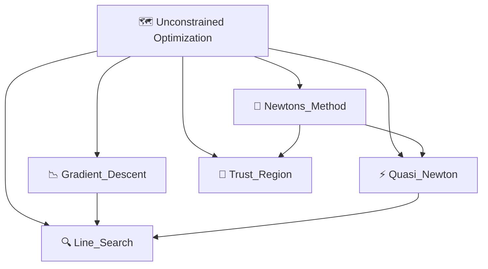

# 🗺️ Unconstrained Optimization — Map of Content

> [!abstract] TL;DR
> Unconstrained optimization finds minima of f:ℝⁿ→ℝ with no constraints on x. The canonical algorithm is gradient descent — move in the direction of steepest descent. This section builds from vanilla gradient descent through Newton's method (second-order convergence), quasi-Newton methods that approximate the Hessian (BFGS/L-BFGS for large-scale problems), line search strategies that choose step sizes automatically, and trust-region methods as an alternative framework. Convergence rates are a central theme: sublinear O(1/k) for gradient descent on convex problems, linear O(ρᵏ) for strongly convex, quadratic for Newton's method near a solution.

---

## Section Map

---

## Learning Path

1. **Start here →** [[Gradient_Descent]] — the foundation; understand update rules, convergence rates, and why step size matters.
2. **Second-order methods →** [[Newtons_Method]] — quadratic convergence; Newton decrement as stopping criterion.
3. **Scaling up →** [[Quasi_Newton]] — BFGS and L-BFGS approximate the Hessian; the workhorse of large-scale optimization.
4. **Step size theory →** [[Line_Search]] — Armijo and Wolfe conditions; how methods automatically select α.
5. **Alternative framework →** [[Trust_Region]] — joint direction + step selection; robust near singularities.

---

## All Notes

| Note | Core Idea | Difficulty | Convergence Rate |
|------|-----------|------------|-----------------|
| [[Gradient_Descent]] | x_{k+1} = x_k - α∇f(x_k) | Beginner | O(1/k) convex; linear strongly convex |
| [[Newtons_Method]] | Second-order Taylor step; Hessian inverse | Intermediate | Quadratic (local) |
| [[Quasi_Newton]] | Approximate Hessian via secant condition | Intermediate | Superlinear (BFGS) |
| [[Line_Search]] | Armijo / Wolfe conditions for step size | Intermediate | Depends on method |
| [[Trust_Region]] | Optimize quadratic model inside ball Δ | Advanced | Quadratic (with good model) |

---

## Convergence Rate Cheat Sheet

| Problem Class | Method | Rate | Complexity |
|--------------|--------|------|------------|
| Convex + L-smooth | Gradient Descent | O(1/k) | O(n) per iter |
| Strongly convex + L-smooth | Gradient Descent | O(ρᵏ), ρ<1 | O(n) per iter |
| Smooth (local) | Newton's Method | Quadratic | O(n³) per iter |
| Smooth (large-scale) | L-BFGS | Superlinear | O(mn) per iter |
| Nonlinear Least Squares | Levenberg-Marquardt | Quadratic | O(n²m) per iter |

---

## Key Questions

1. Why does gradient descent converge sublinearly on convex problems but linearly on strongly convex ones?
2. What is the Newton decrement and why is λ²/2 ≤ ε a natural stopping criterion?
3. How does the BFGS secant condition enforce curvature information, and why does L-BFGS trade off accuracy for memory?
4. When do Wolfe conditions fail, and why does backtracking alone suffice for gradient descent but not quasi-Newton?
5. What is the trust region ratio ρₖ, and how does comparing actual vs. predicted decrease drive step acceptance?

---

## Related Sections

- [[_MOC_Optimization_Master|⬆ Master MOC]] — top-level map
- [[_MOC_Constrained|→ Constrained Optimization]] — Lagrangians, KKT, projected gradient
- [[_MOC_Convex_Analysis|→ Convex Analysis]] — smoothness, strong convexity, duality
- [[_MOC_Numerical_Methods|→ Numerical Methods]] — linear solvers, Cholesky, CG

---

## Sources

- Boyd & Vandenberghe, *Convex Optimization*, Ch. 9
- Nocedal & Wright, *Numerical Optimization*, Ch. 2–7
- Nesterov, *Introductory Lectures on Stochastic Programming*

#MOC #optimization #unconstrained
