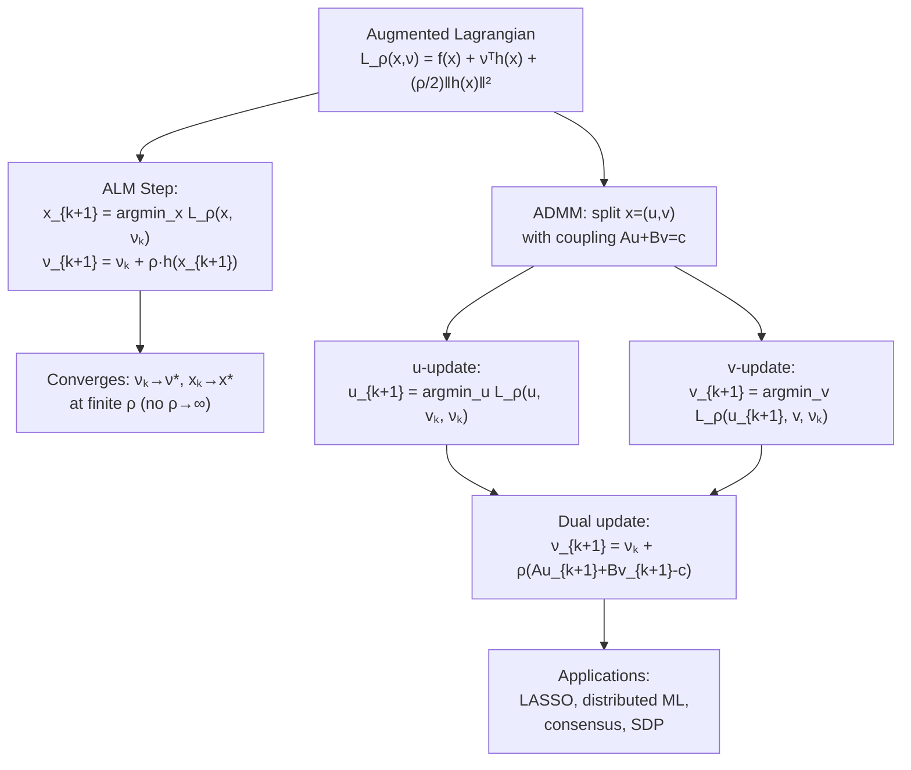

# 🔧 Augmented Lagrangian and ADMM

> [!abstract] TL;DR
> The augmented Lagrangian method (ALM) combines the stability of multiplier methods with the constraint-enforcement of penalty methods: it converges to the exact constrained solution at finite penalty $\rho$, avoiding the ill-conditioning of pure penalty. ADMM (Alternating Direction Method of Multipliers) decomposes the ALM update into two cheaper alternating steps, enabling distributed and large-scale optimization. ADMM has become the workhorse for LASSO, distributed ML, and graph-structured problems.

---

## Intuition — analogy FIRST

Pure penalty is like a stiff spring attached to the constraint surface — it pulls you toward feasibility but you only get there at infinite stiffness. The augmented Lagrangian is like a spring **plus** a guide wire: the spring stiffness $\rho$ stays finite, and the guide wire (multiplier $\nu$) is continuously adjusted to point exactly at the feasible set. Together, they converge to the constrained solution without needing infinite spring tension.

ADMM then says: instead of optimizing over the entire $x$ jointly (which may be hard), split $x = (u, v)$ and alternate — fix $v$, optimize over $u$; fix $u$, optimize over $v$; update the dual wire. Each subproblem is smaller and often has a closed-form solution (e.g., soft thresholding for LASSO).

---

## How It Works



---

## Key Concepts / Details

### Augmented Lagrangian for Equality Constraints

**Standard form:** $\min f(x)$ s.t. $h(x) = 0$

$$\mathcal{L}_\rho(x, \nu) = f(x) + \nu^\top h(x) + \frac{\rho}{2} \|h(x)\|^2$$

This is the standard Lagrangian plus a quadratic penalty term $\frac{\rho}{2}\|h\|^2$.

### ALM Algorithm (Method of Multipliers)

Given $\rho > 0$, $\nu_0 \in \mathbb{R}^p$, iterate:

1. **$x$-update:** $x_{k+1} = \arg\min_x \mathcal{L}_\rho(x, \nu_k)$
2. **$\nu$-update:** $\nu_{k+1} = \nu_k + \rho \cdot h(x_{k+1})$

**Key insight — the dual update:** If $h(x_{k+1}) > 0$ (constraint violated), $\nu$ increases — the Lagrangian pushes harder toward feasibility at the next iteration. This is a **gradient ascent step on the dual problem**: $\nu_{k+1} = \nu_k + \rho \nabla_\nu(-\mathcal{L}_\rho)$... with exact form $\nu_k + \rho h(x_{k+1})$.

### Why ALM Beats Pure Penalty

| Property | Penalty ($\rho \to \infty$) | Augmented Lagrangian (fixed $\rho$) |
|----------|---------------------------|-------------------------------------|
| Constraint satisfaction | Exact only at $\rho = \infty$ | Exact at **finite** $\rho$ once $\nu \to \nu^*$ |
| Condition number | $\kappa \sim \rho$ (grows unboundedly) | $\kappa$ stays bounded |
| KKT recovery | $\nu = \rho \cdot h(x^*_\rho) \to \nu^*$ as $\rho \to \infty$ | $\nu_k \to \nu^*$ directly |

**Theorem:** If $f$ is twice differentiable, SOSC holds, and $\rho > 0$ is large enough (but **finite**), then ALM converges to $(x^*, \nu^*)$ with linear rate $O(1/\rho^k)$ in the dual error.

### Extension to Inequalities

For inequality constraint $g_i(x) \leq 0$, introduce slack $s_i \geq 0$: $g_i(x) + s_i = 0$.

Equivalently, use the clipped update:

$$\lambda_{i,k+1} = \max\!\left(0,\; \lambda_{i,k} + \rho \cdot g_i(x_{k+1})\right)$$

---

## ADMM — Alternating Direction Method of Multipliers

### Problem Structure

ADMM applies to problems with **separable structure** and a coupling constraint:

$$\min_{u, v} \; f(u) + g(v) \quad \text{s.t.} \quad Au + Bv = c$$

**Augmented Lagrangian:**
$$\mathcal{L}_\rho(u, v, \nu) = f(u) + g(v) + \nu^\top(Au + Bv - c) + \frac{\rho}{2}\|Au + Bv - c\|^2$$

### ADMM Algorithm

Given $v_0$, $\nu_0$, iterate:
1. **$u$-update:** $u_{k+1} = \arg\min_u \mathcal{L}_\rho(u, v_k, \nu_k)$
2. **$v$-update:** $v_{k+1} = \arg\min_v \mathcal{L}_\rho(u_{k+1}, v, \nu_k)$
3. **Dual update:** $\nu_{k+1} = \nu_k + \rho(Au_{k+1} + Bv_{k+1} - c)$

The key: each subproblem is **simpler** than the joint problem. Often one or both have closed-form solutions.

### Convergence

For convex $f, g$ (not necessarily smooth): ADMM converges to the optimal value and primal solution under mild conditions (no Slater's required beyond feasibility). Rate is $O(1/k)$ on the residuals for general convex, $O(1/k^2)$ with acceleration, linear for strongly convex.

---

## Application — LASSO via ADMM

**LASSO:** $\min_x \; \frac{1}{2}\|Ax - b\|^2 + \lambda\|x\|_1$

Split: introduce $z = x$, reformulate as:
$$\min_{x, z} \; \frac{1}{2}\|Ax - b\|^2 + \lambda\|z\|_1 \quad \text{s.t.} \quad x = z$$

**$x$-update:** $x_{k+1} = (A^\top A + \rho I)^{-1}(A^\top b + \rho(z_k - \nu_k))$ — ridge regression (linear solve)

**$z$-update:** $z_{k+1} = S_{\lambda/\rho}(x_{k+1} + \nu_k)$ — **soft thresholding** $S_\tau(v)_i = \text{sign}(v_i)\max(|v_i|-\tau, 0)$

**Dual update:** $\nu_{k+1} = \nu_k + x_{k+1} - z_{k+1}$

Each iteration is $O(n^3)$ (one linear system solve, cached) + $O(n)$ (soft threshold). The $z$-update is a **proximal operator**: $z = \text{prox}_{\lambda/\rho \|\cdot\|_1}(x + \nu)$.

---

## Python — ADMM for LASSO

```python
import numpy as np

def soft_threshold(v, tau):
    return np.sign(v) * np.maximum(np.abs(v) - tau, 0)

def admm_lasso(A, b, lam, rho=1.0, max_iter=200, tol=1e-4):
    """ADMM for LASSO: min (1/2)||Ax-b||^2 + lam||z||_1  s.t. x=z"""
    m, n = A.shape
    AtA = A.T @ A
    Atb = A.T @ b
    # Pre-factor: (A'A + rho*I)
    L = np.linalg.cholesky(AtA + rho * np.eye(n))

    x = np.zeros(n); z = np.zeros(n); nu = np.zeros(n)
    residuals = []

    for k in range(max_iter):
        # x-update: ridge regression
        rhs = Atb + rho * (z - nu)
        x = np.linalg.solve(L.T, np.linalg.solve(L, rhs))
        # z-update: soft threshold (prox of L1)
        z_old = z.copy()
        z = soft_threshold(x + nu, lam / rho)
        # dual update
        nu = nu + x - z

        primal_res = np.linalg.norm(x - z)
        dual_res = np.linalg.norm(rho * (z - z_old))
        residuals.append((primal_res, dual_res))
        if primal_res < tol and dual_res < tol:
            print(f"Converged at iteration {k+1}")
            break

    return x, z, residuals

# Example
np.random.seed(42)
m, n = 50, 100
A = np.random.randn(m, n)
x_true = np.zeros(n); x_true[:5] = np.array([3, -2, 1.5, -1, 0.5])
b = A @ x_true + 0.1 * np.random.randn(m)

x_sol, z_sol, res = admm_lasso(A, b, lam=0.5, rho=1.0, max_iter=500)
print(f"Nonzeros in solution: {np.sum(np.abs(x_sol) > 0.01)}")  # Should recover ~5
```

---

## Connection to Proximal Operators

The ADMM $v$-update is always a **proximal operator**:
$$v_{k+1} = \text{prox}_{g/\rho}(u_{k+1} + \nu_k) \quad \text{where} \quad \text{prox}_{\tau h}(v) = \arg\min_x \left[h(x) + \frac{1}{2\tau}\|x-v\|^2\right]$$

This makes ADMM a flexible framework: any function with a tractable prox operator can be used as $f$ or $g$.

| Function $h(x)$ | $\text{prox}_{\tau h}(v)$ |
|-----------------|--------------------------|
| $\lambda\|x\|_1$ | Soft thresholding $S_{\lambda\tau}(v)$ |
| $\lambda\|x\|_2$ | Vector shrinkage $(1-\lambda\tau/\|v\|)_+ \cdot v$ |
| $\delta_C(x)$ (indicator) | Projection $\Pi_C(v)$ |
| $\frac{1}{2}\|Ax-b\|^2$ | $(A^\top A + \frac{1}{\tau}I)^{-1}(A^\top b + \frac{1}{\tau}v)$ |

---

## ALM vs ADMM — When to Use Each

| Criterion | ALM | ADMM |
|-----------|-----|------|
| Problem structure | No separability needed | Requires $f(u)+g(v)$ separable structure |
| $x$-update | Single joint minimization | Two alternating subproblems |
| Subproblem difficulty | May be hard (full problem) | Often closed-form (prox operators) |
| Distributed computing | Difficult | Natural — $u$, $v$ updates parallelize |
| Convergence speed | Linear (faster per iter) | Linear (slower per iter, but cheap) |
| Best for | Smooth NLP, medium-scale | Large-scale, distributed, non-smooth |

---

## Real-World Notes

- **Distributed ML:** ADMM consensus formulation splits data across machines; each machine solves a local subproblem and communicates only the dual variable.
- **Graph-structured problems:** ADMM maps naturally to factor graphs; edges = coupling constraints, nodes = local objectives.
- **OSQP (QP solver):** Modern ADMM-based QP solver used in MPC, robotics; handles millions of variables.
- **Image processing:** Total variation denoising, compressed sensing, matrix completion — all solved efficiently via ADMM.

---

## Common Pitfalls

- **Choosing $\rho$:** ADMM convergence speed is sensitive to $\rho$. Adaptive $\rho$ schemes (dual residual balancing) help.
- **Not pre-factoring:** The $u$-update linear system should be factored once (not re-solved from scratch each iteration).
- **Assuming ADMM converges fast:** ADMM has $O(1/k)$ convergence (slow). For high accuracy, use an accelerated variant or warm-start another solver.
- **Non-convex ADMM:** ADMM can be applied to non-convex problems but convergence is not guaranteed; may cycle or diverge.

---

## Related Concepts

- [[KKT_Conditions]] — ADMM dual update is a gradient ascent step on the dual
- [[Penalty_Barrier_Methods]] — pure penalty is ALM without multiplier update
- [[Lagrange_Multipliers]] — multipliers $\nu_k$ converge to the Lagrange multipliers $\nu^*$
- [[_MOC_Constrained]] — section overview

---

## Review Questions

1. Write the ALM update for $\min f(x)$ s.t. $h(x)=0$. Why does it converge at finite $\rho$?
2. State the three steps of the ADMM algorithm for $\min f(u)+g(v)$ s.t. $Au+Bv=c$.
3. Derive the ADMM $z$-update for LASSO and show it equals soft thresholding.
4. What is a proximal operator? Give two examples with closed-form expressions.
5. When would you prefer ADMM over ALM? What structural requirement must hold?

---

## Sources

- Boyd et al., "Distributed Optimization and Statistical Learning via ADMM," *Foundations and Trends in ML*, 2011
- Bertsekas & Tsitsiklis, *Parallel and Distributed Computation*, Ch. 3
- Nocedal & Wright, *Numerical Optimization*, §17.4 (Augmented Lagrangian)

#optimization #constrained #augmented-lagrangian #ADMM #advanced
