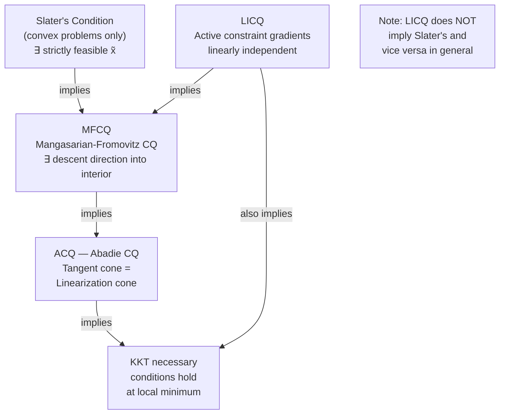

# 📐 Constraint Qualifications

> [!abstract] TL;DR
> KKT conditions are necessary for a local minimum only if the constraint set is "regular" at that point — a property formalized by constraint qualifications (CQs). Without a CQ, KKT may fail to hold even at an optimal point. LICQ (gradient linear independence) is the standard assumption for smooth nonlinear programs; Slater's condition (strict feasibility) is the most important CQ for convex problems and implies strong duality.

---

## Intuition — analogy FIRST

Imagine standing at a corner where two walls meet (two active constraints). The KKT conditions say the gradient of $f$ must be expressible as a positive combination of the wall normals. But if both walls are parallel (their gradients are linearly dependent), the "normal space" they span collapses — and KKT might be vacuously satisfied by any multiplier combination, giving no useful information. Constraint qualifications rule out such degenerate geometries by ensuring the active constraint gradients point in genuinely independent directions.

---

## How It Works



---

## Key Concepts / Details

### Why CQs Matter

Consider the problem $\min_{x_1, x_2} x_1$ s.t. $x_1^2 + x_2^2 \leq 0$. The only feasible point is $(0, 0)$, which is trivially optimal. The constraint gradient at $(0,0)$ is $\nabla g(0,0) = (0,0)$. The KKT stationarity condition $\nabla f + \lambda \nabla g = 0$ becomes $(1,0) + \lambda(0,0) = 0$, which has **no solution** for any $\lambda$. The KKT conditions fail, yet $(0,0)$ is the global minimum. The CQ fails because the constraint gradient vanishes.

### LICQ — Linear Independence Constraint Qualification

**Definition:** At a feasible point $x^*$ with active set $\mathcal{I}(x^*) = \{i : g_i(x^*)=0\}$, LICQ holds if:
$$\{\nabla g_i(x^*) : i \in \mathcal{I}(x^*)\} \cup \{\nabla h_j(x^*) : j = 1,\ldots,p\}$$
are **linearly independent**.

- Sufficient for KKT necessary conditions to hold
- Ensures **uniqueness** of KKT multipliers $(\lambda^*, \nu^*)$
- Fails at degenerate vertices of polyhedra (multiple active constraints with dependent gradients)
- Standard assumption in smooth NLP theory

### MFCQ — Mangasarian-Fromovitz CQ

**Definition:** MFCQ holds at $x^*$ if there exists a vector $d \in \mathbb{R}^n$ such that:
$$\nabla g_i(x^*)^\top d < 0 \quad \forall i \in \mathcal{I}(x^*), \qquad \nabla h_j(x^*)^\top d = 0 \quad \forall j$$

Geometrically: there exists a direction pointing strictly into the feasible region (a descent direction for all active inequality constraints while staying on the equality constraint manifold).

- Weaker than LICQ (LICQ $\Rightarrow$ MFCQ; converse false)
- Does **not** guarantee uniqueness of multipliers
- Sufficient for KKT to hold
- More broadly applicable than LICQ

### Slater's Condition (Convex Problems)

**Definition:** For a convex problem (convex $f, g_i$, affine $h_j$), Slater's condition holds if there exists a strictly feasible point $\tilde{x}$ such that:
$$g_i(\tilde{x}) < 0 \quad \forall i, \qquad h_j(\tilde{x}) = 0 \quad \forall j$$

**Key consequence:** Slater's condition implies:
1. MFCQ holds at every feasible point
2. **Strong duality** holds: $p^* = d^*$ (zero duality gap)
3. The dual optimum is attained
4. KKT conditions are both necessary **and sufficient** for global optimality

Slater's is the most important CQ in convex optimization — it's almost always satisfied in practice (just check strict feasibility).

### ACQ — Abadie CQ

Holds when the **tangent cone** to the feasible set equals the **linearization cone** (the feasible cone of the linearized constraints). This is the weakest standard CQ that guarantees KKT. Usually verified indirectly via MFCQ or LICQ.

---

## CQ Hierarchy Summary

| CQ | Condition | Multiplier uniqueness | Convex only? | When it fails |
|----|-----------|----------------------|--------------|---------------|
| **Slater's** | Strictly feasible point exists | No | Yes (convex) | Inequality constraints tight everywhere |
| **LICQ** | Active gradient set linearly independent | Yes | No | Degenerate vertices, parallel active constraints |
| **MFCQ** | Feasible descent direction exists | No | No | Cone of active constraints spans all directions |
| **ACQ** | Tangent cone = linearization cone | No | No | Nonsmooth or highly curved constraints |

---

## Counterexample — KKT Failure Without CQ

**Problem:** $\min_{x_1,x_2} \; -x_2 \quad \text{s.t.} \quad g_1(x) = (x_1)^2 - x_2 \leq 0, \quad g_2(x) = -x_2 \leq 0$

The feasible set is $x_2 \geq x_1^2 \geq 0$. The minimum is at $x^* = (0,0)$.

At $(0,0)$: $\nabla g_1 = (0,-1)$, $\nabla g_2 = (0,-1)$ — linearly **dependent**. LICQ fails.

KKT stationarity: $(0,-1) + \lambda_1(0,-1) + \lambda_2(0,-1) = 0$ requires $\lambda_1 + \lambda_2 = -1 < 0$, which violates dual feasibility. **KKT has no valid solution at the global minimum.**

---

## Python — KKT Failure Demonstration

```python
import numpy as np
from scipy.optimize import minimize

# Problem where LICQ fails: min -x2 s.t. x1^2 - x2 <= 0, -x2 <= 0
# Optimal at (0, 0)

def f(x): return -x[1]
def g1(x): return -(x[0]**2 - x[1])   # scipy ineq form: g >= 0 ↔ -g <= 0
def g2(x): return x[1]                 # -(-x2) >= 0

constraints = [{'type': 'ineq', 'fun': g1}, {'type': 'ineq', 'fun': g2}]
result = minimize(f, [0.1, 0.1], method='SLSQP', constraints=constraints)
print(f"x* = {result.x}")              # Should be near (0, 0)
print(f"f* = {result.fun:.4f}")        # Should be near 0

# Verify LICQ: active constraint gradients at x*=(0,0)
x_star = np.array([0.0, 0.0])
grad_g1 = np.array([2*x_star[0], -1.0])   # (0, -1)
grad_g2 = np.array([0.0, -1.0])           # (0, -1)
# These are identical → LICQ fails
rank = np.linalg.matrix_rank(np.vstack([grad_g1, grad_g2]))
print(f"Rank of active gradient matrix: {rank}")  # 1 (not 2) → LICQ fails
```

---

## Real-World Notes

- **Degenerate LP vertices:** When more than $n$ constraints are active at a vertex of a polyhedron, LICQ fails. The simplex method handles this via anti-degeneracy rules (Bland's rule).
- **Convex programming in practice:** Slater's condition is nearly always verified by inspection (add small slack to constraints in model validation).
- **Nonlinear programs:** Solvers like IPOPT assume LICQ; convergence certificates may be invalid if violated.
- **Semidefinite programming:** Has its own constraint qualification (Slater's for SDP: strictly positive definite feasible matrix).

---

## Common Pitfalls

- **Assuming KKT always holds:** KKT conditions are **not** universally necessary. Always pair with a CQ assumption.
- **Confusing Slater's with convexity:** Slater's requires strict feasibility; a feasible-but-not-strictly-feasible convex problem may have a duality gap.
- **LICQ implies unique multipliers:** If LICQ holds, the KKT multipliers are uniquely determined. If MFCQ holds (but not LICQ), multipliers may be non-unique.
- **Slater's is not needed for LP:** LPs satisfy a built-in regularity (polyhedra are always regular); strong duality holds under primal/dual feasibility alone.

---

## Related Concepts

- [[KKT_Conditions]] — the conditions CQs enable
- [[Lagrange_Multipliers]] — LICQ ensures Lagrange conditions hold
- [[Penalty_Barrier_Methods]] — Slater's condition used to prove convergence of barrier methods
- [[_MOC_Constrained]] — section overview

---

## Review Questions

1. Define LICQ. Give a geometric example where it fails.
2. State Slater's condition. Why does it imply strong duality for convex problems?
3. Construct a two-variable problem where the global minimum violates KKT due to a failed CQ.
4. Is LICQ stronger or weaker than MFCQ? Does LICQ imply Slater's condition?
5. In an LP, why is a CQ unnecessary for KKT to hold (or for strong duality)?

---

## Sources

- Nocedal & Wright, *Numerical Optimization*, §12.3–12.4
- Boyd & Vandenberghe, *Convex Optimization*, §5.2–5.3 (Slater's)
- Bazaraa, Sherali & Shetty, *Nonlinear Programming*, Ch. 5

#optimization #constrained #constraint-qualifications #advanced
