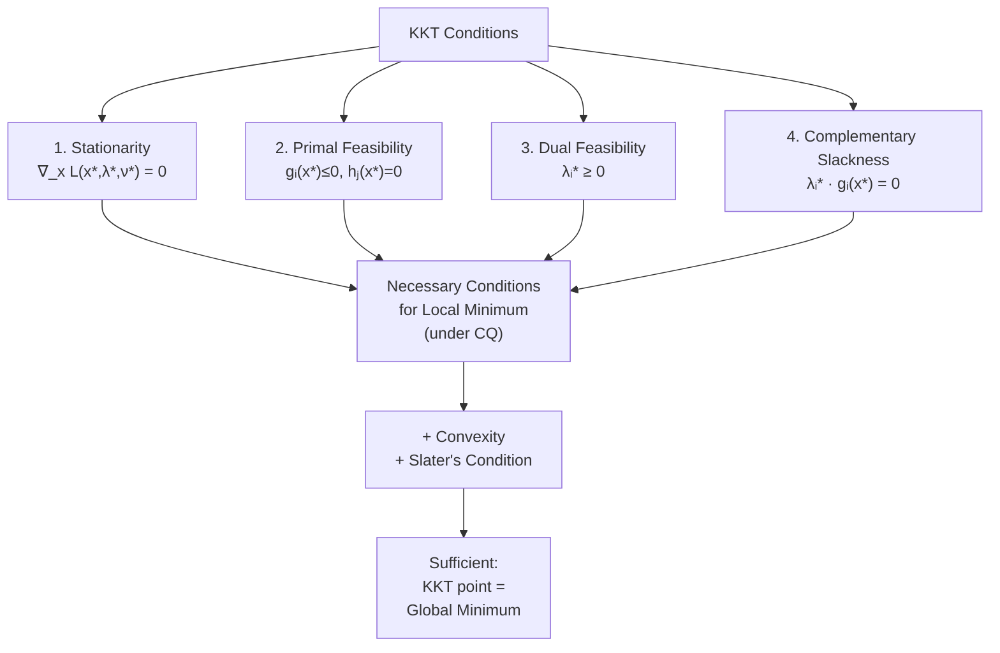

# 🔑 KKT Conditions

> [!abstract] TL;DR
> The Karush-Kuhn-Tucker (KKT) conditions are the fundamental first-order necessary optimality conditions for constrained optimization with both equality and inequality constraints. They extend Lagrange multipliers to inequalities by adding dual feasibility ($\lambda \geq 0$) and complementary slackness ($\lambda_i g_i = 0$). For convex problems under Slater's condition, KKT conditions are also sufficient — the KKT point is the global optimum.

---

## Intuition — analogy FIRST

Think of inequality constraints as one-way walls. If you're not touching a wall ($g_i < 0$, constraint inactive), it doesn't affect your movement — its multiplier $\lambda_i = 0$. If you're pressed against the wall ($g_i = 0$, constraint active), it pushes back with force $\lambda_i \geq 0$ to keep you feasible. Complementary slackness encodes exactly this: **either the wall is not active, or the wall exerts force — never both, never neither (at a constrained optimum).**

---

## How It Works



---

## Key Concepts / Details

### General Problem

$$\min_{x \in \mathbb{R}^n} f(x) \quad \text{s.t.} \quad g_i(x) \leq 0 \; (i=1,\ldots,m), \quad h_j(x) = 0 \; (j=1,\ldots,p)$$

### Lagrangian

$$\mathcal{L}(x, \lambda, \nu) = f(x) + \sum_{i=1}^{m} \lambda_i g_i(x) + \sum_{j=1}^{p} \nu_j h_j(x)$$

### The Four KKT Conditions

| # | Name | Equation | Meaning |
|---|------|----------|---------|
| 1 | **Stationarity** | $\nabla_x \mathcal{L}(x^*,\lambda^*,\nu^*) = 0$ | Gradient of Lagrangian vanishes at $x^*$ |
| 2 | **Primal feasibility** | $g_i(x^*) \leq 0$, $h_j(x^*) = 0$ | $x^*$ is in the feasible set |
| 3 | **Dual feasibility** | $\lambda_i^* \geq 0$ | Inequality multipliers are non-negative |
| 4 | **Complementary slackness** | $\lambda_i^* \cdot g_i(x^*) = 0 \;\forall i$ | Either constraint active or multiplier zero |

### Complementary Slackness — Physical Meaning

For each inequality constraint $i$:
- **Inactive constraint** ($g_i(x^*) < 0$): constraint doesn't bind → $\lambda_i^* = 0$ (wall irrelevant)
- **Active constraint** ($g_i(x^*) = 0$): constraint binds → $\lambda_i^* \geq 0$ (wall pushes back)

It is **impossible** to have $g_i(x^*) < 0$ and $\lambda_i^* > 0$ simultaneously at a KKT point.

### Active Set

$$\mathcal{I}(x^*) = \{i \mid g_i(x^*) = 0\}$$

The active set determines which constraints participate in the stationarity condition.

### When KKT is Sufficient (Convex Case)

If $f, g_1, \ldots, g_m$ are convex, $h_j$ are affine, and Slater's condition holds (see [[Constraint_Qualifications]]), then any KKT point is a **global minimum**. This is the most important result in convex optimization.

---

## Worked Example 1 — Constrained Quadratic

**Problem:** $\min_{x_1,x_2} \; x_1^2 + x_2^2 \quad \text{s.t.} \quad x_1 + x_2 \geq 1$

Reformulate: $g_1(x) = -x_1 - x_2 + 1 \leq 0$

**Lagrangian:** $\mathcal{L} = x_1^2 + x_2^2 + \lambda(-x_1 - x_2 + 1)$

**KKT conditions:**
1. Stationarity: $2x_1 - \lambda = 0$, $2x_2 - \lambda = 0$ → $x_1^* = x_2^* = \lambda/2$
2. Primal feasibility: $-x_1^* - x_2^* + 1 \leq 0$ → $1 - \lambda \leq 0$ → $\lambda \geq 1$
3. Dual feasibility: $\lambda \geq 0$
4. CS: $\lambda(-x_1^* - x_2^* + 1) = 0$

**Case A** (active): $g_1 = 0 \implies x_1^* + x_2^* = 1 \implies \lambda^* = 1$, $x_1^* = x_2^* = 1/2$. Check dual: $\lambda^* = 1 > 0$. ✓

**Solution:** $x^* = (1/2, 1/2)$, $\lambda^* = 1$, $f^* = 1/2$.

---

## Worked Example 2 — LP KKT and Duality

**Linear program:** $\min_{x} \; c^\top x \quad \text{s.t.} \quad Ax = b, \; x \geq 0$

Constraints: $-x_i \leq 0$ (so $\lambda_i \geq 0$) and $Ax = b$.

**Lagrangian:** $\mathcal{L} = c^\top x - \lambda^\top x + \nu^\top (Ax - b)$

**KKT stationarity:** $c - \lambda + A^\top \nu = 0 \implies A^\top \nu \leq c$ (with $\lambda = c - A^\top \nu \geq 0$)

**KKT conditions recover the LP dual:** maximize $b^\top \nu$ s.t. $A^\top \nu \leq c$. Strong duality holds (LP always satisfies Slater's if feasible and bounded).

---

## SVM as a Constrained QP

The hard-margin SVM solves:
$$\min_{w, b} \;\frac{1}{2}\|w\|^2 \quad \text{s.t.} \quad y_i(w^\top x_i + b) \geq 1 \;\forall i$$

KKT conditions give $w^* = \sum_i \alpha_i y_i x_i$ where $\alpha_i$ are the dual variables. Complementary slackness: $\alpha_i > 0$ only for **support vectors** (points on the margin). The dual QP over $\alpha$ is the standard form used in SVM solvers.

---

## Python — Verify KKT Numerically

```python
import numpy as np
from scipy.optimize import minimize

# min x1^2 + x2^2  s.t.  x1 + x2 >= 1 (rewritten as -x1-x2+1 <= 0)
def f(x): return x[0]**2 + x[1]**2
def g1(x): return x[0] + x[1] - 1   # constraint: g1(x) >= 0  (scipy 'ineq')

constraints = [{'type': 'ineq', 'fun': g1}]
result = minimize(f, [0.0, 0.0], method='SLSQP', constraints=constraints)
x_star = result.x

# Manually verify KKT
lam = -result.jac  # SLSQP stores -gradient for inequality dual
print(f"x* = {x_star}")                        # [0.5, 0.5]
print(f"Stationarity: ∇f + λ∇g1 ≈ 0?")
grad_f = 2 * x_star
grad_g1 = np.array([-1.0, -1.0])              # gradient of -x1-x2+1
lam_kkt = grad_f[0] / 1.0                     # λ* = 2*x1* = 1.0
print(f"  λ* = {lam_kkt:.4f}")                # 1.0000
print(f"  Dual feasibility (λ≥0): {lam_kkt >= 0}")  # True
print(f"  CS λ*·g(x*) = {lam_kkt * (x_star[0]+x_star[1]-1):.4f}")  # 0.0
```

---

## Relationship to Duality

Under strong duality (convex + Slater's):
$$p^* = d^* \iff \exists (x^*, \lambda^*, \nu^*) \text{ satisfying KKT}$$

The KKT conditions are the bridge between primal and dual optimality. The duality gap is zero precisely when a KKT triple exists.

---

## Real-World Notes

- **Interior-point methods** (e.g., IPOPT, MOSEK) solve a perturbed KKT system: $\lambda_i g_i = -\mu$ with $\mu \to 0$.
- **Active-set methods** maintain an explicit active set and solve equality-constrained subproblems.
- **SQP** solves a QP approximation of the KKT system at each iteration.
- **Automatic differentiation** (JAX, PyTorch) can compute $\nabla_x \mathcal{L}$ and check KKT residuals numerically.

---

## Common Pitfalls

- **Sign convention:** KKT requires $g_i(x) \leq 0$ (standard form). If your inequality is $g_i \geq 0$, negate it first.
- **Forgetting dual feasibility:** $\lambda_i \geq 0$ is often missed; violations indicate the constraint is pulling in the wrong direction.
- **KKT without a CQ:** KKT may fail at a local minimum if LICQ or MFCQ doesn't hold. See [[Constraint_Qualifications]].
- **Equality constraints have free multipliers:** $\nu_j$ can be any sign; only inequality multipliers $\lambda_i$ must be $\geq 0$.

---

## Related Concepts

- [[Lagrange_Multipliers]] — equality-only special case
- [[Constraint_Qualifications]] — when KKT is guaranteed to hold
- [[Penalty_Barrier_Methods]] — numerical methods that solve perturbed KKT systems
- [[Augmented_Lagrangian]] — iterative KKT-based solver
- [[_MOC_Constrained]] — section overview

---

## Review Questions

1. Write down all four KKT conditions for $\min f(x)$ s.t. $g_i(x) \leq 0$, $h_j(x) = 0$.
2. What does complementary slackness say physically about inactive constraints?
3. Solve via KKT: $\min x^2 + y^2$ s.t. $x^2 + y^2 \leq 1$, $x + y \geq 1$. (Hint: check which constraints are active.)
4. For a convex problem, what additional condition ensures KKT is also sufficient?
5. Derive the KKT conditions for the soft-margin SVM and identify the support vectors.

---

## Sources

- Boyd & Vandenberghe, *Convex Optimization*, §5.5
- Nocedal & Wright, *Numerical Optimization*, §12.1–12.3
- Bertsekas, *Nonlinear Programming*, §3.3

#optimization #constrained #KKT #intermediate
