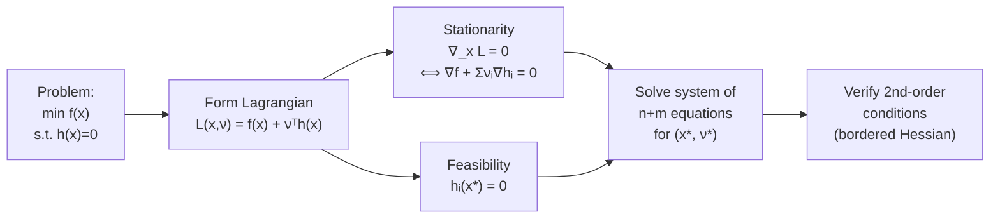

# ⚖️ Lagrange Multipliers

> [!abstract] TL;DR
> Lagrange multipliers solve equality-constrained optimization by combining the objective and constraints into a single unconstrained Lagrangian function. At a constrained optimum, the gradient of the objective must lie in the span of the constraint gradients — the level sets of $f$ and the constraint surface are tangent. Each multiplier $\nu_i$ measures the sensitivity of the optimal value to the $i$-th constraint bound (shadow price).

---

## Intuition — analogy FIRST

Imagine hiking on a mountain (the objective $f$) while forced to stay on a trail (the constraint $h=0$). You've found the lowest point on the trail when there's no direction along the trail that takes you lower — i.e., the trail is tangent to a level contour of the mountain. If the trail crossed a level contour, you could walk along the trail and decrease altitude. The Lagrange condition $\nabla f = -\nu \nabla h$ captures exactly this tangency: the gradient of $f$ and the gradient of $h$ (which points perpendicular to the constraint surface) must be parallel.

---

## How It Works



---

## Key Concepts / Details

### Problem Setup

$$\min_{x \in \mathbb{R}^n} f(x) \quad \text{s.t.} \quad h_i(x) = 0, \; i = 1, \ldots, m \quad (m < n)$$

### The Lagrangian

$$\mathcal{L}(x, \nu) = f(x) + \sum_{i=1}^{m} \nu_i h_i(x) = f(x) + \nu^\top h(x)$$

The dual variables $\nu \in \mathbb{R}^m$ are the **Lagrange multipliers** (also called dual variables or shadow prices).

### Lagrange Conditions (Necessary, under LICQ)

At a local minimum $x^*$ with multipliers $\nu^*$:

| Condition | Equation | Meaning |
|-----------|----------|---------|
| Stationarity | $\nabla_x \mathcal{L}(x^*,\nu^*) = 0$ | $\nabla f(x^*) + \sum_i \nu_i^* \nabla h_i(x^*) = 0$ |
| Feasibility | $h_i(x^*) = 0$ for all $i$ | $x^*$ lies on all constraint surfaces |

This gives a system of $n + m$ equations in $n + m$ unknowns $(x^*, \nu^*)$.

### Geometric Interpretation

The constraint surface $\{x : h(x) = 0\}$ is an $(n-m)$-dimensional manifold. The stationarity condition says:
$$\nabla f(x^*) \in \text{span}\{\nabla h_1(x^*), \ldots, \nabla h_m(x^*)\}$$

Equivalently, $\nabla f(x^*)$ is perpendicular to the constraint manifold. The level set of $f$ through $x^*$ is tangent to the constraint surface.

### Shadow Price Interpretation

Define the perturbed problem: $p^*(b)$ = optimal value of $\min f(x)$ s.t. $h_i(x) = b_i$. Then:
$$\frac{\partial p^*}{\partial b_i}\bigg|_{b=0} = -\nu_i^*$$

If $\nu_i^* > 0$, relaxing constraint $i$ (increasing $b_i$) **decreases** the optimal cost. The multiplier is the marginal value of relaxing the constraint.

---

## Worked Example 1 — Minimum Distance to Line

**Problem:** $\min_{x,y} \; x^2 + y^2 \quad \text{s.t.} \quad x + y = 1$

**Lagrangian:** $\mathcal{L}(x, y, \nu) = x^2 + y^2 + \nu(x + y - 1)$

**Stationarity:**
$$\frac{\partial \mathcal{L}}{\partial x} = 2x + \nu = 0 \implies x = -\nu/2$$
$$\frac{\partial \mathcal{L}}{\partial y} = 2y + \nu = 0 \implies y = -\nu/2$$

**Feasibility:** $x + y = 1 \implies -\nu = 1 \implies \nu^* = -1$

**Solution:** $x^* = y^* = 1/2$, $\nu^* = -1$, $f^* = 1/2$

**Shadow price check:** If constraint becomes $x+y=1+\epsilon$, then $p^* = (1+\epsilon)^2/2$, so $dp^*/d\epsilon\big|_0 = 1 = -\nu^* = -(-1) = 1$. ✓

---

## Worked Example 2 — Extremize $x_1 x_2$ on Unit Circle

**Problem:** $\min_{x_1, x_2} \; x_1 x_2 \quad \text{s.t.} \quad x_1^2 + x_2^2 = 1$

**Lagrangian:** $\mathcal{L} = x_1 x_2 + \nu(x_1^2 + x_2^2 - 1)$

**Stationarity:**
$$x_2 + 2\nu x_1 = 0 \quad \text{and} \quad x_1 + 2\nu x_2 = 0$$

From the first: $\nu = -x_2/(2x_1)$. Substituting: $x_1 - x_2^2/x_1 = 0 \implies x_1^2 = x_2^2$.

**Critical points:** $(x_1, x_2) \in \{(1/\sqrt{2}, 1/\sqrt{2}),\; (-1/\sqrt{2},-1/\sqrt{2}),\; (1/\sqrt{2},-1/\sqrt{2}),\; (-1/\sqrt{2},1/\sqrt{2})\}$

Minimum value $= -1/2$ (at the anti-diagonal points); maximum $= +1/2$.

---

## Second-Order Conditions

At $x^*$ with multipliers $\nu^*$, define the **constrained Hessian** (Hessian of Lagrangian):
$$W = \nabla^2_{xx} \mathcal{L}(x^*, \nu^*)$$

The **bordered Hessian** is $\bar{H} = \begin{bmatrix} 0 & \nabla h^\top \\ \nabla h & W \end{bmatrix}$

**Second-order sufficient condition (SOSC):** $x^*$ is a strict local min if $d^\top W d > 0$ for all nonzero $d$ in the null space of the constraint Jacobian $\nabla h(x^*)^\top d = 0$.

---

## Unconstrained vs Constrained — Comparison

| Property | Unconstrained | Equality-Constrained |
|----------|--------------|---------------------|
| First-order condition | $\nabla f(x^*) = 0$ | $\nabla f(x^*) + \nu^\top \nabla h(x^*) = 0$ |
| Degrees of freedom | $n$ | $n - m$ (on the manifold) |
| Second-order condition | $\nabla^2 f \succ 0$ | $W \succ 0$ on $\ker(\nabla h)$ |
| Number of unknowns | $n$ | $n + m$ |

---

## Python Example

```python
from scipy.optimize import minimize
import numpy as np

# Example 1: min x^2 + y^2 s.t. x + y = 1
def objective(xy):
    x, y = xy
    return x**2 + y**2

constraints = [{'type': 'eq', 'fun': lambda xy: xy[0] + xy[1] - 1}]
x0 = np.array([0.5, 0.5])

result = minimize(objective, x0, constraints=constraints, method='SLSQP')
print(f"x* = {result.x}")           # [0.5, 0.5]
print(f"f* = {result.fun:.4f}")     # 0.5000
# Access Lagrange multiplier (shadow price)
print(f"ν* = {result.jac}")         # gradient info; use dual variables from result
```

---

## Real-World Notes

- **Economics (utility maximization):** maximize utility $u(x)$ subject to budget $p^\top x = I$; the Lagrange multiplier on the budget is the **marginal utility of income**.
- **Portfolio optimization:** minimize variance subject to target return constraint; the multiplier gives the marginal cost of increasing return.
- **Physics (Lagrangian mechanics):** holonomic constraints modeled via Lagrange multipliers; constraint forces emerge naturally.

---

## Common Pitfalls

- **Multiplying both sides by $-1$:** Some texts define $\mathcal{L} = f - \nu^\top h$, reversing the sign of $\nu^*$. Be consistent.
- **Not checking second-order conditions:** Lagrange conditions find all critical points, not just minima. Always verify.
- **Assuming LICQ holds:** If constraint gradients $\{\nabla h_i(x^*)\}$ are linearly dependent, Lagrange conditions may fail. See [[Constraint_Qualifications]].
- **Confusing $m$ and $n$:** Need $m < n$ (fewer constraints than variables) or the problem is over-determined.

---

## Related Concepts

- [[KKT_Conditions]] — generalizes to inequality constraints
- [[Constraint_Qualifications]] — regularity conditions for Lagrange conditions to hold
- [[Penalty_Barrier_Methods]] — numerical alternatives when Lagrange system is hard to solve analytically
- [[_MOC_Constrained]] — section overview

---

## Review Questions

1. State the Lagrange conditions for $\min f(x)$ s.t. $h(x) = 0$. What geometric fact do they encode?
2. Solve: $\min x^2 + 2y^2$ s.t. $x + y = 3$. Find $x^*$, $y^*$, $\nu^*$.
3. What does the sign of $\nu^*$ tell you about the optimal value when the constraint is relaxed?
4. Why must $m < n$ for the problem to be well-posed?
5. When do second-order Lagrange conditions guarantee a strict local minimum?

---

## Sources

- Boyd & Vandenberghe, *Convex Optimization*, Ch. 5 (Lagrangian duality)
- Nocedal & Wright, *Numerical Optimization*, Ch. 12 (Theory of Constrained Optimization)
- Bertsekas, *Nonlinear Programming*, Ch. 3

#optimization #constrained #lagrange-multipliers #intermediate
