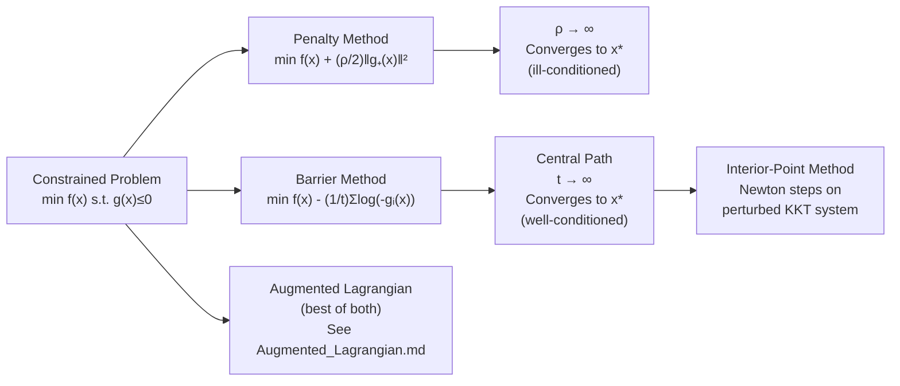

# 🚧 Penalty and Barrier Methods

> [!abstract] TL;DR
> Penalty and barrier methods convert constrained problems into a sequence of unconstrained problems. Penalty methods add a term that grows when constraints are violated; barrier methods add a term that blows up at the constraint boundary, keeping iterates in the interior. Barrier methods (interior-point methods) achieve polynomial-time complexity for convex LP/QP and form the basis of modern large-scale solvers. The augmented Lagrangian (see [[Augmented_Lagrangian]]) improves on pure penalty by combining multiplier updates with penalty terms.

---

## Intuition — analogy FIRST

**Penalty:** Imagine placing a rubber band between the current point and the feasible set. As you pull harder (increase $\rho$), the band tightens and the point is forced toward feasibility. At infinite tension, the point lies exactly on the constraint. Problem: infinite tension makes the problem ill-conditioned.

**Barrier:** Imagine the feasible set is a room with walls made of force fields that repel you exponentially near the boundary. You can only stand inside the room. As you reduce the repulsion (increase $t$), you get pushed closer to the boundary — closer to the constrained optimum.

---

## How It Works



---

## Key Concepts / Details

### 1. Quadratic Penalty Method

**Idea:** Add a penalty for constraint violations to the objective.

$$\phi_\rho(x) = f(x) + \frac{\rho}{2} \sum_{i=1}^{m} \max(g_i(x), 0)^2 + \frac{\rho}{2} \sum_{j=1}^{p} h_j(x)^2$$

**Algorithm:**
1. Start with small $\rho > 0$, initial point $x_0$
2. $x_{k+1} = \arg\min_x \phi_{\rho_k}(x)$ (unconstrained minimization)
3. Increase $\rho_{k+1} = c \cdot \rho_k$ (e.g., $c = 10$)
4. Repeat until feasibility satisfied

**Convergence:** As $\rho \to \infty$, $x^*_\rho \to x^*$ (constrained solution). The limit point satisfies KKT.

**Ill-conditioning problem:** The condition number of $\nabla^2 \phi_\rho \sim \rho$. As $\rho$ grows, Newton's method on the subproblem becomes increasingly ill-conditioned (eigenvalues spread by factor $\rho$).

### Exact Penalty ($\ell_1$ penalty)

$$\phi_\mu(x) = f(x) + \mu \sum_i |h_i(x)| + \mu \sum_i \max(g_i(x), 0)$$

If $\mu > \|\lambda^*\|_\infty$ (larger than the optimal multipliers), then $x^*$ of the constrained problem minimizes $\phi_\mu$ **exactly** (not just in the limit). Non-smooth but avoids the $\rho \to \infty$ limit.

---

### 2. Log Barrier Method

**Idea:** Replace inequality constraints with log barriers that prevent leaving the feasible region.

$$\phi_t(x) = t \cdot f(x) - \sum_{i=1}^{m} \log(-g_i(x))$$

(Only defined for strictly feasible $x$ with $g_i(x) < 0$.)

Equivalently with $\mu = 1/t$:

$$\min_x \; f(x) - \frac{1}{t} \sum_{i=1}^{m} \log(-g_i(x))$$

**Central path:** For each $t > 0$, let $x^*(t) = \arg\min \phi_t(x)$. The curve $\{x^*(t) : t > 0\}$ is the **central path**, parameterized by $t$. As $t \to \infty$, $x^*(t) \to x^*$ (constrained solution).

**KKT interpretation:** The barrier problem has KKT conditions:
$$t \nabla f(x) + \sum_i \frac{\nabla g_i(x)}{-g_i(x)} = 0$$

Setting $\lambda_i = \frac{1}{-t \cdot g_i(x)}$, this is exactly the standard KKT with **perturbed complementary slackness:**
$$\lambda_i \cdot (-g_i(x)) = \frac{1}{t} > 0$$

The barrier method solves a sequence of approximate KKT systems with $\mu = 1/t \to 0$.

**Duality gap:** The duality gap at $x^*(t)$ is bounded by $m/t$ (where $m$ = number of inequalities). This gives a **stopping criterion** with guaranteed precision.

**Complexity:** $O(\sqrt{m}\log(1/\epsilon))$ Newton iterations for an $\epsilon$-optimal solution to a convex LP/QP. This is why interior-point methods are polynomial-time.

---

### 3. Interior-Point Methods (IPMs)

Modern interior-point solvers (IPOPT, MOSEK, Gurobi) implement a **predictor-corrector** variant:

1. **Predictor step:** Newton direction toward KKT solution of barrier problem (affine scaling)
2. **Corrector step:** Re-center onto central path after predictor
3. **Barrier update:** Decrease $\mu$ by a factor after each step
4. **Termination:** Stop when $\mu < \epsilon_{\text{tol}}$

**Why it works:** Newton's method on the log-barrier is well-conditioned near the central path; staying close to the central path ensures feasibility at all iterates.

---

### 4. Sequential Quadratic Programming (SQP)

At each iterate $x_k$, solve the QP:
$$\min_d \; \nabla f(x_k)^\top d + \frac{1}{2} d^\top W_k d \quad \text{s.t.} \quad \nabla g_i(x_k)^\top d + g_i(x_k) \leq 0, \quad \nabla h_j(x_k)^\top d + h_j(x_k) = 0$$

where $W_k \approx \nabla^2_{xx} \mathcal{L}(x_k, \lambda_k, \nu_k)$ (BFGS or exact Hessian of Lagrangian).

**Convergence:** Locally superlinear (quadratic with exact Hessian). Best general-purpose method for smooth nonlinear programs.

---

## Comparison Table

| Method | Iterates feasible? | Conditioning | Convergence | Best for |
|--------|-------------------|--------------|-------------|----------|
| **Quadratic penalty** | No | $O(\rho)$ — worsens | $\rho \to \infty$ needed | Simple, non-smooth problems |
| **$\ell_1$ exact penalty** | No | Fixed $\mu$ | Finite (if $\mu$ large enough) | Equality-constrained NLP |
| **Log barrier** | Yes (interior) | Well-conditioned on central path | $t \to \infty$ | Convex LP, QP, SOCP, SDP |
| **Interior-point** | Yes (interior) | Predictor-corrector stabilizes | $O(\sqrt{m}\log(1/\epsilon))$ | Large-scale convex programs |
| **SQP** | Approximately | Depends on Hessian approx | Superlinear/quadratic | Smooth NLP, general use |
| **Augmented Lagrangian** | Approximately | Better than pure penalty | Linear (no $\rho \to \infty$) | See [[Augmented_Lagrangian]] |

---

## Python — Quadratic Penalty Method

```python
import numpy as np
from scipy.optimize import minimize

# Constrained problem: min x1^2 + x2^2  s.t.  x1 + x2 = 1
# Solved via quadratic penalty: min x1^2 + x2^2 + (rho/2)(x1+x2-1)^2

def make_penalized(rho):
    def phi(x):
        f = x[0]**2 + x[1]**2
        penalty = (rho / 2) * (x[0] + x[1] - 1)**2
        return f + penalty
    return phi

x = np.array([0.0, 0.0])
print(f"{'rho':>10} {'x1':>10} {'x2':>10} {'constraint viol':>16}")
for rho in [1, 10, 100, 1000, 10000]:
    res = minimize(make_penalized(rho), x, method='BFGS')
    x = res.x
    viol = abs(x[0] + x[1] - 1)
    print(f"{rho:>10.0f} {x[0]:>10.6f} {x[1]:>10.6f} {viol:>16.2e}")

# Expected: as rho grows, x→(0.5, 0.5) and violation→0
```

---

## Real-World Notes

- **MOSEK / Gurobi:** Commercial LP/QP/SOCP/SDP solvers use interior-point with predictor-corrector; handle millions of variables.
- **IPOPT:** Open-source NLP solver (used in CasADi, Pyomo) based on interior-point + SQP hybrid.
- **Machine learning:** Log barrier appears in maximum-likelihood estimation for log-linear models, and is implicit in softmax (cross-entropy loss as barrier on probability simplex).
- **Self-concordant barriers:** Nesterov and Nemirovsky showed every convex cone admits a self-concordant barrier, enabling polynomial-time IPM for all convex programs.

---

## Common Pitfalls

- **Starting point for barrier methods:** Must be strictly feasible ($g_i(x_0) < 0$). Finding a strictly feasible starting point (Phase I) can itself be a convex program.
- **Penalty vs. exact penalty:** Quadratic penalty never exactly satisfies constraints (only in the limit). If you need a feasible iterate, use barrier or augmented Lagrangian.
- **SQP Hessian approximation:** BFGS on the Lagrangian Hessian may lose positive definiteness; damped BFGS or SR1 updates are used.
- **Central path existence:** Requires Slater's condition (strict feasibility) for the central path to be well-defined and bounded.

---

## Related Concepts

- [[KKT_Conditions]] — barrier method solves perturbed KKT system
- [[Constraint_Qualifications]] — Slater's condition ensures central path exists
- [[Augmented_Lagrangian]] — improves penalty conditioning via multiplier updates
- [[_MOC_Constrained]] — section overview

---

## Review Questions

1. What is the central path? Why does moving along it converge to the constrained optimum?
2. Why does the condition number of the quadratic penalty subproblem grow as $\rho \to \infty$?
3. How does the log barrier enforce the inequality constraint $g_i(x) \leq 0$ implicitly?
4. What is the duality gap bound for the barrier method at parameter $t$?
5. Describe the predictor-corrector idea in interior-point methods.

---

## Sources

- Boyd & Vandenberghe, *Convex Optimization*, Ch. 11 (Interior-point methods)
- Nocedal & Wright, *Numerical Optimization*, Ch. 17 (Penalty / Barrier)
- Nesterov & Nemirovsky, *Interior-Point Polynomial Algorithms in Convex Programming* (1994)

#optimization #constrained #penalty #barrier #interior-point #intermediate
