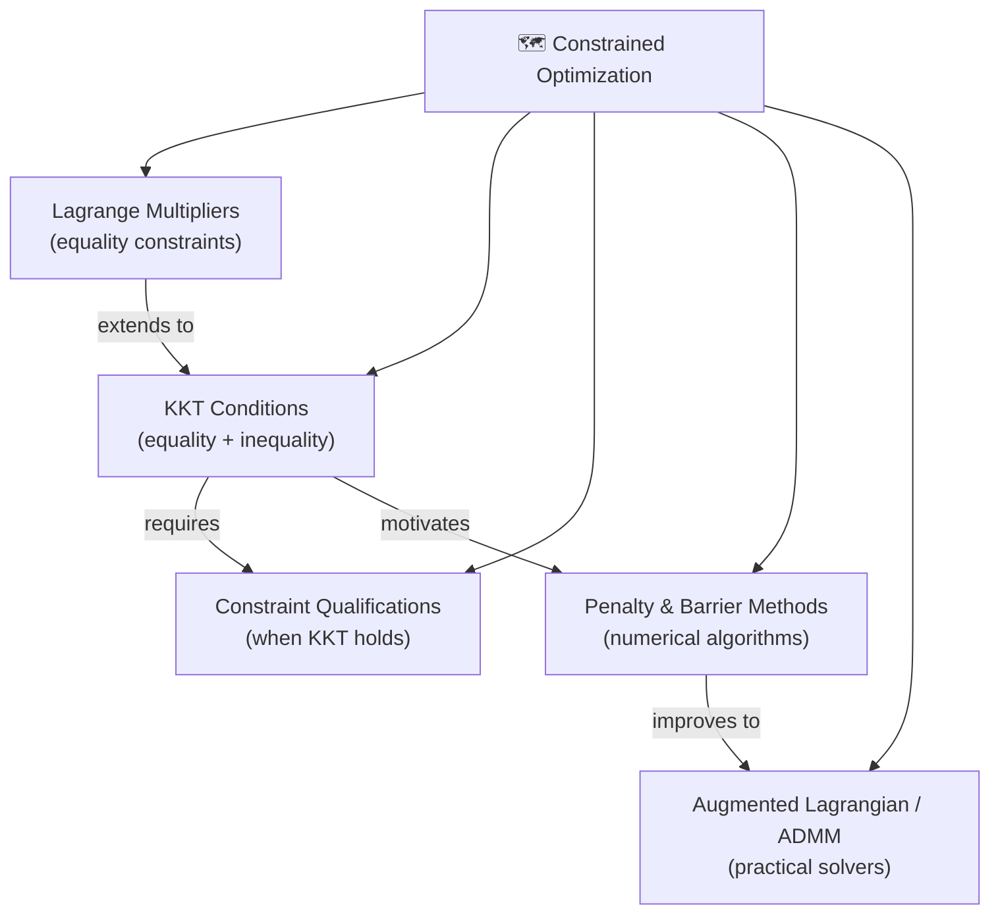

# 🗺️ MOC — Constrained Optimization

> [!abstract] TL;DR
> Constrained optimization adds equality and inequality constraints to the problem. The Lagrangian is the central mathematical object — it encodes both the objective and constraints in a single function. Lagrange multipliers give necessary conditions for equality constraints; KKT conditions extend this to inequalities and are the fundamental first-order optimality conditions for constrained problems. When the problem is convex and a constraint qualification holds (e.g., Slater's condition), KKT conditions are also sufficient. This section also covers numerical methods for solving constrained problems: penalty methods, barrier/interior-point methods, and the augmented Lagrangian.

---

## Section Map

---

## Notes in This Section

| File | Topic | Difficulty | Core Idea |
|------|-------|------------|-----------|
| [[Lagrange_Multipliers]] | Equality-constrained optimality | Intermediate | ∇f = -∑νᵢ∇hᵢ at optimum; shadow prices |
| [[KKT_Conditions]] | General first-order conditions | Intermediate | 4 conditions: stationarity, feasibility, dual feasibility, CS |
| [[Constraint_Qualifications]] | When KKT is valid | Advanced | LICQ, MFCQ, Slater's — regularity of the constraint set |
| [[Penalty_Barrier_Methods]] | Numerical algorithms | Intermediate | Penalize/barrier the constraints; interior-point methods |
| [[Augmented_Lagrangian]] | ALM and ADMM | Advanced | Best of penalty + multipliers; distributed optimization via ADMM |

---

## Recommended Learning Path

1. **[[Lagrange_Multipliers]]** — start here; equality constraints only, clean geometry
2. **[[KKT_Conditions]]** — generalize to inequalities; the master theorem
3. **[[Constraint_Qualifications]]** — understand when KKT actually applies
4. **[[Penalty_Barrier_Methods]]** — move to numerical methods; interior-point intuition
5. **[[Augmented_Lagrangian]]** — modern practical solver; ADMM for distributed problems

---

## Key Questions This Section Answers

- When is a point guaranteed to satisfy KKT conditions?
- What does a Lagrange multiplier actually measure (shadow price)?
- How do interior-point methods achieve polynomial complexity?
- Why is augmented Lagrangian better conditioned than pure penalty?
- How does ADMM decompose a large problem into parallel subproblems?

---

## Mathematical Objects at a Glance

| Object | Definition | Role |
|--------|-----------|------|
| Lagrangian $\mathcal{L}(x,\lambda,\nu)$ | $f(x)+\sum\lambda_i g_i(x)+\sum\nu_j h_j(x)$ | Central object; encodes objective + constraints |
| Lagrange multiplier $\nu_i$ | Dual variable for equality constraint | Shadow price; $\partial p^*/\partial b_i = -\nu_i^*$ |
| KKT multiplier $\lambda_i$ | Dual variable for inequality constraint | Must be $\geq 0$; zero if constraint inactive |
| Active set $\mathcal{I}(x^*)$ | $\{i \mid g_i(x^*)=0\}$ | Constraints that "bite" at the solution |
| Central path | Parametric path of barrier minimizers | Interior-point method trajectory |
| Augmented Lagrangian $\mathcal{L}_\rho$ | $\mathcal{L} + (\rho/2)\|h(x)\|^2$ | Penalty + multiplier update; well-conditioned |

---

## Related Sections

- **Section 01 — Unconstrained Optimization**: gradient, Newton methods; prerequisite
- **Section 02 — Convexity**: convex sets and functions; needed for Slater's condition
- **Section 04 — Duality**: Lagrangian duality, strong/weak duality; deep connection to KKT
- **Section 06 — Linear Programming**: LP as a constrained problem; simplex vs interior-point

---

#MOC #optimization #constrained
