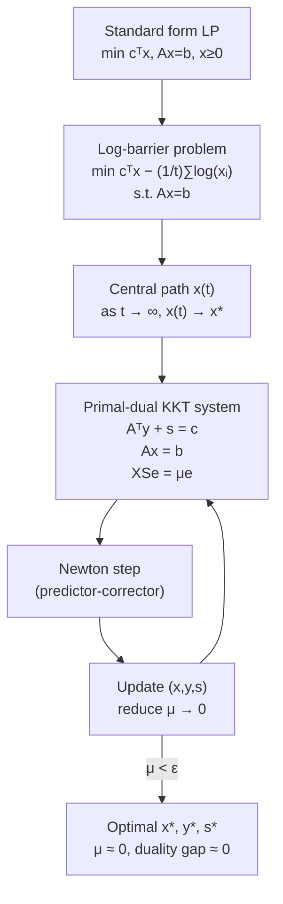

# 🎯 Interior-Point Methods for LP

> [!abstract] TL;DR
> Interior-point methods (IPM) solve LP in provably polynomial time $O(n^{3.5} \log(1/\varepsilon))$ by following a smooth central path through the interior of the feasible region toward the optimum. The primal-dual IPM (Mehrotra predictor-corrector) is the dominant algorithm in modern LP/QP solvers such as MOSEK, Gurobi, and HiGHS.

## Intuition — analogy FIRST

Imagine navigating a foggy mountain valley (the feasible region). Instead of hopping between cliff edges (vertices) as simplex does, IPM walks through the fog along the valley floor, guided by a logarithmic fog machine that repels you from the walls. As you turn up the machine's power ($t \to \infty$), the floor path converges to the true valley bottom (optimum).

The central path is this fog-guided trajectory — a smooth curve from a central interior point to the optimal vertex. At each step, a Newton step corrects your direction, and the duality gap (distance from optimality) shrinks geometrically.

---

## How It Works



## Key Concepts / Details

### Log-Barrier Formulation

The log-barrier method converts the inequality constraints $\mathbf{x} \geq 0$ into a smooth penalty:

$$\phi_t(\mathbf{x}) = \min_{\mathbf{x}}\; \mathbf{c}^\top \mathbf{x} - \frac{1}{t}\sum_{j=1}^n \log(x_j) \quad \text{s.t.}\; A\mathbf{x} = \mathbf{b}$$

- **Barrier parameter** $t > 0$: small $t$ → strongly repelled from boundary; large $t$ → close to true LP optimum
- The unique minimizer $\mathbf{x}(t)$ (central path point) satisfies the KKT conditions with complementarity $x_j s_j = 1/t$ for all $j$

As $t \to \infty$, $\mathbf{x}(t) \to \mathbf{x}^*$ along the central path.

### Primal-Dual KKT System

The optimality conditions for LP are:
$$A^\top \mathbf{y} + \mathbf{s} = \mathbf{c}$$
$$A\mathbf{x} = \mathbf{b}$$
$$\mathbf{x}, \mathbf{s} \geq \mathbf{0},\quad x_j s_j = 0\; \forall j \quad \text{(complementarity)}$$

IPM relaxes complementarity: $x_j s_j = \mu$ for all $j$ where $\mu > 0$ is the **barrier parameter** (duality measure).

Define $X = \text{diag}(\mathbf{x})$, $S = \text{diag}(\mathbf{s})$, $\mathbf{e} = (1,\ldots,1)^\top$. The perturbed KKT system is:

$$F(\mathbf{x}, \mathbf{y}, \mathbf{s}) = \begin{pmatrix} A^\top \mathbf{y} + \mathbf{s} - \mathbf{c} \\ A\mathbf{x} - \mathbf{b} \\ XS\mathbf{e} - \mu\mathbf{e} \end{pmatrix} = \mathbf{0}$$

### Newton Step (One IPM Iteration)

Apply Newton's method to $F = 0$. The Newton system is:

$$\begin{pmatrix} 0 & A^\top & I \\ A & 0 & 0 \\ S & 0 & X \end{pmatrix} \begin{pmatrix} \Delta\mathbf{x} \\ \Delta\mathbf{y} \\ \Delta\mathbf{s} \end{pmatrix} = -F(\mathbf{x}, \mathbf{y}, \mathbf{s})$$

Eliminating $\Delta\mathbf{s}$ reduces to solving the **augmented system** (or normal equations):

$$A X S^{-1} A^\top \Delta\mathbf{y} = A X S^{-1}(\mathbf{c} - A^\top \mathbf{y} - \mathbf{s}) + A\mathbf{x} - \mathbf{b}$$

This is a positive definite $m \times m$ system — solved in $O(m^3)$ (Cholesky factorization).

### Mehrotra Predictor-Corrector

The standard algorithm in practice (MOSEK, Gurobi, HiGHS):

1. **Predictor** (affine scaling step): compute Newton step $(\Delta\mathbf{x}^{aff}, \Delta\mathbf{y}^{aff}, \Delta\mathbf{s}^{aff})$ with $\mu = 0$
2. **Centering**: compute step length $\alpha^{aff}$, estimate $\sigma = (\mu_{aff}/\mu)^3$ (centering parameter)
3. **Corrector**: add a corrector to balance centering and progress
4. **Step**: take a safe step $\alpha$ (line search to stay interior)
5. **Reduce** $\mu \leftarrow \mu \cdot \sigma$

Empirically achieves superlinear convergence — often $30$–$50$ iterations regardless of problem size.

### Complexity Analysis

| Algorithm | Iteration Count | Cost per Iteration | Total |
|---|---|---|---|
| Simplex | $O(\exp(n))$ worst | $O(mn)$ or $O(m^2)$ | Not polynomial |
| Karmarkar (1984) | $O(\sqrt{n}\log(1/\varepsilon))$ | $O(n^3)$ | $O(n^{3.5}\log(1/\varepsilon))$ |
| Primal-dual IPM | $O(\sqrt{n}\log(1/\varepsilon))$ | $O(n^3)$ dense / better sparse | $O(n^{3.5}\log(1/\varepsilon))$ |
| Self-dual IPM | $O(\sqrt{n}\log(n/\varepsilon))$ | $O(n^3)$ | $O(n^{3.5}\log(n/\varepsilon))$ |

### Self-Dual Embedding (HSD Model)

Used in MOSEK and CVXOPT. Embeds the LP into a single homogeneous self-dual problem that:
- Has a known interior starting point (no Phase I needed)
- Detects primal/dual infeasibility uniformly (solution with $\tau \to 0$, $\kappa > 0$ certifies infeasibility)
- Achieves polynomial complexity without artificial assumptions

### IPM vs. Simplex

| Property | Simplex | Interior-Point |
|---|---|---|
| Complexity | Exponential worst case | Polynomial $O(n^{3.5})$ |
| Warm starting | Excellent | Limited (interior vs. vertex) |
| Iterates | Vertices (boundary) | Interior of feasible region |
| Final solution | Vertex (basic) | May be non-vertex; purification needed |
| Small LP | Typically faster | Overhead from Newton system |
| Large LP/QP | Revised simplex competitive | Often faster (no degenerate cycling) |
| SDP/SOCP | Not applicable | Native extension (conic IPM) |

```python
import numpy as np
from scipy.optimize import linprog
import time

# ── Compare simplex vs IPM (HiGHS) on the same LP ──────────────────────
c  = [-5.0, -4.0]
Au = [[6.0, 4.0], [1.0, 2.0]]
bu = [24.0, 6.0]
bounds = [(0, None), (0, None)]

# HiGHS simplex
t0 = time.perf_counter()
res_s = linprog(c, A_ub=Au, b_ub=bu, bounds=bounds,
                method='highs-ds')          # dual simplex
t_s = time.perf_counter() - t0
print(f"Simplex:  x={res_s.x}, obj={-res_s.fun:.4f}, time={t_s*1e6:.1f} µs")

# HiGHS interior point
t0 = time.perf_counter()
res_i = linprog(c, A_ub=Au, b_ub=bu, bounds=bounds,
                method='highs-ipm')         # interior point
t_i = time.perf_counter() - t0
print(f"IPM:      x={res_i.x}, obj={-res_i.fun:.4f}, time={t_i*1e6:.1f} µs")

# ── Verify duality gap ─────────────────────────────────────────────────
# Build dual manually: max 24y1+6y2, s.t. 6y1+y2<=5, 4y1+2y2<=4, y>=0
c_d = [-24.0, -6.0]
A_d = [[6.0, 1.0], [4.0, 2.0]]
b_d = [5.0, 4.0]
dual = linprog(c_d, A_ub=A_d, b_ub=b_d,
               bounds=[(0,None)]*2, method='highs')
primal_obj = -res_i.fun
dual_obj   = -dual.fun
print(f"\nPrimal obj: {primal_obj:.6f}")
print(f"Dual obj:   {dual_obj:.6f}")
print(f"Duality gap: {abs(primal_obj - dual_obj):.2e}")  # ≈ machine precision

# ── Larger random LP to show IPM scaling ──────────────────────────────
np.random.seed(42)
m, n = 50, 200
A_big  = np.random.randn(m, n)
b_big  = np.random.randn(m)
c_big  = np.random.randn(n)
bnds   = [(0, None)] * n

t0 = time.perf_counter()
linprog(c_big, A_eq=A_big, b_eq=b_big, bounds=bnds, method='highs-ds')
print(f"\nLarge LP simplex: {(time.perf_counter()-t0)*1e3:.2f} ms")

t0 = time.perf_counter()
linprog(c_big, A_eq=A_big, b_eq=b_big, bounds=bnds, method='highs-ipm')
print(f"Large LP IPM:     {(time.perf_counter()-t0)*1e3:.2f} ms")
```

## Real-World Notes

- **MOSEK** is the premier IPM solver for conic optimization (LP, QP, SOCP, SDP); used in financial optimization and machine learning
- **Gurobi and CPLEX** use Mehrotra predictor-corrector IPM as their barrier solver, with the option to cross-over to simplex for a vertex solution
- **Cross-over**: after IPM finds the optimum in the interior, a cross-over procedure finds the nearby vertex; this enables warm starting and is the standard workflow in production LP solving
- **Sparse Newton systems**: real-world LP have sparse $A$; sparse Cholesky (e.g., CHOLMOD) reduces per-iteration cost dramatically below $O(m^3)$

## Common Pitfalls

- **Starting point**: IPM requires a strictly interior initial point ($x > 0$, $s > 0$); self-dual embedding avoids this issue automatically
- **Near-degenerate problems**: when the optimal is highly degenerate, central path curves sharply and many iterations are needed; cross-over to simplex is the fix
- **Numerical issues in Newton system**: the coefficient matrix $XS^{-1}$ becomes ill-conditioned near the optimum as $x_j \to 0$ for non-active variables; careful scaling and regularization are needed
- **Not polynomial in practice for LPs with many degenerate constraints**: theoretical complexity assumes non-degeneracy; real solvers handle degeneracy with heuristics

## Related Concepts

- [[LP_Standard_Form]] — defines the LP structure IPM works on
- [[LP_Duality]] — IPM tracks both primal and dual simultaneously; duality gap is the convergence measure
- [[Simplex_Method]] — classical alternative; complementary strengths

## Review Questions

1. What is the central path, and how does it relate to the log-barrier function?
2. Derive the Newton system for one primal-dual IPM step from the KKT conditions.
3. What is the barrier parameter $\mu$, and how does it relate to the duality gap?
4. Compare the theoretical complexity of simplex and IPM. Why might simplex still be preferred for small LPs?
5. What is self-dual embedding, and why does it avoid the need for Phase I?
6. Explain why IPM is harder to warm-start than simplex.

## Sources

- Bertsimas & Tsitsiklis, *Introduction to Linear Optimization*, Ch. 9, Athena Scientific, 1997
- Nocedal & Wright, *Numerical Optimization*, Ch. 14, Springer, 2006
- Vanderbei, *Linear Programming*, Ch. 20–21, Springer, 2020
- Mehrotra, S., "On the Implementation of a Primal-Dual Interior Point Method," *SIAM J. Optim.*, 1992
- Karmarkar, N., "A New Polynomial-Time Algorithm for Linear Programming," *Combinatorica*, 1984

#optimization #linear-programming #advanced
