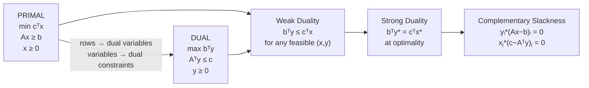

# ⚖️ LP Duality

> [!abstract] TL;DR
> Every LP (the primal) has an associated dual LP formed by a symmetric transformation of constraints and variables. Weak duality says the dual objective always lower-bounds the primal. Strong duality (the crown jewel) says the gap is exactly zero at optimality: primal and dual optima coincide. Complementary slackness characterizes the optimal pair precisely.

## Intuition — analogy FIRST

Imagine a factory manager (primal) who allocates $n$ resources to maximize profit subject to $m$ budget constraints. A regulator (dual) wants to price the $m$ resources as cheaply as possible, but high enough that no product is worth producing beyond what the prices allow. At equilibrium, the total budget spent equals the total profit earned — that is strong duality.

The dual variables are **shadow prices**: the marginal value of relaxing each constraint by one unit. If you could buy one more unit of resource $i$, the shadow price $y_i^*$ tells you exactly how much extra profit you would gain.

---

## How It Works



## Key Concepts / Details

### Primal–Dual Pair

**Primal** (minimization standard): $\min\; \mathbf{c}^\top \mathbf{x} \quad \text{s.t.} \quad A\mathbf{x} \geq \mathbf{b},\; \mathbf{x} \geq \mathbf{0}$

**Dual** (maximization): $\max\; \mathbf{b}^\top \mathbf{y} \quad \text{s.t.} \quad A^\top \mathbf{y} \leq \mathbf{c},\; \mathbf{y} \geq \mathbf{0}$

**Mnemonic for construction**:
- Each **primal constraint** → one **dual variable**
- Each **primal variable** → one **dual constraint**
- Constraint direction and variable sign are symmetric

### Primal–Dual Correspondence Table

| Primal (min) | Dual (max) |
|---|---|
| $m$ constraints $\geq$ | $m$ dual variables $\geq 0$ |
| $n$ variables $\geq 0$ | $n$ dual constraints $\leq$ |
| Constraint $i$ is equality | Dual variable $y_i$ is free |
| Variable $j$ is free | Dual constraint $j$ is equality |
| Objective coefficients $\mathbf{c}$ | RHS of dual constraints |
| RHS $\mathbf{b}$ | Dual objective coefficients |
| **Dual of dual** | = Primal |

### Weak Duality Theorem

> **Theorem**: For any primal feasible $\mathbf{x}$ and dual feasible $\mathbf{y}$: $\mathbf{b}^\top \mathbf{y} \leq \mathbf{c}^\top \mathbf{x}$

**Proof**: $\mathbf{b}^\top \mathbf{y} \leq (A\mathbf{x})^\top \mathbf{y} = \mathbf{x}^\top A^\top \mathbf{y} \leq \mathbf{x}^\top \mathbf{c} = \mathbf{c}^\top \mathbf{x}$

where the first $\leq$ uses $A\mathbf{x} \geq \mathbf{b}$ and $\mathbf{y} \geq 0$; the second $\leq$ uses $A^\top \mathbf{y} \leq \mathbf{c}$ and $\mathbf{x} \geq 0$. $\square$

**Corollary**: If primal objective = dual objective for some feasible pair, both are optimal.

### Strong Duality Theorem

> **Theorem**: If the primal LP has a finite optimal solution $\mathbf{x}^*$, then the dual LP also has a finite optimal $\mathbf{y}^*$ and $\mathbf{c}^\top \mathbf{x}^* = \mathbf{b}^\top \mathbf{y}^*$.

The proof follows from the simplex method: at termination with optimal basis $B$, the dual variables $\mathbf{y}^* = (B^{-1})^\top \mathbf{c}_B$ are feasible for the dual, and strong duality holds by construction of the reduced cost optimality conditions.

### Complementary Slackness (CS)

At optimality, for primal $\mathbf{x}^*$ and dual $\mathbf{y}^*$:

$$y_i^*\, (A_i\mathbf{x}^* - b_i) = 0 \quad \forall i$$
$$x_j^*\, (c_j - A_j^\top \mathbf{y}^*) = 0 \quad \forall j$$

In words:
- If constraint $i$ is **slack** (not tight), then $y_i^* = 0$ (resource is free; extra supply has no value)
- If $y_i^* > 0$, then constraint $i$ is **tight** ($A_i\mathbf{x}^* = b_i$)
- If $x_j^* > 0$, then dual constraint $j$ is **tight** (product $j$ is produced at the price that makes it break-even)

CS gives a practical recipe: given primal optimal, compute dual by solving the CS system; verify dual feasibility.

### Duality in the Simplex Method

At the optimal simplex basis $B$:
- Dual variables: $\mathbf{y}^* = (B^{-1})^\top \mathbf{c}_B$
- Reduced costs: $\bar{\mathbf{c}} = \mathbf{c} - A^\top \mathbf{y}^*$
- Optimality condition: $\bar{\mathbf{c}} \geq 0$ ↔ **dual feasibility**

This means simplex terminates when the current primal BFS is also dual-feasible — a direct expression of complementary slackness.

### Infeasibility and Unboundedness via Duality

| Primal | Dual | Interpretation |
|---|---|---|
| Optimal | Optimal | Strong duality holds |
| Unbounded | Infeasible | Primal can decrease forever → no dual feasible pt |
| Infeasible | Unbounded | No resource allocation is consistent |
| Infeasible | Infeasible | Both fail simultaneously (rare but possible) |

**Farkas' Lemma**: exactly one of the following holds: (1) $A\mathbf{x} = \mathbf{b}$, $\mathbf{x} \geq 0$ has a solution; (2) $A^\top \mathbf{y} \geq 0$, $\mathbf{b}^\top \mathbf{y} < 0$ has a solution. This is the fundamental certificate of infeasibility.

```python
import numpy as np
from scipy.optimize import linprog

# Primal: min -5x1 - 4x2
# s.t.  6x1 + 4x2 <= 24
#        x1 + 2x2 <= 6
#        x1, x2 >= 0
c_p = [-5.0, -4.0]
A_p = [[6.0, 4.0], [1.0, 2.0]]
b_p = [24.0, 6.0]

primal = linprog(c_p, A_ub=A_p, b_ub=b_p,
                 bounds=[(0, None)] * 2, method='highs')

x_star = primal.x
primal_obj = -primal.fun   # convert back to max
print(f"Primal opt: x={x_star}, obj={primal_obj:.4f}")

# ── Build dual: max 24y1 + 6y2
# s.t.  6y1 + y2 <= 5
#       4y1 + 2y2 <= 4
#       y1, y2 >= 0
# (convert to min for scipy)
c_d = [-24.0, -6.0]
A_d = [[6.0, 1.0], [4.0, 2.0]]
b_d = [5.0, 4.0]

dual = linprog(c_d, A_ub=A_d, b_ub=b_d,
               bounds=[(0, None)] * 2, method='highs')

y_star = dual.x
dual_obj = -dual.fun
print(f"Dual opt:  y={y_star}, obj={dual_obj:.4f}")
print(f"Duality gap: {abs(primal_obj - dual_obj):.2e}")  # should be ~0

# ── Verify complementary slackness ─────────────────────────────────────
A_np = np.array(A_p)
b_np = np.array(b_p)
slack_primal = b_np - A_np @ x_star      # s = b - Ax (≥ 0)
print(f"\nPrimal slacks: {slack_primal}")
print(f"Dual variables (y*): {y_star}")
print(f"CS check (y* * slack): {y_star * slack_primal}")  # should be ~0
# Output: CS check ≈ [0, 0] — complementary slackness holds
```

## Real-World Notes

- **Shadow prices in production**: if the machine time constraint has shadow price $y_1^* = 0.75$, buying one extra machine-hour increases maximum profit by \$0.75 — exactly as long as the current basis remains optimal
- **Revenue management**: airlines solve the dual of seat allocation LP to price fare classes; dual variables = opportunity cost of capacity
- **Network flow duality**: the dual of a min-cost flow LP has a beautiful interpretation as node potentials (see Bellman-Ford)
- **Sensitivity analysis** [[Sensitivity_Analysis]] uses shadow prices to answer "what-if" questions without resolving

## Common Pitfalls

- **Wrong dual form**: the primal-dual transformation depends on the constraint direction (≤, ≥, =) and variable sign; use the correspondence table carefully
- **Forgetting free variables**: a free primal variable $x_j$ (no sign constraint) forces the corresponding dual constraint to be an equality
- **Misinterpreting shadow prices outside the ranging interval**: $y_i^* = \Delta p^*/\Delta b_i$ only holds locally; outside the range, the basis changes and the price changes discontinuously
- **Infeasibility vs. unboundedness confusion**: when primal is infeasible, the dual is not necessarily unbounded (it can also be infeasible)

## Related Concepts

- [[LP_Standard_Form]] — defines the primal LP structure
- [[Simplex_Method]] — dual variables emerge naturally at optimality
- [[Sensitivity_Analysis]] — shadow prices and ranging intervals
- [[Interior_Point_Methods]] — primal-dual IPM tracks both x and y simultaneously

## Review Questions

1. Write the dual of: $\min\; 2x_1 + 3x_2$ s.t. $x_1 + x_2 \geq 4$, $x_1 - x_2 \leq 2$, $x_1 \geq 0$, $x_2$ free.
2. Prove weak duality from scratch for the canonical pair (max cᵀx ≤ bᵀy for any feasible pair).
3. At optimality, if dual variable $y_2^* = 3$, what does this mean economically?
4. Use complementary slackness to find the optimal dual solution given primal optimal $x^* = (3, 1.5)$.
5. State Farkas' Lemma and explain its role as an infeasibility certificate.
6. Why is the dual of the dual equal to the primal (up to sign)?

## Sources

- Bertsimas & Tsitsiklis, *Introduction to Linear Optimization*, Ch. 4, Athena Scientific, 1997
- Boyd & Vandenberghe, *Convex Optimization*, Ch. 5, Cambridge University Press, 2004
- Vanderbei, *Linear Programming*, Ch. 7–8, Springer, 2020
- Gale, D., Kuhn, H.W., Tucker, A.W., "Linear Programming and the Theory of Games," 1951

#optimization #linear-programming #advanced
