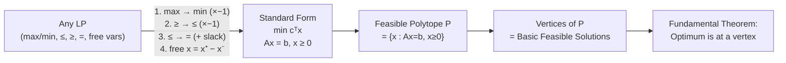

# 📄 LP Standard Form and Geometry

> [!abstract] TL;DR
> Any linear program can be converted to standard form min cᵀx s.t. Ax=b, x≥0. The feasible region is a polyhedron, and the fundamental theorem of LP guarantees that if an optimum exists, it occurs at a vertex — a basic feasible solution (BFS) corresponding to a set of m linearly independent active constraints.

## Intuition — analogy FIRST

Imagine pouring water into a multidimensional crystal. The water level rises until it hits a corner — no matter the shape of the crystal, the highest resting point is always a vertex. LP works the same way: the objective function "tilts" the space, and the optimal value must pool at a corner (vertex) of the feasible polyhedron.

Slack variables are like padding: if a wall says "you must use at least 3 hours on machine A," we add a slack variable recording how many unused hours remain. Turning inequalities into equalities with slacks is purely bookkeeping — the geometry is unchanged.

---

## How It Works



## Key Concepts / Details

### LP Forms and Conversions

| Original Form | Conversion Rule | Result |
|---|---|---|
| max cᵀx | Replace c with −c | min −cᵀx |
| aᵀx ≥ b | Multiply by −1 | −aᵀx ≤ −b |
| aᵀx ≤ b | Add slack s ≥ 0 | aᵀx + s = b |
| aᵀx = b | Already equality | keep as is |
| xⱼ free | Replace xⱼ = xⱼ⁺ − xⱼ⁻, xⱼ⁺,xⱼ⁻ ≥ 0 | two non-negative vars |

**Standard form**: $\min\; \mathbf{c}^\top \mathbf{x} \quad \text{s.t.} \quad A\mathbf{x} = \mathbf{b},\; \mathbf{x} \geq \mathbf{0}$

**Canonical form (maximization)**: $\max\; \mathbf{c}^\top \mathbf{x} \quad \text{s.t.} \quad A\mathbf{x} \leq \mathbf{b},\; \mathbf{x} \geq \mathbf{0}$

### Basic Feasible Solutions (BFS)

Given $A \in \mathbb{R}^{m \times n}$ with $m < n$ and $\text{rank}(A) = m$:

1. Choose $m$ linearly independent columns of $A$ — call this basis matrix $B \in \mathbb{R}^{m \times m}$
2. **Basic variables**: $\mathbf{x}_B = B^{-1}\mathbf{b}$
3. **Nonbasic variables**: $\mathbf{x}_N = \mathbf{0}$
4. The solution is a **BFS** if $\mathbf{x}_B \geq 0$

Each BFS corresponds to a **vertex** (extreme point) of the feasible polyhedron $P = \{\mathbf{x} : A\mathbf{x} = \mathbf{b},\; \mathbf{x} \geq 0\}$.

> [!info] Degeneracy
> A BFS is **degenerate** when some basic variable $x_{B_i} = 0$. Geometrically, more than $n$ constraints are active at the vertex. Degeneracy can cause the simplex method to stall (cycle) if care is not taken.

### Fundamental Theorem of LP

> **Theorem**: If LP has a feasible solution and a finite optimal value, then there exists an optimal solution that is a BFS.

**Proof sketch**: Let $x^*$ be any optimal interior point. Move $x^*$ in the direction of the objective gradient until a constraint becomes active (we hit a face). Repeat on the face until we reach a vertex. The objective value only improves (or stays equal) along this path. $\square$

This theorem is why we only need to search vertices — there are at most $\binom{n}{m}$ of them.

### Geometry: Feasible Region Types

- **Bounded polytope**: $P$ is compact — optimal always exists at a vertex
- **Unbounded polyhedron**: feasible set extends to infinity; LP may be unbounded (no finite optimal) or bounded (optimum at vertex on a ray's base)
- **Empty**: infeasible — no point satisfies all constraints simultaneously

### 2D Example — Production Planning

A factory makes two products:
- $x_1$ = units of Product A, profit = \$5
- $x_2$ = units of Product B, profit = \$4
- Machine time: $6x_1 + 4x_2 \leq 24$
- Labor: $x_1 + 2x_2 \leq 6$
- $x_1, x_2 \geq 0$

Vertices: $(0,0)$, $(4,0)$, $(3,1.5)$, $(0,3)$ — optimal at $(3, 1.5)$ with profit $\$21$.

```python
import numpy as np
from scipy.optimize import linprog
import matplotlib.pyplot as plt

# Maximize 5x1 + 4x2 => minimize -5x1 - 4x2
c = [-5, -4]

# Inequality constraints (≤ form): Ax ≤ b
A_ub = [[6, 4],
        [1, 2]]
b_ub = [24, 6]

# Bounds: x1, x2 >= 0
bounds = [(0, None), (0, None)]

result = linprog(c, A_ub=A_ub, b_ub=b_ub, bounds=bounds, method='highs')

print(f"Optimal x1={result.x[0]:.2f}, x2={result.x[1]:.2f}")
print(f"Maximum profit: ${-result.fun:.2f}")
# Output: x1=3.00, x2=1.50, profit=$21.00

# Visualize feasible region and vertices
x1 = np.linspace(0, 5, 300)
fig, ax = plt.subplots(figsize=(6, 5))
ax.fill_between(x1,
                np.zeros_like(x1),
                np.minimum((24 - 6*x1)/4, (6 - x1)/2),
                where=(x1 >= 0) & (x1 <= 4),
                alpha=0.3, label='Feasible region')
vertices = [(0,0), (4,0), (3,1.5), (0,3)]
for v in vertices:
    ax.plot(*v, 'ro', ms=8)
    ax.annotate(f'({v[0]},{v[1]})', v, textcoords='offset points', xytext=(5,5))
ax.set_xlabel('$x_1$'); ax.set_ylabel('$x_2$')
ax.set_title('2D LP — Feasible Polytope'); ax.legend(); plt.tight_layout()
```

## Real-World Notes

- **Operations research** formulations almost always start with standard form conversion as a preprocessing step before handing off to a solver
- Large-scale LPs (supply chain, airline scheduling) have $m$ in the thousands and $n$ in the millions — sparse data structures for $A$ are critical
- The number of vertices $\binom{n}{m}$ can be astronomically large, but simplex visits only a tiny fraction in practice

## Common Pitfalls

- **Forgetting nonnegativity after substitution**: when replacing $x = x^+ - x^-$, both $x^+$ and $x^-$ must be constrained $\geq 0$
- **Rank deficiency in A**: if $A$ has redundant rows, $B^{-1}$ may not exist; always verify $\text{rank}(A) = m$
- **Confusing BFS with feasibility**: a basis gives a BFS only if $B^{-1}b \geq 0$; otherwise it is a basic infeasible solution
- **Assuming bounded**: an LP with only $\geq 0$ bounds but no upper bound constraints is often unbounded — always check

## Related Concepts

- [[Simplex_Method]] — algorithm that traverses BFS vertices
- [[LP_Duality]] — dual LP and shadow prices
- [[_MOC_Linear_Programming]] — section overview

## Review Questions

1. Convert the LP $\max\; 3x_1 - 2x_2$ s.t. $x_1 + x_2 \leq 4$, $x_1 - x_2 \geq 1$, $x_2$ free, to standard form.
2. How many basic feasible solutions can a standard form LP with $m=3$, $n=7$ have at most?
3. If a BFS has all basic variables strictly positive, what can you say about degeneracy?
4. Explain geometrically why the optimal of an LP must be at a vertex.
5. What happens to the feasible polytope when you add a new constraint?

## Sources

- Bertsimas & Tsitsiklis, *Introduction to Linear Optimization*, Ch. 2, Athena Scientific, 1997
- Vanderbei, *Linear Programming: Foundations and Extensions*, Ch. 1–2, Springer, 2020
- Dantzig, G.B., *Linear Programming and Extensions*, Princeton University Press, 1963

#optimization #linear-programming #intermediate
