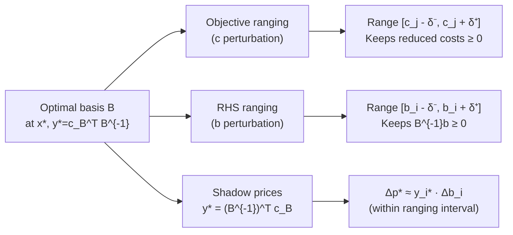

# 📊 Sensitivity Analysis in LP

> [!abstract] TL;DR
> Sensitivity analysis tells you how far the data (objective coefficients c or right-hand sides b) can change before the current optimal basis changes. Shadow prices (dual variables) give the marginal value of each constraint, valid within a ranging interval. This is essential for practical OR decisions without resolving the LP from scratch.

## Intuition — analogy FIRST

After solving a production LP, a manager asks: "What if machine time increases by 10 hours? What if product A becomes 20% more profitable?" Sensitivity analysis answers these questions without re-running the solver.

Think of the optimal corner of the feasible polytope: the corner stays optimal as long as you don't tip the objective direction enough to make a neighboring corner better, and as long as you don't shrink/expand the polytope enough to make the current corner infeasible. The ranges for $\mathbf{c}$ and $\mathbf{b}$ that keep these conditions intact are the **sensitivity ranges**.

---

## How It Works



## Key Concepts / Details

### Setup: Sensitivity from the Optimal Basis

At optimality, simplex provides:
- Optimal basis $B$ and basis inverse $B^{-1}$
- Primal solution $\mathbf{x}_B^* = B^{-1}\mathbf{b}$
- Dual variables $\mathbf{y}^* = (B^{-1})^\top \mathbf{c}_B$
- Reduced costs $\bar{\mathbf{c}}_N = \mathbf{c}_N - A_N^\top \mathbf{y}^* \geq \mathbf{0}$

All sensitivity formulas exploit these quantities — **no re-solve needed** for small perturbations.

### Ranging for Objective Coefficients (c)

Perturb $c_j \to c_j + \delta$ for a **nonbasic** variable $j$:
- New reduced cost: $\bar{c}_j + \delta$
- Basis remains optimal iff $\bar{c}_j + \delta \geq 0$, i.e., $\delta \geq -\bar{c}_j$
- Allowable decrease: $\delta_- = \bar{c}_j$ (can decrease by exactly the current reduced cost)
- Allowable increase: $\delta_+ = +\infty$ (any increase keeps $\bar{c}_j + \delta > 0$)

Perturb $c_j \to c_j + \delta$ for a **basic** variable $j$:
- Dual variables change: $\mathbf{y} \to \mathbf{y} + (B^{-1}\mathbf{e}_j)\delta$ (where $\mathbf{e}_j$ is the unit vector in the basis position)
- All reduced costs shift; find max $\delta_-$ and $\delta_+$ such that all $\bar{c}_N \geq 0$ still holds

### Ranging for Right-Hand Sides (b)

Perturb $b_i \to b_i + \delta$:
- New primal solution: $\mathbf{x}_B^* = B^{-1}(\mathbf{b} + \delta \mathbf{e}_i) = \mathbf{x}_B^* + \delta (B^{-1})_{\cdot i}$
- Basis remains feasible iff $\mathbf{x}_B^* + \delta (B^{-1})_{\cdot i} \geq \mathbf{0}$
- Let $\mathbf{d} = (B^{-1})_{\cdot i}$ (the $i$-th column of $B^{-1}$):
  - Allowable increase: $\delta_+ = \min_{k : d_k < 0} (-x_{B_k}^* / d_k)$
  - Allowable decrease: $\delta_- = \min_{k : d_k > 0} (x_{B_k}^* / d_k)$

### Shadow Prices and Their Interpretation

The **shadow price** (dual variable) $y_i^*$ gives:

$$\Delta p^* \approx y_i^* \cdot \Delta b_i \quad \text{for } \Delta b_i \text{ within ranging interval}$$

| Shadow price | Meaning |
|---|---|
| $y_i^* > 0$ | Constraint $i$ is binding; relaxing it by 1 unit improves objective by $y_i^*$ |
| $y_i^* = 0$ | Constraint $i$ has slack; tightening or relaxing it (slightly) has no effect |

> [!warning] Valid only within the ranging interval
> Shadow prices are **linear approximations**. Once $\Delta b_i$ exceeds the ranging interval, the optimal basis changes and $y_i^*$ is no longer the correct shadow price.

### 100% Rule for Simultaneous Changes

If multiple RHS values change simultaneously by fractions $f_i$ of their individual allowable ranges:

$$\sum_i f_i \leq 1 \implies \text{current basis remains optimal (sufficient condition)}$$

This is conservative — the basis may remain optimal even beyond this bound.

### Adding a New Variable or Constraint

**New variable $x_{n+1}$ with cost $c_{n+1}$, column $\mathbf{a}_{n+1}$**:
- Compute reduced cost: $\bar{c}_{n+1} = c_{n+1} - \mathbf{y}^{*\top}\mathbf{a}_{n+1}$
- If $\bar{c}_{n+1} \geq 0$: current basis still optimal (new variable has no benefit)
- If $\bar{c}_{n+1} < 0$: re-run simplex from current basis (one more pivot may suffice)

**New constraint $\mathbf{a}^\top \mathbf{x} \leq b_{m+1}$**:
- Check if current $\mathbf{x}^*$ satisfies the new constraint
- If yes: constraint is redundant, solution unchanged
- If no: add slack, perform dual simplex pivots to restore feasibility

### Practical Summary Table

| Analysis Type | What Changes | Condition for Basis to Stay | Formula |
|---|---|---|---|
| Obj. coeff. (nonbasic $j$) | $c_j + \delta$ | $\bar{c}_j + \delta \geq 0$ | $\delta \in [-\bar{c}_j, +\infty)$ |
| Obj. coeff. (basic $j$) | $c_j + \delta$ | All $\bar{c}_N \geq 0$ | Solve system for $\delta$ bounds |
| RHS $b_i$ | $b_i + \delta$ | $B^{-1}\mathbf{b} + \delta(B^{-1})_{\cdot i} \geq 0$ | Ratio test on $B^{-1}$ columns |
| Shadow price | — | Within RHS range | $\Delta p^* = y_i^* \cdot \Delta b_i$ |

```python
import numpy as np
from scipy.optimize import linprog

# ── Base LP: max 5x1 + 4x2 subject to 6x1+4x2<=24, x1+2x2<=6 ──────────
c  = [-5.0, -4.0]
Au = [[6.0, 4.0], [1.0, 2.0]]
bu = [24.0, 6.0]
bounds = [(0, None), (0, None)]

def solve_lp(c, Au, bu):
    res = linprog(c, A_ub=Au, b_ub=bu, bounds=bounds, method='highs')
    return res.x, -res.fun, res

x_opt, obj_opt, res = solve_lp(c, Au, bu)
print(f"Base: x={x_opt}, obj={obj_opt:.2f}")

# ── Manual shadow price computation ────────────────────────────────────
# Optimal basis at x=(3, 1.5): both constraints are tight
# B = [[6, 4], [1, 2]]  (columns for x1, x2)
B = np.array([[6.0, 4.0], [1.0, 2.0]])
c_B = np.array([-5.0, -4.0])           # costs of basic variables
y_star = np.linalg.solve(B.T, c_B)     # dual variables (shadow prices)
print(f"\nShadow prices: y1={-y_star[0]:.4f}, y2={-y_star[1]:.4f}")
# Negative because we minimized -obj; shadow prices for max problem

# ── Sensitivity: perturb b1 (machine hours) ────────────────────────────
for delta in [-2, 0, 2, 5]:
    bu_new = [24.0 + delta, 6.0]
    x_new, obj_new, _ = solve_lp(c, Au, bu_new)
    approx = obj_opt + (-y_star[0]) * delta   # shadow price approximation
    print(f"  b1={24+delta}: actual={obj_new:.3f}, shadow approx={approx:.3f}")

# ── Sensitivity: perturb objective coefficient c1 ──────────────────────
print("\nObjective sensitivity for c1 (base = 5):")
for c1 in [3.0, 4.0, 5.0, 6.0, 8.0]:
    c_new = [-c1, -4.0]
    x_new, obj_new, _ = solve_lp(c_new, Au, bu)
    print(f"  c1={c1}: x={x_new.round(3)}, obj={obj_new:.3f}")
# Basis changes when c1 drops below 2 (x2 becomes more attractive)
```

## Real-World Notes

- **Contract negotiation**: sensitivity analysis tells a manager exactly how much more they should pay for additional machine hours ($y_i^*$ per unit), and for how many additional hours this price is valid
- **Portfolio management**: ranging on return coefficients shows how robust the optimal allocation is to estimation error in expected returns
- **Automated LP reporting**: commercial solvers (CPLEX, Gurobi) output sensitivity ranges automatically; knowing how to read this report is a core OR skill
- **Parametric LP**: tracing the optimal as a parameter changes continuously is used in multi-objective optimization and homotopy methods

## Common Pitfalls

- **Using shadow prices outside the ranging interval**: the price changes discontinuously when the basis changes; the linear approximation fails
- **Ignoring degeneracy**: degenerate BFS have zero-length ranging intervals — multiple bases achieve the same vertex, and small changes can cause basis changes
- **100% rule direction**: the 100% rule applies to the allowable **range**, not to the coefficient value; fractional changes must be normalized correctly
- **Forgetting sign conventions**: shadow prices computed from a minimization LP need sign flipping for a maximization interpretation

## Related Concepts

- [[LP_Duality]] — shadow prices are dual variables $\mathbf{y}^* = (B^{-1})^\top \mathbf{c}_B$
- [[Simplex_Method]] — provides the optimal basis from which sensitivity is computed
- [[LP_Standard_Form]] — basis structure needed for ranging formulas

## Review Questions

1. The optimal basis for a 2-constraint LP is $B = [[2,1],[1,3]]$, $\mathbf{c}_B = [5, 3]$, $\mathbf{b} = [10, 6]$. Compute the shadow prices.
2. A shadow price for constraint 2 is $y_2^* = 4$ with allowable increase $\Delta b_2 \leq 3$. If $b_2$ increases by 5, can you use the shadow price directly? Why or why not?
3. Explain the 100% rule and why it is a sufficient (not necessary) condition.
4. How do you determine whether a new variable added to an optimal LP will change the optimal basis?
5. If the ranging interval for $c_1$ is $[3, 8]$ and the current value is $c_1 = 5$, by how much can $c_1$ decrease before the current basis is no longer optimal?

## Sources

- Bertsimas & Tsitsiklis, *Introduction to Linear Optimization*, Ch. 5, Athena Scientific, 1997
- Hillier & Lieberman, *Introduction to Operations Research*, McGraw-Hill, 2015
- Vanderbei, *Linear Programming*, Ch. 9, Springer, 2020
- Winston, W.L., *Operations Research: Applications and Algorithms*, 4th ed., 2004

#optimization #linear-programming #intermediate
