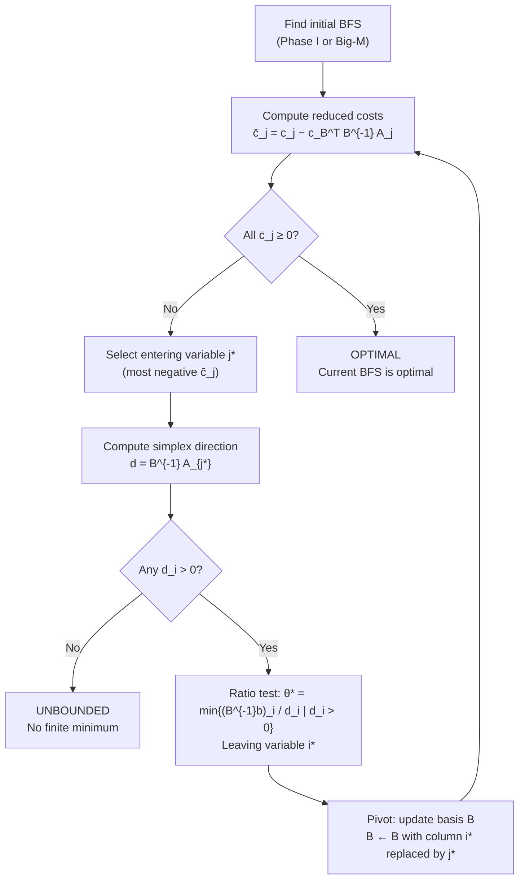

# 🔄 Simplex Method

> [!abstract] TL;DR
> The simplex method traverses vertices (basic feasible solutions) of the LP feasible polytope by performing pivot operations, moving to an adjacent BFS with a strictly lower objective until optimality is certified. It is exponential in the worst case (Klee-Minty) but empirically fast; the revised simplex is efficient for large sparse LPs.

## Intuition — analogy FIRST

Imagine hiking down a mountain where the terrain is a many-faced crystal (the polyhedron). You stand at a corner (vertex), look at all the edges leading away from you, and step along whichever edge goes downhill fastest. At each new corner you repeat this check. When every edge leads uphill, you are at the bottom — the optimum.

The **ratio test** prevents you from stepping off a cliff: when you choose an edge direction, it tells you exactly how far you can walk before hitting another wall (becoming infeasible).

---

## How It Works



## Key Concepts / Details

### Reduced Costs

For a current basis $B$ with basic variables $\mathbf{x}_B$, the **reduced cost** of nonbasic variable $j$ is:

$$\bar{c}_j = c_j - \mathbf{c}_B^\top B^{-1} \mathbf{A}_j$$

- $\bar{c}_j < 0$ → entering variable $j$ decreases the objective (for minimization)
- $\bar{c}_j \geq 0$ for all nonbasic $j$ → current BFS is **optimal**
- The vector $\mathbf{y} = (B^{-1})^\top \mathbf{c}_B$ are the **dual variables** (shadow prices)

### Pivot Operation (One Iteration)

| Step | Action |
|---|---|
| **Entering variable** | $j^* = \arg\min_j \bar{c}_j < 0$ (most negative; Bland: lowest index) |
| **Simplex direction** | $\mathbf{d} = B^{-1}\mathbf{A}_{j^*}$ |
| **Unboundedness check** | If $\mathbf{d} \leq 0$, LP is unbounded |
| **Ratio test** | $\theta^* = \min\{(B^{-1}\mathbf{b})_i / d_i \mid d_i > 0\}$ |
| **Leaving variable** | $i^* = \arg\min$ achieving $\theta^*$ |
| **Basis update** | Replace $i^*$-th basic variable with $j^*$ |
| **Update** | $\mathbf{x}_B \leftarrow \mathbf{x}_B - \theta^* \mathbf{d}$; $x_{j^*} = \theta^*$ |

### Simplex Phases

| Phase | Purpose | When Used |
|---|---|---|
| **Phase I** | Find an initial BFS | No obvious starting vertex |
| **Phase II** | Optimize starting from BFS | After Phase I or when BFS known |
| **Big-M method** | Combine both phases | Add artificial vars with penalty M |

**Phase I** formulation: add artificial variables $\mathbf{a} \geq 0$ to each equality constraint, minimize $\sum a_i$. If minimum = 0, found a BFS for the original LP. If minimum > 0, original LP is **infeasible**.

### Degeneracy and Cycling

- **Degenerate pivot**: $\theta^* = 0$, so the objective does not decrease
- **Cycling**: simplex revisits the same sequence of bases indefinitely (rare in practice)
- **Bland's Rule**: always choose the lowest-index eligible entering and leaving variable — guarantees termination

### Complexity

- **Worst case**: exponential — Klee-Minty cube example has $2^n$ vertices all visited
- **Average case**: empirically $O(m)$ to $O(3m)$ iterations for $m$ constraints
- **Polynomial?** No — simplex is not polynomial-time; see [[Interior_Point_Methods]]

### Revised Simplex

Instead of maintaining the full tableau $B^{-1}A$, keep only:
- The basis $B$ as an LU factorization (numerical stability via partial pivoting)
- Compute $B^{-1}\mathbf{A}_j$ only for candidate entering columns

Cost per iteration: $O(m^2)$ instead of $O(mn)$ for dense LPs. For sparse large-scale LPs (millions of variables), this is the industry-standard approach used in CPLEX, Gurobi.

### Simplex Tableau (Compact Form)

$$\begin{pmatrix} B & N & I & \mathbf{b} \\ \mathbf{c}_B^\top B^{-1}B - \mathbf{c}_B^\top & \mathbf{c}_B^\top B^{-1}N - \mathbf{c}_N^\top & \mathbf{c}_B^\top B^{-1} & \mathbf{c}_B^\top B^{-1}\mathbf{b} \end{pmatrix}$$

Row operations on the tableau perform basis updates.

```python
import numpy as np
from scipy.optimize import linprog

# ── Small example: manual two-iteration trace ──────────────────────────
# min -5x1 - 4x2
# s.t. 6x1 + 4x2 + s1 = 24
#      x1 + 2x2 + s2 = 6
#      x1, x2, s1, s2 >= 0

# Initial BFS: x1=x2=0, s1=24, s2=6  (basis = {s1, s2})
c_B = np.array([0.0, 0.0])          # costs of s1, s2
B   = np.eye(2)                     # basis matrix = I
b   = np.array([24.0, 6.0])
A   = np.array([[6, 4], [1, 2]])    # coefficient columns for x1, x2
c   = np.array([-5.0, -4.0])       # costs for x1, x2

for iteration in range(2):
    xB = np.linalg.solve(B, b)
    y  = np.linalg.solve(B.T, c_B)
    reduced = c - A.T @ y           # reduced costs for nonbasic vars
    print(f"Iter {iteration+1}: xB={xB}, reduced={reduced}")

    j_enter = int(np.argmin(reduced))
    if reduced[j_enter] >= 0:
        print("Optimal!"); break

    d = np.linalg.solve(B, A[:, j_enter])
    ratios = np.where(d > 0, xB / d, np.inf)
    i_leave = int(np.argmin(ratios))
    theta   = ratios[i_leave]
    print(f"  Enter x{j_enter+1}, leave basis[{i_leave}], θ={theta:.2f}")

    B[:, i_leave] = A[:, j_enter]
    c_B[i_leave]  = c[j_enter]

# ── Production solver using scipy ─────────────────────────────────────
result = linprog([-5, -4],
                 A_ub=[[6, 4], [1, 2]], b_ub=[24, 6],
                 bounds=[(0, None), (0, None)], method='highs')
print(f"\nscipy optimal: x={result.x}, obj={-result.fun:.2f}")
# Output: x=[3.0, 1.5], obj=21.00
```

## Real-World Notes

- Modern commercial solvers (CPLEX, Gurobi, HiGHS) use **revised dual simplex** with sophisticated pricing strategies and numerical safeguards
- **Pricing strategies**: partial pricing (check subset of nonbasics), steepest edge, Devex — reduce per-iteration cost
- For LPs arising from LP relaxations in branch-and-bound, **warm starting** simplex from a nearby solution is critical for speed
- Primal simplex is better when you have a good primal starting point; dual simplex is better when feasibility is easier to achieve than dual feasibility

## Common Pitfalls

- **Not applying a pivot rule**: using arbitrary selection can lead to cycling; always use Bland's rule or perturbation in implementations
- **Ignoring Phase I**: assuming a feasible solution exists without checking; infeasible LPs will loop without Phase I
- **Numerical drift**: after many pivots, $B^{-1}$ accumulates floating-point errors; re-factorize periodically
- **Degenerate cycling in practice**: rare but possible; robustness requires Bland's rule or lexicographic pivoting

## Related Concepts

- [[LP_Standard_Form]] — defines BFS and the polytope simplex traverses
- [[LP_Duality]] — dual variables $\mathbf{y} = B^{-\top}\mathbf{c}_B$ appear naturally in simplex
- [[Interior_Point_Methods]] — alternative algorithm with polynomial complexity
- [[Sensitivity_Analysis]] — uses the final simplex tableau to compute ranges

## Review Questions

1. What is the reduced cost of a variable currently in the basis? Why?
2. Why does the ratio test prevent the simplex from generating an infeasible solution after a pivot?
3. Give an example of a 2D LP where simplex visits all 4 vertices before finding the optimum.
4. How does Phase I simplex detect that an LP is infeasible?
5. Explain why Bland's Rule guarantees termination of simplex.
6. What is the key difference between full tableau simplex and revised simplex in terms of computational cost?

## Sources

- Bertsimas & Tsitsiklis, *Introduction to Linear Optimization*, Ch. 3–4, Athena Scientific, 1997
- Vanderbei, *Linear Programming*, Ch. 4–6, Springer, 2020
- Dantzig, G.B., *Linear Programming and Extensions*, Princeton University Press, 1963
- Nocedal & Wright, *Numerical Optimization*, Ch. 13, Springer, 2006

#optimization #linear-programming #intermediate
