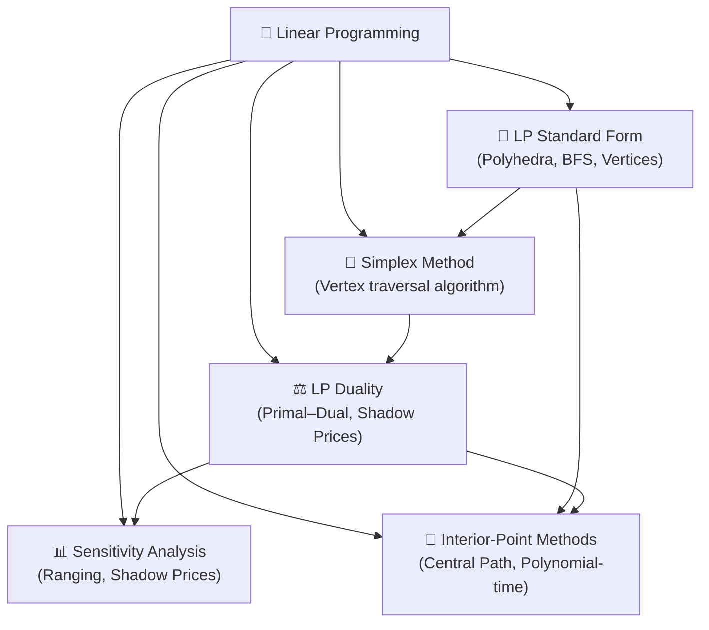

# 📐 Linear Programming — Map of Content

> [!abstract] TL;DR
> Linear programming (LP) optimizes a linear objective over a polyhedron — the intersection of halfspaces. The geometry is key: the optimum always occurs at a vertex (basic feasible solution) of the feasible polytope. LP duality is one of the most elegant results in optimization, and interior-point methods provide polynomial-time guarantees.

## Intuition — analogy FIRST

Think of LP as finding the highest point on a faceted gemstone. The feasible region is the gemstone (a polyhedron), the objective function is a light source tilted at some angle, and the optimal solution is the vertex that catches the most light. No matter how complex the gemstone, you only need to check its corners — the simplex method does exactly this, hopping from corner to corner along edges until no brighter neighbor exists.

LP duality is like looking at the same gemstone from inside versus outside: the primal asks "what is the maximum value I can extract?" while the dual asks "what is the minimum price at which the constraints become binding?" — and at optimality both answers agree perfectly.

---

## How It Works



## Notes in This Section

| File | Topic | Difficulty |
|---|---|---|
| [[LP_Standard_Form]] | Polyhedra, BFS, fundamental theorem | Intermediate |
| [[Simplex_Method]] | Pivoting, reduced costs, cycling | Intermediate |
| [[LP_Duality]] | Weak/strong duality, complementary slackness | Advanced |
| [[Sensitivity_Analysis]] | Ranging, shadow prices, parametric LP | Intermediate |
| [[Interior_Point_Methods]] | Central path, primal-dual IPM, complexity | Advanced |

## Key Results at a Glance

| Result | Statement |
|---|---|
| **Fundamental Theorem of LP** | If an optimal exists, an optimal BFS (vertex) exists |
| **Weak Duality** | bᵀy ≤ cᵀx for any primal/dual feasible pair |
| **Strong Duality** | At optimality, duality gap = 0 |
| **Complementary Slackness** | yᵢ*(Axᵢ–bᵢ)=0 and xⱼ*(c–Aᵀy*)ⱼ=0 at optimality |
| **Simplex Complexity** | Exponential worst case, polynomial in practice |
| **IPM Complexity** | O(n^{3.5} · log(1/ε)) — provably polynomial |

## Prerequisites

- Linear algebra (matrix operations, rank, null space)
- Basic convexity (convex sets, supporting hyperplanes)
- Calculus (gradients, directional derivatives)

## Learning Path

```
LP_Standard_Form → Simplex_Method → LP_Duality → Sensitivity_Analysis → Interior_Point_Methods
```

## Real-World Applications

- **Production planning**: maximize profit subject to resource constraints
- **Transportation / network flow**: route goods at minimum cost
- **Portfolio optimization**: maximize return subject to budget and risk bounds
- **Diet problem**: minimize cost subject to nutritional requirements
- **LP relaxations**: backbone of branch-and-bound for integer programming

## Common Pitfalls

- Forgetting to convert max to min (multiply by –1) before applying standard algorithms
- Ignoring unbounded or infeasible cases before running a solver
- Misinterpreting shadow prices outside the ranging interval
- Assuming simplex always visits few vertices — pathological instances exist

## Sources

- Bertsimas & Tsitsiklis, *Introduction to Linear Optimization*, Athena Scientific, 1997
- Vanderbei, *Linear Programming: Foundations and Extensions*, Springer, 2020
- Boyd & Vandenberghe, *Convex Optimization*, Cambridge University Press, 2004 (Ch. 4–5)
- Nocedal & Wright, *Numerical Optimization*, Springer, 2006 (Ch. 13)

#MOC #optimization #linear-programming
