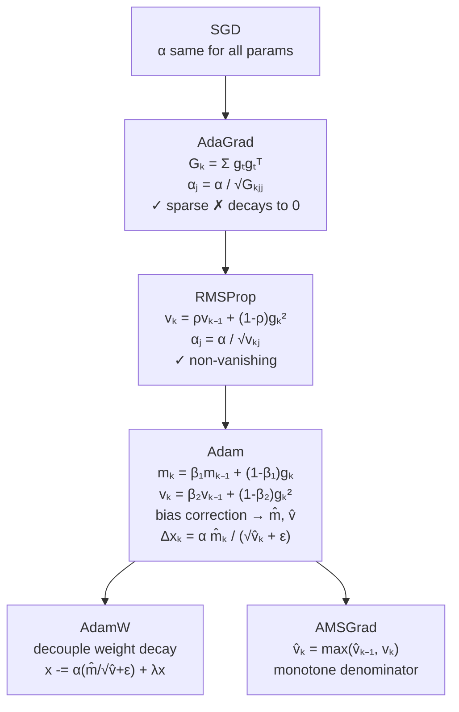

# ⚙️ Adaptive Methods

> [!abstract] TL;DR
> Adaptive gradient methods automatically tune a **per-parameter learning rate** based on the history of that parameter's gradients, removing the burden of manually setting a single global step size. AdaGrad adapts well to sparse features but decays too aggressively; RMSProp fixes this with exponential forgetting; Adam combines RMSProp's second moment with a momentum-like first moment plus bias correction, and is the default optimizer for most deep learning tasks.

## Intuition — analogy FIRST

Imagine a hiking team where some members (frequent-feature parameters) cross the same terrain every day and develop efficient muscle memory, while others (rare-feature parameters) only occasionally encounter their terrain and need larger steps when they do. A fixed global step size is too large for the frequent hikers (they overshoot) and too small for the rare ones (they barely move). Adaptive methods are like **individual fitness trackers** — each hiker adjusts their stride based on their own cumulative effort, automatically balancing the team.

---

## How It Works



---

## Key Concepts / Details

### 1. Motivation

SGD update: $x_{k+1} = x_k - \alpha g_k$. Same $\alpha$ for every parameter $j$:
- Dense parameters (appear in every sample): gradients large → want small step
- Sparse parameters (appear rarely): gradients near zero most of the time → want large step when nonzero

Adaptive methods solve this by maintaining a **per-parameter estimate of gradient scale**.

---

### 2. AdaGrad (Duchi, Hazan, Singer 2011)

Accumulate the sum of squared gradients:

$$G_k = \sum_{t=1}^k g_t g_t^\top \in \mathbb{R}^{d \times d} \quad \text{(use diagonal approximation)}$$

Update rule (diagonal version):

$$x_{k+1,j} = x_{k,j} - \frac{\alpha}{\sqrt{G_{k,jj}} + \varepsilon} \cdot g_{k,j}$$

- Effective step for parameter $j$: $\alpha / \sqrt{\sum_{t=1}^k g_{t,j}^2}$
- **Advantage**: excellent for sparse gradients (NLP word embeddings, sparse features); large steps for rarely-updated parameters
- **Problem**: $G_k$ grows monotonically → effective step $\to 0$ → learning halts in long training

---

### 3. RMSProp (Hinton, unpublished 2012)

Replace the cumulative sum with an **exponential moving average** (EMA):

$$v_k = \rho v_{k-1} + (1 - \rho) g_k^2 \qquad [\text{element-wise}]$$

$$x_{k+1} = x_k - \frac{\alpha}{\sqrt{v_k} + \varepsilon} \cdot g_k$$

- $\rho = 0.9$ typical; recent gradients weighted more, old ones decay
- Effective step no longer shrinks monotonically — suitable for non-stationary objectives
- Used extensively in RNNs and RL (natural choice for online/stationary-changing settings)

---

### 4. Adam (Kingma & Ba 2015)

Adam maintains **two EMAs**: first moment (mean) and second moment (uncentered variance):

$$m_k = \beta_1 m_{k-1} + (1 - \beta_1) g_k \qquad \text{(momentum / first moment)}$$
$$v_k = \beta_2 v_{k-1} + (1 - \beta_2) g_k^2 \qquad \text{(RMSProp / second moment)}$$

**Bias correction** (both $m_0 = v_0 = 0$, so early estimates are biased toward 0):

$$\hat{m}_k = \frac{m_k}{1 - \beta_1^k}, \qquad \hat{v}_k = \frac{v_k}{1 - \beta_2^k}$$

**Update**:

$$x_{k+1} = x_k - \frac{\alpha \hat{m}_k}{\sqrt{\hat{v}_k} + \varepsilon}$$

**Default hyperparameters**: $\beta_1 = 0.9$, $\beta_2 = 0.999$, $\varepsilon = 10^{-8}$, $\alpha = 10^{-3}$.

Intuition: $\hat{m}_k / \sqrt{\hat{v}_k}$ is approximately a **signal-to-noise ratio** — large when gradient is consistent (large $\hat{m}$, small $\hat{v}$), small when gradient is noisy.

---

### 5. AdamW — Fixing Weight Decay

Standard Adam with L2 regularization adds $\lambda x$ to the gradient $g_k$, which then gets scaled by $1/\sqrt{\hat{v}_k}$. This **distorts** the regularization effect.

**AdamW** decouples weight decay from the adaptive gradient update:

$$x_{k+1} = x_k - \alpha \cdot \frac{\hat{m}_k}{\sqrt{\hat{v}_k} + \varepsilon} - \alpha \lambda x_k$$

- Decoupled decay: each parameter simply shrinks by factor $(1 - \alpha\lambda)$ per step, independent of gradient history
- Standard for transformer training (BERT, GPT, LLaMA all use AdamW)

---

### 6. AMSGrad

Adam can fail to converge in theory (Reddi et al. 2018 showed a counter-example). Fix: use the **running maximum** of $\hat{v}_k$:

$$\hat{v}_k^{\max} = \max(\hat{v}_{k-1}^{\max}, \hat{v}_k)$$
$$x_{k+1} = x_k - \frac{\alpha \hat{m}_k}{\sqrt{\hat{v}_k^{\max}} + \varepsilon}$$

- Monotone denominator guarantees convergence in theory
- Empirically sometimes worse than Adam in practice

---

### 7. Comparison Table

| Method | Moment Est. | Step Size | Sparse? | Vanish? | Memory |
|--------|-------------|-----------|---------|---------|--------|
| SGD | None | $\alpha$ fixed | No | No | $O(d)$ |
| AdaGrad | 2nd (sum) | $\alpha/\sqrt{G_k}$ | Yes | **Yes** | $O(d)$ |
| RMSProp | 2nd (EMA) | $\alpha/\sqrt{v_k}$ | No | No | $O(d)$ |
| Adam | 1st + 2nd EMA | $\alpha\hat{m}/\sqrt{\hat{v}}$ | No | No | $O(2d)$ |
| AdamW | 1st + 2nd EMA | Adam + decoupled decay | No | No | $O(2d)$ |
| AMSGrad | 1st + 2nd EMA (max) | Monotone denom | No | No | $O(2d)$ |

---

## Python Demo

```python
import numpy as np

# Adam from scratch on 2-layer NN toy classification
np.random.seed(42)

def adam_optimizer(grad_fn, x0, alpha=1e-3, beta1=0.9, beta2=0.999,
                   eps=1e-8, n_iters=500):
    x = x0.copy().astype(float)
    m = np.zeros_like(x)
    v = np.zeros_like(x)
    losses = []
    for k in range(1, n_iters + 1):
        g, loss = grad_fn(x)
        m = beta1 * m + (1 - beta1) * g
        v = beta2 * v + (1 - beta2) * g**2
        m_hat = m / (1 - beta1**k)
        v_hat = v / (1 - beta2**k)
        x -= alpha * m_hat / (np.sqrt(v_hat) + eps)
        losses.append(loss)
    return x, losses

def sgd_with_momentum(grad_fn, x0, alpha=1e-2, beta=0.9, n_iters=500):
    x = x0.copy().astype(float)
    vel = np.zeros_like(x)
    losses = []
    for _ in range(n_iters):
        g, loss = grad_fn(x)
        vel = beta * vel + (1 - beta) * g
        x -= alpha * vel
        losses.append(loss)
    return x, losses

# Rosenbrock function: f(x,y) = (1-x)² + 100(y-x²)²
def rosenbrock_grad(xy):
    x, y = xy
    fx = (1 - x)**2 + 100*(y - x**2)**2
    gx = -2*(1 - x) - 400*x*(y - x**2)
    gy = 200*(y - x**2)
    return np.array([gx, gy]), fx

x0 = np.array([-1.5, 0.5])
x_adam, losses_adam = adam_optimizer(rosenbrock_grad, x0)
x_sgd, losses_sgd = sgd_with_momentum(rosenbrock_grad, x0)

print(f"Adam  final: x={x_adam}, f={losses_adam[-1]:.6f}")
print(f"SGD+M final: x={x_sgd},  f={losses_sgd[-1]:.6f}")
# Adam converges to [1,1] much faster on ill-conditioned surfaces
```

---

## Real-World Notes

- **Transformers**: AdamW with linear warmup + cosine decay is nearly universal (BERT, GPT, LLaMA).
- **CNNs**: SGD + momentum with careful LR schedule sometimes outperforms Adam on final accuracy (SGD finds flatter minima), but Adam trains faster.
- **Sparse NLP embeddings**: AdaGrad still competitive; large rare-word embeddings benefit from its large step on sparse updates.
- **$\varepsilon$ tuning**: for transformers, $\varepsilon = 10^{-6}$ (rather than $10^{-8}$) reduces gradient explosion at initialization.
- **Lion optimizer** (Chen et al. 2023): sign-based update with EMA; $O(d)$ memory vs Adam's $O(2d)$; competitive on large vision/language models.

## Common Pitfalls

- **Forgetting bias correction**: without it, early steps are tiny ($\hat{m}_1 = (1-\beta_1)g_1$, very small). Always include bias correction.
- **L2 vs weight decay in Adam**: using `weight_decay` in PyTorch's `Adam` optimizer applies L2 penalty to gradient (wrong); use `AdamW` which decouples it.
- **Warmup requirement**: Adam with large $\alpha$ at step 1 can diverge; linear warmup over 1k–10k steps is standard.
- **Accumulating second moment for dead parameters**: in sparse models, $v_k$ for dormant parameters barely updates, so bias correction explodes $\hat{v}_k$ early — clip or initialize $v_0 > 0$ as needed.

## Related Concepts

- [[SGD_and_Variants]] — first-order methods and variance reduction
- [[Proximal_Methods]] — handling non-smooth regularizers alongside adaptive updates
- [[Coordinate_Descent]] — also maintains per-coordinate information for updates

## Review Questions

1. Why does AdaGrad work well for sparse gradients but fail in dense, long-training settings?
2. Write out the full Adam update, including bias correction. What does bias correction fix, and when does it matter most?
3. What is the specific problem with L2 regularization in Adam that AdamW fixes?
4. AMSGrad was proposed to fix a convergence issue in Adam. What was the issue, and how does the max operation fix it?
5. Compare the memory footprint of SGD, Adam, and AdamW for a model with $d = 7 \times 10^9$ parameters.

## Sources

- Duchi, Hazan, Singer (2011). *Adaptive Subgradient Methods for Online Learning.* JMLR.
- Kingma & Ba (2015). *Adam: A Method for Stochastic Optimization.* ICLR.
- Loshchilov & Hutter (2019). *Decoupled Weight Decay Regularization.* ICLR.
- Reddi, Kale, Kumar (2018). *On the Convergence of Adam and Beyond.* ICLR.
- Chen et al. (2023). *Symbolic Discovery of Optimization Algorithms (Lion).* NeurIPS.

#optimization #numerical-methods #intermediate
