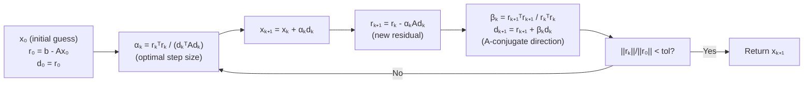

# 🔄 Conjugate Gradient

> [!abstract] TL;DR
> The Conjugate Gradient (CG) method solves the linear system $Ax = b$ (with $A$ symmetric positive definite) or minimizes a smooth quadratic in at most $n$ iterations without forming $A$ explicitly — only matrix-vector products $Av$ are needed. Its convergence rate depends on the condition number $\kappa(A) = \lambda_{\max}/\lambda_{\min}$; preconditioning reduces $\kappa$ dramatically. Nonlinear CG and truncated Newton-CG extend the method to general smooth unconstrained optimization and large-scale Newton steps.

## Intuition — analogy FIRST

Standard gradient descent on $\frac{1}{2}x^\top Ax - b^\top x$ zig-zags inefficiently because each new gradient step partially undoes the previous one. CG instead constructs search directions that are **A-conjugate** — mutually orthogonal in the geometry defined by $A$. This means each direction is "used up" exactly once and never revisited, guaranteeing termination in at most $n$ steps. Think of it as solving a 2D problem in 2 perfectly aimed shots rather than an infinite series of approximate ones.

---

## How It Works



---

## Key Concepts / Details

### 1. Problem Setup — Symmetric Positive Definite Linear Systems

Solve $Ax = b$ where $A \in \mathbb{R}^{n \times n}$ is **symmetric positive definite** (SPD).

Equivalently, minimize the quadratic:

$$f(x) = \frac{1}{2}x^\top A x - b^\top x$$

The minimizer is $x^* = A^{-1}b$. Gradient: $\nabla f(x) = Ax - b = -r$ (negative residual).

---

### 2. A-Conjugate Directions

Directions $d_i, d_j$ are **A-conjugate** (or A-orthogonal) if:

$$d_i^\top A d_j = 0 \quad \text{for } i \neq j$$

**Key property**: if $\{d_0, d_1, \ldots, d_{n-1}\}$ are A-conjugate, then minimizing $f$ along each direction exactly (with the optimal $\alpha_k$) terminates in at most $n$ steps — direct method performance from iterative procedure.

GD directions are Euclidean-orthogonal ($d_i^\top d_j = 0$); CG directions are A-orthogonal. CG is optimal in the Krylov subspace $\mathcal{K}_k = \text{span}\{r_0, Ar_0, A^2r_0, \ldots, A^{k-1}r_0\}$.

---

### 3. CG Algorithm (Complete)

Initialize: $x_0$ (often $\mathbf{0}$), $r_0 = b - Ax_0$, $d_0 = r_0$

For $k = 0, 1, 2, \ldots$:

$$\alpha_k = \frac{r_k^\top r_k}{d_k^\top A d_k} \qquad \text{(optimal step along } d_k \text{)}$$
$$x_{k+1} = x_k + \alpha_k d_k$$
$$r_{k+1} = r_k - \alpha_k A d_k$$
$$\beta_k = \frac{r_{k+1}^\top r_{k+1}}{r_k^\top r_k} \qquad \text{(Polak-Ribière / Fletcher-Reeves)}$$
$$d_{k+1} = r_{k+1} + \beta_k d_k$$

Termination when $\|r_{k+1}\| < \text{tol}$.

**Cost per iteration**: one matrix-vector product $Ad_k$ — cost $O(n^2)$ for dense $A$, $O(\text{nnz}(A))$ for sparse $A$.

---

### 4. Convergence Theory

Define the **A-norm** of the error $e_k = x_k - x^*$ as $\|e_k\|_A = \sqrt{e_k^\top A e_k}$.

**Exact arithmetic**: $\|e_n\|_A = 0$ — terminates in $n$ steps.

**Floating-point / early stopping**: after $k$ steps,

$$\frac{\|e_k\|_A}{\|e_0\|_A} \leq 2 \left(\frac{\sqrt{\kappa} - 1}{\sqrt{\kappa} + 1}\right)^k$$

where $\kappa = \lambda_{\max}/\lambda_{\min}$ is the **condition number** of $A$.

| $\kappa$ | Contraction factor | Steps to $10^{-6}$ |
|---------|-------------------|-------------------|
| 10 | 0.516 | ~20 |
| 100 | 0.818 | ~80 |
| 1000 | 0.939 | ~267 |
| 10000 | 0.980 | ~840 |

**Cluster effect**: if $A$ has only $m$ distinct eigenvalues, CG terminates in $m$ steps. This motivates preconditioning — cluster eigenvalues artificially.

---

### 5. Preconditioning (PCG)

Instead of solving $Ax = b$, solve the equivalent:

$$M^{-1}Ax = M^{-1}b$$

where $M \approx A$ is easy to invert. Effective condition number: $\kappa(M^{-1}A) \ll \kappa(A)$.

**PCG algorithm** maintains $z_k = M^{-1}r_k$ instead of $r_k$; update:

$$\alpha_k = \frac{r_k^\top z_k}{d_k^\top A d_k}, \quad \beta_k = \frac{r_{k+1}^\top z_{k+1}}{r_k^\top z_k}$$

**Common preconditioners**:
- **Jacobi (diagonal)**: $M = \text{diag}(A)$; $O(n)$ to apply; improves $\kappa$ when diagonal dominates
- **Incomplete Cholesky IC(0)**: $M = \tilde{L}\tilde{L}^\top$ with sparsity pattern of $A$; $O(n)$ to apply; excellent in practice
- **SSOR, multigrid**: stronger preconditioners for structured problems (PDEs, FEM)

---

### 6. Nonlinear CG (Fletcher-Reeves, Polak-Ribière)

For unconstrained smooth optimization $\min_x f(x)$, replace residuals with negative gradients:

$$d_{k+1} = -\nabla f(x_{k+1}) + \beta_k d_k$$

with exact line search $\alpha_k$ along $d_k$.

**Fletcher-Reeves**:

$$\beta_k^{\text{FR}} = \frac{\|\nabla f(x_{k+1})\|^2}{\|\nabla f(x_k)\|^2}$$

**Polak-Ribière** (often preferred empirically):

$$\beta_k^{\text{PR}} = \frac{\nabla f(x_{k+1})^\top (\nabla f(x_{k+1}) - \nabla f(x_k))}{\|\nabla f(x_k)\|^2}$$

- **No finite termination** for nonlinear $f$ (unlike quadratic case)
- **Restart**: if $\beta_k < 0$, reset to steepest descent ($d_{k+1} = -\nabla f(x_{k+1})$) — prevents stagnation
- Convergence: global for smooth nonlinear $f$ with exact line search; inexact line search requires Wolfe conditions

---

### 7. Truncated Newton-CG (Newton-CG / Steihaug-CG)

Newton step: solve $H_k d = -\nabla f(x_k)$ exactly — cost $O(n^3)$.

**Truncated CG**: run CG to approximately solve $H_k d_k \approx -g_k$ for at most $m \ll n$ iterations:

$$d_k \approx -H_k^{-1} g_k \quad \text{(truncated)}$$

**Steihaug-CG** combines with a trust region: stop CG early if iterates leave the trust region ball.

**Key advantage**: never form $H$ explicitly — only Hessian-vector products $H_k v = \nabla^2 f(x_k) v$, computable via:
- Finite differences: $(1/h)[\nabla f(x + hv) - \nabla f(x)]$
- Automatic differentiation (Pearlmutter trick): $O(\text{grad cost})$

This enables **Newton-level convergence** (superlinear) at $O(nd)$ per-iteration cost for large ML problems.

---

### 8. Connections

| Method | CG Relationship |
|--------|----------------|
| Lanczos iteration | CG applied to eigenvalue problem; extracts $k$ eigenvalues in $k$ steps |
| MINRES | CG variant for indefinite (not SPD) symmetric systems |
| GMRES | CG-like for general non-symmetric systems |
| L-BFGS | Uses CG-like logic but stores rank-$m$ Hessian approximation |
| Krylov subspace methods | CG is optimal over $\mathcal{K}_k$; GMRES is MINRES equivalent for general $A$ |

---

## Python Demo

```python
import numpy as np

def conjugate_gradient(A, b, x0=None, tol=1e-8, max_iter=None):
    """
    Solves Ax = b for symmetric positive definite A using CG.
    Only uses matrix-vector products A @ v.
    """
    n = len(b)
    if x0 is None: x0 = np.zeros(n)
    if max_iter is None: max_iter = n

    x = x0.copy().astype(float)
    r = b - A @ x
    d = r.copy()
    r_dot = r @ r
    residuals = [np.sqrt(r_dot)]

    for k in range(max_iter):
        Ad = A @ d
        alpha = r_dot / (d @ Ad)
        x = x + alpha * d
        r = r - alpha * Ad
        r_dot_new = r @ r
        residuals.append(np.sqrt(r_dot_new))
        if np.sqrt(r_dot_new) < tol:
            print(f"CG converged in {k+1} iterations")
            break
        beta = r_dot_new / r_dot
        d = r + beta * d
        r_dot = r_dot_new

    return x, residuals

def preconditioned_cg(A, b, M_inv, tol=1e-8, max_iter=None):
    """PCG with preconditioning matrix M ≈ A (M_inv = M^{-1} as a function)."""
    n = len(b)
    if max_iter is None: max_iter = n
    x = np.zeros(n)
    r = b - A @ x
    z = M_inv(r)
    d = z.copy()
    rz = r @ z
    residuals = [np.linalg.norm(r)]

    for k in range(max_iter):
        Ad = A @ d
        alpha = rz / (d @ Ad)
        x = x + alpha * d
        r = r - alpha * Ad
        z = M_inv(r)
        rz_new = r @ z
        residuals.append(np.linalg.norm(r))
        if np.linalg.norm(r) < tol:
            print(f"PCG converged in {k+1} iterations")
            break
        beta = rz_new / rz
        d = z + beta * d
        rz = rz_new

    return x, residuals

# Demo: ill-conditioned system
np.random.seed(0)
n = 200
eigvals = np.concatenate([np.linspace(1, 1000, n)])  # condition number = 1000
Q = np.linalg.qr(np.random.randn(n, n))[0]
A = Q @ np.diag(eigvals) @ Q.T
b = np.random.randn(n)

# Plain CG
x_cg, res_cg = conjugate_gradient(A, b)

# Jacobi PCG (diagonal preconditioner)
D_inv = lambda r: r / np.diag(A)
x_pcg, res_pcg = preconditioned_cg(A, b, D_inv)

# Reference: numpy direct solver
x_ref = np.linalg.solve(A, b)
print(f"CG  error: {np.linalg.norm(x_cg  - x_ref):.2e}, iters: {len(res_cg)}")
print(f"PCG error: {np.linalg.norm(x_pcg - x_ref):.2e}, iters: {len(res_pcg)}")

# CG iters: ~150 for κ=1000; PCG (Jacobi) moderately better
# With IC(0) preconditioner on structured problems: 10x fewer iterations typical
```

---

## Convergence Method Comparison

| Method | Solves | Per-Iter Cost | Convergence | Memory |
|--------|--------|--------------|-------------|--------|
| Gaussian elimination (direct) | $Ax=b$ | — (one-shot) | Exact in $O(n^3)$ | $O(n^2)$ |
| GD on quadratic | $Ax=b$ | $O(n^2)$ dense | $O(\kappa)$ steps | $O(n)$ |
| CG | $Ax=b$, SPD | $O(n^2)$ dense / $O(\text{nnz})$ sparse | $O(\sqrt{\kappa})$ steps | $O(n)$ |
| PCG (Jacobi) | $Ax=b$, SPD | $O(\text{nnz})$ | Improved $\kappa'$ | $O(n)$ |
| PCG (IC(0)) | $Ax=b$, SPD | $O(\text{nnz})$ | Much smaller $\kappa'$ | $O(\text{nnz})$ |
| Nonlinear CG | Smooth unconstrained | $O(nd)$ | $O(1/k)$ w/ restarts | $O(d)$ |

---

## Real-World Notes

- **Finite element methods (FEM)**: sparse SPD systems ($A$ is stiffness matrix) with $n \sim 10^6$–$10^8$; CG + multigrid preconditioner is the standard solver.
- **Newton-CG in ML**: used by scipy's `minimize` with `method='Newton-CG'`; `torch.optim.LBFGS` is a quasi-Newton variant with similar spirit.
- **Hessian-free optimization** (Martens 2010): Newton-CG with Gauss-Newton Hessian approximation; trained deep networks before Adam became standard.
- **CG for normal equations**: solving least-squares $\min\|Ax-b\|^2$ via CGLS or LSQR (CG on $A^\top A$); numerically stable formulation.

## Common Pitfalls

- **Non-SPD matrix**: plain CG requires $A$ to be SPD; use MINRES (symmetric indefinite) or GMRES (general). Applying CG to indefinite $A$ can give wrong answers or diverge.
- **Finite precision rounding**: in practice, CG directions lose A-orthogonality after many steps. Periodic restarts or using MATLAB's `pcg` with restart parameter.
- **Stopping criterion**: stopping on $\|r_k\| < \text{tol}$ in absolute terms can stall for poorly scaled $b$; use $\|r_k\|/\|b\|$ as relative criterion.
- **Nonlinear CG without Wolfe conditions**: using Armijo (sufficient decrease) alone is not enough; must also satisfy curvature condition (Wolfe) for $\beta_k > 0$ to hold.

## Related Concepts

- [[Proximal_Methods]] — CG used inside augmented Lagrangian subproblems (ADMM)
- [[SGD_and_Variants]] — first-order alternative for large-scale smooth optimization
- [[Coordinate_Descent]] — both avoid full $n \times n$ Hessian; CG uses curvature info, CD exploits separability

## Review Questions

1. What does "A-conjugate" mean, and why does it guarantee CG terminates in at most $n$ steps?
2. Write the full CG iteration (all four update equations) and identify what each step computes.
3. The condition number of $A$ is $\kappa = 10^4$. Roughly how many CG iterations are needed to reduce the error by $10^6$?
4. What is preconditioning, and why does a Jacobi preconditioner $M = \text{diag}(A)$ help?
5. How does truncated Newton-CG avoid forming the Hessian while still exploiting second-order curvature?

## Sources

- Shewchuk (1994). *An Introduction to the Conjugate Gradient Method Without the Agonizing Pain.* CMU Technical Report.
- Nocedal & Wright (2006). *Numerical Optimization.* Chapter 5 (CG), Chapter 7 (Truncated Newton).
- Martens (2010). *Deep Learning via Hessian-Free Optimization.* ICML.
- Saad (2003). *Iterative Methods for Sparse Linear Systems.* SIAM.

#optimization #numerical-methods #advanced
