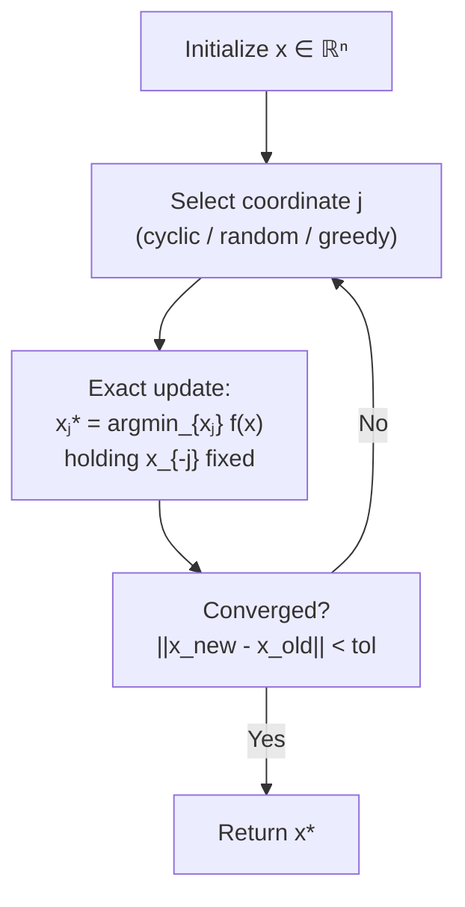

# ↔️ Coordinate Descent

> [!abstract] TL;DR
> Coordinate Descent (CD) optimizes one variable (or block) at a time while holding all others fixed, cycling through all variables until convergence. When each coordinate subproblem has a cheap closed-form solution — as in LASSO, SVMs, NMF, and K-means — CD is often faster in practice than gradient descent. Convergence is guaranteed for convex smooth functions and for objectives with separable non-smooth terms, but fails for non-smooth, non-separable structure.

## Intuition — analogy FIRST

Imagine tuning the knobs on a mixing board one at a time: turn knob 1 to its optimal position given all others, then knob 2, then knob 3, cycling until the sound is right. This is coordinate descent. It works beautifully when "optimal given all others" has a simple formula (e.g., a closed-form scalar equation), turning a high-dimensional optimization into a sequence of 1D problems. The key question is always: **does the single-coordinate subproblem have a cheap solution?** If yes, CD is the algorithm of choice.

---

## How It Works



---

## Key Concepts / Details

### 1. Algorithm Structure

**Cyclic Coordinate Descent**: for iteration $k$, cycle over $j = 1, \ldots, d$:

$$x_j^{k+1} = \operatorname*{argmin}_{x_j \in \mathbb{R}} f(x_1^{k+1}, \ldots, x_{j-1}^{k+1}, x_j, x_{j+1}^k, \ldots, x_d^k)$$

Each subproblem is 1D (or block-dimensional for BCD) and typically has:
- An exact closed-form solution, or
- A cheap line search along a single coordinate direction

**Randomized CD**: pick coordinate $j_k \sim \text{Uniform}[d]$ at each step — often faster convergence guarantees.

---

### 2. Convergence Guarantees

| Objective Type | Converges? | Rate |
|---------------|-----------|------|
| Convex + smooth | Yes | $O(1/k)$ |
| Strongly convex + smooth | Yes | $O(\rho^k)$ geometric |
| Convex + separable non-smooth: $f(x) + \sum_j g_j(x_j)$ | Yes | $O(1/k)$ |
| Non-smooth + **non-separable** $g$ | **No** in general | — |

> [!warning] Non-smooth Non-separable Failure
> The classic counter-example: $f(x_1, x_2) = |x_1 + x_2|$ with cyclic CD. The coordinate minimum of $f$ w.r.t. $x_1$ is any point on the line $x_1 = -x_2$, so the algorithm can cycle without converging to the global min.

**For LASSO** ($f(x) = \frac{1}{2}\|Ax-b\|^2 + \lambda\|x\|_1$): the $\ell_1$ term is **separable** ($\lambda|x_j|$ depends only on $x_j$), so CD converges.

---

### 3. LASSO Coordinate Update — Closed Form

For LASSO, the coordinate update for $x_j$ has an exact formula. Let $r = b - A(x - x_j e_j)$ be the **partial residual** (residual with $x_j$ zeroed out):

$$x_j^* = \frac{S_\lambda(A_j^\top r)}{\|A_j\|^2}$$

where $S_\lambda(z) = \text{sign}(z)\max(|z| - \lambda, 0)$ is the soft-threshold and $A_j$ is the $j$-th column of $A$.

This is $O(m)$ per coordinate (inner product), $O(md)$ per full sweep — same asymptotic cost as one gradient step, but often **far fewer sweeps** are needed when the solution is sparse (only nonzero coordinates updated).

**Warm starting**: after updating $x_j$, update the residual incrementally:

$$r \leftarrow r - A_j (x_j^{\text{new}} - x_j^{\text{old}})$$

This avoids recomputing $Ax$ from scratch at each step: $O(m)$ per coordinate update, $O(m \cdot \text{nnz}(x))$ per sweep — extremely fast for sparse solutions.

---

### 4. Block Coordinate Descent (BCD)

Update a **block** of variables simultaneously:

$$x_B^{k+1} = \operatorname*{argmin}_{x_B} f(x_B, x_{-B}^k)$$

- Each block subproblem may be a small unconstrained problem (solvable by Newton or CG)
- Alternating Minimization is BCD with two blocks: $\min_{A,B} f(A,B)$

**NMF (Non-negative Matrix Factorization)**:

$$\min_{W \geq 0, H \geq 0} \|V - WH\|_F^2$$

BCD alternates:
- Fix $H$, update $W$: each row of $W$ is a non-negative least squares problem
- Fix $W$, update $H$: each column of $H$ is a non-negative least squares problem

Convergence to a stationary point (but not necessarily global min — NMF is non-convex).

---

### 5. SVM and Sequential Minimal Optimization (SMO)

SVM dual: $\max_\alpha \sum_i \alpha_i - \frac{1}{2}\sum_{i,j}\alpha_i\alpha_j y_i y_j K(x_i, x_j)$ subject to $0 \leq \alpha_i \leq C$, $\sum_i \alpha_i y_i = 0$.

**SMO** (Platt 1998): the equality constraint $\sum_i \alpha_i y_i = 0$ means we cannot update a single $\alpha_i$ without violating it. SMO updates the **smallest block that can move**: a pair $(\alpha_i, \alpha_j)$ can be jointly updated while satisfying the constraint. Each pair update has a closed-form solution — making SMO the standard algorithm for SVM training.

---

### 6. K-means as Block Coordinate Descent

$$\min_{C, \mu} \sum_{i=1}^n \|x_i - \mu_{c_i}\|^2$$

- **Assignment step**: fix $\mu$, update $C$ (cluster assignments) — coordinate-wise minimization
- **Update step**: fix $C$, update $\mu$ (centroids as means) — block update with closed form
- Converges to a local minimum; non-convex problem so initialization matters

---

### 7. Gauss-Seidel vs Jacobi

| Method | Update style | Convergence | Parallelism |
|--------|-------------|-------------|------------|
| Gauss-Seidel (standard CD) | Sequential: use new $x_j$ immediately | Often faster | Sequential only |
| Jacobi | Parallel: use old values for all updates | Sometimes needed | Fully parallel |
| Hogwild (async) | Lock-free parallel updates | Convergent for sparse problems | Near-linear speedup |

**Hogwild** (Recht et al. 2011): asynchronous SGD / CD where threads update shared $x$ without locks. Converges if updates are sparse (each update touches few coordinates), because collisions are rare.

---

### 8. Comparison Table

| Method | Per-Iter Cost | Closed Form? | Non-smooth? | Best Use Case |
|--------|--------------|-------------|------------|---------------|
| GD | $O(nd)$ | N/A | No | Dense smooth problems |
| CD | $O(n)$/coord | Often yes | Separable only | LASSO, SVM, sparse problems |
| Proximal GD (ISTA) | $O(nd)$ | Prox only | Yes (general) | Composite $f+g$, dense |
| BCD | $O(n \cdot |B|)$/block | Block-specific | Separable | NMF, alternating min |
| Randomized CD | $O(n)$/coord | Often yes | Separable | Theoretical guarantees |

---

## Python Demo — Coordinate Descent for LASSO

```python
import numpy as np

def lasso_cd(A, b, lam, max_iter=500, tol=1e-6):
    """
    Coordinate descent for LASSO:
    min 0.5 * ||Ax - b||^2 + lambda * ||x||_1
    """
    m, n = A.shape
    x = np.zeros(n)
    col_norms_sq = np.sum(A**2, axis=0)  # ||Aⱼ||² for each column j
    r = b.copy()  # residual r = b - Ax, start with x=0 so r=b

    losses = []
    for iteration in range(max_iter):
        x_old = x.copy()
        for j in range(n):
            if col_norms_sq[j] < 1e-10:
                continue
            # Add back contribution of column j to residual
            r += A[:, j] * x[j]
            # Closed-form coordinate update: soft threshold
            rho_j = A[:, j] @ r  # = Aⱼᵀ(b - A_{-j}x_{-j})
            x[j] = np.sign(rho_j) * max(abs(rho_j) - lam, 0) / col_norms_sq[j]
            # Update residual incrementally
            r -= A[:, j] * x[j]

        loss = 0.5 * np.sum(r**2) + lam * np.sum(np.abs(x))
        losses.append(loss)

        if np.max(np.abs(x - x_old)) < tol:
            print(f"Converged at iteration {iteration+1}")
            break

    return x, losses

# Compare CD vs FISTA for LASSO
np.random.seed(42)
m, n = 200, 500
A = np.random.randn(m, n) / np.sqrt(m)
x_true = np.zeros(n); x_true[:15] = np.random.randn(15)
b = A @ x_true + 0.01 * np.random.randn(m)
lam = 0.1

x_cd, losses_cd = lasso_cd(A, b, lam)

print(f"CD final loss: {losses_cd[-1]:.6f}")
print(f"Recovered {np.sum(np.abs(x_cd) > 0.01)} nonzeros (true: 15)")
print(f"Solution error: {np.linalg.norm(x_cd - x_true):.4f}")
```

---

## Real-World Notes

- **scikit-learn LASSO**: uses coordinate descent by default (`sklearn.linear_model.Lasso`) — standard implementation for $n \leq 10^6$.
- **Elastic net**: CD update for elastic net ($\ell_1 + \ell_2$) is $x_j^* = S_\lambda(A_j^\top r) / (\|A_j\|^2 + 2\rho)$ — just a modified denominator.
- **liblinear, libsvm**: both use CD variants; liblinear uses randomized CD for $L_1$-regularized logistic regression.
- **Active set warm starts**: after fitting LASSO at $\lambda_1$, use the support (nonzero set) as the starting active set for $\lambda_2 < \lambda_1$ (lasso path); most of the work is reusing the previous solution.

## Common Pitfalls

- **Non-separable penalties**: applying CD to total-variation or group LASSO without checking that the subproblem decomposes — it won't.
- **Singular columns**: if $\|A_j\|^2 = 0$, the coordinate update is undefined; add a check and skip.
- **Slow convergence near optimum**: CD can zig-zag in highly correlated problems (e.g., $A_i \approx A_j$); ADMM or proximal methods may be faster.
- **Block size selection in BCD**: too-large blocks make each subproblem expensive; too-small blocks require many passes. Tune for the application.

## Related Concepts

- [[Proximal_Methods]] — ISTA/FISTA: alternative for composite problems, handles non-separable $g$
- [[SGD_and_Variants]] — stochastic CD is essentially equivalent to SGD for separable losses
- [[Conjugate_Gradient]] — used inside BCD blocks when the subproblem is a linear system

## Review Questions

1. Why does coordinate descent fail to converge for $f(x_1, x_2) = |x_1 + x_2|$, but succeed for the LASSO?
2. Derive the closed-form coordinate update for LASSO from first principles.
3. What is SMO, and why must SVM dual CD update *pairs* of variables rather than singletons?
4. Explain why K-means is a form of block coordinate descent and what type of minimum it converges to.
5. When would you choose coordinate descent over FISTA for solving a LASSO problem?

## Sources

- Wright (2015). *Coordinate Descent Algorithms.* Mathematical Programming.
- Friedman, Hastie, Tibshirani (2010). *Regularization Paths for Generalized Linear Models via Coordinate Descent.* JSS.
- Platt (1998). *Sequential Minimal Optimization: A Fast Algorithm for Training SVMs.*
- Recht et al. (2011). *Hogwild: A Lock-Free Approach to Parallelizing Stochastic Gradient Descent.* NeurIPS.

#optimization #numerical-methods #intermediate
