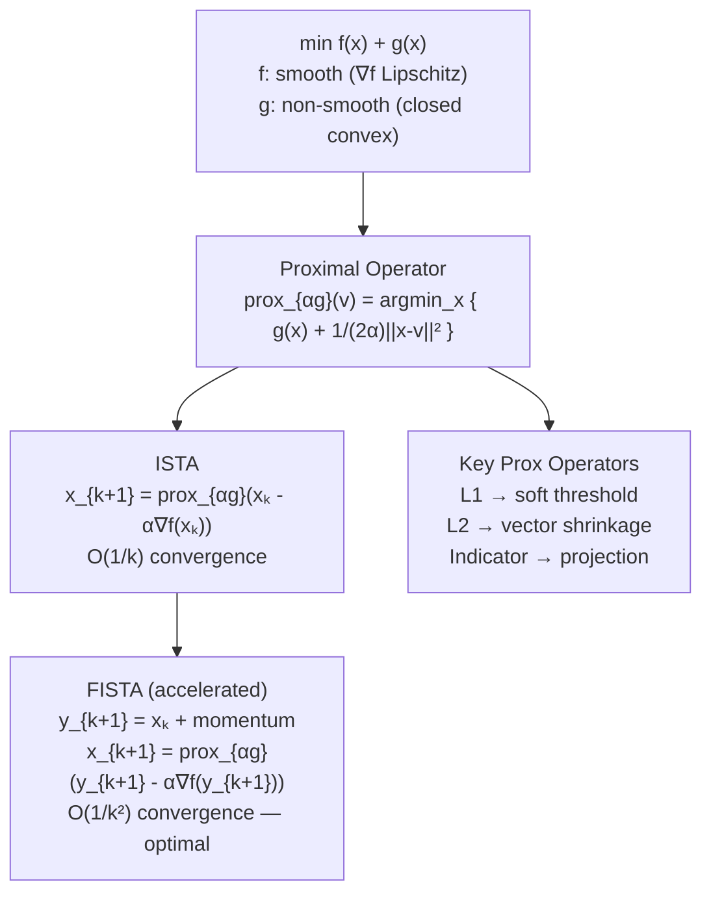

# 🔀 Proximal Methods

> [!abstract] TL;DR
> Many practical objectives take the form $f(x) + g(x)$ where $f$ is smooth (gradients available) and $g$ is non-smooth (e.g., $\ell_1$ norm, constraint indicators) — a form where plain gradient descent fails because $\nabla g$ does not exist. Proximal methods handle $g$ exactly via the **proximal operator**, which has closed-form solutions for common regularizers. ISTA achieves $O(1/k)$ and FISTA achieves the optimal $O(1/k^2)$ convergence with a momentum-like acceleration.

## Intuition — analogy FIRST

Imagine you want to hike downhill (minimize $f$) but also stay inside a forest (satisfy a constraint represented by $g$). Plain gradient descent ignores the forest boundary and steps outside. The **proximal operator** is like a forest ranger who, after each gradient step, takes your current position and finds the nearest legal point inside the forest — handling the constraint exactly without ever approximating it. **FISTA** adds a look-ahead move (like Nesterov's for smooth functions) to accelerate the process from $O(1/k)$ to $O(1/k^2)$.

---

## How It Works



---

## Key Concepts / Details

### 1. Problem Setup

Composite objective:

$$\min_{x \in \mathbb{R}^d} \; F(x) = f(x) + g(x)$$

- $f$: convex, differentiable, $L$-smooth ($\|\nabla f(x) - \nabla f(y)\| \leq L\|x-y\|$)
- $g$: convex, **closed**, possibly non-differentiable (but simple structure)
- Examples: LASSO ($g = \lambda\|x\|_1$), elastic net, group LASSO, indicator of convex set $C$

---

### 2. Proximal Operator

For any closed convex $g$ and step $\alpha > 0$:

$$\text{prox}_{\alpha g}(v) = \operatorname*{argmin}_{x} \left\{ g(x) + \frac{1}{2\alpha}\|x - v\|^2 \right\}$$

**Interpretation**: the proximal operator balances two objectives — minimizing $g$ and staying close to $v$. It is a **generalized projection** (reduces to standard projection when $g = \iota_C$, the indicator of a convex set $C$).

Key properties:
- Always well-defined and unique (strongly convex subproblem)
- **Non-expansive**: $\|\text{prox}_{\alpha g}(x) - \text{prox}_{\alpha g}(y)\| \leq \|x - y\|$
- Fixed points: $x^* = \text{prox}_{\alpha g}(x^*)$ iff $0 \in \partial g(x^*)$ (i.e., $x^*$ minimizes $g$)

---

### 3. Catalogue of Proximal Operators

| $g(x)$ | $\text{prox}_{\alpha g}(v)$ | Name |
|--------|----------------------------|------|
| $\lambda\|x\|_1$ | $\text{sign}(v) \cdot \max(|v| - \lambda\alpha, 0)$ coord-wise | Soft threshold $S_{\lambda\alpha}(v)$ |
| $\lambda\|x\|_2$ | $(1 - \lambda\alpha/\|v\|_2)_+ \cdot v$ | Vector soft threshold |
| $\lambda\|x\|_2^2$ | $v/(1 + 2\lambda\alpha)$ | Ridge shrinkage |
| $\iota_C(x)$ (indicator of $C$) | $\Pi_C(v)$ | Projection onto $C$ |
| $0$ | $v$ | Identity |
| $\lambda\|x\|_0$ | Hard threshold at $\sqrt{2\lambda\alpha}$ | Hard threshold |
| $\lambda\|Ax\|_1$ | Requires iterative solver | — |

> [!note] Soft Thresholding in Detail
> For $g(x) = \lambda\|x\|_1$ and scalar $v$:
> $$S_{\tau}(v) = \begin{cases} v - \tau & v > \tau \\ 0 & |v| \leq \tau \\ v + \tau & v < -\tau \end{cases}$$
> This is the proximity operator evaluated coordinate-wise. It **shrinks** values toward zero but does not set small nonzero values to zero (unlike hard thresholding).

---

### 4. ISTA — Iterative Shrinkage-Thresholding Algorithm

$$x_{k+1} = \text{prox}_{\alpha g}\!\left(x_k - \alpha \nabla f(x_k)\right)$$

This is exactly a gradient step on $f$ followed by a proximal step on $g$:
- Step size: $\alpha \leq 1/L$ (Lipschitz constant of $\nabla f$) for guaranteed convergence
- **Convergence**: $F(x_k) - F^* \leq \frac{\|x_0 - x^*\|^2}{2\alpha k}$, i.e., $O(1/k)$
- Same rate as gradient descent on smooth $f$ — adding non-smooth $g$ does not slow it down

---

### 5. FISTA — Fast ISTA (Beck & Teboulle 2009)

Add Nesterov-style momentum between iterates. Let $t_1 = 1$:

$$y_{k+1} = x_k + \frac{t_k - 1}{t_{k+1}}(x_k - x_{k-1})$$
$$x_{k+1} = \text{prox}_{\alpha g}\!\left(y_{k+1} - \alpha \nabla f(y_{k+1})\right)$$
$$t_{k+1} = \frac{1 + \sqrt{1 + 4t_k^2}}{2}$$

- The momentum coefficient $(t_k - 1)/t_{k+1} \to 1$ as $k \to \infty$
- **Convergence**: $F(x_k) - F^* \leq \frac{2\|x_0 - x^*\|^2}{\alpha (k+1)^2}$, i.e., $O(1/k^2)$
- **Optimal first-order rate** for composite problems (matches Nesterov lower bound)
- Cost per iteration: same as ISTA — one gradient evaluation + one proximal step

---

### 6. Proximal Point Algorithm

The conceptual anchor: iterate $x_{k+1} = \text{prox}_{\alpha f}(x_k)$ on the objective itself:

$$x_{k+1} = \operatorname*{argmin}_x \left\{ f(x) + \frac{1}{2\alpha}\|x - x_k\|^2 \right\}$$

- Converges for any closed convex $f$, any $\alpha > 0$
- Usually impractical (subproblem is as hard as original) but foundational theoretically
- ADMM and augmented Lagrangian methods are inexact proximal point algorithms

---

### 7. Moreau Envelope and Decomposition

The **Moreau envelope** of $f$:

$$f_\alpha(x) = \min_y \left\{ f(y) + \frac{1}{2\alpha}\|x - y\|^2 \right\} = f(\text{prox}_{\alpha f}(x)) + \frac{1}{2\alpha}\|x - \text{prox}_{\alpha f}(x)\|^2$$

Properties:
- $f_\alpha$ is differentiable everywhere even if $f$ is not: $\nabla f_\alpha(x) = \frac{1}{\alpha}(x - \text{prox}_{\alpha f}(x))$
- $\inf f_\alpha = \inf f$ (same minimizer, smoother landscape)

**Moreau decomposition** (conjugate duality):

$$v = \text{prox}_{\alpha f}(v) + \alpha \cdot \text{prox}_{f^*/\alpha}(v/\alpha)$$

This decomposes any vector into its prox component and the prox of the conjugate function — useful for deriving dual proximal algorithms.

---

## Python Demo — FISTA for LASSO

```python
import numpy as np

def soft_threshold(v, threshold):
    """Element-wise soft thresholding."""
    return np.sign(v) * np.maximum(np.abs(v) - threshold, 0)

def ista(A, b, lam, alpha=None, max_iter=200):
    """ISTA for LASSO: min 0.5||Ax-b||² + λ||x||₁."""
    m, n = A.shape
    L = np.linalg.norm(A, ord=2)**2  # Lipschitz constant of ∇f
    if alpha is None: alpha = 1.0 / L
    x = np.zeros(n)
    losses = []
    for _ in range(max_iter):
        grad_f = A.T @ (A @ x - b)
        x = soft_threshold(x - alpha * grad_f, alpha * lam)
        losses.append(0.5 * np.linalg.norm(A @ x - b)**2 + lam * np.linalg.norm(x, 1))
    return x, losses

def fista(A, b, lam, alpha=None, max_iter=200):
    """FISTA for LASSO: accelerated ISTA with Nesterov momentum."""
    m, n = A.shape
    L = np.linalg.norm(A, ord=2)**2
    if alpha is None: alpha = 1.0 / L
    x = np.zeros(n)
    x_prev = np.zeros(n)
    t = 1.0
    losses = []
    for _ in range(max_iter):
        t_new = (1 + np.sqrt(1 + 4 * t**2)) / 2
        y = x + ((t - 1) / t_new) * (x - x_prev)
        x_prev = x.copy()
        grad_f = A.T @ (A @ y - b)
        x = soft_threshold(y - alpha * grad_f, alpha * lam)
        t = t_new
        losses.append(0.5 * np.linalg.norm(A @ x - b)**2 + lam * np.linalg.norm(x, 1))
    return x, losses

# Generate synthetic LASSO problem
np.random.seed(0)
m, n = 100, 200
A = np.random.randn(m, n) / np.sqrt(m)
x_true = np.zeros(n); x_true[:10] = np.random.randn(10)  # 10 nonzeros
b = A @ x_true + 0.01 * np.random.randn(m)
lam = 0.05

x_ista, losses_ista = ista(A, b, lam)
x_fista, losses_fista = fista(A, b, lam)

print(f"ISTA  final loss: {losses_ista[-1]:.6f}, nnz={np.sum(np.abs(x_ista)>1e-4)}")
print(f"FISTA final loss: {losses_fista[-1]:.6f}, nnz={np.sum(np.abs(x_fista)>1e-4)}")
# FISTA converges ~quadratically faster: loss drops to 1e-4 in ~50 iters vs ~500 for ISTA
```

---

### Convergence Comparison

| Method | Rate | Iters to $\epsilon$ | Gradient Calls | Memory |
|--------|------|---------------------|----------------|--------|
| GD (smooth $f$ only) | $O(1/k)$ | $O(1/\epsilon)$ | 1/iter | $O(d)$ |
| ISTA | $O(1/k)$ | $O(1/\epsilon)$ | 1/iter | $O(d)$ |
| FISTA | $O(1/k^2)$ | $O(1/\sqrt{\epsilon})$ | 1/iter | $O(d)$ |
| FISTA (strongly convex) | $O(\rho^k)$ | $O(\log 1/\epsilon)$ | 1/iter | $O(d)$ |

---

## Real-World Notes

- **Compressed sensing**: FISTA solves LASSO at scale; used in MRI reconstruction (sparse in wavelet domain).
- **Image denoising**: Total variation denoising uses $g(x) = \lambda\|\nabla x\|_1$ — proximal step is a projection onto the TV ball.
- **Neural networks with sparsity**: proximal SGD applies the prox at each stochastic step; used for sparse pruning.
- **Step size in practice**: use backtracking line search on $L$ rather than precomputing $\|A\|^2$ when $L$ is not available analytically.

## Common Pitfalls

- **Confusing ISTA and proximal point**: ISTA takes a gradient step on $f$ then prox on $g$; the proximal point algorithm takes a full prox step on $F = f + g$ (usually intractable).
- **FISTA non-monotone loss**: FISTA's loss can occasionally increase between steps (it's not monotone). Use monotone FISTA variant (restart strategies) if monotone descent is required.
- **Wrong Lipschitz constant**: using $\alpha > 1/L$ causes ISTA to diverge; overestimating $L$ (using $\alpha < 1/L$) is safe but slow.
- **Non-separable $g$**: if $g(x) = \lambda\|Ax\|_1$ (e.g., fused LASSO), the prox is no longer soft threshold; requires iterative solver for prox subproblem.

## Related Concepts

- [[Coordinate_Descent]] — alternative approach for separable $g$; ISTA vs CD-LASSO comparison
- [[Conjugate_Gradient]] — used inside augmented Lagrangian / ADMM for the smooth subproblem
- [[SGD_and_Variants]] — stochastic proximal gradient (ProxSGD) for large $n$

## Review Questions

1. Write the proximal operator for $g(x) = \lambda\|x\|_1$ and prove it is the soft-threshold function.
2. Why is FISTA's convergence $O(1/k^2)$ rather than $O(1/k)$, given it uses the same gradient oracle as ISTA?
3. What is the Moreau envelope, and why is it useful for optimizing non-smooth functions?
4. When would you prefer ISTA over coordinate descent for solving LASSO?
5. FISTA's iterates are not monotone in loss. Is this a problem? How would you fix it?

## Sources

- Beck & Teboulle (2009). *A Fast Iterative Shrinkage-Thresholding Algorithm for Linear Inverse Problems.* SIAM J. Imaging Sci.
- Parikh & Boyd (2014). *Proximal Algorithms.* Foundations and Trends in Optimization.
- Combettes & Wajs (2005). *Signal Recovery by Proximal Forward-Backward Splitting.* Multiscale Model. Simul.
- Nesterov (2013). *Gradient Methods for Minimizing Composite Functions.* Mathematical Programming.

#optimization #numerical-methods #advanced
