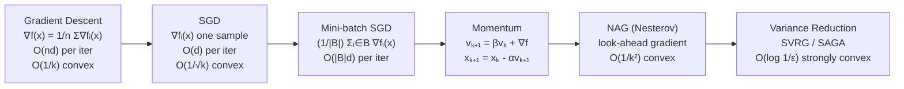

# 📉 SGD and Variants

> [!abstract] TL;DR
> Stochastic Gradient Descent replaces the expensive full-gradient $\nabla f(x) = \frac{1}{n}\sum_{i=1}^n \nabla f_i(x)$ with a cheap single-sample or mini-batch estimate, reducing per-iteration cost from $O(nd)$ to $O(d)$. Momentum and Nesterov acceleration dampen oscillations and achieve $O(1/k^2)$ convergence for smooth convex objectives. Variance reduction methods (SVRG, SAGA) recover geometric convergence by periodically anchoring the noisy gradient.

## Intuition — analogy FIRST

Imagine estimating the average height of a million people. **Full GD** measures everyone before taking a step — accurate but slow. **SGD** measures one random person and steps immediately — fast and noisy but correct on average. **Momentum** is like a boulder rolling downhill: it accumulates speed in the consistent downhill direction and resists being deflected by individual bumpy measurements. **NAG** is the boulder that looks ahead before committing to the roll. **Variance reduction** is like keeping a running census so each new measurement corrects a known baseline, not just a random sample.

---

## How It Works



---

## Key Concepts / Details

### 1. Stochastic Gradient Descent

For an objective $f(x) = \frac{1}{n}\sum_{i=1}^n f_i(x)$, GD requires all $n$ gradients per step:

$$x_{k+1} = x_k - \alpha \cdot \frac{1}{n}\sum_{i=1}^n \nabla f_i(x_k)$$

**SGD** replaces this with a single random sample $i_k \sim \text{Uniform}[n]$:

$$x_{k+1} = x_k - \alpha_k \nabla f_{i_k}(x_k)$$

The stochastic gradient is an **unbiased estimator**: $\mathbb{E}[\nabla f_{i_k}(x_k)] = \nabla f(x_k)$.

### 2. Mini-Batch SGD

$$x_{k+1} = x_k - \frac{\alpha}{|B|}\sum_{i \in B_k} \nabla f_i(x_k), \quad B_k \subset [n], \; |B_k| = b$$

- Variance of the mini-batch gradient: $\text{Var} = \sigma^2/b$ — linear in batch size
- Linear speedup holds up to $b \approx n$ (trivially becomes GD)
- Practical sweet spot: $b \in [32, 4096]$ for deep learning

### 3. Convergence Rates

For $f$ convex, $L$-smooth, bounded gradient noise $\sigma^2$, with step $\alpha_k = c/\sqrt{k}$:

$$\mathbb{E}[f(\bar{x}_k) - f^*] \leq O\!\left(\frac{1}{\sqrt{k}}\right)$$

The $O(1/\sqrt{k})$ rate (vs $O(1/k)$ for GD) is the **unavoidable cost of stochasticity** — noise prevents convergence below $\sigma^2/k$ without decaying steps.

> [!warning] SGD Noise as Regularization
> SGD's inherent noise biases toward **flat minima** (low curvature, more generalizable) over sharp minima (high curvature). This is why a larger batch size sometimes *hurts* generalization — it's equivalent to reducing noise and thus allowing sharp minima.

### 4. Momentum (Polyak Heavy-Ball)

$$v_{k+1} = \beta v_k + \nabla f(x_k), \qquad x_{k+1} = x_k - \alpha v_{k+1}$$

- $\beta = 0.9$ typical; $v_k$ is the **exponential moving average** of past gradients
- Consistent gradient directions **accumulate** (velocity builds); noisy oscillations **cancel**
- Does NOT achieve $O(1/k^2)$ for general convex functions (only for quadratics)

### 5. Nesterov Accelerated Gradient (NAG)

$$y_{k+1} = x_k + \frac{t_k - 1}{t_{k+1}}(x_k - x_{k-1})$$
$$x_{k+1} = y_{k+1} - \alpha \nabla f(y_{k+1}), \qquad t_{k+1} = \frac{1 + \sqrt{1 + 4t_k^2}}{2}$$

- Computes gradient at the **look-ahead point** $y_{k+1}$, not current $x_k$
- Achieves $O(1/k^2)$ for convex smooth $f$ — **optimal first-order rate** (Nesterov lower bound)
- Practical implementation: often written as momentum on gradient steps rather than iterates

### 6. Convergence Table

| Method | Convex Smooth | Strongly Convex | Per-Iter Cost |
|--------|--------------|-----------------|---------------|
| GD | $O(1/k)$ | $O(\rho^k)$ geometric | $O(nd)$ |
| SGD | $O(1/\sqrt{k})$ | $O(1/k)$ | $O(d)$ |
| Mini-batch SGD | $O(1/\sqrt{k})$ | $O(1/k)$ | $O(bd)$ |
| Momentum | $O(1/k)$ practical | Better empirically | $O(d)$ |
| NAG | $O(1/k^2)$ | $O(\rho^k)$ optimal $\rho$ | $O(nd)$ |
| SVRG | — | $O(\rho^k)$ geometric | $O(d)$ amortized |

### 7. Variance Reduction: SVRG

**SVRG** (Johnson & Zhang 2013): maintain a snapshot $\tilde{x}$ every $m$ steps; full gradient $\nabla f(\tilde{x})$ computed once per epoch:

$$g_k = \nabla f_{i_k}(x_k) - \nabla f_{i_k}(\tilde{x}) + \nabla f(\tilde{x})$$

This is unbiased and has **vanishing variance** as $x_k \to x^*$. For $\mu$-strongly convex $f$:

$$\mathbb{E}[f(x_k) - f^*] \leq O\!\left(\left(1 - \frac{\mu}{O(L)}\right)^k\right)$$

— geometric convergence with $O(d)$ amortized cost.

---

## Python Demo

```python
import numpy as np
import matplotlib.pyplot as plt

# Logistic regression: f(x) = (1/n) sum log(1 + exp(-yᵢ xᵀaᵢ)) + (λ/2)||x||²
def sigmoid(z): return 1 / (1 + np.exp(-np.clip(z, -20, 20)))

def grad_i(x, a, y, lam=1e-3):
    """Gradient of single logistic loss term."""
    return -y * a * sigmoid(-y * (a @ x)) + lam * x

def grad_full(x, A, y, lam=1e-3):
    return np.mean([-y[i]*A[i]*sigmoid(-y[i]*(A[i]@x)) for i in range(len(y))], axis=0) + lam*x

np.random.seed(0)
n, d = 500, 20
A = np.random.randn(n, d); y = np.sign(A @ np.random.randn(d))

def run_sgd(A, y, alpha0=0.1, epochs=20):
    x = np.zeros(A.shape[1]); losses = []
    for k in range(1, epochs * len(y) + 1):
        i = np.random.randint(len(y))
        x -= (alpha0 / np.sqrt(k)) * grad_i(x, A[i], y[i])
        if k % len(y) == 0:
            losses.append(np.mean(np.log1p(np.exp(-y * (A @ x)))))
    return losses

def run_momentum(A, y, alpha=0.01, beta=0.9, epochs=20):
    x = np.zeros(A.shape[1]); v = np.zeros_like(x); losses = []
    for epoch in range(epochs):
        for i in np.random.permutation(len(y)):
            g = grad_i(x, A[i], y[i])
            v = beta * v + g
            x -= alpha * v
        losses.append(np.mean(np.log1p(np.exp(-y * (A @ x)))))
    return losses

def run_nag(A, y, alpha=0.01, beta=0.9, epochs=20):
    x = np.zeros(A.shape[1]); x_prev = x.copy(); losses = []
    t = 1.0
    for epoch in range(epochs):
        for i in np.random.permutation(len(y)):
            t_new = (1 + np.sqrt(1 + 4*t**2)) / 2
            y_look = x + ((t - 1) / t_new) * (x - x_prev)
            x_prev = x.copy()
            x = y_look - alpha * grad_i(y_look, A[i], y[i])
            t = t_new
        losses.append(np.mean(np.log1p(np.exp(-y * (A @ x)))))
    return losses

sgd_losses = run_sgd(A, y)
mom_losses = run_momentum(A, y)
nag_losses = run_nag(A, y)

for name, losses in [("SGD", sgd_losses), ("Momentum", mom_losses), ("NAG", nag_losses)]:
    print(f"{name:10s} final loss: {losses[-1]:.4f}")
```

---

## Real-World Notes

- **Deep learning**: SGD + momentum (or Adam) is the default. NAG is used in some frameworks as `nesterov=True`.
- **Batch size scaling**: when doubling batch size, linearly scale learning rate (linear scaling rule, Goyal et al. 2017) up to a warmup threshold.
- **Gradient clipping**: clip gradient norm to threshold before applying update — prevents exploding gradients in RNNs/transformers.
- **Learning rate schedules**: cosine annealing, warmup + decay widely used; step decay (halve every fixed epochs) in CV.

## Common Pitfalls

- **Fixed learning rate for SGD**: without decay, SGD oscillates around $x^*$ but never converges to it. Use $\alpha_k \to 0$ (satisfying $\sum \alpha_k = \infty$, $\sum \alpha_k^2 < \infty$).
- **Momentum overshooting**: $\beta$ too close to 1 → slow correction when direction changes; tune carefully.
- **NAG in stochastic setting**: standard NAG theory is for deterministic gradients. In practice, use SGD + Nesterov momentum as implemented in PyTorch.
- **Shuffling**: always shuffle data between epochs; without shuffling, periodic gradient patterns can hurt convergence.

## Related Concepts

- [[Adaptive_Methods]] — per-parameter step sizes as alternative to tuning global $\alpha$
- [[Proximal_Methods]] — handles non-smooth $g(x)$ added to the objective
- [[../02_Unconstrained/Gradient_Descent]] — full-batch baseline and convergence theory

## Review Questions

1. Why is the SGD convergence rate $O(1/\sqrt{k})$ rather than $O(1/k)$, and what step-size rule achieves it?
2. Explain why NAG achieves $O(1/k^2)$ while plain momentum does not, in one sentence.
3. What property does SVRG exploit to achieve geometric convergence with $O(d)$ per-iteration cost?
4. A practitioner doubles their mini-batch size from 256 to 512. What should they do to the learning rate, and why?
5. Why might a small batch size sometimes *improve* test accuracy even though it increases training noise?

## Sources

- Bottou, Curtis, Nocedal (2018). *Optimization Methods for Large-Scale ML.* SIAM Review.
- Nesterov (1983). *A Method of Solving a Convex Programming Problem with Convergence Rate $O(1/k^2)$.*
- Johnson & Zhang (2013). *Accelerating Stochastic Gradient Descent using Predictive Variance Reduction.* NeurIPS.
- Goyal et al. (2017). *Accurate, Large Minibatch SGD: Training ImageNet in 1 Hour.* arXiv.

#optimization #numerical-methods #intermediate
