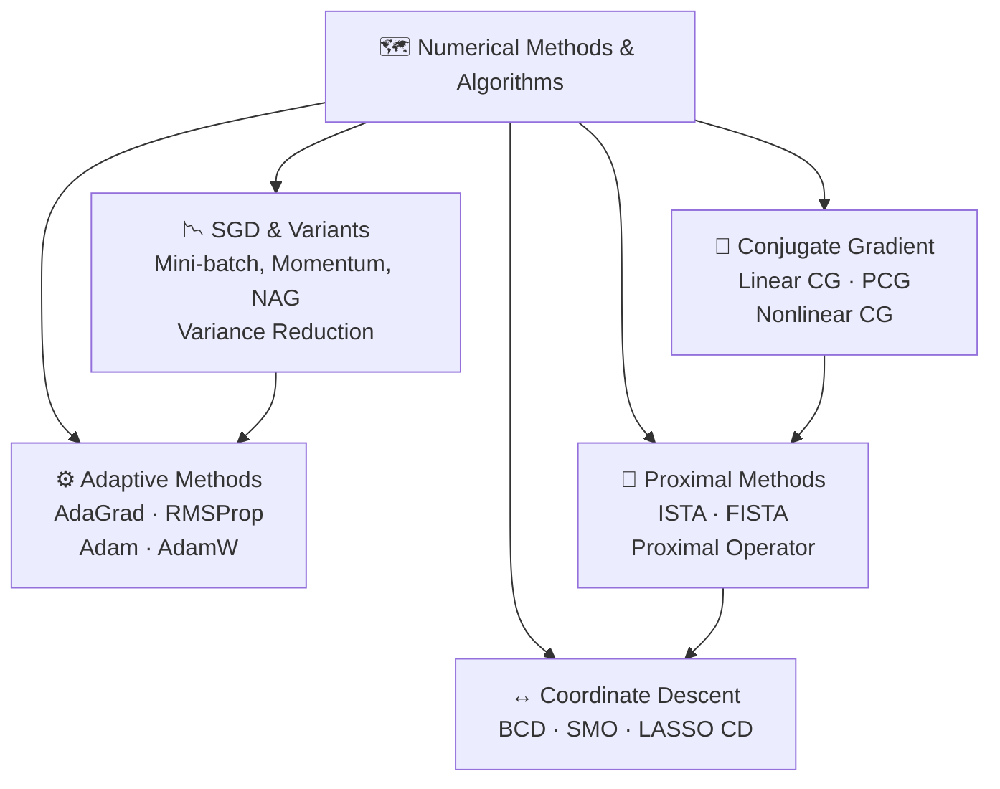

# 🗺️ Numerical Methods & Algorithms — Map of Content

> [!abstract] TL;DR
> Large-scale optimization — training neural networks with millions of parameters, solving LPs with thousands of constraints, compressed sensing with sparse signals — requires algorithms that never explicitly form the Hessian and whose per-iteration cost is sublinear or linear in problem dimension. This section covers stochastic gradient descent and its adaptive variants (momentum, AdaGrad, RMSProp, Adam), proximal gradient methods for non-smooth objectives (ISTA/FISTA), coordinate descent for separable problems, conjugate gradient for linear systems and smooth unconstrained optimization, and ADMM for distributed/decomposable problems. These are the algorithms that power modern ML and large-scale operations research.

## Intuition — analogy FIRST

Think of large-scale optimization as navigating a massive, fog-shrouded mountain range. Classical methods (Newton, interior-point) require a full survey of the terrain before each step — impossible at scale. The algorithms in this section instead use **local scouts** (stochastic gradients), **momentum** (accumulated direction history), **structure-aware decomposition** (coordinate descent, proximal splitting), and **conjugate search directions** (CG) to descend efficiently without global knowledge. Each is optimal for a different problem structure.

---

## Section Map

---

## Notes in This Section

| File | Topic | Difficulty |
|------|-------|------------|
| [[SGD_and_Variants]] | Stochastic GD, momentum, NAG, variance reduction | Intermediate |
| [[Adaptive_Methods]] | AdaGrad, RMSProp, Adam, AdamW | Intermediate |
| [[Proximal_Methods]] | Proximal operator, ISTA, FISTA, Moreau envelope | Advanced |
| [[Coordinate_Descent]] | CD, BCD, LASSO, SMO, K-means as BCD | Intermediate |
| [[Conjugate_Gradient]] | Linear CG, PCG, nonlinear CG, Newton-CG | Advanced |

---

## Key Themes

### 1. Stochasticity & Variance
Full-gradient methods cost $O(n)$ per iteration on $n$-sample problems. SGD reduces this to $O(1)$ at the cost of gradient noise ($\sigma^2$). Variance reduction (SVRG, SAGA) recovers near-deterministic convergence rates with $O(1)$ per-iteration cost.

### 2. Adaptivity
Per-parameter learning rates — AdaGrad through Adam — exploit heterogeneous gradient scales. Critical in NLP (sparse embeddings) and deep learning (varying layer scales).

### 3. Non-smooth Objectives
$\ell_1$ regularization, group sparsity, and constraint indicators are non-differentiable. Proximal operators handle them exactly without smoothing, enabling sparse recovery (LASSO, compressed sensing).

### 4. Problem Decomposition
Both coordinate descent and ADMM exploit separable structure. When each subproblem has a cheap closed-form solution (LASSO, NMF, SVM), the overall algorithm becomes highly efficient.

### 5. Second-Order Curvature without the Hessian
CG exploits curvature information implicitly through matrix-vector products $Ad$ (cost $O(n)$) without storing the $n \times n$ Hessian. Newton-CG scales second-order methods to large problems.

---

## Algorithm Complexity Summary

| Algorithm | Per-Iter Cost | Convergence Rate | Best For |
|-----------|--------------|-----------------|----------|
| GD | $O(nd)$ | $O(1/k)$ convex | Small, smooth |
| SGD | $O(d)$ | $O(1/\sqrt{k})$ | Large-scale ML |
| SGD + Momentum | $O(d)$ | Empirically faster | Deep learning |
| NAG | $O(nd)$ | $O(1/k^2)$ | Smooth convex |
| Adam | $O(d)$ | Empirical | Deep learning |
| ISTA | $O(nd)$ | $O(1/k)$ | Smooth+L1 |
| FISTA | $O(nd)$ | $O(1/k^2)$ | Smooth+L1 |
| Coord. Descent | $O(d)$/coord | $O(1/k)$ separable | LASSO, SVM |
| CG (linear) | $O(d^2)$ or $O(\text{nnz})$ | $O((\frac{\sqrt\kappa-1}{\sqrt\kappa+1})^k)$ | Linear systems |

---

## Prerequisites

- [[../01_Foundations/Convexity_and_Optimality]] — convexity, smoothness ($L$-smooth, $\mu$-strongly convex)
- [[../02_Unconstrained/Gradient_Descent]] — full gradient descent baseline
- [[../01_Foundations/Linear_Algebra_for_Optimization]] — inner products, norms, eigenvalues

## Related Sections

- [[../06_Stochastic_Optimization/_MOC_Stochastic_Optimization]] — deeper variance reduction theory
- [[../04_Duality_Theory/_MOC_Duality]] — ADMM derives from augmented Lagrangian

---

## Review Questions

1. Why does SGD converge at $O(1/\sqrt{k})$ rather than $O(1/k)$, and what assumption drives this?
2. What is the proximal operator for the $\ell_1$ norm, and why is it a soft-threshold rather than a hard-threshold?
3. How does Adam correct for initialization bias in its moment estimates?
4. Why does coordinate descent fail to converge for non-smooth, non-separable $g(x)$?
5. What property of the CG search directions guarantees termination in at most $n$ steps?

---

## Sources

- Bottou, Curtis, Nocedal (2018). *Optimization Methods for Large-Scale ML.* SIAM Review.
- Beck & Teboulle (2009). *A Fast Iterative Shrinkage-Thresholding Algorithm.* SIAM J. Imaging Sci.
- Kingma & Ba (2015). *Adam: A Method for Stochastic Optimization.* ICLR.
- Wright (2015). *Coordinate Descent Algorithms.* Mathematical Programming.
- Shewchuk (1994). *An Introduction to the Conjugate Gradient Method Without the Agonizing Pain.*

#MOC #optimization #numerical-methods
