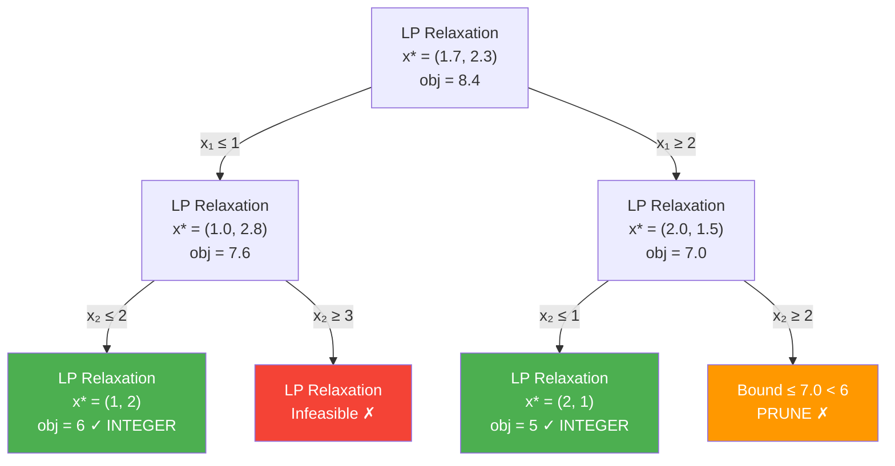

# 🔢 Integer Programming

> [!abstract] TL;DR
> Integer programs (IPs) add integrality constraints to LPs, making them NP-hard in general. The core algorithmic approach is branch-and-bound: recursively partition the feasible region and prune branches using LP relaxation bounds. Cutting planes (Gomory cuts) tighten the LP relaxation without removing integer feasible points. Modern solvers combine both with primal heuristics to solve large instances in practice.

## Intuition — analogy FIRST

Imagine optimizing over a grid of integer lattice points inside a polytope. The LP relaxation "fills in the gaps" between lattice points with a smooth region. Branch-and-bound works like a systematic divide-and-conquer: split the problem on a fractional variable, solve each half recursively, and discard any branch whose LP relaxation is worse than the best integer solution found so far. Gomory cuts shave off fractional LP corners without removing any integer points — tightening the bound at each node.

---

## How It Works



---

## Key Concepts / Details

### Integer Linear Program (ILP)

$$\min_{x} \; c^\top x \quad \text{s.t.} \quad Ax \leq b,\; x \geq 0,\; x_j \in \mathbb{Z} \;\forall j \in \mathcal{I}$$

- **Pure ILP**: all variables integer
- **Binary IP (BIP)**: $x_j \in \{0,1\}$; models yes/no decisions
- **Mixed-Integer Program (MIP)**: some variables integer, others continuous
- **Complexity**: NP-hard in general; feasibility is NP-complete (subsumes SAT)

### LP Relaxation and Integrality Gap

**LP relaxation**: drop all integrality constraints. Optimal LP value $z_{LP}^* \leq z_{IP}^*$ (for minimization). The **integrality gap** can be arbitrarily large.

$$\text{gap} = \frac{z_{IP}^* - z_{LP}^*}{z_{LP}^*}$$

When the gap is 0 (LP relaxation gives integer optimal) — no IP solver needed:
- **Totally unimodular** constraint matrix + integer $b$ → always integer LP optimal (see [[Network_Flow]])

### Branch and Bound

1. Solve LP relaxation at current node
2. If infeasible: prune (infeasible)
3. If LP optimal is worse than current best integer solution: prune (bound)
4. If LP optimal is integer: update incumbent, prune (integer feasible)
5. Otherwise: select fractional variable $x_j^*$; create two children:
   - Left: add $x_j \leq \lfloor x_j^* \rfloor$
   - Right: add $x_j \geq \lceil x_j^* \rceil$
6. Recurse

**Branching strategies**:
- Most-infractional: branch on variable with $x_j^*$ closest to 0.5
- Strong branching: test both branches, pick one with worse bound (expensive but fewer nodes)
- Pseudocost branching: estimate bound improvement from historical data

**Search strategies**:
- Depth-first: low memory; finds feasible solutions quickly
- Best-first: explores most promising node first; tighter bounds overall

### Cutting Planes

**Cut**: a valid inequality $\pi^\top x \leq \pi_0$ satisfied by all integer feasible points but violated by the current LP optimal.

**Gomory Cut** (from simplex tableau): for any row $i$ with fractional RHS $\bar{b}_i$:
$$\sum_{j: \bar{a}_{ij} > 0} \{\bar{a}_{ij}\} x_j \geq \{\bar{b}_i\}$$

where $\{y\} = y - \lfloor y \rfloor$ denotes the fractional part.

**Chvátal-Gomory procedure**: take non-negative combination of constraints, round RHS down; generates all valid inequalities for the integer hull.

**Problem-specific cuts** (stronger, exploited by modern solvers):
- **Knapsack cover cuts**: for $\sum a_j x_j \leq b$, a set $C$ is a cover if $\sum_{j \in C} a_j > b$; cut: $\sum_{j \in C} x_j \leq |C|-1$
- **TSP subtour elimination**: for subset $S \subsetneq V$, $\sum_{(i,j) \in E(S)} x_{ij} \leq |S|-1$

### Branch and Cut

Combines branch-and-bound with cutting planes at each node of the tree — this is the architecture of all modern MIP solvers (Gurobi, CPLEX, CBC).

### MIP Formulation Techniques

**Big-M method** (logical constraints):

"If $y=1$ then $Ax \leq b$":
$$Ax \leq b + M(1-y), \quad y \in \{0,1\}$$

where $M$ is chosen large enough to not cut off feasible points when $y=0$. Weak relaxation; tighter: use tightest valid $M$.

**Fixed cost** (facility location):
$$\text{cost of using resource } j: \; f_j y_j + c_j x_j, \quad x_j \leq M y_j, \quad y_j \in \{0,1\}$$

**Disjunctive constraints** (either $Ax \leq b$ or $Cx \leq d$):
$$Ax \leq b + M(1-y), \quad Cx \leq d + My, \quad y \in \{0,1\}$$

### Special Structure Problems

| Problem | Structure | Complexity | Best Algorithm |
|---------|-----------|------------|----------------|
| Knapsack | $\sum a_j x_j \leq b, x_j \in \{0,1\}$ | NP-hard; pseudopolynomial DP | DP or B&B |
| TSP | Min Hamiltonian cycle | NP-hard | Subtour cuts + B&B |
| Facility location | Open facilities + assignment | NP-hard | Lagrangian relaxation |
| Network flow | TU matrix | Polynomial | Simplex/network algorithms |
| Scheduling | Machine assignment | Varies | B&B + heuristics |

### LP vs IP Comparison

| Property | LP | IP / MIP |
|----------|-----|----------|
| Complexity | Polynomial (simplex, interior point) | NP-hard (general) |
| Solution | Vertex of polytope | Lattice point in polytope |
| Relaxation | Self; no relaxation needed | LP relaxation gives lower bound |
| Integrality gap | N/A | Can be $O(\log n)$ or worse |
| Solver tools | Gurobi, CPLEX, GLPK, simplex | Gurobi, CPLEX, CBC + B&B |

```python
import numpy as np
from scipy.optimize import milp, LinearConstraint, Bounds

# Knapsack problem via scipy milp (SciPy >= 1.7)
# max sum(v_j * x_j)  s.t.  sum(w_j * x_j) <= W, x_j in {0,1}

values  = np.array([10, 6, 5, 4, 3], dtype=float)
weights = np.array([10, 4, 6, 3, 2], dtype=float)
W = 13  # total weight capacity

n = len(values)
# scipy milp minimizes, so negate values
c = -values

# Constraint: sum(w_j * x_j) <= W
A = weights.reshape(1, -1)
constraints = LinearConstraint(A, lb=-np.inf, ub=W)

# Bounds: 0 <= x_j <= 1
bounds = Bounds(lb=np.zeros(n), ub=np.ones(n))

# Integrality: 1 = integer variable
integrality = np.ones(n)

result = milp(c=c, constraints=constraints, integrality=integrality, bounds=bounds)
x_opt = np.round(result.x).astype(int)
print(f"Knapsack solution: {x_opt}")
print(f"Total value:  {int(values @ x_opt)}")
print(f"Total weight: {int(weights @ x_opt)} / {W}")

# Compare LP relaxation (integrality=0)
result_lp = milp(c=c, constraints=constraints, integrality=np.zeros(n), bounds=bounds)
print(f"\nLP relaxation value: {-result_lp.fun:.3f}")
print(f"IP optimal value:    {-result.fun:.3f}")
print(f"Integrality gap:     {(-result_lp.fun - (-result.fun)) / abs(-result_lp.fun):.1%}")
```

---

## Real-World Notes

- Modern solvers (Gurobi, CPLEX) use branch-and-cut with extensive presolve, heuristics, and parallel processing; MIPs with millions of variables are routinely solved in minutes.
- The 1990s-to-today speedup in MIP solving is approximately $10^9$: half from hardware (Moore's law), half from algorithmic improvements (cuts, presolve, heuristics).
- For combinatorial optimization heuristics (genetic algorithms, simulated annealing, tabu search) are used when exact methods are too slow — they trade optimality for speed.
- Open-source solvers: CBC (via PuLP/OR-Tools), HiGHS, GLPK; commercial: Gurobi (free for academics), CPLEX.

## Common Pitfalls

- **Weak big-M formulation**: large $M$ values make LP relaxation loose → deep B&B trees; tighten by finding the minimum valid $M$.
- **Ignoring LP relaxation quality**: a tight LP relaxation (small integrality gap) dramatically reduces B&B tree size.
- **Symmetric problems**: TSP, facility location have many equivalent optimal solutions; add symmetry-breaking constraints.
- **Numerical issues**: MIP solvers work with floating-point; small coefficients or large ranges can cause incorrect branching; scale and normalize.

## Related Concepts

- [[Network_Flow]] — TU structure avoids IP; multi-commodity flow requires MIP
- [[Portfolio_Optimization]] — cardinality-constrained portfolio is a BIP
- Sec 01 (Foundations) — LP theory; LP relaxation is the backbone of B&B
- Sec 04 (Duality) — LP duality for bounding; Lagrangian relaxation for MIP lower bounds

## Review Questions

1. Define the LP relaxation of an ILP. Why does it provide a lower bound on the optimal IP value (for minimization)?
2. Describe one full iteration of branch-and-bound: when do you prune, when do you branch, and how do you choose the branching variable?
3. Derive a Gomory cut from a simplex tableau row with fractional RHS. Why does this cut off the LP optimal without removing integer feasible points?
4. What is a big-M formulation? Give an example for the constraint "if binary $y=1$, then $x \leq 5$." What goes wrong with $M$ too large?
5. Why is network flow solvable as an LP even though it has integrality requirements?

## Sources

- Wolsey, L.A. *Integer Programming*. Wiley, 1998.
- Schrijver, A. *Theory of Linear and Integer Programming*. Wiley, 1986.
- Nemhauser & Wolsey. *Integer and Combinatorial Optimization*.
- Bixby, R. (2012). A brief history of linear and mixed-integer programming computation. *Documenta Mathematica*.
- Gomory, R.E. (1958). Outline of an algorithm for integer solutions to linear programs.

#optimization #applications #advanced
