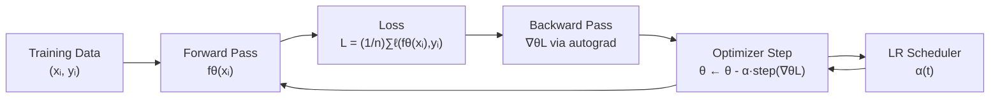

# ⚙️ ML Training Optimization

> [!abstract] TL;DR
> Training a neural network is unconstrained non-convex optimization over parameters θ. Despite non-convexity, SGD and its adaptive variants find good solutions in practice because the loss landscape in high dimensions has few poor local minima — most critical points are saddles. Learning rate schedules, gradient clipping, and batch normalization each address specific geometric properties of the landscape.

## Intuition — analogy FIRST

Imagine navigating a mountainous terrain in dense fog. You can only feel the local slope (gradient). Pure gradient descent walks carefully downhill. SGD is like bouncing down with a pogo stick — noisy, but the randomness helps escape shallow valleys. Adam is like having memory: it tracks how steep each direction has been recently, so it takes shorter steps in ravines and longer steps on gentle slopes. The learning rate schedule is your speed plan for the journey.

---

## How It Works



---

## Key Concepts / Details

### Neural Network Training as Optimization

$$\min_{\theta} \mathcal{L}(\theta) = \frac{1}{n} \sum_{i=1}^{n} \ell\!\left(f_\theta(x_i),\, y_i\right)$$

- $\theta \in \mathbb{R}^p$: all parameters (weights + biases), $p$ can be $10^8$–$10^{12}$
- $\ell$: task-specific loss (cross-entropy for classification, MSE for regression)
- No constraints; problem is **non-convex** due to composition of nonlinear activations

### Loss Landscape Properties

| Property | Description | Implication |
|----------|-------------|-------------|
| Non-convex | Many critical points | Global min not guaranteed |
| High-dimensional | $p \gg n$ typically | Most critical points are saddles (Dauphin et al., 2014) |
| Flat minima | Wide valleys in parameter space | Better generalization (Hochreiter & Schmidhuber 1997) |
| Sharp minima | Narrow valleys | Poorer generalization; found by small batch SGD |

**Saddle point dominance**: In high dimensions, a random critical point has probability $\approx 2^{-p}$ of being a local minimum (all Hessian eigenvalues positive). Almost all critical points encountered during optimization are saddles — this is why training "escapes" them and why local minima are rarely the bottleneck.

### SGD Implicit Regularization

- Large learning rate → noisier gradients → escapes sharp minima → lands in flat minima
- Small batch size → more noise → stronger implicit regularization
- **Batch normalization** (Ioffe & Szegedy 2015): normalizes layer inputs; smoothens loss landscape; reduces Lipschitz constant of gradients; allows larger learning rates

### Learning Rate Schedules

$$\alpha(t) = \begin{cases} \alpha_{\max} \cdot t / T_w & \text{warmup phase } t < T_w \\ \text{cosine schedule} & t \geq T_w \end{cases}$$

**Cosine annealing** (Loshchilov & Hutter 2017):
$$\alpha(t) = \alpha_{\min} + \frac{1}{2}(\alpha_{\max} - \alpha_{\min})\left(1 + \cos\!\left(\frac{\pi t}{T}\right)\right)$$

**Why warmup for Adam**: At initialization, second-moment estimate $v_t$ is small → effective step size $\alpha / \sqrt{v_t + \epsilon}$ is huge → unstable updates. Warmup prevents large early steps before $v_t$ stabilizes.

**Cyclical LR** (Smith 2017): oscillate $\alpha$ between bounds; traverses multiple loss landscape regions; can find flatter minima.

### Gradient Clipping

Clip by global norm (standard for RNNs/Transformers):
$$g \leftarrow \begin{cases} g & \text{if } \|g\| \leq \gamma \\ \gamma \cdot g / \|g\| & \text{otherwise} \end{cases}$$

Prevents **exploding gradients** caused by deep recurrence or large parameter norms.

### Second-Order Methods for Deep Learning

Full Newton step requires inverting $H \in \mathbb{R}^{p \times p}$ — infeasible for large $p$.

**K-FAC** (Kronecker-Factored Approximate Curvature, Martens & Grosse 2015):
- Approximates Fisher information matrix as $F \approx A \otimes B$ (Kronecker product per layer)
- Inverts efficiently: $(A \otimes B)^{-1} = A^{-1} \otimes B^{-1}$
- Per-epoch convergence faster than Adam; per-step cost higher

**Shampoo** (Gupta et al. 2018): maintains per-layer gradient second-moment matrices; interpolates between AdaGrad and full second-order.

### Optimizer Comparison for Deep Learning

| Optimizer | Update Rule | Adaptive? | Notes |
|-----------|-------------|-----------|-------|
| SGD + momentum | $v \leftarrow \beta v - \alpha g$; $\theta \leftarrow \theta + v$ | No | Best generalization on CV tasks; needs careful LR tuning |
| Adam | $m_t / (1-\beta_1^t)$ over $\sqrt{v_t/(1-\beta_2^t)}+\epsilon$ | Yes | Fast convergence; may generalize slightly worse |
| AdamW | Adam + decoupled weight decay | Yes | Standard for Transformers; fixes L2 reg in Adam |
| LAMB | Layer-wise adaptive LR scaling | Yes | Large-batch training (BERT pretraining) |
| K-FAC | Natural gradient with Kronecker approx | Second-order | Faster epoch convergence; expensive per step |

```python
import torch
import torch.nn as nn
from torch.optim import AdamW
from torch.optim.lr_scheduler import CosineAnnealingLR

# Simple MLP for demonstration
class MLP(nn.Module):
    def __init__(self, in_dim=784, hidden=256, out_dim=10):
        super().__init__()
        self.net = nn.Sequential(
            nn.Linear(in_dim, hidden),
            nn.BatchNorm1d(hidden),
            nn.ReLU(),
            nn.Linear(hidden, hidden),
            nn.BatchNorm1d(hidden),
            nn.ReLU(),
            nn.Linear(hidden, out_dim)
        )
    def forward(self, x):
        return self.net(x)

model = MLP()
optimizer = AdamW(model.parameters(), lr=3e-4, weight_decay=1e-2)
scheduler = CosineAnnealingLR(optimizer, T_max=100, eta_min=1e-6)

# Training loop with gradient clipping
def train_epoch(model, loader, optimizer, scheduler, clip_norm=1.0):
    model.train()
    total_loss = 0.0
    criterion = nn.CrossEntropyLoss()

    for X, y in loader:
        optimizer.zero_grad()
        logits = model(X)
        loss = criterion(logits, y)
        loss.backward()

        # Gradient clipping by global norm
        torch.nn.utils.clip_grad_norm_(model.parameters(), max_norm=clip_norm)

        optimizer.step()
        total_loss += loss.item()

    scheduler.step()
    return total_loss / len(loader)

# Warmup + cosine annealing via lambda scheduler
def warmup_cosine_schedule(step, warmup_steps=1000, total_steps=10000):
    if step < warmup_steps:
        return step / warmup_steps  # linear warmup
    progress = (step - warmup_steps) / (total_steps - warmup_steps)
    return 0.5 * (1 + torch.cos(torch.tensor(3.14159 * progress))).item()
```

---

## Real-World Notes

- AdamW is the default for Transformer-based models (LLMs, ViTs); SGD+momentum remains competitive for CNNs on ImageNet.
- Batch normalization is less effective with very small batches (< 8); use Layer Norm or Group Norm instead.
- Gradient clipping threshold $\gamma = 1.0$ is standard for language models; use $\gamma = 0.1$ for RNNs.
- Hyperparameter search: random search outperforms grid search (Bergstra & Bengio 2012) when effective dimensionality is low; Bayesian opt (GPyOpt, Optuna) adds further gains for expensive models.

## Common Pitfalls

- **Skipping warmup with Adam**: causes large initial steps that corrupt early layers.
- **No weight decay with Adam**: Adam's L2 penalty is absorbed into adaptive scaling — use AdamW for proper decoupled decay.
- **Constant LR**: leaving LR constant misses convergence to better minima; always schedule.
- **Clipping too aggressively**: $\gamma \ll 1$ can slow convergence; $\gamma \gg \|g\|$ has no effect.
- **Batch size too large without LR scaling**: linear scaling rule: multiply $\alpha$ by $k$ when batch size is multiplied by $k$ (Goyal et al. 2017).

## Related Concepts

- [[Regularization_as_Optimization]] — L2 weight decay as Ridge penalty
- [[_MOC_AI_ML_Master]] — SGD variants, batch normalization, hyperparameter search
- Sec 02 (Unconstrained Optimization) — gradient descent theory, convergence rates
- Sec 03 (First-Order Methods) — Adam, AdaGrad, proximal gradient

## Review Questions

1. Why do most critical points in high-dimensional loss landscapes turn out to be saddle points rather than local minima?
2. Derive the Adam update rule and explain why warmup is necessary at initialization.
3. What is cosine annealing? Write the formula and explain its advantage over step decay.
4. Explain the implicit regularization effect of SGD's batch noise on the final solution.
5. Why does K-FAC converge faster per epoch than Adam, and what limits its use in practice?

## Sources

- Dauphin et al. (2014). Identifying and attacking the saddle point problem in high-dimensional non-convex optimization.
- Goodfellow, Bengio, Courville. *Deep Learning*, Chapter 8.
- Loshchilov & Hutter (2017). SGDR: Stochastic Gradient Descent with Warm Restarts.
- Martens & Grosse (2015). Optimizing Neural Networks with Kronecker-factored Approximate Curvature.
- Smith (2017). Cyclical Learning Rates for Training Neural Networks.
- Ioffe & Szegedy (2015). Batch Normalization: Accelerating Deep Network Training.

#optimization #applications #intermediate
