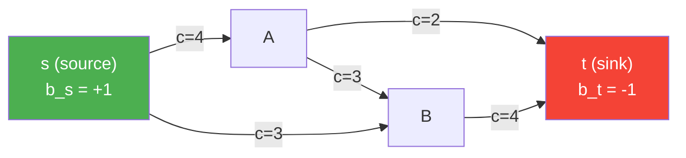

# 🌐 Network Flow

> [!abstract] TL;DR
> Network flow problems — max flow, shortest path, minimum cost flow, bipartite matching — are all instances of LP over a graph structure. The key insight is that the constraint matrix of any network flow LP is totally unimodular (TU), guaranteeing integer optimal solutions from LP relaxation without requiring integer programming. Max-flow equals min-cut by strong LP duality.

## Intuition — analogy FIRST

Think of a city water network: pipes have maximum capacities, and you want to pump as much water as possible from a source to a sink. The max-flow min-cut theorem says the bottleneck is always a "cut" — a set of pipes whose removal disconnects source from sink — and the maximum flow exactly equals the minimum such cut capacity. This is LP duality made visible: the primal problem pushes flow, the dual problem finds a minimum cut.

---

## How It Works



---

## Key Concepts / Details

### General Minimum Cost Flow (MCF)

The most general network flow problem. All others reduce to it.

$$\min_{f} \sum_{e \in E} w_e f_e$$

$$\text{s.t.} \quad \sum_{e \text{ out of } v} f_e - \sum_{e \text{ into } v} f_e = b_v \quad \forall v \in V$$

$$0 \leq f_e \leq c_e \quad \forall e \in E$$

- $b_v$: supply ($b_v > 0$) or demand ($b_v < 0$) at node $v$; $\sum_v b_v = 0$ required
- $c_e$: edge capacity; $w_e$: edge cost
- **Totally unimodular** constraint matrix → LP always has an integer optimal solution when $b$ and $c$ are integer

### Max Flow Problem

Maximize flow from source $s$ to sink $t$:

$$\max \; f \quad \text{s.t.} \quad f \leq c_e \text{ (per edge)}, \; \text{flow conservation}$$

Equivalently: add edge $(t, s)$ with capacity $\infty$, set $b_v = 0$ for all $v$, maximize flow on $(t,s)$.

**Residual graph** $G_f$: for each edge $(u,v)$ with flow $f_e$ and capacity $c_e$:
- Forward edge $(u,v)$ with residual capacity $c_e - f_e$
- Backward edge $(v,u)$ with residual capacity $f_e$

**Augmenting path**: any $s$-$t$ path in $G_f$ with positive capacity throughout.

### Max-Flow Min-Cut Theorem

> **Theorem**: Maximum $s$-$t$ flow = minimum $s$-$t$ cut capacity.

**Cut** $(S, T)$: partition $V = S \cup T$ with $s \in S$, $t \in T$. Cut capacity:
$$\text{cap}(S,T) = \sum_{(u,v): u \in S, v \in T} c_{uv}$$

**Proof sketch** (LP duality): max flow LP and min cut LP are dual programs; both achieve their bounds → strong duality gives equality.

### Ford-Fulkerson / Edmonds-Karp

| Algorithm | Augmentation Strategy | Complexity |
|-----------|----------------------|------------|
| Ford-Fulkerson | Any $s$-$t$ path in $G_f$ | $O(E \cdot |f^*|)$ (can be infinite for irrational caps) |
| Edmonds-Karp | BFS shortest path (fewest edges) | $O(VE^2)$ |
| Dinic's | BFS level graph + blocking flow | $O(V^2 E)$ |
| Push-relabel | Height function + local operations | $O(V^2 \sqrt{E})$ |

### Shortest Path as LP

Single-source shortest path: min total weight of flow routing one unit from $s$ to $t$.

$$\min \sum_{e} c_e f_e \quad \text{s.t.} \quad \sum_{e \text{ out}} f_e - \sum_{e \text{ in}} f_e = b_v,\; f_e \geq 0$$

where $b_s = 1$, $b_t = -1$, $b_v = 0$ otherwise.

| Algorithm | Conditions | Complexity |
|-----------|-----------|------------|
| Dijkstra | Non-negative weights | $O((V+E)\log V)$ with binary heap |
| Bellman-Ford | Arbitrary weights (detects neg cycles) | $O(VE)$ |
| DAG relaxation | DAG (topological order) | $O(V+E)$ |
| Floyd-Warshall | All-pairs, arbitrary weights | $O(V^3)$ |

**Dual of shortest path LP** = longest path LP; dual variables are potential functions $\pi_v$ (Johnson's reweighting).

### Bipartite Matching as Max Flow

Given bipartite graph $G = (L \cup R, E)$:
- Add source $s$ connected to all $l \in L$ (capacity 1)
- Add sink $t$ connected from all $r \in R$ (capacity 1)
- All original edges have capacity 1
- Maximum matching = max flow value

**Assignment problem** (min cost perfect matching): Hungarian algorithm $O(n^3)$; also solvable as min-cost flow.

### Total Unimodularity (TU)

> **Definition**: Matrix $A$ is TU if every square submatrix has determinant $\in \{-1, 0, +1\}$.

> **Theorem**: Node-edge incidence matrix of any directed graph is TU.

**Consequence**: If $A$ is TU and $b, c$ are integer, then all vertices of the LP feasible polytope $\{x: Ax=b, x \geq 0\}$ are integer → LP optimal is automatically integer → **no need for integer programming**.

This applies to: max flow, min cost flow, shortest path, bipartite matching, assignment, transportation problems.

### Network Flow LP Formulations Summary

| Problem | Objective | Special Structure |
|---------|-----------|-------------------|
| Max flow | max flow s→t | MCF with $w=0$ except $t→s$ edge |
| Shortest path | min path cost | MCF single commodity, unit demand |
| Bipartite matching | max matching | MCF with unit capacities |
| Assignment | min total cost | Bipartite matching with costs |
| Transportation | min shipping cost | MCF with multiple sources/sinks |

```python
import networkx as nx
import numpy as np

# Max flow example
G = nx.DiGraph()
G.add_edge('s', 'A', capacity=4)
G.add_edge('s', 'B', capacity=3)
G.add_edge('A', 'B', capacity=3)
G.add_edge('A', 't', capacity=2)
G.add_edge('B', 't', capacity=4)

flow_value, flow_dict = nx.maximum_flow(G, 's', 't')
print(f"Max flow: {flow_value}")
for u in flow_dict:
    for v, f in flow_dict[u].items():
        if f > 0:
            print(f"  {u} → {v}: {f}")

# Shortest path (Dijkstra)
H = nx.DiGraph()
edges = [('s','A',1), ('s','B',4), ('A','B',2), ('A','C',5), ('B','C',1), ('C','t',3)]
for u, v, w in edges:
    H.add_edge(u, v, weight=w)

path = nx.shortest_path(H, 's', 't', weight='weight')
dist = nx.shortest_path_length(H, 's', 't', weight='weight')
print(f"\nShortest path s→t: {path}, cost: {dist}")

# Min cost flow
MCF = nx.DiGraph()
MCF.add_node('s', demand=-5)  # supply 5 units
MCF.add_node('t', demand=5)   # demand 5 units
MCF.add_edge('s', 'A', capacity=4, weight=1)
MCF.add_edge('s', 'B', capacity=3, weight=2)
MCF.add_edge('A', 't', capacity=3, weight=3)
MCF.add_edge('B', 't', capacity=4, weight=1)
MCF.add_edge('A', 'B', capacity=2, weight=1)

flow_cost, flow_mcf = nx.min_cost_flow_cost(MCF), nx.min_cost_flow(MCF)
print(f"\nMin cost flow cost: {flow_cost}")
```

---

## Real-World Notes

- Network flow solvers (e.g., LEMON, OR-Tools) scale to millions of nodes; pure LP solvers are slower due to lack of graph structure exploitation.
- Max flow arises in: image segmentation (graph cuts), project scheduling, kidney exchange, airline crew scheduling.
- Shortest path is ubiquitous: GPS navigation, packet routing (OSPF uses Dijkstra), dependency resolution.
- Minimum cost flow models: supply chain logistics, power grid dispatch, multi-commodity flow for internet routing.

## Common Pitfalls

- **Negative cycles in MCF**: MCF is infeasible or unbounded with negative-cost cycles; check via Bellman-Ford on residual graph.
- **Ford-Fulkerson with irrational capacities**: can loop forever; always use Edmonds-Karp (BFS) in practice.
- **Forgetting flow conservation**: source/sink balances must sum to zero globally.
- **Multi-commodity flow**: when multiple source-sink pairs share capacity, TU no longer applies → may require IP (and is NP-hard in general).

## Related Concepts

- [[Integer_Programming]] — network flow as integer LP; TU avoids IP; multi-commodity flow requires IP
- [[Portfolio_Optimization]] — CVaR as LP; asset allocation as flow
- Sec 01 (Foundations) — LP duality, strong duality theorem
- Sec 04 (Duality) — max-flow min-cut as a duality result

## Review Questions

1. State the max-flow min-cut theorem and sketch a proof using LP duality.
2. What is the residual graph? Why is it needed in augmenting path algorithms?
3. Formulate the shortest path problem as a minimum cost flow LP. Write out variables, objective, and constraints.
4. Define total unimodularity. Why does TU imply that LP relaxation has an integer optimal solution?
5. Describe how bipartite matching reduces to a max flow instance.

## Sources

- Ahuja, Magnanti, Orlin. *Network Flows: Theory, Algorithms, and Applications*.
- Boyd & Vandenberghe, *Convex Optimization*, Chapter 4 (LP examples).
- Cormen et al. *Introduction to Algorithms*, Chapter 26 (maximum flow).
- Ford & Fulkerson (1956). Maximal Flow through a Network. *Canadian Journal of Mathematics*.

#optimization #applications #intermediate
