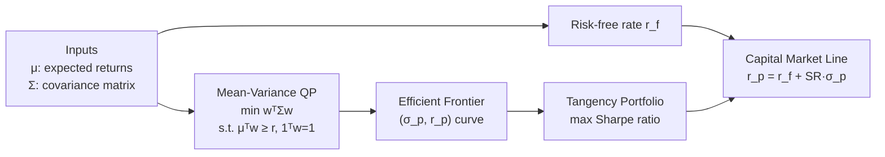

# 📈 Portfolio Optimization

> [!abstract] TL;DR
> Markowitz mean-variance optimization (1952) frames portfolio selection as a convex QP: minimize portfolio variance for a target return. Extensions — Black-Litterman (Bayesian return estimation), risk parity (equal risk contribution), and CVaR optimization (tail-risk control) — address the notorious sensitivity of MV to input estimation error. All are solvable as QP or LP programs.

## Intuition — analogy FIRST

You have $n$ assets. Holding all money in one asset is risky; spreading across uncorrelated assets reduces variance without necessarily reducing expected return — free diversification. Markowitz quantified this: given a return target, the optimal portfolio minimizes variance, and sweeping over all targets traces the **efficient frontier** — the Pareto front of (risk, return) pairs. Every rational investor should hold a point on this curve; which point depends on their risk aversion.

---

## How It Works



---

## Key Concepts / Details

### Markowitz Mean-Variance Problem (1952)

$$\min_{w} \; w^\top \Sigma w \quad \text{s.t.} \quad \mu^\top w \geq r_{\text{target}},\; \mathbf{1}^\top w = 1,\; w \geq 0$$

- $w \in \mathbb{R}^n$: portfolio weights (long-only if $w \geq 0$)
- $\Sigma \in \mathbb{S}^n_+$: asset return covariance matrix (PSD → convex QP)
- $\mu \in \mathbb{R}^n$: vector of expected returns
- Portfolio return: $r_p = \mu^\top w$; portfolio variance: $\sigma_p^2 = w^\top \Sigma w$

**Analytical solution** (equality constraints only, no sign constraint):

Let $A = \begin{bmatrix} \mu^\top \\ \mathbf{1}^\top \end{bmatrix}$, then:
$$w^* = \Sigma^{-1} A^\top \!\left(A \Sigma^{-1} A^\top\right)^{-1} \begin{bmatrix} r_{\text{target}} \\ 1 \end{bmatrix}$$

**KKT conditions**:
$$2\Sigma w^* = A^\top \nu, \quad A w^* = \begin{bmatrix} r_{\text{target}} \\ 1 \end{bmatrix}$$
where $\nu = (\nu_1, \nu_2)^\top$ are dual variables (Lagrange multipliers for return and budget constraints).

### Efficient Frontier and Capital Market Line

- **Efficient frontier**: curve of $(σ_p, r_p)$ for all optimal portfolios; minimum-variance portfolio is at the apex
- **Capital Market Line (CML)**: with a risk-free asset at rate $r_f$, the optimal risky-asset mix is the **tangency portfolio**
- **Sharpe ratio**: $\text{SR}(w) = (r_p - r_f) / \sigma_p$; tangency portfolio maximizes SR

Tangency portfolio (unconstrained):
$$w_{\text{tang}} \propto \Sigma^{-1}(\mu - r_f \mathbf{1})$$

### Black-Litterman Model

Addresses the main failure of MV: **garbage in, garbage out** — small errors in $\mu$ cause wildly different portfolios.

**Step 1 — Equilibrium returns** (reverse optimization from CAPM):
$$\Pi = \delta \Sigma w_{\text{mkt}}$$
where $\delta$ is the risk-aversion coefficient, $w_{\text{mkt}}$ is the market-cap-weighted portfolio.

**Step 2 — Investor views** ($k$ views on combinations of assets):
$$P \mu = q + \varepsilon, \quad \varepsilon \sim \mathcal{N}(0, \Omega)$$

**Step 3 — Bayesian posterior** (combine prior $\Pi$ with views):
$$\mu_{\text{BL}} = \left[(\tau \Sigma)^{-1} + P^\top \Omega^{-1} P\right]^{-1} \left[(\tau \Sigma)^{-1} \Pi + P^\top \Omega^{-1} q\right]$$

Use $\mu_{\text{BL}}$ in place of $\mu$ in the MV problem; portfolios are more stable and intuitive.

### Risk Parity

**Equal risk contribution**: each asset contributes equally to total portfolio risk.

Risk contribution of asset $i$:
$$RC_i = w_i \cdot \frac{\partial \sigma_p}{\partial w_i} = \frac{w_i (\Sigma w)_i}{\sigma_p}$$

**Risk parity condition**:
$$RC_i = \frac{\sigma_p}{n} \quad \forall i \iff w_i (\Sigma w)_i = w_j (\Sigma w)_j \quad \forall i, j$$

Not a convex program in general, but solvable via iterative methods or reformulation as a convex program (Spinu 2013).

### CVaR Optimization

**Value at Risk**: $\text{VaR}_\alpha(w)$ = worst loss at confidence level $\alpha$ (e.g., 95%).

**Conditional VaR (CVaR)**: expected loss in the worst $\alpha$ fraction of scenarios — more coherent than VaR.

**LP formulation** (Rockafellar-Uryasev 2000), given $S$ historical/simulated scenarios with returns $r^{(s)}$:

$$\min_{w, \zeta, z} \; \zeta + \frac{1}{(1-\alpha)S}\sum_{s=1}^{S} z_s$$
$$\text{s.t.} \quad z_s \geq -r^{(s)\top} w - \zeta, \quad z_s \geq 0, \quad \mathbf{1}^\top w = 1, \quad w \geq 0$$

### Portfolio Models Comparison

| Model | Objective | Inputs Needed | Strength | Weakness |
|-------|-----------|--------------|----------|----------|
| MV (Markowitz) | min variance | $\mu$, $\Sigma$ | Theoretically optimal | Sensitive to $\mu$ errors |
| Risk Parity | Equal RC | $\Sigma$ only | Robust; no return forecast | Ignores expected returns |
| Black-Litterman | MV with Bayesian $\mu$ | $\Sigma$, views, market weights | Stable; blends views with market | Complex; view specification |
| CVaR opt | min tail loss | Scenario returns | Coherent risk; handles fat tails | Needs scenario set; LP larger |

```python
import numpy as np
from scipy.optimize import minimize
import matplotlib.pyplot as plt

np.random.seed(0)
n = 4  # assets
# Example parameters (annualized)
mu = np.array([0.10, 0.12, 0.08, 0.15])
# Covariance matrix (positive definite)
A = np.random.randn(n, n)
Sigma = A @ A.T / n + np.eye(n) * 0.02

def portfolio_stats(w, mu, Sigma):
    r = mu @ w
    sigma = np.sqrt(w @ Sigma @ w)
    return r, sigma

def min_variance(r_target, mu, Sigma, n):
    constraints = [
        {'type': 'eq', 'fun': lambda w: mu @ w - r_target},
        {'type': 'eq', 'fun': lambda w: np.sum(w) - 1}
    ]
    bounds = [(0, 1)] * n
    w0 = np.ones(n) / n
    res = minimize(lambda w: w @ Sigma @ w, w0,
                   method='SLSQP', bounds=bounds, constraints=constraints)
    return res.x if res.success else None

# Sweep over return targets to trace efficient frontier
r_targets = np.linspace(mu.min() + 0.001, mu.max() - 0.001, 50)
frontier = []
for r in r_targets:
    w = min_variance(r, mu, Sigma, n)
    if w is not None:
        r_p, sigma_p = portfolio_stats(w, mu, Sigma)
        frontier.append((sigma_p, r_p))

frontier = np.array(frontier)

# Tangency portfolio (max Sharpe)
r_f = 0.03
def neg_sharpe(w, mu, Sigma, r_f):
    r, sigma = portfolio_stats(w, mu, Sigma)
    return -(r - r_f) / sigma

constraints = [{'type': 'eq', 'fun': lambda w: np.sum(w) - 1}]
bounds = [(0, 1)] * n
w0 = np.ones(n) / n
res_tang = minimize(neg_sharpe, w0, args=(mu, Sigma, r_f),
                    method='SLSQP', bounds=bounds, constraints=constraints)
w_tang = res_tang.x
r_tang, sigma_tang = portfolio_stats(w_tang, mu, Sigma)
sharpe_tang = (r_tang - r_f) / sigma_tang
print(f"Tangency portfolio: return={r_tang:.3f}, sigma={sigma_tang:.3f}, Sharpe={sharpe_tang:.3f}")
print(f"Tangency weights: {np.round(w_tang, 3)}")

# Plot
plt.figure(figsize=(8, 5))
plt.plot(frontier[:, 0], frontier[:, 1], 'b-', lw=2, label='Efficient Frontier')
plt.scatter(sigma_tang, r_tang, s=100, c='red', zorder=5, label='Tangency Portfolio')
sigma_range = np.linspace(0, sigma_tang * 1.5, 50)
cml = r_f + sharpe_tang * sigma_range
plt.plot(sigma_range, cml, 'g--', label='Capital Market Line')
plt.xlabel('Portfolio Risk (σ)'); plt.ylabel('Expected Return')
plt.title('Efficient Frontier & CML'); plt.legend()
```

---

## Real-World Notes

- $\Sigma$ can be estimated from historical returns; use shrinkage estimators (Ledoit-Wolf) for high-dimensional portfolios where $n \approx T$.
- Markowitz is rarely used "raw" in practice; Black-Litterman, factor models, or constraints on maximum weight per asset are standard.
- Risk parity became popular after 2008 (Bridgewater's All Weather); it outperforms MV when return estimates are noisy.
- CVaR optimization with Monte Carlo scenarios handles non-normal return distributions (fat tails, skewness).

## Common Pitfalls

- **Not shrinking the covariance matrix**: sample $\Sigma$ is singular when $n > T$; Ledoit-Wolf or factor model shrinkage is essential.
- **Using arithmetic returns for MV**: multi-period compounding requires geometric returns; be consistent.
- **Ignoring transaction costs**: rebalancing frequency should trade off against implementation costs.
- **Over-fitting to historical returns**: MV weights are extremely sensitive to $\mu$; even small estimation errors cause dramatic weight changes (error maximization).

## Related Concepts

- [[Network_Flow]] — portfolio constraints can be modeled as network flow
- [[Integer_Programming]] — cardinality-constrained portfolio (max $k$ assets) is an ILP
- [[_MOC_QuantitativeFinance_Master]] — CAPM, factor models, options pricing
- Sec 04 (Duality) — KKT conditions for the QP, dual interpretation of Sharpe

## Review Questions

1. Write the Markowitz QP in standard form and derive the KKT conditions. What do the dual variables represent?
2. What is the tangency portfolio? How is it computed and why does it maximize the Sharpe ratio?
3. Explain Black-Litterman: what prior is used, what are the "views," and how is the posterior derived?
4. Define risk parity and write the equal risk contribution condition mathematically.
5. Formulate CVaR optimization as a linear program. What is the auxiliary variable $\zeta$ and what does it represent at optimum?

## Sources

- Markowitz, H. (1952). Portfolio Selection. *Journal of Finance*.
- Black & Litterman (1992). Global Portfolio Optimization. *Financial Analysts Journal*.
- Rockafellar & Uryasev (2000). Optimization of Conditional Value-at-Risk. *Journal of Risk*.
- Ledoit & Wolf (2004). A well-conditioned estimator for large-dimensional covariance matrices.
- Qian, E. (2005). Risk Parity Portfolios. *PanAgora Asset Management*.

#optimization #applications #advanced
