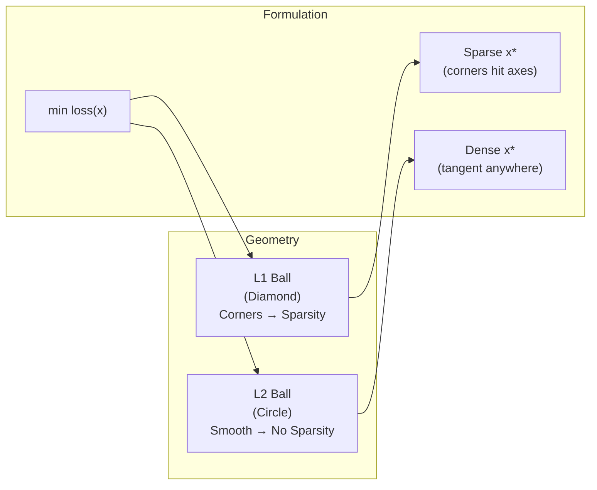

# 🔗 Regularization as Optimization

> [!abstract] TL;DR
> Regularization adds a penalty term to the empirical loss, converting an ill-posed problem into a well-posed one. Ridge (L2) shrinks all coefficients smoothly; LASSO (L1) produces exact zeros via soft thresholding, exploiting the geometry of the L1 ball's corners. Both arise naturally from Bayesian priors (Gaussian vs Laplace) and can be derived via Lagrangian duality.

## Intuition — analogy FIRST

Imagine fitting a curve through noisy data: without constraints, you draw an impossibly wiggly line. Regularization says "keep it simple" — Ridge pulls all knobs toward zero gently (like a spring on every parameter), while LASSO slams some knobs to exactly zero (like a hinge that locks when force exceeds a threshold). The geometry explains this: Ridge's L2 constraint region is a smooth ball, so the optimal solution grazes it anywhere; LASSO's L1 diamond has sharp corners on the axes, and optimal solutions snap to those corners — producing sparsity.

---

## How It Works



---

## Key Concepts / Details

### Ridge Regression (L2)

$$\min_{x} \|Ax - b\|_2^2 + \lambda\|x\|_2^2$$

**Closed-form solution**:
$$x^* = (A^\top A + \lambda I)^{-1} A^\top b$$

- Adds $\lambda I$ to $A^\top A$: makes every eigenvalue at least $\lambda$ → **always invertible**, even when $A^\top A$ is singular
- Stabilizes ill-conditioned systems: condition number $\kappa(A^\top A + \lambda I) \leq \kappa(A^\top A) / (1 + \lambda/\sigma_{\min}^2)$
- **No sparsity**: all coefficients shrunk toward 0, none set to exactly 0
- **Bayesian interpretation**: Gaussian prior $x \sim \mathcal{N}(0, \sigma_x^2 I)$ → MAP estimate is Ridge with $\lambda = \sigma^2 / \sigma_x^2$

### LASSO (L1)

$$\min_{x} \frac{1}{2n}\|Ax - b\|_2^2 + \lambda\|x\|_1$$

- **No closed form** (non-smooth); solved via coordinate descent, proximal gradient (ISTA/FISTA), or ADMM
- **Sparsity**: at optimum, many $x_j^* = 0$ exactly

**KKT conditions** at optimum:
$$\frac{1}{n}A_j^\top(Ax^* - b) = \lambda \cdot \text{sign}(x_j^*) \quad \text{for active } j \;(x_j^* \neq 0)$$
$$\left|\frac{1}{n}A_j^\top(Ax^* - b)\right| \leq \lambda \quad \text{for inactive } j \;(x_j^* = 0)$$

**Soft thresholding** (proximal operator of $\|\cdot\|_1$):
$$\text{prox}_{\lambda\|\cdot\|_1}(z)_j = \text{sign}(z_j)\max(|z_j| - \lambda, 0) \equiv S_\lambda(z_j)$$

**Bayesian interpretation**: Laplace prior $x_j \sim \text{Laplace}(0, 1/\lambda)$ → MAP estimate = LASSO.

### Elastic Net

$$\min_{x} \frac{1}{2n}\|Ax - b\|_2^2 + \lambda_1\|x\|_1 + \lambda_2\|x\|_2^2$$

Combines sparsity (L1) and grouping effect (L2 encourages correlated variables to be selected together).

**Coordinate descent update**:
$$x_j^* = \frac{S_{\lambda_1 \alpha}\!\left(\frac{1}{n}A_j^\top r_{-j}\right)}{\frac{1}{n}\|A_j\|_2^2 + 2\lambda_2 \alpha}$$

where $r_{-j} = b - A_{-j}x_{-j}^*$ is the partial residual.

### Basis Pursuit / Compressed Sensing

$$\min_{x} \|x\|_1 \quad \text{s.t.} \quad Ax = b$$

Recovers a sparse signal $x$ from underdetermined measurements $b = Ax$ (more unknowns than equations).

**Recovery guarantee (RIP)**: If $A$ satisfies the Restricted Isometry Property with constant $\delta_{2k} < \sqrt{2} - 1$, then basis pursuit recovers any $k$-sparse $x$ exactly.

**Relationship to LASSO**: Basis pursuit is the Lagrangian form of LASSO; as $\lambda \to 0$, LASSO solution → basis pursuit solution.

### Nuclear Norm Regularization

$$\min_{X} f(X) + \lambda\|X\|_*$$

where $\|X\|_* = \sum_i \sigma_i(X)$ (sum of singular values).

- Convex relaxation of $\text{rank}(X)$ (which is NP-hard to minimize)
- Proximal operator: **singular value soft thresholding** $X^* = U S_\lambda(\Sigma) V^\top$
- Applications: matrix completion (Netflix prize), robust PCA, phase retrieval

### Regularization Comparison

| Method | Penalty | Sparsity | Solution | Bayesian Prior |
|--------|---------|----------|----------|----------------|
| Ridge | $\lambda\|x\|_2^2$ | No | Closed form $(A^\top A+\lambda I)^{-1}A^\top b$ | Gaussian |
| LASSO | $\lambda\|x\|_1$ | Yes (exact zeros) | Coordinate descent / ISTA | Laplace |
| Elastic Net | $\lambda_1\|x\|_1 + \lambda_2\|x\|_2^2$ | Yes + grouping | Coordinate descent | — |
| Group LASSO | $\lambda\sum_g\|x_g\|_2$ | Group-level sparsity | Block coordinate descent | — |
| Nuclear norm | $\lambda\|X\|_*$ | Low-rank | SVD soft threshold | — |

### Total Variation

$$\text{TV}(x) = \|Dx\|_1 \quad \text{where } (Dx)_i = x_{i+1} - x_i$$

Promotes **piecewise-constant** solutions. Used in image denoising (ROF model):
$$\min_{x} \frac{1}{2}\|x - b\|_2^2 + \lambda\text{TV}(x)$$

```python
import numpy as np
from sklearn.linear_model import Ridge, Lasso, ElasticNet
from sklearn.model_selection import cross_val_score
import matplotlib.pyplot as plt

np.random.seed(42)
n, p = 100, 50
A = np.random.randn(n, p)
x_true = np.zeros(p)
x_true[:5] = np.array([3, -2, 1.5, -1, 2])  # sparse true signal
b = A @ x_true + 0.5 * np.random.randn(n)

# Ridge
ridge = Ridge(alpha=1.0)
ridge.fit(A, b)

# LASSO with cross-validation for lambda selection
lambdas = np.logspace(-3, 1, 50)
lasso_scores = [
    cross_val_score(Lasso(alpha=lam, max_iter=10000), A, b, cv=5, scoring='r2').mean()
    for lam in lambdas
]
best_lambda = lambdas[np.argmax(lasso_scores)]
lasso = Lasso(alpha=best_lambda, max_iter=10000)
lasso.fit(A, b)

# Elastic Net
enet = ElasticNet(alpha=0.5, l1_ratio=0.5, max_iter=10000)
enet.fit(A, b)

# Sparsity patterns
print(f"Ridge nonzero:       {np.sum(np.abs(ridge.coef_) > 1e-4)}/{p}")
print(f"LASSO nonzero:       {np.sum(np.abs(lasso.coef_) > 1e-4)}/{p}")
print(f"Elastic Net nonzero: {np.sum(np.abs(enet.coef_) > 1e-4)}/{p}")

# Regularization path: coefficient values vs log-lambda
fig, axes = plt.subplots(1, 2, figsize=(12, 4))
lasso_coefs = np.array([Lasso(alpha=lam, max_iter=5000).fit(A, b).coef_ for lam in lambdas])
for j in range(min(p, 10)):
    axes[0].plot(np.log10(lambdas), lasso_coefs[:, j])
axes[0].set_xlabel('log10(λ)'); axes[0].set_title('LASSO Regularization Path')
axes[1].bar(range(p), lasso.coef_, label='LASSO')
axes[1].bar(range(p), ridge.coef_, alpha=0.5, label='Ridge')
axes[1].set_title('Coefficient comparison'); axes[1].legend()
plt.tight_layout()
```

---

## Real-World Notes

- LASSO struggles with correlated predictors (randomly picks one); Elastic Net is preferred when features are correlated.
- Cross-validate $\lambda$ over a log-scale grid; `LassoCV` in sklearn does this efficiently via warm starting.
- Group LASSO is natural for one-hot encoded categorical variables — select or drop the entire group.
- Nuclear norm for matrix completion requires the matrix to be incoherent (information spread across rows/cols).

## Common Pitfalls

- **Standardize features before regularization**: penalizes large-coefficient variables otherwise; Ridge/LASSO are not scale-invariant.
- **LASSO path instability**: tiny perturbation to data can change which variables enter; use stability selection.
- **Confusing Lagrangian and constrained form**: $\min \text{loss} + \lambda\|x\|$ is equivalent to $\min \text{loss}$ s.t. $\|x\| \leq t$ via Lagrange duality, but $\lambda$ and $t$ have a nonlinear relationship.
- **Setting $\lambda$ too large**: all coefficients → 0; model underfits. Always tune on validation data.

## Related Concepts

- [[ML_Training_Optimization]] — weight decay as Ridge penalty in neural networks
- [[Portfolio_Optimization]] — cardinality constraints as L0 (relaxed to L1)
- Sec 04 (Duality) — KKT conditions for LASSO, Lagrangian relaxation
- Sec 03 (First-Order Methods) — ISTA/FISTA for solving LASSO

## Review Questions

1. Derive the closed-form solution for Ridge regression. Why does adding $\lambda I$ always guarantee invertibility?
2. Write the KKT conditions for LASSO and explain geometrically why they produce sparse solutions.
3. What is soft thresholding? Show it is the proximal operator of $\lambda\|\cdot\|_1$.
4. When would you prefer Elastic Net over LASSO? Give a concrete scenario.
5. How does nuclear norm regularization relate to rank minimization?

## Sources

- Boyd & Vandenberghe, *Convex Optimization*, Chapter 6 (approximation and fitting).
- Tibshirani, R. (1996). Regression Shrinkage and Selection via the Lasso. *JRSS-B*.
- Candès & Recht (2009). Exact Matrix Completion via Convex Optimization.
- Zou & Hastie (2005). Regularization and variable selection via the elastic net. *JRSS-B*.
- Hastie, Tibshirani, Wainwright. *Statistical Learning with Sparsity*.

#optimization #applications #intermediate
