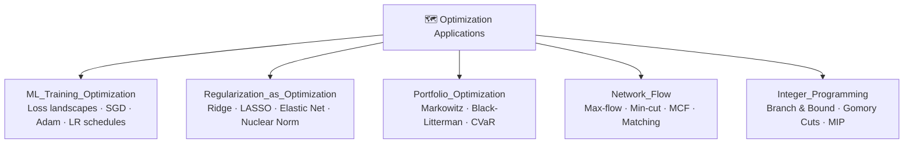

# 🗺️ MOC — Optimization Applications

> [!abstract] TL;DR
> Optimization theory becomes most powerful when applied to concrete problems. This section covers five major application domains: ML training (loss landscapes, second-order methods), regularization as convex optimization (LASSO, Ridge, elastic net), portfolio optimization (Markowitz, Black-Litterman, risk parity), network flow (max-flow min-cut, shortest path as LP, MCF), and integer programming (branch-and-bound, cutting planes, LP relaxations). Each application is a direct instantiation of theory from earlier sections.

## Intuition — analogy FIRST

Every field has its own vocabulary for the same idea: "minimize something subject to constraints." A machine learning engineer calls it training; a portfolio manager calls it allocation; a logistics planner calls it routing. This section rips off the field-specific costume and shows the common skeleton underneath — all of these are optimization programs with structure you can exploit.

---

## Section Map

---

## Learning Path

| Step | File | Prerequisite |
|------|------|--------------|
| 1 | `ML_Training_Optimization.md` | Gradient descent (Sec 02), Adam (Sec 03) |
| 2 | `Regularization_as_Optimization.md` | Convex opt (Sec 01), duality (Sec 04) |
| 3 | `Portfolio_Optimization.md` | QP (Sec 01), KKT (Sec 04) |
| 4 | `Network_Flow.md` | LP (Sec 01), duality (Sec 04) |
| 5 | `Integer_Programming.md` | LP (Sec 01), branch strategies |

---

## Notes Table

| Note | Core Problem | Key Algorithm | Difficulty |
|------|-------------|---------------|------------|
| `ML_Training_Optimization.md` | min (1/n)∑ℓ(fθ(xᵢ),yᵢ) | SGD, Adam, K-FAC | Intermediate |
| `Regularization_as_Optimization.md` | min loss + λ·penalty | Soft thresholding, ADMM | Intermediate |
| `Portfolio_Optimization.md` | min wᵀΣw s.t. μᵀw≥r | QP, Black-Litterman | Advanced |
| `Network_Flow.md` | min ∑wₑfₑ s.t. conservation | Ford-Fulkerson, Dijkstra | Intermediate |
| `Integer_Programming.md` | min cᵀx s.t. Ax≤b, x∈ℤ | Branch & Bound, Gomory | Advanced |

---

## Cross-Vault Links

- **AI-ML Vault**: `_MOC_AI_ML_Master.md` → Deep Learning training, batch norm, hyperparameter search
- **Quantitative Finance Vault**: `_MOC_QuantitativeFinance_Master.md` → Markowitz, CAPM, factor models
- **System Design Vault**: `_MOC_SystemDesign_Master.md` → Network routing, resource scheduling

---

## Key Questions for This Section

1. Why does SGD with large learning rate find flat minima? What does this imply about generalization?
2. Why does L1 regularization produce sparse solutions while L2 does not?
3. What is the Black-Litterman model and why does it outperform naive Markowitz in practice?
4. State the max-flow min-cut theorem. Why does it follow from LP duality?
5. When does LP relaxation of an integer program give an integer solution automatically?
6. What is the computational complexity of integer programming, and how do modern solvers handle large instances?

---

## Related Sections (This Vault)

| Section | Content |
|---------|---------|
| `01_Foundations/` | Convex sets, LP, QP, conic programs |
| `02_Unconstrained/` | Gradient descent, Newton's method, line search |
| `03_First_Order_Methods/` | SGD, Adam, proximal methods |
| `04_Duality/` | KKT conditions, LP duality, strong duality |
| `05_Constrained/` | Lagrangians, projected gradient, augmented Lagrangian |

---

## Review Questions

- [ ] Explain how batch normalization smoothens the loss landscape.
- [ ] Derive the KKT conditions for LASSO and interpret them geometrically.
- [ ] Compute the efficient frontier for a 3-asset portfolio by hand.
- [ ] Apply one iteration of Ford-Fulkerson to a small network.
- [ ] Show a branch-and-bound tree for a 2-variable ILP example.

## Sources

- Boyd & Vandenberghe, *Convex Optimization* — Chapters 6, 7 (applications)
- Goodfellow, Bengio, Courville — *Deep Learning*, Chapter 8 (optimization for DL)
- Markowitz, H. (1952). Portfolio Selection. *Journal of Finance*.
- Rockafellar & Uryasev (2000). Optimization of Conditional Value-at-Risk.
- Schrijver, A. — *Theory of Linear and Integer Programming*

#MOC #optimization #applications
