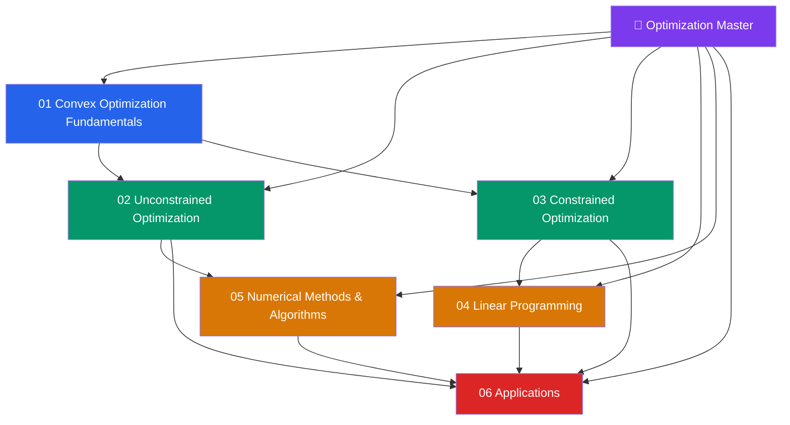

# 📐 Optimization — Master Map of Content

> [!abstract] About This Vault
> A rigorous Optimization reference: **37 notes across 6 sections**, covering the full arc from convex sets and functions through unconstrained gradient-based methods, constrained optimization with KKT theory, linear programming and the simplex method, modern numerical algorithms (SGD variants, proximal methods, coordinate descent), and real-world applications in machine learning, portfolio optimization, and network flow. Every note pairs an intuition-first analogy with precise mathematics, Mermaid diagrams, Python/numpy code examples, trade-off tables, and review questions. Designed for practitioners who need to formulate, analyze, and solve optimization problems across machine learning, operations research, finance, and engineering. Start at the section matching your goal, or follow one of the four learning paths below.

## Vault Architecture

## Sections at a Glance

| # | Section | Notes | Entry Point | Difficulty |
|---|---------|-------|-------------|------------|
| 01 | Convex Optimization Fundamentals | 5 | [[_MOC_Convex_Fundamentals]] | Beginner → Intermediate |
| 02 | Unconstrained Optimization | 5 | [[_MOC_Unconstrained]] | Intermediate |
| 03 | Constrained Optimization | 5 | [[_MOC_Constrained]] | Intermediate → Advanced |
| 04 | Linear Programming | 5 | [[_MOC_Linear_Programming]] | Intermediate |
| 05 | Numerical Methods & Algorithms | 5 | [[_MOC_Numerical_Methods]] | Intermediate → Advanced |
| 06 | Applications | 5 | [[_MOC_Opt_Applications]] | Advanced |

---

## Learning Paths

### Path 1 — Mathematical Foundations (Theory First)

> Best for: graduate students or researchers needing rigorous theoretical grounding before applying algorithms.

**Convex Fundamentals → Unconstrained → Constrained → LP**

[[_MOC_Convex_Fundamentals]] → [[Convex_Sets]] → [[Convex_Functions]] → [[Optimality_Conditions]] → [[Duality_Theory]] → [[_MOC_Unconstrained]] → [[Gradient_Descent]] → [[Newtons_Method]] → [[_MOC_Constrained]] → [[Lagrange_Multipliers]] → [[KKT_Conditions]] → [[_MOC_Linear_Programming]] → [[LP_Standard_Form]] → [[Simplex_Method]] → [[LP_Duality]]

---

### Path 2 — Machine Learning Practitioner

> Best for: ML engineers and data scientists who train models and tune optimizers.

**Gradient Descent → Numerical Algorithms → Convex Fundamentals → Applications**

[[Gradient_Descent]] → [[Line_Search]] → [[_MOC_Numerical_Methods]] → [[SGD_and_Variants]] → [[Adaptive_Methods]] → [[Proximal_Methods]] → [[_MOC_Convex_Fundamentals]] → [[Convex_Functions]] → [[Optimality_Conditions]] → [[_MOC_Opt_Applications]] → [[ML_Training_Optimization]] → [[Regularization_as_Optimization]]

---

### Path 3 — Operations Research / Engineer

> Best for: engineers and analysts formulating and solving real-world resource allocation and planning problems.

**LP → Constrained → Applications → Numerical Methods**

[[_MOC_Linear_Programming]] → [[LP_Standard_Form]] → [[Simplex_Method]] → [[LP_Duality]] → [[Interior_Point_Methods]] → [[_MOC_Constrained]] → [[KKT_Conditions]] → [[Penalty_Barrier_Methods]] → [[_MOC_Opt_Applications]] → [[Network_Flow]] → [[Integer_Programming]] → [[_MOC_Numerical_Methods]] → [[Coordinate_Descent]]

---

### Path 4 — Quantitative Finance / Portfolio Optimization

> Best for: quants applying Markowitz mean-variance, factor models, and risk-constrained allocation.

**Convex Fundamentals → Constrained → LP → Applications**

[[Convex_Functions]] → [[Duality_Theory]] → [[_MOC_Constrained]] → [[Lagrange_Multipliers]] → [[KKT_Conditions]] → [[_MOC_Linear_Programming]] → [[LP_Duality]] → [[_MOC_Opt_Applications]] → [[Portfolio_Optimization]] → [[Regularization_as_Optimization]]

---

## Cross-Vault Links

- **AI-ML vault** — [[_MOC_AI_ML_Master]] — Every neural network is trained via optimization; gradient descent, Adam, learning rate schedules, and regularization are the direct application of this vault's algorithms.
- **Quantitative Finance vault** — [[_MOC_QuantFinance_Master]] — Markowitz mean-variance portfolio construction, Black-Litterman, and risk-parity are constrained quadratic programs solved with the tools from Sections 03 and 06.
- **Signals and Systems vault** — [[_MOC_SS_Master]] — LQR control (state-space section) is a continuous-time quadratic optimization problem; the Riccati equation is its optimality condition.
- **Econometrics vault** — OLS and MLE are unconstrained optimization problems; LASSO/Ridge are regularized convex programs — the mathematical machinery is here.
- **Game Theory vault** — Nash equilibrium computation is a fixed-point / optimization problem; LP duality underlies the minimax theorem for zero-sum games.

---

## Section MOC Index

- [[_MOC_Convex_Fundamentals]] — Convex sets (intersection, affine hull, cone), convex functions (Jensen's inequality, first/second-order conditions, sublevel sets), quasi-convexity, and the fundamental theorems (supporting hyperplane, separating hyperplane) that underpin all of optimization theory.
- [[_MOC_Unconstrained]] — Gradient descent with convergence rates, Newton's method and quadratic convergence, quasi-Newton methods (BFGS/L-BFGS), line search strategies (Armijo/Wolfe conditions), and the trust-region alternative.
- [[_MOC_Constrained]] — Lagrange multipliers for equality constraints, KKT conditions for inequality constraints, constraint qualifications, Lagrangian duality, saddle-point theory, and numerical methods (penalty, barrier/interior point, augmented Lagrangian).
- [[_MOC_Linear_Programming]] — Standard form and geometry of LP, the simplex method (pivoting, degeneracy, Bland's rule), LP duality (strong duality theorem, complementary slackness), sensitivity analysis, and interior point methods (path-following).
- [[_MOC_Numerical_Methods]] — Stochastic gradient descent and its variants (momentum, AdaGrad, RMSProp, Adam), proximal gradient methods (ISTA/FISTA for L1 regularization), coordinate descent, conjugate gradient, and distributed/parallel optimization (ADMM).
- [[_MOC_Opt_Applications]] — Machine learning training (loss landscapes, batch normalization, second-order methods), regularization as optimization (LASSO, Ridge, elastic net), portfolio optimization (Markowitz mean-variance, risk-parity), network flow (max-flow min-cut, shortest path as LP), and integer programming (branch-and-bound, cutting planes).

#MOC #Optimization #MasterMOC
