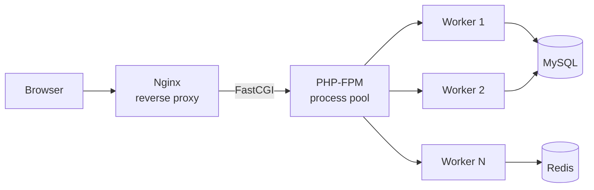

# PHP Overview

> [!abstract] TL;DR
> PHP is a mature, server-side scripting language powering ~77% of the web. PHP 8.x transformed it from a loose scripting language into a modern, type-safe backend platform with a JIT compiler, named arguments, match expressions, fibers, and a rich ecosystem centered on Composer and Laravel — making it a legitimate alternative to Python/Node.js for web APIs and full-stack apps.

---

## History and Evolution

PHP (Hypertext Preprocessor) was created by Rasmus Lerdorf in 1994 as a set of CGI scripts. Each major version brought dramatic improvements:

| Version | Year | Key Addition |
|---------|------|-------------|
| PHP 5   | 2004 | Full OOP model, SPL, PDO |
| PHP 7   | 2015 | 2x performance, scalar type declarations, null coalescing |
| PHP 7.4 | 2019 | Typed properties, arrow functions, preloading |
| PHP 8.0 | 2020 | JIT, named args, match, nullsafe `?->`, union types, attributes |
| PHP 8.1 | 2021 | Enums, fibers, readonly properties, intersection types |
| PHP 8.2 | 2022 | Readonly classes, `true`/`false`/`null` standalone types, DNF types |
| PHP 8.3 | 2023 | Typed class constants, `json_validate()`, `#[\Override]` attribute |

---

## Execution Model

### Server-Side vs CLI

PHP executes on the server and returns HTML/JSON to the client — the browser never sees PHP source. Two primary modes:

```
Browser → Nginx → PHP-FPM → PHP process → MySQL → PHP renders → HTML response
```

**PHP-FPM (FastCGI Process Manager)** is the standard production process manager:
- Maintains a pool of worker processes (no per-request boot cost)
- Communicates with Nginx/Apache via FastCGI socket
- Configurable `pm.max_children`, `pm.start_servers`, request timeouts

**CLI PHP** — used for Artisan commands, crons, queue workers, build scripts:
```bash
php artisan migrate
php -r "echo PHP_VERSION;"   # one-liner
php -a                        # interactive REPL
```

### PHP-FPM Architecture



---

## PHP 8.x Modern Features

### JIT Compiler (8.0)
The JIT (Just-in-Time) compiler compiles PHP opcodes to native machine code at runtime. It benefits CPU-intensive applications (image processing, math) more than typical web requests (which are I/O-bound).

```php
// php.ini — enable JIT
opcache.enable=1
opcache.jit_buffer_size=100M
opcache.jit=tracing   // tracing | function | off
```

### Named Arguments (8.0)
```php
// Old: positional, must match order
array_slice($array, 1, true, false);

// PHP 8.0+: named, order-independent, self-documenting
array_slice(array: $array, offset: 1, preserve_keys: false, length: true);

function makeUser(string $name, int $age = 18, bool $admin = false): array {
    return compact('name', 'age', 'admin');
}
makeUser(name: 'Alice', admin: true); // skip $age, set $admin
```

### Match Expression (8.0)
```php
// Old switch: loose comparison, fallthrough, verbose
switch ($status) {
    case 1: $label = 'active'; break;
    case 2: $label = 'inactive'; break;
    default: $label = 'unknown';
}

// PHP 8.0 match: strict ===, no fallthrough, expression (returns value)
$label = match($status) {
    1       => 'active',
    2, 3    => 'inactive',   // multiple arms
    default => 'unknown',    // required if not exhaustive
};
```

### Nullsafe Operator (8.0)
```php
// Old: nested null checks
$city = null;
if ($user !== null && $user->getAddress() !== null) {
    $city = $user->getAddress()->getCity();
}

// PHP 8.0: short-circuit on null, returns null without exception
$city = $user?->getAddress()?->getCity()?->getName();
```

---

## Composer — PHP's Package Manager

Composer is the definitive PHP package manager (analogous to npm/pip):

```bash
composer init                    # create composer.json interactively
composer require guzzlehttp/guzzle  # install + add to require
composer require --dev phpunit/phpunit  # dev dependency
composer install                 # install from composer.lock (CI/deploy)
composer update                  # update to latest allowed versions
composer dump-autoload           # regenerate classmap after adding files
```

**composer.json** structure:
```json
{
    "require": {
        "php": "^8.1",
        "laravel/framework": "^11.0"
    },
    "require-dev": {
        "phpunit/phpunit": "^10.0",
        "pestphp/pest": "^2.0"
    },
    "autoload": {
        "psr-4": { "App\\": "src/" }
    }
}
```

---

## php.ini Key Configuration

```ini
; Memory and execution
memory_limit = 256M
max_execution_time = 30
max_input_time = 60

; Error reporting (development)
error_reporting = E_ALL
display_errors = On
log_errors = On
error_log = /var/log/php/error.log

; File uploads
upload_max_filesize = 20M
post_max_size = 25M

; OPcache (production)
opcache.enable = 1
opcache.memory_consumption = 128
opcache.max_accelerated_files = 10000
```

---

## PHP vs Python/Node.js

| Aspect | PHP 8.x | Python (FastAPI) | Node.js (Express) |
|--------|---------|-----------------|-------------------|
| Primary use | Web/full-stack | APIs, ML serving | APIs, real-time |
| Async model | Sync (Swoole for async) | AsyncIO native | Event loop native |
| Typing | Gradual (declare strict) | Type hints (runtime optional) | TypeScript layer |
| Package mgr | Composer | pip/poetry | npm/yarn |
| Web framework | Laravel | FastAPI/Django | Express/NestJS |
| Performance | ~50k req/s (FPM) | ~30k req/s (uvicorn) | ~80k req/s |
| Learning curve | Low | Moderate | Low |
| Ecosystem maturity | Very high (30 years) | High | High |

---

## Common Pitfalls

- **Type juggling surprises** — PHP's loose comparison (`==`) causes `0 == "foo"` to be `true` in older PHP and `false` in PHP 8+ (breaking change). Always use `===` for strict comparison or `declare(strict_types=1)`.
- **Not using OPcache in production** — without OPcache, PHP re-parses every `.php` file on every request. Enable OPcache and set `validate_timestamps=0` in production.
- **Per-request state** — unlike Node.js, PHP-FPM worker processes die after each request by default (no persistent state). Use Redis/Memcached for shared state. Swoole and RoadRunner break this model with persistent workers.
- **Old PHP habits die hard** — avoid `mysql_*` functions (removed in PHP 7), `register_globals`, and `magic_quotes`. Use PDO, namespaces, and Composer autoloading.

---

## Review Questions

1. What is PHP-FPM and why is it preferred over the old Apache `mod_php` for production deployments?
2. PHP 8.0's JIT compiler does not speed up typical CRUD web applications — why? What type of PHP code does JIT actually accelerate?
3. How does `match` differ from `switch` in terms of comparison semantics and return value?
4. A PHP script running under FPM writes to a global variable. Will another concurrent request see that value? Explain the process model.

---

## Sources

- [PHP 8.x Migration Guides](https://www.php.net/manual/en/migration80.php)
- [PHP-FPM Configuration](https://www.php.net/manual/en/install.fpm.configuration.php)
- [Composer Documentation](https://getcomposer.org/doc/)
- [PHP: The Right Way](https://phptherightway.com/)

---

#PHP #Laravel
