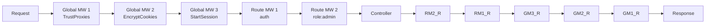

# Laravel Auth and Middleware

> [!abstract] TL;DR
> Laravel authentication is built around the `Auth` facade and guard system. Breeze and Jetstream scaffold the full auth UI in minutes. Middleware intercepts requests before they reach controllers — global middleware runs on every request, route middleware is opt-in. Laravel Sanctum handles both SPA cookie-based auth and stateless API token auth. Spatie Permission adds role/permission management.

---

## Authentication — Auth Facade

```php
use Illuminate\Support\Facades\Auth;

// Login
if (Auth::attempt(['email' => $email, 'password' => $password])) {
    // Session-based login (web guard)
    $request->session()->regenerate();
    return redirect()->intended('/dashboard');
}

// Remember me
Auth::attempt(['email' => $email, 'password' => $password], remember: true);

// Manual login (without password check)
Auth::login($user);
Auth::loginUsingId(1);

// Logout
Auth::logout();
$request->session()->invalidate();
$request->session()->regenerateToken();

// Check / get user
Auth::check();          // bool
Auth::guest();          // opposite of check()
Auth::user();           // authenticated User model or null
Auth::id();             // user ID or null

// In Blade
@auth   {{ auth()->user()->name }} @endauth
@guest  <a href="/login">Login</a> @endguest
```

---

## Starter Kits

```bash
# Laravel Breeze — minimal auth (login, register, password reset)
composer require laravel/breeze --dev
php artisan breeze:install blade    # Blade views
php artisan breeze:install react    # Inertia + React
php artisan breeze:install vue      # Inertia + Vue
php artisan migrate
npm install && npm run dev

# Laravel Jetstream — full-featured (2FA, teams, API tokens, profile photos)
composer require laravel/jetstream
php artisan jetstream:install livewire  # or: --stack=inertia
php artisan migrate
```

---

## Middleware

Middleware is a chain of inspectors that wrap every HTTP request:



### Custom Middleware

```php
// Create middleware
php artisan make:middleware EnsureApiVersion

// app/Http/Middleware/EnsureApiVersion.php
namespace App\Http\Middleware;

use Closure;
use Illuminate\Http\Request;
use Symfony\Component\HttpFoundation\Response;

class EnsureApiVersion {
    public function handle(Request $request, Closure $next): Response {
        $version = $request->header('API-Version', '1');

        if (!in_array($version, ['1', '2'])) {
            return response()->json(['error' => 'Unsupported API version'], 400);
        }

        // Add data to request for downstream use
        $request->merge(['api_version' => (int) $version]);

        $response = $next($request);  // call the next middleware / controller

        // Post-processing: modify response
        $response->headers->set('X-API-Version', $version);

        return $response;
    }
}
```

### Registering Middleware

```php
// bootstrap/app.php (Laravel 11+)
->withMiddleware(function (Middleware $middleware) {
    // Global middleware — runs on every request
    $middleware->append(\App\Http\Middleware\LogRequests::class);

    // Middleware aliases — use short name in routes
    $middleware->alias([
        'role'     => \App\Http\Middleware\CheckRole::class,
        'api.ver'  => \App\Http\Middleware\EnsureApiVersion::class,
    ]);

    // Middleware groups
    $middleware->group('api', [
        \Illuminate\Routing\Middleware\ThrottleRequests::class.':api',
        \Illuminate\Routing\Middleware\SubstituteBindings::class,
    ]);
})
```

### Applying to Routes

```php
// Single middleware
Route::get('/admin', [AdminController::class, 'index'])->middleware('auth');

// Multiple middleware
Route::post('/posts', [PostController::class, 'store'])
    ->middleware(['auth', 'verified', 'throttle:60,1']);

// Middleware with parameters
Route::get('/admin', AdminController::class)
    ->middleware('role:admin,super-admin');

// Group
Route::middleware(['auth', 'verified'])->group(function () {
    Route::get('/dashboard', DashboardController::class);
    Route::resource('posts', PostController::class);
});
```

---

## CSRF Protection

Laravel automatically generates and validates CSRF tokens for all `POST`, `PUT`, `PATCH`, `DELETE` web routes:

```blade
{{-- Include in every HTML form --}}
<form method="POST" action="/posts">
    @csrf
    {{-- Renders: <input type="hidden" name="_token" value="..."> --}}
    ...
</form>

{{-- Method spoofing for PUT/PATCH/DELETE in HTML forms (forms only support GET/POST) --}}
<form method="POST" action="/posts/{{ $post->id }}">
    @csrf
    @method('PUT')
    ...
</form>
```

```php
// Exclude routes from CSRF (e.g., Stripe webhooks)
// bootstrap/app.php
->withMiddleware(function (Middleware $middleware) {
    $middleware->validateCsrfTokens(except: [
        'stripe/webhook',
        'api/*',
    ]);
})
```

---

## Laravel Sanctum

Sanctum provides two auth systems in one package:

### 1. SPA Cookie Authentication (Stateful)

```bash
composer require laravel/sanctum
php artisan vendor:publish --provider="Laravel\Sanctum\SanctumServiceProvider"
php artisan migrate
```

```php
// routes/api.php — protect with sanctum middleware
Route::middleware('auth:sanctum')->group(function () {
    Route::get('/user', fn(Request $r) => $r->user());
    Route::apiResource('posts', PostController::class);
});
```

SPA login flow:
```
1. GET /sanctum/csrf-cookie  → sets XSRF-TOKEN cookie
2. POST /login               → sets session cookie
3. GET /api/user             → authenticated via session (stateful)
```

### 2. API Token Authentication (Stateless)

```php
// User model — add HasApiTokens trait
use Laravel\Sanctum\HasApiTokens;
class User extends Model { use HasApiTokens, ... }

// Issue a token
$token = $user->createToken('mobile-app', ['read', 'write'])->plainTextToken;
// Store $token securely — it's shown only once

// Revoke
$user->tokens()->delete();           // all tokens
$request->user()->currentAccessToken()->delete();  // current token

// Protected routes
Route::middleware('auth:sanctum')->get('/orders', fn(Request $r) => $r->user()->orders);

// Client sends token
// Authorization: Bearer <token>
```

---

## Role and Permission with Spatie

```bash
composer require spatie/laravel-permission
php artisan vendor:publish --provider="Spatie\Permission\PermissionServiceProvider"
php artisan migrate
```

```php
// Setup in User model
use Spatie\Permission\Traits\HasRoles;
class User extends Model { use HasRoles; }

// Assign roles/permissions
$user->assignRole('editor');
$user->givePermissionTo('edit articles');

// Check
$user->hasRole('editor');
$user->can('edit articles');
$user->hasAnyRole(['admin', 'editor']);

// Middleware
Route::middleware(['auth', 'role:admin'])->group(fn() => []);
Route::middleware(['auth', 'permission:edit articles'])->group(fn() => []);

// Blade directives
@role('admin') <a href="/admin">Admin</a> @endrole
@can('edit articles') <a href="/edit">Edit</a> @endcan
```

---

## Form Request Validation

```php
php artisan make:request StorePostRequest

// app/Http/Requests/StorePostRequest.php
class StorePostRequest extends FormRequest {
    public function authorize(): bool {
        // Return true to allow all authenticated users,
        // or check specific authorization:
        return $this->user()->can('create', Post::class);
    }

    public function rules(): array {
        return [
            'title'      => 'required|string|min:3|max:255',
            'body'       => 'required|string|min:50',
            'tags'       => 'array|max:5',
            'tags.*'     => 'string|exists:tags,name',  // validate each tag
            'published'  => 'boolean',
            'image'      => 'nullable|image|mimes:jpg,png,webp|max:2048',
        ];
    }

    public function messages(): array {
        return [
            'title.required' => 'A post must have a title.',
            'body.min'       => 'Post body must be at least :min characters.',
        ];
    }
}

// Controller — just type-hint the request
public function store(StorePostRequest $request): JsonResponse {
    // Runs authorize() + rules() before this method is called
    // If invalid: returns 422 with errors automatically
    $post = Post::create($request->validated());
    return response()->json($post, 201);
}
```

---

## Common Pitfalls

- **`Auth::user()` returns null in constructor** — the authentication guard is not resolved during controller construction. Access `Auth::user()` in method bodies, not in `__construct()`.
- **Sanctum stateful vs stateless confusion** — for SPAs served from the same domain, use cookie-based stateful auth (CSRF cookie flow). For mobile apps and third-party clients, use API tokens. Never mix both for the same client.
- **CSRF token mismatch after session expiry** — if a user's session expires while they have a form open, the next submit throws `TokenMismatchException` (419). Handle with a redirect back with an error message.
- **Sanctum token not scoped** — `$user->createToken('app')` creates a token with all abilities by default. Always scope tokens: `createToken('app', ['read'])` and check `$request->user()->tokenCan('write')` in controllers.

---

## Review Questions

1. What is the difference between session-based auth (web guard) and token-based auth (Sanctum API tokens)?
2. How does Laravel's CSRF protection work? What specific HTTP methods does it validate?
3. Middleware has a `before` and `after` section relative to `$next($request)`. Give a real-world example of logic you'd place in each.
4. What does `FormRequest::authorize()` do? What happens if it returns `false`?

---

## Sources

- [Laravel Documentation: Authentication](https://laravel.com/docs/11.x/authentication)
- [Laravel Documentation: Middleware](https://laravel.com/docs/11.x/middleware)
- [Laravel Sanctum Documentation](https://laravel.com/docs/11.x/sanctum)
- [Spatie Laravel Permission](https://spatie.be/docs/laravel-permission/)

---

#PHP #Laravel
