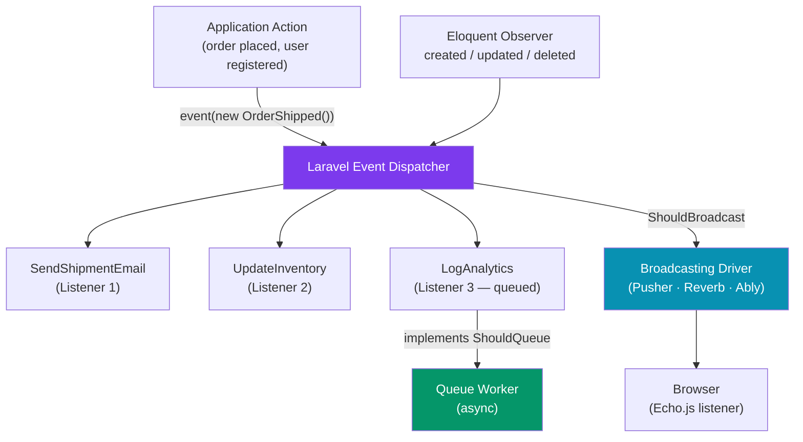

# Laravel Events and Listeners

> [!abstract] TL;DR
> Laravel's event system implements the Observer pattern: **Events** are plain PHP classes that describe something that happened; **Listeners** react to those events asynchronously or synchronously. Events are dispatched with `event(new OrderShipped($order))` and automatically routed to all registered listeners. **Observers** attach multiple event callbacks to an Eloquent model in one class. **Broadcasting** (via Pusher, Ably, or Laravel Reverb) pushes events to the browser over WebSockets for real-time UIs. **Event subscribers** group multiple event → listener registrations in a single class.

---

## Intuition — analogy first

Events are like a public announcement over a building's PA system: "Order #42 has shipped!" Every department that cares (shipping tracking, email team, analytics) listens independently without the announcer knowing who is listening. The announcer (the code that dispatches the event) is decoupled from the responders (Listeners). Broadcasting extends this: the PA system now reaches customers' phones (the browser) in real time via WebSockets.

---

## How It Works



---

## Defining and Dispatching Events

```bash
# Generate event + listener scaffold
php artisan make:event OrderShipped
php artisan make:listener SendShipmentNotification --event=OrderShipped
```

```php
// app/Events/OrderShipped.php
namespace App\Events;

use App\Models\Order;
use Illuminate\Broadcasting\InteractsWithSockets;
use Illuminate\Foundation\Events\Dispatchable;
use Illuminate\Queue\SerializesModels;

class OrderShipped
{
    use Dispatchable, InteractsWithSockets, SerializesModels;
    // SerializesModels ensures Eloquent models are serialized/deserialized correctly
    // across queue boundaries (stores model ID, refetches on deserialization)

    public function __construct(
        public readonly Order $order,
        public readonly string $carrier,
    ) {
    }
}
```

```php
// Dispatch the event
use App\Events\OrderShipped;

// Option 1 — helper function
event(new OrderShipped($order, 'FedEx'));

// Option 2 — static method (via Dispatchable trait)
OrderShipped::dispatch($order, 'FedEx');

// Option 3 — conditionally
OrderShipped::dispatchIf($order->isEligibleForShipping(), $order, 'UPS');

// Option 4 — in controller
class OrderController extends Controller
{
    public function ship(Order $order): RedirectResponse
    {
        // Ship the order...
        event(new OrderShipped($order, 'FedEx'));
        return back()->with('status', 'Order shipped!');
    }
}
```

---

## Listeners

```php
// app/Listeners/SendShipmentNotification.php
namespace App\Listeners;

use App\Events\OrderShipped;
use App\Notifications\OrderShippedNotification;
use Illuminate\Contracts\Queue\ShouldQueue;
use Illuminate\Queue\InteractsWithQueue;

// Implement ShouldQueue to process async via queue worker
class SendShipmentNotification implements ShouldQueue
{
    use InteractsWithQueue;

    public string $queue = 'notifications'; // specific queue name
    public int $delay = 30;                  // delay in seconds before processing
    public int $tries = 3;                   // retry on failure
    public int $timeout = 60;               // seconds

    public function handle(OrderShipped $event): void
    {
        $event->order->user->notify(
            new OrderShippedNotification($event->order, $event->carrier)
        );
    }

    // Called when all retries are exhausted
    public function failed(OrderShipped $event, \Throwable $exception): void
    {
        Log::error('Failed to send shipment notification', [
            'order_id' => $event->order->id,
            'error'    => $exception->getMessage(),
        ]);
    }

    // Conditional queuing — don't queue if order is internal
    public function shouldQueue(OrderShipped $event): bool
    {
        return !$event->order->isInternal();
    }
}
```

### Registering Events and Listeners

```php
// app/Providers/EventServiceProvider.php
protected $listen = [
    OrderShipped::class => [
        SendShipmentNotification::class,
        UpdateInventoryRecord::class,
        LogShipmentAnalytics::class,
    ],
    UserRegistered::class => [
        SendWelcomeEmail::class,
        CreateUserProfile::class,
    ],
];

// OR use auto-discovery (Laravel 11+) — scans app/Listeners automatically
// In app/Providers/AppServiceProvider.php boot():
Event::discover(app_path('Listeners'));
```

---

## Eloquent Observers

Observers group event callbacks for a single model in one class:

```bash
php artisan make:observer UserObserver --model=User
```

```php
// app/Observers/UserObserver.php
namespace App\Observers;

use App\Models\User;

class UserObserver
{
    public function created(User $user): void
    {
        // Auto-create a default profile
        $user->profile()->create(['bio' => '', 'avatar' => null]);
        // Send welcome email
        Mail::to($user)->send(new WelcomeMail($user));
    }

    public function updated(User $user): void
    {
        if ($user->wasChanged('email')) {
            // Email changed — require re-verification
            $user->email_verified_at = null;
            $user->saveQuietly(); // save without triggering further observer events
        }
    }

    public function deleted(User $user): void
    {
        // Clean up related data
        $user->apiTokens()->delete();
        Cache::forget("user:{$user->id}:permissions");
    }

    public function restored(User $user): void { /* soft delete restored */ }
    public function forceDeleted(User $user): void { /* permanent delete */ }
}
```

```php
// Register in AppServiceProvider::boot()
User::observe(UserObserver::class);

// Or in the model using Attributes (Laravel 10+)
use Illuminate\Database\Eloquent\Attributes\ObservedBy;

#[ObservedBy([UserObserver::class])]
class User extends Authenticatable { ... }
```

---

## Broadcasting — Real-Time WebSockets

```bash
# Install Laravel Reverb (self-hosted WebSocket server, Laravel 11+)
php artisan install:broadcasting  # sets up Reverb, Echo
php artisan reverb:start          # start the WebSocket server

# Or use Pusher (hosted service)
composer require pusher/pusher-php-server
```

```php
// Event must implement ShouldBroadcast
use Illuminate\Contracts\Broadcasting\ShouldBroadcast;
use Illuminate\Broadcasting\PresenceChannel;
use Illuminate\Broadcasting\PrivateChannel;

class OrderStatusUpdated implements ShouldBroadcast
{
    use Dispatchable, InteractsWithSockets, SerializesModels;

    public function __construct(
        public readonly Order $order,
        public readonly string $status,
    ) {
    }

    // Which channels to broadcast on
    public function broadcastOn(): array
    {
        return [
            new PrivateChannel("orders.{$this->order->id}"), // authenticated users only
        ];
    }

    // Customize the event name sent to the browser
    public function broadcastAs(): string
    {
        return 'order.status.updated';
    }

    // Customize the data payload
    public function broadcastWith(): array
    {
        return [
            'status'     => $this->status,
            'updated_at' => now()->toISOString(),
        ];
    }

    // Only broadcast if the change is significant
    public function broadcastWhen(): bool
    {
        return in_array($this->status, ['shipped', 'delivered', 'cancelled']);
    }
}
```

```javascript
// Frontend — Laravel Echo (resources/js/bootstrap.js)
import Echo from 'laravel-echo';
import Pusher from 'pusher-js';

window.Echo = new Echo({
    broadcaster: 'reverb',  // or 'pusher'
    key: import.meta.env.VITE_REVERB_APP_KEY,
    wsHost: import.meta.env.VITE_REVERB_HOST,
    wsPort: import.meta.env.VITE_REVERB_PORT,
    forceTLS: false,
});

// Listen on a private channel
Echo.private(`orders.${orderId}`)
    .listen('.order.status.updated', (event) => {
        console.log('Status updated:', event.status);
        updateOrderUI(event);
    });
```

---

## Event Subscribers

Group multiple event → listener registrations in one class:

```php
// app/Listeners/UserEventSubscriber.php
class UserEventSubscriber
{
    public function handleUserLogin(Login $event): void
    {
        Log::info("User logged in: {$event->user->email}");
    }

    public function handleUserLogout(Logout $event): void
    {
        Cache::forget("user:{$event->user->id}:session_data");
    }

    public function handleUserRegistered(Registered $event): void
    {
        $event->user->sendEmailVerificationNotification();
    }

    public function subscribe(Dispatcher $events): array
    {
        return [
            Login::class      => 'handleUserLogin',
            Logout::class     => 'handleUserLogout',
            Registered::class => 'handleUserRegistered',
        ];
    }
}

// Register subscriber
protected $subscribe = [UserEventSubscriber::class];
```

---

## Trade-offs

| Approach | Decoupling | Debugging | Async | Use Case |
|----------|-----------|-----------|-------|----------|
| Direct method calls | None | Easy | No | Simple, one-to-one |
| Events + Listeners | High | Moderate | Optional | One-to-many, decoupled |
| Queued Listeners | High | Hard | Yes | Heavy operations (email, search index) |
| Observers | Medium | Easy | No | Model lifecycle side effects |
| Broadcasting | High | Moderate | Yes | Real-time browser updates |

---

## Common Pitfalls

- **Forgetting `SerializesModels` on broadcast events** — without this trait, Eloquent models are fully serialized (large payload). The trait serializes only the model key and refetches on the queue worker side.
- **Circular event chains** — an Observer's `updated()` calling `$model->save()` triggers another `updated` event. Use `$model->saveQuietly()` to skip observer events when needed.
- **Queued listener not retrying on failure** — without `public int $tries`, failed queued listeners retry only once. Set `$tries` and implement `failed()` to handle exhausted retries.
- **Broadcasting to public channels for sensitive data** — use `PrivateChannel` (authenticated) or `PresenceChannel` (authenticated + see who is connected) for sensitive data. `Channel` (public) sends to anyone.
- **Dispatching events in database transactions** — if you dispatch an event inside a transaction and the transaction rolls back, the queued listener may still run. Use `DB::afterCommit()` or the `$afterCommit = true` property on the listener.

---

## Review Questions

1. What is the difference between an Event and a Listener in Laravel? Why is this separation useful?
2. What does implementing `ShouldQueue` on a Listener do? What happens if the listener fails?
3. When should you use an Eloquent Observer vs. a regular Event + Listener? What is the key difference?
4. What are the three channel types for broadcasting (`Channel`, `PrivateChannel`, `PresenceChannel`)? When is each appropriate?
5. You dispatch a `UserDeleted` event inside a database transaction, and the transaction rolls back. The queued listener has already started running. How would you prevent this?

---

## Sources

- [Laravel Events and Listeners](https://laravel.com/docs/11.x/events)
- [Laravel Broadcasting](https://laravel.com/docs/11.x/broadcasting)
- [Laravel Reverb](https://laravel.com/docs/11.x/reverb)
- [Laravel Observers](https://laravel.com/docs/11.x/eloquent#observers)

---

#PHP #Laravel #events #listeners #broadcasting #observer #websockets
