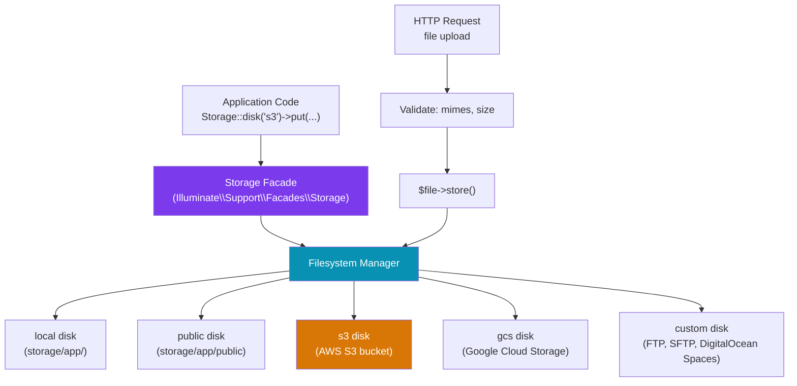

# Laravel File Storage

> [!abstract] TL;DR
> Laravel's `Storage` facade provides a uniform API for the local filesystem, S3, Google Cloud Storage, and other Flysystem-backed drivers. Files are read/written with `Storage::disk('s3')->put()`, `get()`, `delete()`. File uploads from `Request` use `$request->file('avatar')->store()`. **Signed URLs** generate time-limited access URLs for private files. Streaming large files avoids memory exhaustion. Environment-specific disks (local in dev, S3 in prod) are configured in `config/filesystems.php`.

---

## Intuition — analogy first

Think of the `Storage` facade as a universal remote control for different storage "appliances" (local disk, S3 bucket, GCS bucket). The remote's buttons (`put`, `get`, `delete`, `url`) always work the same way regardless of which appliance is plugged in. Swapping from local to S3 is like plugging a different appliance into the same remote — your code doesn't change. Signed URLs are like a one-time passcode: a security guard checks it at the door and it expires after a set time.

---

## How It Works



---

## Configuration

```php
// config/filesystems.php
'default' => env('FILESYSTEM_DISK', 'local'),

'disks' => [
    'local' => [
        'driver' => 'local',
        'root'   => storage_path('app/private'), // not web-accessible
        'throw'  => false,
    ],

    'public' => [
        'driver'     => 'local',
        'root'       => storage_path('app/public'),
        'url'        => env('APP_URL') . '/storage',
        'visibility' => 'public',
    ],

    's3' => [
        'driver'   => 's3',
        'key'      => env('AWS_ACCESS_KEY_ID'),
        'secret'   => env('AWS_SECRET_ACCESS_KEY'),
        'region'   => env('AWS_DEFAULT_REGION'),
        'bucket'   => env('AWS_BUCKET'),
        'url'      => env('AWS_URL'),         // optional CDN URL
        'endpoint' => env('AWS_ENDPOINT'),    // optional: DigitalOcean Spaces, MinIO
        'use_path_style_endpoint' => env('AWS_USE_PATH_STYLE_ENDPOINT', false),
    ],

    'gcs' => [
        'driver'          => 'gcs',
        'key_file_path'   => env('GOOGLE_CLOUD_KEY_FILE'),
        'project_id'      => env('GOOGLE_CLOUD_PROJECT_ID'),
        'bucket'          => env('GOOGLE_CLOUD_STORAGE_BUCKET'),
    ],
],
```

```bash
# Install S3 driver
composer require league/flysystem-aws-s3-v3

# Install GCS driver
composer require league/flysystem-google-cloud-storage

# Create the symbolic link for public disk
php artisan storage:link
# Creates: public/storage → storage/app/public
```

---

## Basic Storage Operations

```php
use Illuminate\Support\Facades\Storage;

// ── Write ──────────────────────────────────────────────────
Storage::put('reports/2026/annual.pdf', $pdfContent);
Storage::put('data/config.json', json_encode($config));

// With visibility
Storage::put('avatars/user-123.jpg', $imageData, 'public');  // public S3 object
Storage::put('documents/private.pdf', $data, 'private');     // private (default)

// Append to file
Storage::append('logs/events.log', "Event occurred: " . now()->toISOString());
Storage::prepend('queue.txt', 'First line');

// ── Read ───────────────────────────────────────────────────
$content = Storage::get('reports/2026/annual.pdf');
$exists  = Storage::exists('reports/2026/annual.pdf');
$size    = Storage::size('avatars/user-123.jpg');      // bytes
$time    = Storage::lastModified('data/config.json');  // Unix timestamp
$mime    = Storage::mimeType('uploads/document.docx');

// ── List ───────────────────────────────────────────────────
$files = Storage::files('reports/2026');        // files in directory
$all   = Storage::allFiles('reports');           // recursive
$dirs  = Storage::directories('reports');
$allDirs = Storage::allDirectories('reports');

// ── Delete ─────────────────────────────────────────────────
Storage::delete('temp/old-report.pdf');
Storage::delete(['temp/file1.txt', 'temp/file2.txt']);  // multiple
Storage::deleteDirectory('temp');

// ── Copy / Move ────────────────────────────────────────────
Storage::copy('reports/draft.pdf', 'reports/final.pdf');
Storage::move('temp/upload.jpg', 'avatars/user-123.jpg');

// ── Multiple disks ─────────────────────────────────────────
Storage::disk('s3')->put('backups/db.sql.gz', $backup);
Storage::disk('local')->get('private/key.pem');
```

---

## File Uploads from HTTP Requests

```php
// Controller
class AvatarController extends Controller
{
    public function store(Request $request): JsonResponse
    {
        $request->validate([
            'avatar' => [
                'required',
                'file',
                'image',                    // jpg, png, gif, bmp, webp, svg
                'mimes:jpg,jpeg,png,webp',
                'max:2048',                 // kilobytes (2MB)
                'dimensions:min_width=100,min_height=100,max_width=2000,max_height=2000',
            ],
        ]);

        $file = $request->file('avatar');

        // Store with auto-generated filename (UUID-based)
        $path = $file->store('avatars', 's3');        // returns: avatars/abc123.jpg
        // $path = $file->storePublicly('avatars', 's3');  // public visibility

        // Store with original filename
        $path = $file->storeAs(
            'avatars',
            "user-{$request->user()->id}.{$file->extension()}",
            's3',
        );

        // Update user record
        $request->user()->update(['avatar_path' => $path]);

        return response()->json([
            'url' => Storage::disk('s3')->url($path),
        ]);
    }
}
```

---

## URLs and Signed URLs

```php
// Public file URL (bucket must be configured as public or file visibility=public)
$url = Storage::url('avatars/user-123.jpg');  // https://cdn.example.com/avatars/user-123.jpg

// Temporary signed URL — private file, time-limited access
$signedUrl = Storage::disk('s3')->temporaryUrl(
    'documents/private-contract.pdf',
    now()->addMinutes(30),  // expires in 30 minutes
    ['ResponseContentDisposition' => 'attachment; filename="contract.pdf"'],
);

// Local disk signed URLs (for non-S3 disks)
// Use route-based signing:
Route::get('/files/{path}', [FileController::class, 'serve'])
    ->name('files.serve')
    ->middleware('signed');

$url = URL::temporarySignedRoute(
    'files.serve',
    now()->addHours(1),
    ['path' => 'documents/private.pdf'],
);

// In FileController::serve():
public function serve(Request $request, string $path): StreamedResponse
{
    abort_unless($request->hasValidSignature(), 403);
    abort_unless(Storage::exists($path), 404);
    return Storage::response($path);  // sets correct Content-Type and streams
}
```

---

## Streaming Large Files

```php
// Download — stream to browser without loading into memory
return Storage::disk('s3')->download('exports/large-export.csv', 'export.csv');

// Stream response — for video/audio
return Storage::disk('s3')->response('videos/webinar.mp4');

// Custom streamed response with headers
return response()->streamDownload(function () {
    echo Storage::disk('s3')->get('reports/giant-report.pdf');
}, 'annual-report.pdf', [
    'Content-Type'        => 'application/pdf',
    'Content-Disposition' => 'attachment; filename="annual-report.pdf"',
]);

// For very large files — chunk reading
Storage::disk('s3')->readStream('exports/10gb-dump.sql.gz');
// Returns a PHP stream resource for piped streaming
```

---

## Trade-offs

| Disk | Cost | Scalability | Durability | CDN Integration |
|------|------|-------------|------------|-----------------|
| local | Free (server disk) | Single server only | Low (server storage) | No |
| public | Free (server disk) | Single server only | Low | Via nginx/Apache |
| s3 | Pay-per-use | Infinite | 99.999999999% | CloudFront |
| GCS | Pay-per-use | Infinite | 99.999999999% | Cloud CDN |
| DigitalOcean Spaces | Flat-rate | High | High | Built-in CDN |

---

## Common Pitfalls

- **Forgetting `php artisan storage:link`** — the `public` disk files won't be web-accessible without the symbolic link from `public/storage` to `storage/app/public`. This must be run on each server.
- **Storing uploaded files with original user filenames** — user filenames can contain path traversal characters (`../`), spaces, or non-UTF8 characters. Always generate a safe filename with `Str::uuid()` or let `store()` auto-generate one.
- **Using S3 public ACLs when bucket blocks public access** — AWS S3 now blocks public ACLs by default at the bucket level. Use presigned URLs for private file access or enable public access at the bucket level explicitly.
- **Loading large files into memory with `Storage::get()`** — for files > a few MB, `Storage::get()` loads the entire file into PHP's memory. Use `readStream()` or `download()` for large files.
- **Not validating file MIME type** — `mimes` validation checks the file extension, not the content. Use `mimetypes` to validate the actual MIME type detected from the file binary.

---

## Review Questions

1. What is the difference between the `local` and `public` disk in Laravel? What command makes public disk files accessible from the browser?
2. How do temporary signed URLs work for S3 files? When would you use a temporary URL instead of a permanent public URL?
3. What is the risk of using `storeAs($dir, $request->file('photo')->getClientOriginalName())`?
4. A user uploads a 2GB CSV file for import. Why should you not use `Storage::get()` to read it? What should you use instead?
5. How would you configure Laravel to use S3 in production but local disk in development without changing application code?

---

## Sources

- [Laravel File Storage](https://laravel.com/docs/11.x/filesystem)
- [Flysystem](https://flysystem.thephpleague.com/)
- [AWS S3 pre-signed URLs](https://docs.aws.amazon.com/AmazonS3/latest/userguide/PresignedUrlUploadObject.html)

---

#PHP #Laravel #file-storage #s3 #file-uploads #signed-urls
