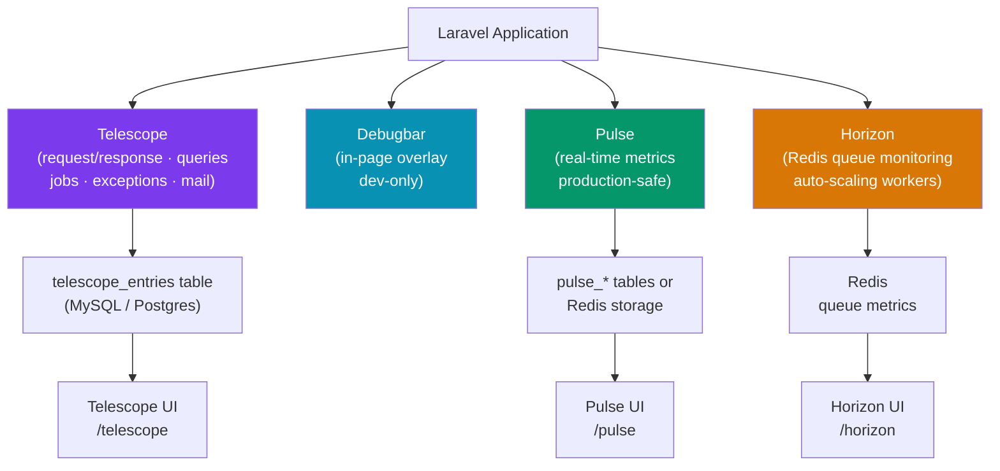

# Laravel Monitoring

> [!abstract] TL;DR
> Laravel's monitoring ecosystem covers four layers: **Telescope** (per-request debugging — queries, jobs, emails, exceptions; dev/staging only), **Debugbar** (lightweight in-page profiling overlay during development), **Pulse** (real-time application health dashboard — server metrics, slow queries, exceptions, queues; production-safe), and **Horizon** (queue monitoring and auto-scaling dashboard for Redis queues). Combined, they cover development debugging, production observability, and queue operations. Health check endpoints integrate with uptime monitors and Kubernetes liveness probes.

---

## Intuition — analogy first

Think of monitoring tools as a hospital's diagnostic system. Debugbar is the bedside vital-signs monitor — instant, local, only useful when you're right there. Telescope is the full diagnostic workup: every blood test, X-ray, and prescription logged in the chart — comprehensive but only practical in a clinical setting (dev/staging). Pulse is the hospital's operations dashboard: overall patient count, ER wait times, staff load — for administrators, not individual patients. Horizon is the hospital's scheduling board for the queue workers: which nurses are busy, which have too many patients, which need backup.

---

## How It Works



---

## Laravel Telescope

Telescope provides a beautiful debug assistant for local and staging environments. It records everything: requests, queries, jobs, mail, notifications, cache hits/misses, exceptions, and more.

```bash
composer require laravel/telescope --dev  # dev-only
php artisan telescope:install
php artisan migrate
```

```php
// config/telescope.php — restrict access
'middleware' => ['web', Authorize::class],

// TelescopeServiceProvider — limit to local env or specific users
class TelescopeServiceProvider extends ServiceProvider
{
    public function boot(): void
    {
        $this->hideSensitiveRequestDetails();

        Telescope::filter(function (IncomingEntry $entry) {
            // In staging: record only slow requests and errors
            if ($this->app->environment('staging')) {
                return $entry->isReportableException()
                    || $entry->isFailedRequest()
                    || $entry->isSlowQuery()     // > 100ms by default
                    || $entry->hasMonitoredTag();
            }
            return true; // in local: record everything
        });
    }

    protected function gate(): void
    {
        Gate::define('viewTelescope', function ($user) {
            return in_array($user->email, [
                'admin@example.com',
                'dev@example.com',
            ]);
        });
    }
}
```

```bash
# Prune old entries (add to scheduler)
php artisan telescope:prune --hours=48

# Access the dashboard
# http://localhost:8000/telescope
```

**Key Telescope sections:**

| Section | What it shows |
|---------|--------------|
| Requests | Every HTTP request with headers, payload, response |
| Commands | Artisan commands and their output |
| Schedule | Scheduled task executions |
| Jobs | Queue jobs — payload, attempts, timing |
| Exceptions | Full stack traces with context |
| Queries | Every SQL query — time, connection, bindings |
| Mail | Email previews and recipients |
| Notifications | All sent notifications |
| Cache | Hits, misses, writes, forgets |

---

## Laravel Debugbar

Debugbar adds a collapsible panel to the bottom of every web page in development showing queries, request data, timeline, views, and session contents.

```bash
composer require --dev barryvdh/laravel-debugbar
```

```php
// config/debugbar.php — key settings
'enabled' => env('DEBUGBAR_ENABLED', null), // null = auto (debug mode only)

// Collectors to enable/disable
'collectors' => [
    'phpinfo'       => true,
    'messages'      => true,   // debug(), log()
    'time'          => true,   // timeline
    'exceptions'    => true,
    'memory'        => true,
    'request'       => true,
    'queries'       => true,   // SQL queries
    'models'        => true,   // Eloquent model counts
    'views'         => true,
    'route'         => true,
    'session'       => true,
],

// Never enable in production!
// .env
DEBUGBAR_ENABLED=false  // in production
DEBUGBAR_ENABLED=true   // in development
```

```php
// Programmatic usage — add custom data
use Debugbar;

Debugbar::info('Processing order', ['order_id' => $order->id]);
Debugbar::warning('Slow query detected');
Debugbar::error('Failed to fetch user data');
Debugbar::startMeasure('import', 'CSV Import');
// ... long operation ...
Debugbar::stopMeasure('import');
```

---

## Laravel Pulse

Pulse is a production-ready application health dashboard (Laravel 11+). Unlike Telescope, it aggregates metrics and is safe for production use.

```bash
composer require laravel/pulse
php artisan vendor:publish --tag=pulse-config --tag=pulse-dashboard
php artisan migrate

# Start the Pulse ingest worker (or let it ingest inline)
php artisan pulse:work
```

```php
// config/pulse.php — configure cards
// routes/web.php — expose dashboard
use Laravel\Pulse\Facades\Pulse;
use Laravel\Pulse\Http\Middleware\Authorize;

Route::get('/pulse', function () {
    return view('vendor.pulse.dashboard');
})->middleware([Authorize::class]);
```

```php
// resources/views/vendor/pulse/dashboard.blade.php
<x-pulse>
    <livewire:pulse.servers cols="full" />
    <livewire:pulse.usage cols="4" rows="2" />
    <livewire:pulse.queues cols="4" />
    <livewire:pulse.cache cols="4" />
    <livewire:pulse.slow-queries cols="8" />
    <livewire:pulse.exceptions cols="6" />
    <livewire:pulse.slow-requests cols="6" />
    <livewire:pulse.slow-jobs cols="6" />
    <livewire:pulse.slow-outgoing-requests cols="6" />
</x-pulse>
```

**Custom Pulse recorders:**

```php
// Record custom metrics
Pulse::record('order_placed', $order->total)->avg()->perMinute();
Pulse::record('api_call', 'stripe', $duration)->max()->perHour();
```

---

## Laravel Horizon

Horizon provides a beautiful queue monitoring dashboard for **Redis-based queues** with auto-balancing workers.

```bash
composer require laravel/horizon
php artisan horizon:install
php artisan migrate
```

```php
// config/horizon.php
'environments' => [
    'production' => [
        'supervisor-1' => [
            'connection'  => 'redis',
            'queue'       => ['critical', 'default', 'low'],
            'balance'     => 'auto',         // auto | simple | false
            'minProcesses'=> 1,
            'maxProcesses'=> 10,             // auto-scale between 1-10
            'tries'       => 3,
            'timeout'     => 60,
        ],
    ],
    'local' => [
        'supervisor-1' => [
            'connection'  => 'redis',
            'queue'       => ['default'],
            'balance'     => 'simple',
            'processes'   => 3,
            'tries'       => 3,
        ],
    ],
],

// Tag jobs for grouping in dashboard
'trim' => [
    'recent'  => 60,    // minutes to keep recent jobs
    'pending' => 60,
    'completed' => 60,
    'recent_failed' => 10080, // keep failed for 7 days
    'failed' => 10080,
    'monitored' => 10080,
],
```

```bash
# Start Horizon (replaces 'php artisan queue:work')
php artisan horizon

# In production — Supervisor keeps Horizon running
# /etc/supervisor/conf.d/horizon.conf:
# [program:horizon]
# command=php /var/www/app/artisan horizon
# autostart=true
# autorestart=true
# user=www-data
# redirect_stderr=true

php artisan horizon:status     # check if running
php artisan horizon:pause      # pause processing
php artisan horizon:continue   # resume
php artisan horizon:terminate  # graceful stop (completes current jobs)
```

---

## Health Checks

```bash
composer require spatie/laravel-health
php artisan vendor:publish --tag="health-config"
php artisan migrate
```

```php
// app/Providers/AppServiceProvider.php
use Spatie\Health\Facades\Health;
use Spatie\Health\Checks\Checks\OptimizedAppCheck;
use Spatie\Health\Checks\Checks\DatabaseCheck;
use Spatie\Health\Checks\Checks\RedisCheck;
use Spatie\Health\Checks\Checks\HorizonCheck;
use Spatie\Health\Checks\Checks\QueueCheck;
use Spatie\Health\Checks\Checks\UsedDiskSpaceCheck;

Health::checks([
    OptimizedAppCheck::new(),
    DatabaseCheck::new(),
    RedisCheck::new(),
    HorizonCheck::new(),
    QueueCheck::new(),
    UsedDiskSpaceCheck::new()->warnWhenUsedSpaceIsAbovePercentage(70),
]);

// Expose health check endpoint
Route::get('/health', \Spatie\Health\Http\Controllers\HealthCheckResultsController::class);
// Returns JSON: {"finishedAt": "...", "checkResults": [...]}
```

---

## Trade-offs

| Tool | Environment | Overhead | Purpose |
|------|-------------|----------|---------|
| Debugbar | Dev only | Moderate (inline) | Per-request debugging |
| Telescope | Dev/Staging | High (stores everything) | Detailed request inspection |
| Pulse | Production-safe | Low (aggregated) | Application health overview |
| Horizon | Production (Redis queues only) | Low | Queue worker management |
| Custom health checks | Production | Very low | Uptime monitoring / k8s probes |

---

## Common Pitfalls

- **Running Telescope in production without filtering** — Telescope's default configuration records every request, query, and job to the database. Without pruning and filtering, the `telescope_entries` table grows to millions of rows and degrades performance.
- **Forgetting `php artisan telescope:prune` on a schedule** — add `Schedule::command('telescope:prune --hours=48')->daily()` to routes/console.php. Without it, data accumulates indefinitely.
- **Using Debugbar on production** — Debugbar exposes session data, query details, and route information in the browser. It must be disabled in production via `DEBUGBAR_ENABLED=false`.
- **Horizon not running via Supervisor** — if Horizon crashes, queue processing stops silently. Always run Horizon under Supervisor with `autorestart=true`.
- **Confusing Horizon and `queue:work`** — `queue:work` is the basic queue processor. Horizon wraps it with monitoring and auto-scaling. Running both simultaneously causes conflicts — use one or the other.

---

## Review Questions

1. What is the key difference between Telescope and Pulse in terms of production suitability?
2. Why should Debugbar never be enabled in a production environment? What data does it expose?
3. What does Horizon's `balance: auto` setting do? What is the difference from `simple`?
4. Why is it important to schedule `php artisan telescope:prune` and how often should it run?
5. How would you expose a health check endpoint for Kubernetes liveness probes? What should it return?

---

## Sources

- [Laravel Telescope](https://laravel.com/docs/11.x/telescope)
- [Laravel Pulse](https://laravel.com/docs/11.x/pulse)
- [Laravel Horizon](https://laravel.com/docs/11.x/horizon)
- [barryvdh/laravel-debugbar](https://github.com/barryvdh/laravel-debugbar)
- [spatie/laravel-health](https://spatie.be/docs/laravel-health)

---

#PHP #Laravel #monitoring #telescope #pulse #horizon #debugbar #health-checks
