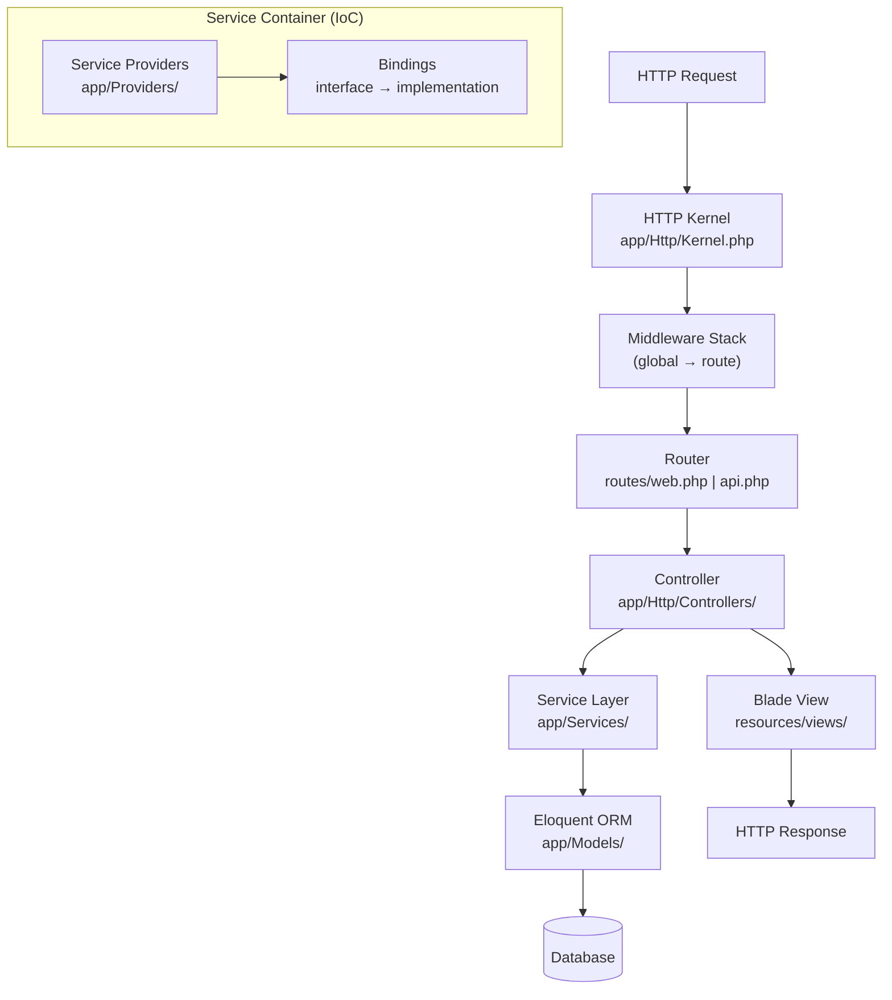

# Laravel Overview

> [!abstract] TL;DR
> Laravel is a full-stack PHP framework built around a service container (IoC/DI), expressive Eloquent ORM, Blade templating, and a rich ecosystem (Sanctum, Horizon, Octane). Its architecture combines MVC with service providers that bootstrap the application, facades that provide static-style access to container bindings, and Artisan CLI for code generation — making it the most productive PHP framework for building web apps and APIs.

---

## Architecture: MVC + Service Container



**Key architectural layers:**
- **Service Container** — dependency injection container that resolves class dependencies automatically
- **Service Providers** — bootstrap the application (register bindings, event listeners, routes)
- **Facades** — static-style proxies to container-registered services
- **Artisan** — CLI for scaffolding, running migrations, queue workers, and custom commands

---

## Project Structure

```
laravel-app/
├── app/
│   ├── Console/Kernel.php         ← scheduled tasks
│   ├── Exceptions/Handler.php     ← global exception handler
│   ├── Http/
│   │   ├── Controllers/           ← controllers
│   │   ├── Middleware/            ← custom middleware
│   │   └── Requests/              ← form request classes
│   ├── Models/                    ← Eloquent models
│   ├── Providers/                 ← service providers
│   └── Services/                  ← business logic layer
├── bootstrap/                     ← framework bootstrapping
├── config/                        ← app.php, database.php, etc.
├── database/
│   ├── migrations/                ← schema migrations
│   └── seeders/                   ← database seeders
├── public/index.php               ← web entry point
├── resources/views/               ← Blade templates
├── routes/
│   ├── web.php                    ← browser routes
│   ├── api.php                    ← API routes (stateless)
│   └── console.php                ← Artisan routes
├── storage/                       ← logs, cache, uploads
├── tests/                         ← PHPUnit / Pest tests
├── .env                           ← environment configuration
└── composer.json
```

---

## Artisan CLI

Artisan is the command-line interface for Laravel:

```bash
# Create files
php artisan make:controller UserController --resource  # CRUD controller
php artisan make:model Post --migration --factory     # model + migration + factory
php artisan make:middleware EnsureApiToken
php artisan make:job SendWelcomeEmail
php artisan make:event UserRegistered
php artisan make:request StoreUserRequest             # form request validation

# Database
php artisan migrate                   # run pending migrations
php artisan migrate:rollback          # rollback last batch
php artisan migrate:fresh --seed      # drop all tables, re-migrate, seed
php artisan db:seed --class=UserSeeder

# Development
php artisan serve                     # dev server at localhost:8000
php artisan tinker                    # interactive REPL with full app context
php artisan route:list                # show all registered routes
php artisan config:cache              # cache config for production
php artisan optimize                  # cache config + routes + views

# Queue
php artisan queue:work                # process jobs
php artisan queue:work --tries=3 --timeout=60
```

---

## .env Configuration

Laravel uses Dotenv for environment-specific config. The `.env` file is **never committed to git**:

```ini
APP_NAME=MyApp
APP_ENV=local           # local | staging | production
APP_DEBUG=true          # true in dev, ALWAYS false in production
APP_URL=http://localhost:8000

DB_CONNECTION=mysql
DB_HOST=127.0.0.1
DB_PORT=3306
DB_DATABASE=myapp
DB_USERNAME=root
DB_PASSWORD=secret

CACHE_DRIVER=redis
SESSION_DRIVER=redis
QUEUE_CONNECTION=redis

REDIS_HOST=127.0.0.1
REDIS_PORT=6379
```

Accessing config in code:
```php
// config() helper — reads from config/app.php which reads env()
$name = config('app.name');          // 'MyApp'
$debug = config('app.debug', false); // with default

// env() directly — only in config files, NOT in application code
$dsn = env('DATABASE_URL');
```

---

## Service Container (IoC / DI)

The container automatically resolves constructor dependencies:

```php
// Automatic resolution — no registration needed for concrete classes
class UserService {
    public function __construct(
        private UserRepository $repo,    // auto-injected
        private MailService $mail,       // auto-injected
    ) {}
}

// Explicit binding — interface → implementation
// In a ServiceProvider:
$this->app->bind(
    \App\Contracts\PaymentGateway::class,
    \App\Services\StripeGateway::class,
);

// Singleton — resolve once, reuse instance
$this->app->singleton(
    \App\Services\Analytics::class,
    fn($app) => new Analytics(config('analytics.key')),
);

// Manual resolution
$service = app(UserService::class);
$gateway = app(\App\Contracts\PaymentGateway::class);
```

---

## Service Providers

Service providers are the bootstrapping mechanism for all Laravel features:

```php
// app/Providers/AppServiceProvider.php
namespace App\Providers;

use Illuminate\Support\ServiceProvider;

class AppServiceProvider extends ServiceProvider {
    // Register — bind into container (no services available yet)
    public function register(): void {
        $this->app->bind(
            \App\Contracts\PaymentGateway::class,
            fn($app) => new \App\Services\StripeGateway(
                config('services.stripe.secret'),
            ),
        );
    }

    // Boot — runs after all providers registered (services are available)
    public function boot(): void {
        // Register event listeners, macros, gates, model observers
        \App\Models\User::observe(\App\Observers\UserObserver::class);

        // Macro — add methods to core classes
        \Illuminate\Database\Eloquent\Builder::macro('active', function() {
            return $this->where('active', true);
        });
    }
}
```

---

## Facades

Facades provide a static-style interface to container services — they look like static calls but are proxied to a real object instance:

```php
use Illuminate\Support\Facades\Cache;
use Illuminate\Support\Facades\DB;
use Illuminate\Support\Facades\Log;
use Illuminate\Support\Facades\Mail;

// These all resolve an underlying object from the container
Cache::put('key', 'value', 3600);
$result = DB::table('users')->where('active', 1)->get();
Log::info('User logged in', ['user_id' => $user->id]);

// Facades are testable — they support mocking
Cache::shouldReceive('get')
    ->once()
    ->with('key')
    ->andReturn('cached-value');
```

> [!tip] Facade vs Dependency Injection
> In controllers and services, prefer constructor DI over facades for testability and explicitness. Facades are convenient for one-liners in routes, but DI makes dependencies visible and easier to mock in unit tests.

---

## Common Pitfalls

- **Using `env()` outside config files** — `env()` returns `null` after config is cached (`php artisan config:cache`). Always use `config('app.key')` in application code; only use `env()` inside `config/*.php` files.
- **Not running `php artisan optimize:clear` after config changes** — cached config, routes, and views persist until explicitly cleared. Changes to `.env` or `config/` files won't take effect until cache is cleared.
- **Service Providers: `register` vs `boot`** — code in `register()` must only bind to the container. Accessing other services (e.g., `Auth::user()`, `Route::`) in `register()` fails because those providers haven't booted yet. Use `boot()` for cross-service interactions.
- **Facades in tight loops** — each facade call resolves from the container. In hot paths, assign to a local variable first: `$cache = app(Cache::class); $cache->get(...)` inside the loop.

---

## Review Questions

1. What is the difference between `register()` and `boot()` in a Service Provider? What can and cannot be done in each?
2. How do Laravel Facades work under the hood? Why can you write `Cache::get('key')` as if it were a static call?
3. Why should `env()` never be called in application code (controllers, services, models) — only in `config/*.php` files?
4. What is the difference between `$this->app->bind()` and `$this->app->singleton()`? When would you use each?

---

## Sources

- [Laravel Documentation: Architecture Concepts](https://laravel.com/docs/11.x/lifecycle)
- [Laravel Documentation: Service Container](https://laravel.com/docs/11.x/container)
- [Laravel Documentation: Service Providers](https://laravel.com/docs/11.x/providers)
- [Laravel Documentation: Facades](https://laravel.com/docs/11.x/facades)

---

#PHP #Laravel
