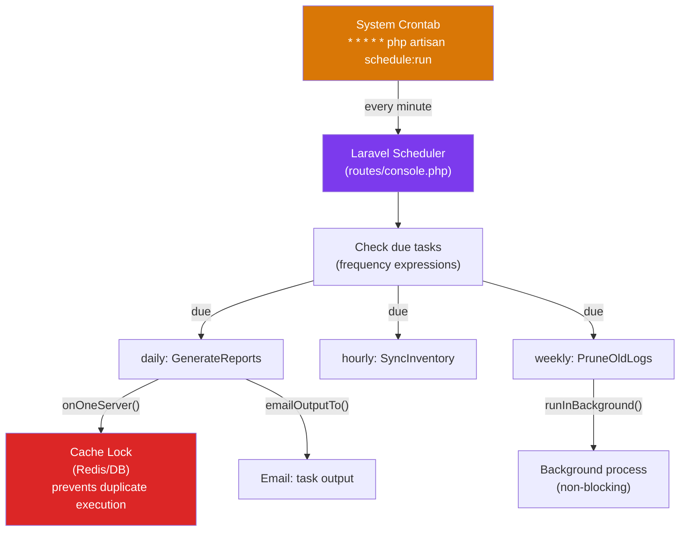

# Laravel Task Scheduling

> [!abstract] TL;DR
> Laravel's task scheduler centralizes all cron logic inside the application (instead of maintaining multiple crontab entries). A single cron entry runs `php artisan schedule:run` every minute; Laravel then evaluates which scheduled tasks are due and runs them. Tasks are defined in `routes/console.php` (Laravel 11+) or `app/Console/Kernel.php` (Laravel 10) and support rich scheduling expressions, output logging, before/after hooks, environments, and single-server locking to prevent overlapping execution in clustered setups.

---

## Intuition — analogy first

A traditional crontab is like having a separate alarm clock for every task in your house — one for taking out the trash, one for watering plants, one for paying bills. Laravel's scheduler is one smart alarm hub: one master alarm wakes it every minute, and it checks its internal calendar to see what's due. All your task logic lives in one place (the codebase), is version-controlled, and can be tested.

---

## How It Works



---

## Setting Up the Master Cron Entry

```bash
# One entry in the system crontab (server's /etc/crontab or crontab -e)
* * * * * cd /var/www/app && php artisan schedule:run >> /dev/null 2>&1

# For local development
php artisan schedule:work        # runs scheduler every minute in foreground
php artisan schedule:run         # run once immediately (for testing)
php artisan schedule:list        # show all registered tasks and next run time
php artisan schedule:test        # interactive: choose and run a specific task now
```

---

## Defining Scheduled Tasks

### Laravel 11+ (routes/console.php)

```php
// routes/console.php
use Illuminate\Support\Facades\Schedule;

// Artisan commands
Schedule::command('reports:generate')->daily();
Schedule::command('sitemap:rebuild')->weeklyOn(1, '3:00'); // every Monday at 3am
Schedule::command('queue:prune-batches --hours=48')->daily();
Schedule::command('telescope:prune --hours=48')->daily();

// Closures
Schedule::call(function () {
    \App\Models\User::inactive()->delete();
})->monthly()->onOneServer();

// External commands
Schedule::exec('node /path/to/script.js')->hourly();

// Jobs
Schedule::job(new SyncInventory, 'sync', 'redis')->everyFiveMinutes();
```

### Laravel 10 (app/Console/Kernel.php)

```php
// app/Console/Kernel.php
protected function schedule(Schedule $schedule): void
{
    $schedule->command('reports:generate')->daily();
    $schedule->command('cache:prune-stale-tags')->hourly();
}
```

---

## Frequency Methods

```php
// Time-based
->everySecond()               // every second (careful!)
->everyMinute()               // * * * * *
->everyFiveMinutes()          // */5 * * * *
->everyTenMinutes()
->everyFifteenMinutes()
->everyThirtyMinutes()
->hourly()                    // 0 * * * *
->hourlyAt(17)                // 17 minutes past every hour
->daily()                     // 0 0 * * *
->dailyAt('13:00')            // 1pm every day
->twiceDaily(1, 13)           // 1am and 1pm
->weekly()                    // every Sunday midnight
->weeklyOn(2, '8:00')         // every Tuesday at 8am (0=Sun, 1=Mon...)
->monthly()
->monthlyOn(4, '15:30')       // 4th of month at 3:30pm
->quarterly()
->yearly()
->yearlyOn(6, 1, '17:00')     // June 1st at 5pm

// Cron expressions
->cron('30 9 * * 1-5')        // 9:30am Mon-Fri (any valid cron expression)
```

---

## Task Modifiers

```php
Schedule::command('reports:generate')
    ->daily()
    ->at('02:00')                // run at 2am
    ->timezone('America/New_York')  // in NY timezone
    ->environments(['production', 'staging']) // skip in dev
    ->onOneServer()              // acquire a lock — run on only ONE server in cluster
    ->withoutOverlapping(10)     // skip if still running from previous run (10 min max lock)
    ->runInBackground()          // don't block the scheduler for this task
    ->before(function () { Log::info('Report generation starting'); })
    ->after(function () { Log::info('Report generation complete'); })
    ->onSuccess(function () { Notification::send(admins(), new ReportReady()); })
    ->onFailure(function () { Notification::send(ops(), new ReportFailed()); })
    ->appendOutputTo(storage_path('logs/reports.log'))  // log output
    ->emailOutputOnFailure('admin@example.com');        // email on failure
```

---

## Preventing Overlaps on Multiple Servers

```php
// Without onOneServer(): all 3 web servers run the task simultaneously
// With onOneServer(): only one acquires the Redis/DB lock and runs

Schedule::command('sync:inventory')
    ->everyFiveMinutes()
    ->onOneServer();  // requires Redis or database cache driver

// Requires cache.default = redis in config/cache.php
// and CACHE_DRIVER=redis in .env
```

---

## Custom Artisan Commands

```bash
php artisan make:command GenerateMonthlyReports
```

```php
// app/Console/Commands/GenerateMonthlyReports.php
namespace App\Console\Commands;

use Illuminate\Console\Command;

class GenerateMonthlyReports extends Command
{
    protected $signature = 'reports:generate
                            {month? : Month number (1-12), defaults to last month}
                            {--format=pdf : Output format (pdf|csv|excel)}
                            {--email= : Email the report to this address}';

    protected $description = 'Generate monthly analytics reports';

    public function handle(): int
    {
        $month = (int) ($this->argument('month') ?? now()->subMonth()->month);
        $format = $this->option('format');

        $this->info("Generating {$month} report in {$format} format...");

        // Show a progress bar for batch operations
        $users = User::all();
        $bar = $this->output->createProgressBar($users->count());
        $bar->start();

        foreach ($users as $user) {
            // process user...
            $bar->advance();
        }

        $bar->finish();
        $this->newLine();
        $this->info('Reports generated successfully!');

        // Return codes: 0 = success, 1 = failure
        return Command::SUCCESS;
    }
}
```

---

## Maintenance Mode Integration

```bash
# Put app in maintenance mode (scheduled tasks can still run with --except)
php artisan down --secret="bypass-token"

# Schedule tasks run regardless of maintenance mode by default
# To skip during maintenance:
Schedule::command('reports:generate')
    ->daily()
    ->skip(fn() => app()->isDownForMaintenance());

# Bring app back up
php artisan up
```

---

## Trade-offs

| Approach | Complexity | Control | Scalability |
|----------|-----------|---------|-------------|
| System crontab per task | Low | OS-level | Each server needs its own crontab |
| Laravel Scheduler | Medium | App-level, version-controlled | `onOneServer()` for clusters |
| Queued Jobs | Medium | Async, retryable | Horizontal via queue workers |
| Supervisor + Workers | High | Long-running daemons | Best for high-frequency work |

---

## Common Pitfalls

- **Forgetting the single cron entry** — the scheduler itself requires one system cron entry. Without `* * * * * php artisan schedule:run`, nothing runs. This is frequently missed in new server setups.
- **Timezone mismatch** — the server may run in UTC while your business logic expects local time. Always use `->timezone('America/Chicago')` on time-sensitive tasks or set `app.timezone` in `config/app.php`.
- **Not using `onOneServer()` in a multi-server setup** — without the lock, all 3 web servers run the task simultaneously, causing duplicate emails, duplicate database records, etc. Requires Redis or database cache driver.
- **Not using `withoutOverlapping()`** — if a daily report task takes 90 minutes and the scheduler runs every minute, it will start a new instance while the old one is running. `withoutOverlapping()` prevents this.
- **Scheduler not running in production** — a common missed step. Verify with `php artisan schedule:list` and check that the system crontab entry exists with `crontab -l`.

---

## Review Questions

1. How does Laravel's task scheduler work? What is the one system-level requirement?
2. What does `onOneServer()` do, and what cache driver is required for it to work?
3. What is the difference between `withoutOverlapping()` and `onOneServer()`?
4. How would you schedule a task to run at 9:30am Monday through Friday in the Eastern timezone?
5. A scheduled command starts at midnight and takes 2 hours. Without `withoutOverlapping()`, how many instances could be running by 1am?

---

## Sources

- [Laravel Task Scheduling](https://laravel.com/docs/11.x/scheduling)
- [Artisan Console Commands](https://laravel.com/docs/11.x/artisan)
- [Supervisor for Queue Workers](https://laravel.com/docs/11.x/queues#supervisor-configuration)

---

#PHP #Laravel #scheduling #cron #artisan #task-scheduler
