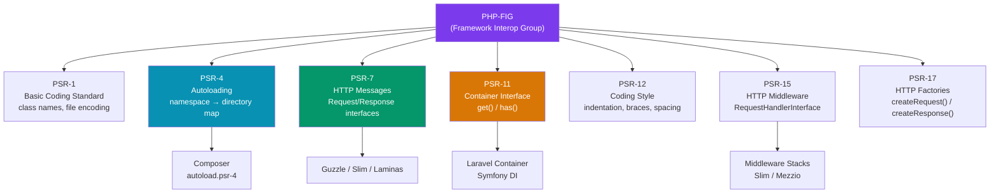

# PHP PSR Standards

> [!abstract] TL;DR
> **PHP-FIG** (PHP Framework Interop Group) publishes PSRs (PHP Standard Recommendations) to standardize interfaces across frameworks. Key PSRs: **PSR-1/12** (coding style enforced by PHP-CS-Fixer/PHPCS), **PSR-4** (autoloading — namespace to directory mapping used by Composer), **PSR-7** (HTTP message interfaces — `RequestInterface`, `ResponseInterface` used by Guzzle/Slim), **PSR-11** (container interface — enables swappable DI containers), **PSR-15** (HTTP middleware), **PSR-17** (HTTP factories). Implementing these interfaces makes code framework-agnostic and interoperable.

---

## Intuition — analogy first

PSRs are like electrical outlet standards. In a country with a standard outlet shape (PSR), any device (framework, library) can plug into any outlet (interface implementation) regardless of who made them. Without standards, every framework would have its own outlet shape and nothing would be interoperable. PSR-4 is like a standardized postal addressing system — given a class name, Composer knows exactly which directory to find the file in.

---

## How It Works



---

## PSR-1: Basic Coding Standard

```php
<?php
// Rule: Files MUST use only <?php or <?= tags (no short tags <%)
// Rule: Files MUST use UTF-8 without BOM
// Rule: Class names MUST be in StudlyCaps (PascalCase)
// Rule: Constants MUST be UPPER_SNAKE_CASE
// Rule: Method names MUST be camelCase

namespace App\Services;

class UserAuthenticationService  // StudlyCaps ✓
{
    const MAX_LOGIN_ATTEMPTS = 5; // UPPER_SNAKE_CASE ✓

    public function validateCredentials(string $email, string $password): bool // camelCase ✓
    {
        return true;
    }
}
```

---

## PSR-4: Autoloading

PSR-4 maps a **namespace prefix** to a **base directory**. The remainder of the namespace maps to a sub-directory path, and the class name maps to a `.php` filename.

```
Namespace: App\Http\Controllers\UserController
Base dir:  app/
Path:       app/Http/Controllers/UserController.php
```

```json
// composer.json — declaring PSR-4 autoloading
{
    "autoload": {
        "psr-4": {
            "App\\": "app/",
            "Database\\": "database/"
        }
    },
    "autoload-dev": {
        "psr-4": {
            "Tests\\": "tests/"
        }
    }
}
```

```bash
# Regenerate autoloader after adding new classes/directories
composer dump-autoload

# Optimized class map for production (no filesystem traversal)
composer dump-autoload --optimize
```

```php
// Resolving: App\Services\PaymentService → app/Services/PaymentService.php
namespace App\Services;

class PaymentService
{
    // Composer will find this file automatically via PSR-4 autoloading
}

// Usage — no require/include needed
use App\Services\PaymentService;
$service = new PaymentService();
```

---

## PSR-12: Coding Style

PSR-12 extends PSR-1 with explicit formatting rules:

```php
<?php

declare(strict_types=1);

namespace App\Http\Controllers;

use App\Models\User;
use Illuminate\Http\Request;
use Illuminate\Http\JsonResponse;

class UserController  // Opening brace on new line for classes
{
    public function __construct(
        private readonly UserRepository $userRepository,
    ) {
    }  // Closing brace on own line

    public function show(Request $request, int $id): JsonResponse  // Return type declaration
    {
        $user = $this->userRepository->findOrFail($id);

        return response()->json([
            'data' => $user,
        ]);
    }
}
```

**Enforce with tools:**

```bash
# PHP-CS-Fixer — auto-fix style issues
composer require --dev friendsofphp/php-cs-fixer
vendor/bin/php-cs-fixer fix src --rules=@PSR12

# PHP_CodeSniffer — detect violations
composer require --dev squizlabs/php_codesniffer
vendor/bin/phpcs src --standard=PSR12

# Laravel Pint — Laravel-flavored PHP-CS-Fixer (built-in since Laravel 9)
vendor/bin/pint
vendor/bin/pint --test  # check without fixing
```

---

## PSR-7: HTTP Message Interfaces

PSR-7 defines immutable interfaces for HTTP requests and responses — the foundation for interoperable HTTP libraries:

```php
use Psr\Http\Message\RequestInterface;
use Psr\Http\Message\ResponseInterface;
use Psr\Http\Message\StreamInterface;
use Psr\Http\Message\UriInterface;

// Implementations: guzzlehttp/psr7, laminas/laminas-diactoros, nyholm/psr7

// Immutable — all with* methods return a NEW instance
/** @var RequestInterface $request */
$newRequest = $request
    ->withMethod('POST')
    ->withUri($uri->withPath('/api/users'))
    ->withHeader('Content-Type', 'application/json')
    ->withBody($stream);

// Reading a PSR-7 request
$method  = $request->getMethod();           // 'POST'
$uri     = $request->getUri();             // UriInterface
$headers = $request->getHeaders();         // array of arrays
$body    = $request->getBody()->getContents(); // string

// Creating a response (PSR-17 factory)
use Psr\Http\Message\ResponseFactoryInterface;

class ApiController
{
    public function __construct(
        private readonly ResponseFactoryInterface $responseFactory,
    ) {
    }

    public function list(): ResponseInterface
    {
        $response = $this->responseFactory->createResponse(200);
        $response->getBody()->write(json_encode(['items' => []]));
        return $response->withHeader('Content-Type', 'application/json');
    }
}
```

---

## PSR-11: Container Interface

```php
use Psr\Container\ContainerInterface;
use Psr\Container\NotFoundExceptionInterface;
use Psr\Container\ContainerExceptionInterface;

// Write framework-agnostic code against the interface
class ServiceLocator
{
    public function __construct(
        private readonly ContainerInterface $container,
    ) {
    }

    public function getPaymentGateway(): PaymentGatewayInterface
    {
        if (!$this->container->has(PaymentGatewayInterface::class)) {
            throw new \RuntimeException('Payment gateway not configured');
        }
        return $this->container->get(PaymentGatewayInterface::class);
    }
}

// Laravel's container implements PSR-11
$container = app(); // returns Illuminate\Container\Container
$container->get(UserService::class);  // PSR-11 compliant
```

---

## PSR-15: HTTP Middleware

```php
use Psr\Http\Message\ResponseInterface;
use Psr\Http\Message\ServerRequestInterface;
use Psr\Http\Server\MiddlewareInterface;
use Psr\Http\Server\RequestHandlerInterface;

class RateLimitMiddleware implements MiddlewareInterface
{
    public function process(
        ServerRequestInterface $request,
        RequestHandlerInterface $handler,  // next middleware / handler
    ): ResponseInterface {
        $ip = $request->getServerParams()['REMOTE_ADDR'];

        if ($this->isRateLimited($ip)) {
            return new Response(429, [], 'Too Many Requests');
        }

        $this->recordRequest($ip);

        // Pass to the next handler in the pipeline
        return $handler->handle($request);
    }
}

// Authentication middleware pattern
class AuthMiddleware implements MiddlewareInterface
{
    public function process(ServerRequestInterface $request, RequestHandlerInterface $handler): ResponseInterface
    {
        $token = $request->getHeaderLine('Authorization');
        $user = $this->authenticate($token);

        if ($user === null) {
            return new Response(401, [], 'Unauthorized');
        }

        // Attach user to request attributes for downstream handlers
        $request = $request->withAttribute('user', $user);
        return $handler->handle($request);
    }
}
```

---

## Trade-offs

| PSR | Adoption | Benefit | When to Skip |
|-----|----------|---------|--------------|
| PSR-1/12 | Universal | Consistent codebase | Never — use Pint/PHP-CS-Fixer |
| PSR-4 | Universal | Composer autoloading | Never — standard for all PHP projects |
| PSR-7 | Framework-agnostic libraries | Portability | Laravel apps (use Laravel's Request/Response) |
| PSR-11 | Growing | DI container portability | App-layer code (use framework container directly) |
| PSR-15 | Slim/Mezzio/Middleware pipelines | Reusable middleware | Laravel (uses its own Middleware pattern) |

---

## Common Pitfalls

- **Mixing PSR-4 namespace and directory structure** — the namespace `App\Services\Payment\PaymentService` must map to `app/Services/Payment/PaymentService.php`. Mismatches cause `class not found` errors even after `dump-autoload`.
- **Forgetting `composer dump-autoload` after adding files** — new classes in an `optimized` autoloader won't be found until the classmap is regenerated.
- **Mutating PSR-7 objects** — PSR-7 objects are immutable. `$request->withHeader(...)` returns a new object; if you discard the return value, the header is not set on your request.
- **Using PHP short tags** — PSR-1 prohibits `<?` (short tags). They may not be available on all server configurations. Always use `<?php`.
- **PSR-12 vs Laravel Pint** — Pint applies `@Laravel` ruleset which differs slightly from pure `@PSR12`. Don't mix them in the same project.

---

## Review Questions

1. How does PSR-4 autoloading work? Given the namespace `App\Repositories\UserRepository` and a PSR-4 mapping of `"App\\" → "app/"`, what file path does Composer look for?
2. Why are PSR-7 HTTP message objects immutable? What does this mean for modifying a request?
3. What is the difference between PSR-7 (HTTP Messages) and PSR-15 (HTTP Middleware)? How do they relate?
4. What is the purpose of PSR-11? How does it make code framework-agnostic?
5. Why is `composer dump-autoload --optimize` recommended for production deployments?

---

## Sources

- [PHP-FIG PSR Index](https://www.php-fig.org/psr/)
- [PSR-4: Autoloader](https://www.php-fig.org/psr/psr-4/)
- [PSR-7: HTTP Message Interfaces](https://www.php-fig.org/psr/psr-7/)
- [Laravel Pint](https://laravel.com/docs/11.x/pint)
- [PSR-12: Extended Coding Style](https://www.php-fig.org/psr/psr-12/)

---

#PHP #Laravel #PSR #autoloading #coding-standards #http-interfaces
