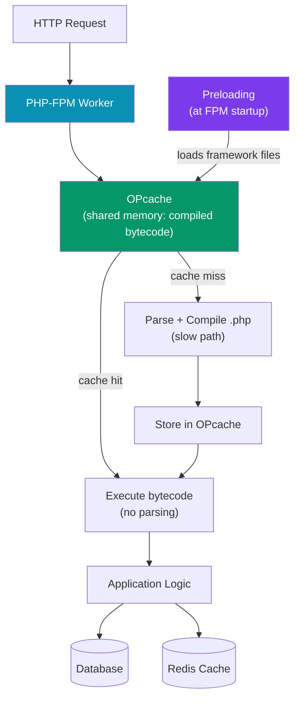

# PHP Performance

> [!abstract] TL;DR
> PHP performance optimization follows a priority order: first **enable OPcache** (eliminates per-request parsing — largest single gain), then **preloading** (PHP 7.4+, loads framework files into shared memory at startup), then **profile** with Xdebug or Blackfire to find actual bottlenecks, then tune **PHP-FPM** pool size and timeouts, and finally consider **async runtimes** (Swoole, RoadRunner) for persistent workers. Premature optimization without profiling is counterproductive — always measure first.

---

## Intuition — analogy first

Without OPcache, PHP is like a chef who re-reads the entire recipe book from scratch before cooking every single dish. OPcache tears out the relevant recipe pages and pins them on the wall — the chef glances at the wall, not the book. Preloading goes further: the chef pre-measures all ingredients for the most common dishes before the restaurant opens. Profiling is like installing cameras on every station to find which step is actually the bottleneck — without it, you might optimize the bread basket when the grill is the real problem.

---

## How It Works



---

## OPcache — Most Important Optimization

OPcache stores compiled PHP bytecode in shared memory. Every request to the same file skips parsing and compiling. **This is the single biggest PHP performance win** — typically 3-5x throughput improvement over no-cache.

```ini
; php.ini — production OPcache settings
opcache.enable = 1
opcache.enable_cli = 0                  ; disabled for CLI unless needed

; Memory allocation
opcache.memory_consumption = 256        ; MB — increase for large apps
opcache.interned_strings_buffer = 16    ; MB — shared string pool
opcache.max_accelerated_files = 20000   ; number of files to cache (stat your app)

; Invalidation strategy
opcache.validate_timestamps = 0         ; PRODUCTION: disable for max performance
                                        ; set to 1 during development for auto-reload
opcache.revalidate_freq = 2            ; seconds between timestamp checks (when validate=1)

; Optimization level (default 7 is fine; 0 disables)
opcache.optimization_level = 0x7FFFBFFF

; Preloading (PHP 7.4+)
opcache.preload = /var/www/app/preload.php
opcache.preload_user = www-data       ; must match FPM user

; JIT (PHP 8.0+)
opcache.jit_buffer_size = 128M
opcache.jit = tracing                  ; tracing | function | off
```

```bash
# Check OPcache status
php -r "print_r(opcache_get_status());"

# Clear OPcache (e.g., after deployment)
php -r "opcache_reset();"

# Laravel deployment: clear all caches
php artisan optimize:clear
php artisan config:cache
php artisan route:cache
php artisan view:cache
```

---

## Preloading (PHP 7.4+)

Preloading loads specified PHP files into shared memory at PHP-FPM startup. These files are available to all workers without re-reading the OPcache:

```php
// preload.php — loaded once at startup, shared by all FPM workers
<?php

// Preload framework files that every request uses
$files = [
    '/vendor/laravel/framework/src/Illuminate/Support/helpers.php',
    '/vendor/laravel/framework/src/Illuminate/Support/Str.php',
    '/vendor/laravel/framework/src/Illuminate/Support/Collection.php',
    // ... add your most-used vendor files
];

foreach ($files as $file) {
    if (file_exists($file)) {
        require_once $file;
    }
}
```

> [!warning] Preloading requires FPM restart
> Changes to preloaded files require restarting PHP-FPM to take effect — the files are loaded at startup, not per-request. Run `php-fpm -t` to test config before restart.

**Laravel Octane** (alternative approach — persistent workers):

```bash
composer require laravel/octane
php artisan octane:install  # choose Swoole or RoadRunner
php artisan octane:start --workers=8 --task-workers=4
```

---

## PHP-FPM Tuning

```ini
; /etc/php/8.x/fpm/pool.d/www.conf

[www]
user = www-data
group = www-data
listen = /run/php/php8.x-fpm.sock

; Process management
; static: fixed number (predictable memory)
; dynamic: scale between min_spare and max_children
; ondemand: spawn on demand (low traffic)
pm = dynamic

pm.max_children = 50        ; max simultaneous requests
pm.start_servers = 10       ; initial workers
pm.min_spare_servers = 5    ; minimum idle workers
pm.max_spare_servers = 20   ; maximum idle workers
pm.max_requests = 1000      ; restart worker after N requests (prevent memory leaks)

; Timeouts
request_terminate_timeout = 60s
request_slowlog_timeout = 5s    ; log slow requests to slowlog
slowlog = /var/log/php-fpm-slow.log

; Status page (useful for monitoring)
pm.status_path = /fpm-status
ping.path = /fpm-ping
```

**Sizing `pm.max_children`:**

```
max_children = Available RAM / Average worker memory

# Check average worker memory:
ps -o pid,rss,command -C php-fpm | awk 'NR>1 { sum += $2; count++ } END { print sum/count/1024 " MB avg" }'
```

---

## Profiling with Xdebug

```ini
; php.ini — development only (NEVER in production — massive overhead)
zend_extension = xdebug.so
xdebug.mode = profile
xdebug.start_with_request = trigger   ; only profile when XDEBUG_PROFILE=1 in request
xdebug.output_dir = /tmp/xdebug
xdebug.profiler_output_name = cachegrind.out.%p
```

```bash
# Trigger profiling for a specific request
curl "https://app.local/api/users" -H "X-XDEBUG-PROFILE: 1"

# Or set cookie: XDEBUG_PROFILE=1

# Analyze output with KCacheGrind (Linux) or QCacheGrind (macOS/Windows)
kcachegrind /tmp/xdebug/cachegrind.out.12345
```

---

## Profiling with Blackfire

Blackfire is a production-safe profiler (minimal overhead, available as a SaaS):

```bash
# Install Blackfire CLI and PHP probe
# Follow: https://docs.blackfire.io/php/integrations/php

# Profile a web request
blackfire curl https://app.example.com/api/products

# Profile an Artisan command
blackfire run php artisan process:large-dataset

# Compare two profiles (before/after optimization)
blackfire compare <profile-url-1> <profile-url-2>
```

---

## Laravel-Specific Performance

```bash
# Cache all cacheables
php artisan optimize  # combines: config:cache + route:cache + view:cache

# Individual caches
php artisan config:cache    # merges all config files into bootstrap/cache/config.php
php artisan route:cache     # compiles route list (~100x faster routing)
php artisan view:cache      # pre-compiles all Blade templates
php artisan event:cache     # caches event listeners

# Eager loading — eliminate N+1 queries (most common Laravel bottleneck)
// BAD — N+1: 1 query for posts + N queries for authors
$posts = Post::all();
foreach ($posts as $post) {
    echo $post->author->name; // fires a query per post!
}

// GOOD — 2 queries total
$posts = Post::with('author')->get();
```

```php
// Laravel Telescope — development profiling
composer require --dev laravel/telescope
php artisan telescope:install
php artisan migrate

// Debugbar — development profiling overlay
composer require --dev barryvdh/laravel-debugbar

// Query log — find slow queries
DB::enableQueryLog();
// ... run code ...
$queries = DB::getQueryLog();
// Sort by query time
usort($queries, fn($a, $b) => $b['time'] <=> $a['time']);
```

---

## Trade-offs

| Optimization | Effort | Gain | Risk |
|-------------|--------|------|------|
| OPcache | Low | Very High (3-5x) | None |
| Route/config cache | Low (artisan cmd) | High | Clear cache on deploy |
| Preloading | Medium | Medium (10-20%) | FPM restart required |
| PHP-FPM tuning | Medium | High (throughput) | OOM if max_children too high |
| Swoole/Octane | High | Very High (10x+) | State leaks between requests |
| Eager loading | Low-Medium | High (per N+1 query) | Larger query payloads |

---

## Common Pitfalls

- **Leaving `opcache.validate_timestamps=1` in production** — PHP checks every file's modification timestamp on every request. For 500+ file apps, this adds measurable overhead. Set to `0` and clear OPcache manually after deployment.
- **Setting `pm.max_children` too high** — if each worker uses 50MB and you set 100 workers, that's 5GB RAM. Swap usage will kill performance faster than having fewer workers.
- **Profiling in production with Xdebug** — Xdebug in profile mode adds 2-5x overhead. Use Blackfire or Tideways for production profiling.
- **Forgetting `php artisan optimize` after deployment** — deploying new code without clearing the route/config/view cache means the app runs with stale cached routes and config.
- **Caching config in dev** — `php artisan config:cache` prevents `.env` changes from being picked up. Don't cache config in local development environments.

---

## Review Questions

1. What does OPcache do, and why is it the single most impactful PHP performance optimization?
2. What is the difference between OPcache and PHP preloading? When would preloading provide additional benefit beyond OPcache alone?
3. How do you calculate the correct value for `pm.max_children` in PHP-FPM?
4. Why should Xdebug's profiling mode never be enabled in production? What is the production-safe alternative?
5. A Laravel app has slow list pages. Using Telescope, you notice 47 queries per page. What is this problem called, and what Eloquent method fixes it?

---

## Sources

- [PHP OPcache documentation](https://www.php.net/manual/en/book.opcache.php)
- [PHP Preloading](https://www.php.net/manual/en/opcache.preloading.php)
- [PHP-FPM configuration](https://www.php.net/manual/en/install.fpm.configuration.php)
- [Blackfire documentation](https://docs.blackfire.io/)
- [Laravel Octane](https://laravel.com/docs/11.x/octane)

---

#PHP #Laravel #performance #opcache #profiling #php-fpm #xdebug #blackfire
