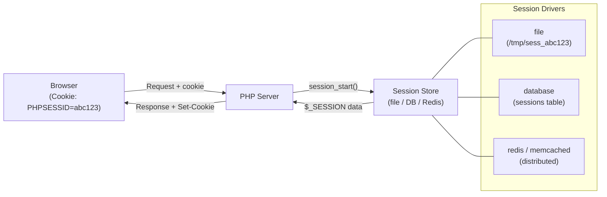
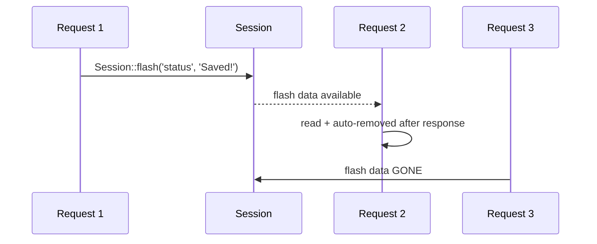

# PHP Sessions and Cookies

> [!abstract] TL;DR
> HTTP is stateless — sessions and cookies are the mechanisms that maintain user state across requests. A **session** stores data server-side (identified by a session ID cookie); a **cookie** stores data client-side. PHP's native `$_SESSION` superglobal stores data in the file system by default. Laravel wraps sessions with configurable drivers (file, database, Redis, Memcached) and adds **flash data** (persists for the next request only). Cookie security requires `HttpOnly`, `Secure`, and `SameSite=Lax` attributes to prevent XSS/CSRF theft.

---

## Intuition — analogy first

A session is like a coat-check ticket: the server keeps your coat (data) in a numbered cubby (session storage); you carry only a small ticket (session ID cookie). Each request you show the ticket, the server finds your cubby, and retrieves your data. A cookie is like writing your name on your hand — the client carries the data itself, but anyone who sees your hand can read it (hence the need for encryption and security flags).

---

## How It Works



---

## Native PHP Sessions

```php
<?php
// Start session — must be before any output
session_start();

// Store data
$_SESSION['user_id'] = 42;
$_SESSION['username'] = 'alice';
$_SESSION['cart'] = ['item1', 'item2'];

// Read data
$userId = $_SESSION['user_id'] ?? null;

// Check if session variable exists
if (isset($_SESSION['user_id'])) {
    // User is logged in
}

// Remove a single value
unset($_SESSION['cart']);

// Destroy entire session (logout)
session_unset();             // clear all $_SESSION variables
session_destroy();           // destroy server-side data
setcookie(session_name(), '', time() - 3600, '/'); // delete cookie

// Regenerate session ID after privilege escalation (login, sudo)
session_regenerate_id(true); // prevents session fixation attacks
```

### Session Configuration (php.ini)

```ini
; Session storage
session.save_handler = files               ; or redis, memcached, user
session.save_path = "/var/lib/php/sessions"

; Cookie settings
session.name = PHPSESSID                   ; cookie name
session.cookie_lifetime = 0               ; 0 = until browser closes
session.cookie_path = /
session.cookie_domain = .example.com      ; include subdomains
session.cookie_secure = 1                 ; HTTPS only
session.cookie_httponly = 1               ; no JavaScript access
session.cookie_samesite = Lax             ; CSRF protection

; Session lifetime
session.gc_maxlifetime = 1440             ; seconds (24 min default)
session.gc_probability = 1
session.gc_divisor = 100                  ; 1% chance of GC per request

; Security
session.use_strict_mode = 1              ; reject uninitialized session IDs
session.use_only_cookies = 1             ; don't accept SID in URL
```

---

## PHP Cookies

```php
<?php
// setcookie(name, value, options_array)
setcookie('remember_token', $encryptedToken, [
    'expires'  => time() + (30 * 24 * 60 * 60), // 30 days
    'path'     => '/',
    'domain'   => '.example.com',
    'secure'   => true,      // HTTPS only
    'httponly' => true,       // no JavaScript access (XSS protection)
    'samesite' => 'Lax',     // Lax | Strict | None
]);

// Read cookie
$token = $_COOKIE['remember_token'] ?? null;

// Delete cookie — set expiry in the past
setcookie('remember_token', '', ['expires' => time() - 1, 'path' => '/']);
```

### SameSite Explained

| Value | Sent on cross-site GET | Sent on cross-site POST | Use Case |
|-------|----------------------|------------------------|----------|
| `Strict` | No | No | Highest security; breaks OAuth flows |
| `Lax` | Yes (top-level nav) | No | Default; balances security/usability |
| `None` | Yes | Yes | Required with `Secure`; for embedded iframes |

---

## Laravel Sessions

```php
// config/session.php — driver options
'driver' => env('SESSION_DRIVER', 'file'), // file | cookie | database | redis | memcached

// Using the Session facade
use Illuminate\Support\Facades\Session;

Session::put('key', 'value');
Session::get('key', 'default');
Session::has('key');           // true if exists AND not null
Session::exists('key');        // true even if null
Session::forget('key');
Session::flush();              // remove all session data
Session::regenerate();         // regenerate ID (call after login)

// Flash data — available on next request only
Session::flash('status', 'Profile updated!');
Session::reflash();            // keep flash data for one more request
Session::keep(['status']);     // selectively keep specific flash keys

// In controller
public function login(Request $request): RedirectResponse
{
    if (Auth::attempt($request->only('email', 'password'))) {
        $request->session()->regenerate(); // prevent session fixation
        return redirect()->intended('dashboard');
    }
    return back()->withErrors(['email' => 'Invalid credentials']);
}
```

### Laravel Database Session Driver

```bash
# Create sessions table
php artisan session:table
php artisan migrate
```

```php
// config/session.php
'driver' => 'database',
'table'  => 'sessions',
'lifetime' => 120, // minutes
```

The `sessions` table schema includes: `id`, `user_id`, `ip_address`, `user_agent`, `payload`, `last_activity`.

### Laravel Redis Sessions

```php
// config/session.php
'driver' => 'redis',
'connection' => 'session', // references config/database.php redis connections

// config/database.php
'redis' => [
    'session' => [
        'url'      => env('REDIS_URL'),
        'host'     => env('REDIS_HOST', '127.0.0.1'),
        'port'     => env('REDIS_PORT', '6379'),
        'database' => env('REDIS_SESSION_DB', '1'),
    ],
],
```

Redis sessions are ideal for horizontally-scaled apps (multiple web servers sharing session state).

---

## Flash Data Lifecycle



---

## Trade-offs

| Driver | Speed | Scalability | Persistence | Use Case |
|--------|-------|-------------|-------------|----------|
| file | Medium | Single server only | Until gc_maxlifetime | Local dev, small apps |
| database | Medium | Multi-server | Until deleted | Audit trail, user blocking |
| redis | Fast | Multi-server, horizontal | Configurable TTL | Production, high traffic |
| cookie | Fastest | Full (stateless) | Browser lifetime | Encrypted, small data only |
| memcached | Fast | Multi-server | Volatile (no persistence) | Cache-only, not for auth |

---

## Common Pitfalls

- **Not calling `session_regenerate_id(true)` after login** — failure to regenerate the session ID after privilege escalation leaves the app vulnerable to session fixation attacks (attacker sets session ID before login).
- **Missing `session_start()` before output** — PHP sessions require `session_start()` before any output (including whitespace). Use `ob_start()` or ensure no output precedes the call.
- **Storing objects in sessions** — PHP serializes/deserializes session data. Storing large objects or closures breaks deserialization or wastes memory. Store only IDs and primitive values.
- **Using cookie driver for sensitive data in Laravel** — Laravel's `cookie` session driver stores all session data client-side (encrypted but readable size limit ~4KB). Don't store large datasets.
- **Not setting `HttpOnly` and `Secure` on session cookies** — without `HttpOnly`, JavaScript can steal the session cookie via XSS. Without `Secure`, the cookie is sent over HTTP in plaintext.

---

## Review Questions

1. What is session fixation, and how does `session_regenerate_id(true)` prevent it?
2. What is the difference between `HttpOnly` and `SameSite=Lax` cookie attributes? What attack does each prevent?
3. Why is the Redis session driver preferred over the `file` driver for horizontally-scaled Laravel applications?
4. What is Laravel flash data? Describe the exact lifecycle: when is it set, when is it available, when is it removed?
5. You store a User Eloquent model in `$_SESSION['user']`. What happens when the session is deserialized on the next request if the model class definition changes?

---

## Sources

- [PHP Sessions](https://www.php.net/manual/en/book.session.php)
- [PHP setcookie()](https://www.php.net/manual/en/function.setcookie.php)
- [Laravel Sessions](https://laravel.com/docs/11.x/session)
- [OWASP Session Management](https://owasp.org/www-community/attacks/Session_fixation)

---

#PHP #Laravel #sessions #cookies #state-management
