# PHP and Laravel — Master MOC

> [!abstract] About
> 24 notes across 3 sections covering the full PHP 8.x language, the Laravel framework, and the broader PHP ecosystem. Emphasis on PHP 8.x modern features (match, named args, enums, readonly, first-class callables) versus old PHP patterns, and Laravel's architecture (service container, Eloquent, Blade, Sanctum, queues, events, scheduling, file storage, monitoring).

---

## Knowledge Map

```mermaid
graph TD
    Master["PHP & Laravel Master MOC"]

    subgraph Foundations["01 PHP Fundamentals"]
        Overview["PHP Overview\n(history, PHP-FPM, Composer)"]
        Types["PHP Types & Variables\n(strict_types, union types, readonly)"]
        Control["Control Flow & Functions\n(match, arrow fn, named args)"]
        OOP["PHP OOP\n(traits, enums, constructor promotion)"]
        Errors["Error Handling\n(Throwable, exceptions, set_exception_handler)"]
        Arrays["Arrays & Strings\n(array_map/filter/reduce, str_contains)"]
    end

    subgraph LaravelSec["02 Laravel Framework"]
        LOverview["Laravel Overview\n(Service Container, Facades, Artisan)"]
        Routing["Routing & Controllers\n(resource routes, model binding)"]
        Eloquent["Eloquent ORM\n(relationships, scopes, N+1)"]
        Blade["Blade & Views\n(components, Livewire, Inertia)"]
        Auth["Auth & Middleware\n(Sanctum, Spatie, CSRF)"]
        Jobs["Jobs, Testing & Deployment\n(queues, Pest, Forge)"]
        Events["Events & Listeners\n(Observer, Broadcasting, Reverb)"]
        Schedule["Task Scheduling\n(Artisan scheduler, cron, onOneServer)"]
        FileStorage["File Storage\n(Storage facade, S3, signed URLs)"]
        Monitoring["Monitoring\n(Telescope, Pulse, Horizon, Debugbar)"]
    end

    subgraph Ecosystem["03 PHP Ecosystem"]
        Composer["Composer & Packages\n(PSR-4, semver, Packagist)"]
        DB["Database Access\n(PDO, migrations, Doctrine vs Eloquent)"]
        API["API Development\n(Resources, rate limiting, pagination)"]
        Testing["PHP Testing\n(PHPUnit, Pest, Faker, Xdebug)"]
        Sessions["Sessions & Cookies\n(drivers, flash, HttpOnly, SameSite)"]
        Security["PHP Security\n(XSS, CSRF, SQLi, password_hash)"]
        PSR["PSR Standards\n(PSR-4/7/11/12/15, PHP-FIG)"]
        Performance["PHP Performance\n(OPcache, preloading, PHP-FPM, profiling)"]
    end

    Master --> Foundations
    Master --> LaravelSec
    Master --> Ecosystem

    Overview --> LOverview
    OOP --> Eloquent
    OOP --> LOverview
    Types --> Control
    Errors --> Jobs
    Control --> Arrays
    LOverview --> Routing
    LOverview --> Auth
    Routing --> Eloquent
    Eloquent --> API
    Auth --> API
    Blade --> Auth
    Composer --> LOverview
    DB --> Eloquent
    DB --> API
    Testing --> Jobs
    Testing --> API
    Sessions --> Auth
    Security --> Auth
    PSR --> Composer
    Performance --> LOverview
    Events --> Jobs
    Schedule --> Jobs
    FileStorage --> API
    Monitoring --> Jobs
```

---

## Sections

### 01 — PHP Fundamentals

| Note | Difficulty | Key Concepts |
|------|-----------|-------------|
| [[PHP_Overview]] | Beginner | PHP 8.x features, PHP-FPM, Composer, JIT, match, nullsafe `?->` |
| [[PHP_Types_and_Variables]] | Beginner | strict_types, union types, nullable, readonly, mixed, never |
| [[PHP_Control_Flow_and_Functions]] | Beginner | match expression, named args, arrow fn, first-class callables, spread |
| [[PHP_OOP]] | Intermediate | constructor promotion, traits, enums, late static binding, magic methods |
| [[PHP_Error_Handling]] | Intermediate | Throwable hierarchy, multi-catch, exception chaining, throw as expression |
| [[PHP_Arrays_and_String]] | Beginner | array_map/filter/reduce, usort, str_contains/starts_with/ends_with, heredoc |

### 02 — Laravel Framework

| Note | Difficulty | Key Concepts |
|------|-----------|-------------|
| [[Laravel_Overview]] | Intermediate | MVC + Service Container, Artisan, .env, Service Providers, Facades |
| [[Laravel_Routing_and_Controllers]] | Intermediate | Route groups, resource controllers, model binding, FormRequest |
| [[Laravel_Eloquent_ORM]] | Intermediate | Relationships, scopes, eager loading, N+1, soft deletes, accessors |
| [[Laravel_Blade_and_Views]] | Intermediate | Blade directives, components, layouts, Livewire, Inertia.js |
| [[Laravel_Auth_and_Middleware]] | Intermediate | Auth facade, Sanctum, middleware, CSRF, Spatie Permission |
| [[Laravel_Jobs_Testing_Deployment]] | Advanced | Queues, scheduled tasks, Pest, facades fake, Forge/Vapor |
| [[Laravel_Events_Listeners]] | Intermediate | Event/Listener, Observers, Broadcasting, Pusher, Reverb, subscribers |
| [[Laravel_Task_Scheduling]] | Intermediate | Artisan scheduler, cron expressions, onOneServer, withoutOverlapping |
| [[Laravel_File_Storage]] | Intermediate | Storage facade, S3/GCS drivers, file uploads, signed URLs, streaming |
| [[Laravel_Monitoring]] | Intermediate | Telescope, Debugbar, Pulse, Horizon, health checks |

### 03 — PHP Ecosystem

| Note | Difficulty | Key Concepts |
|------|-----------|-------------|
| [[Composer_and_Packages]] | Beginner | composer.json, PSR-4, semver constraints, composer.lock, Packagist |
| [[PHP_Database_Access]] | Intermediate | PDO, prepared statements, migrations, Doctrine vs Eloquent, SQLite tests |
| [[PHP_API_Development]] | Intermediate | API Resources, versioning, rate limiting, pagination, Swagger, GraphQL |
| [[PHP_Testing]] | Intermediate | PHPUnit, Pest, datasets, mocks, Faker, Xdebug coverage |
| [[PHP_Sessions_and_Cookies]] | Intermediate | Session lifecycle, cookie security, drivers (file/DB/Redis), flash data |
| [[PHP_Security]] | Intermediate | XSS prevention, CSRF, SQL injection, bcrypt/argon2, headers, validation |
| [[PHP_PSR_Standards]] | Intermediate | PHP-FIG, PSR-1/4/7/11/12/15/17, autoloading, HTTP message interfaces |
| [[PHP_Performance]] | Advanced | OPcache, preloading, PHP-FPM tuning, Xdebug/Blackfire, Octane |

---

## Learning Paths

### Path A — PHP Backend Developer

Sequential path for developers learning PHP for backend web development:

1. **Language Foundation** (Week 1)
   - [[PHP_Overview]] — understand the ecosystem and PHP-FPM execution model
   - [[PHP_Types_and_Variables]] — master PHP's type system and strict_types
   - [[PHP_Control_Flow_and_Functions]] — match, named args, arrow functions
   - [[PHP_Arrays_and_String]] — array functions and string manipulation

2. **Object-Oriented PHP** (Week 2)
   - [[PHP_OOP]] — classes, traits, enums, constructor promotion
   - [[PHP_Error_Handling]] — exception hierarchy, try/catch, Throwable

3. **Database and Packages** (Week 3)
   - [[Composer_and_Packages]] — project setup, dependencies, PSR-4
   - [[PHP_Database_Access]] — PDO, prepared statements, migrations

4. **Web Fundamentals** (Week 4)
   - [[PHP_Sessions_and_Cookies]] — state management, session drivers
   - [[PHP_Security]] — XSS, CSRF, SQL injection, password hashing

5. **Testing and Standards** (Week 5)
   - [[PHP_Testing]] — PHPUnit, Pest, Faker, mocks
   - [[PHP_PSR_Standards]] — PHP-FIG standards, autoloading, HTTP interfaces
   - [[PHP_Performance]] — OPcache, profiling, PHP-FPM tuning

**Milestone:** Build a pure PHP REST API with PDO, Composer autoloading, CSRF protection, and PHPUnit tests.

---

### Path B — Laravel Full-Stack Developer

Path for developers targeting the full Laravel stack:

1. **PHP Basics** (Days 1–3)
   - [[PHP_Overview]], [[PHP_Types_and_Variables]], [[PHP_Control_Flow_and_Functions]]

2. **Laravel Core** (Week 1–2)
   - [[Laravel_Overview]] — architecture, container, service providers
   - [[Laravel_Routing_and_Controllers]] — routes, controllers, model binding
   - [[Laravel_Eloquent_ORM]] — models, relationships, eager loading
   - [[Composer_and_Packages]] — managing the project

3. **Frontend & Auth** (Week 3)
   - [[Laravel_Blade_and_Views]] — Blade templates, components, Livewire
   - [[Laravel_Auth_and_Middleware]] — auth, middleware, Sanctum

4. **Production Skills** (Week 4)
   - [[Laravel_Jobs_Testing_Deployment]] — queues, tests, deployment
   - [[Laravel_Events_Listeners]] — event-driven architecture, broadcasting
   - [[Laravel_Task_Scheduling]] — cron, scheduler, onOneServer
   - [[Laravel_File_Storage]] — file uploads, S3, signed URLs

5. **Observability** (Week 5)
   - [[Laravel_Monitoring]] — Telescope, Pulse, Horizon, health checks
   - [[PHP_Performance]] — OPcache, N+1 queries, profiling
   - [[PHP_Security]] — hardening for production

**Milestone:** Ship a full-stack Laravel app with authentication, Eloquent relationships, queue-based email, event broadcasting, scheduled tasks, and 80%+ test coverage.

---

### Path C — API Developer

Path for developers building Laravel REST APIs:

1. **Foundation** (Days 1–4)
   - [[PHP_Overview]], [[PHP_Types_and_Variables]], [[PHP_OOP]]
   - [[Composer_and_Packages]]

2. **Laravel API** (Week 1–2)
   - [[Laravel_Overview]] — service container, providers
   - [[Laravel_Routing_and_Controllers]] — `apiResource`, invokable controllers
   - [[Laravel_Eloquent_ORM]] — query builder, eager loading
   - [[Laravel_Auth_and_Middleware]] — Sanctum token auth, rate limiting

3. **API Design** (Week 3)
   - [[PHP_API_Development]] — API Resources, versioning, pagination, OpenAPI
   - [[PHP_Database_Access]] — migrations, seeds, testing with SQLite
   - [[Laravel_File_Storage]] — file upload endpoints, S3 integration

4. **Quality & Scale** (Week 4)
   - [[Laravel_Jobs_Testing_Deployment]] — async processing, deployment
   - [[PHP_Testing]] — feature tests, HTTP fakes, Pest datasets
   - [[PHP_Security]] — input validation, headers, SQL injection
   - [[Laravel_Monitoring]] — Telescope, Horizon for queue visibility

**Milestone:** Build a versioned, documented, rate-limited API with Sanctum authentication, API Resources, cursor pagination, S3 file uploads, and full Pest test suite.

---

## Cross-Vault Links

- [[Python/Backend/FastAPI_Deep_Dive]] — compare PHP-FPM + Laravel vs Python ASGI + FastAPI for API development
- [[Java/16_Spring_Core/Spring_IoC_Container]] — Spring's dependency injection is similar to Laravel's service container
- [[System Design/_MOC_SystemDesign_Master]] — architectural patterns applicable to Laravel microservices
- [[Database/_MOC_Database_Master]] — database fundamentals that complement [[PHP_Database_Access]] and [[Laravel_Eloquent_ORM]]
- [[DevOps/_MOC_DevOps_Master]] — containerization and CI/CD workflows that support [[Laravel_Jobs_Testing_Deployment]]

---

#PHP #Laravel
