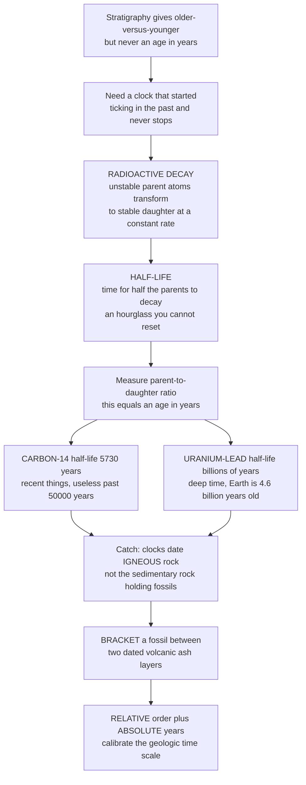

# ⏳ Dating the Past: Radiometric and Relative Methods

> [!abstract] TL;DR
> **Stratigraphy** can prove that one layer is *older* than another, but it cannot say *how many years* old — for that you need a clock that started ticking in the past and never stopped. Nature hides exactly such a clock inside atoms: **radioactive decay**. Unstable **parent** isotopes transform into stable **daughter** isotopes at a perfectly constant rate, indifferent to heat, pressure, or chemistry, and the **half-life** — the time for half the parents to decay — is the tick. Measure the parent-to-daughter ratio in a mineral and you get its age in years, like reading an hourglass you cannot reset. **Carbon-14** (half-life ~5,730 yr) dates recent things out to ~50,000 yr; **uranium-lead** (half-life billions of yr) dates the oldest rocks and even meteorites, which is how we know Earth is **4.54 billion years** old. The catch: radiometric clocks date **igneous** rocks (volcanic ash, lava), *not* the sedimentary rocks that hold most fossils — so paleontologists **bracket** fossils between datable volcanic layers. Marrying **relative** order (stratigraphy) to **absolute** years (radiometry) is what calibrated the entire geologic time scale and put real numbers on the history of life.

---

## Intuition

**Analogy — the hourglass you cannot reset.** Stratigraphy is like finding a stack of newspapers: you *know* the bottom one is older than the top one (superposition), but nothing on the page tells you the year. To get actual dates you need a clock — and the clock has to be one that *started running in the past on its own* and cannot be paused, sped up, or reset. Nature provides exactly this, buried inside atoms.

Certain unstable "parent" atoms — uranium, or a special heavy form of carbon — spontaneously transform into stable "daughter" atoms at a rate that never changes, no matter how hot, squeezed, or chemically abused the rock gets. The key measure is the **half-life**: the time for exactly *half* of the parents to decay. Picture a magical hourglass where each grain of sand has a fixed probability per second of falling and no amount of shaking or heating changes that rate. You did not watch it start, but you can still read the elapsed time: measure the sand left on top (**parent**), the sand piled below (**daughter**), and knowing how fast it falls (**half-life**), you calculate exactly how long it has been running. Measure the parent-to-daughter ratio in a mineral and out comes an age in years.

Different clocks cover different ranges. **Carbon-14** (half-life ~5,730 years) is perfect for the recent — mammoths, archaeology, human evolution — but useless past ~50,000 years, because by then essentially all the sand has fallen and there is nothing left to measure. For **deep time** you switch to clocks with enormous half-lives: **uranium-lead** (half-life billions of years) dates the oldest rocks and meteorites, and told us Earth is 4.6 billion years old. There is one crucial catch: most radiometric clocks date *igneous* rocks — the moment volcanic ash or lava crystallized — not the *sedimentary* rocks that actually entomb fossils. So paleontologists date a fossil by **bracketing** it between a datable volcanic layer above and one below. That marriage of **relative** dating (the fossil order) with **absolute** dating (radiometric years) is what turned the fossil record from a mere *sequence* into a *measured history*.

---

## How It Works

### Core Mechanics

1. **Two kinds of dating.** *Relative* dating orders events without numbers — **superposition** (deeper is older), **faunal succession** (fossil assemblages appear in a fixed global order), and **cross-cutting relationships** (a fault or dike is younger than what it cuts). *Absolute* (numerical) dating assigns ages in **years**. Paleontology needs both: relative methods give the *sequence*, radiometry supplies the *scale*.
2. **The clock is radioactive decay.** An unstable parent isotope emits a particle and becomes a daughter isotope. Because decay is a nuclear process, its rate — the **decay constant** $\lambda$ — is fixed and environment-independent. This is the single fact that makes the clock trustworthy across four billion years of geologic chaos.
3. **The decay law and half-life.** The parent population shrinks exponentially, $N = N_0\,e^{-\lambda t}$, so the **half-life** is $T_{1/2} = \ln 2 / \lambda$. After one half-life, half the parents remain; after two, a quarter; after ten, one part in ~1000.
4. **Measure the ratio, solve for age.** Because every decayed parent becomes one radiogenic daughter $D^*$, the accumulated daughter records the elapsed time: $t = \tfrac{1}{\lambda}\ln\!\left(1 + D^*/P\right)$. Equivalently, from the surviving parent *fraction* $f = N/N_0$, the age is $t = T_{1/2}\,\log_2(1/f)$ — the same one line whether $f$ came from a mammoth bone or a 4-billion-year-old zircon.
5. **The catch — igneous, not sedimentary.** Radiometric clocks date the *crystallization* of minerals in volcanic ash and lava, not the deposition of the mud that buries fossils. So fossils are **bracketed** between datable ash beds (interbedded **tuffs**), and the result is integrated with **biostratigraphy** and **magnetostratigraphy**.
6. **Calibration.** Radiometric ages were pinned onto the relative geologic time scale at defined boundaries, converting a *sequence of periods* into a *numbered timeline* — the marriage that gives us "the K-Pg boundary is 66.0 million years old."

### Flow / Architecture



---

## Key Concepts

### 🟢 Secondary

- **Relative vs absolute dating.** Relative dating tells you the *order* of events (this layer is older than that one) using **superposition** and **fossil succession**; absolute dating gives the *number of years*. You need both — order without numbers is a story with no dates; numbers without order is trivia.
- **Radioactive decay and half-life.** Unstable "parent" atoms turn into stable "daughter" atoms at a rock-steady rate. The **half-life** is how long it takes half of them to change. It never speeds up or slows down — that is why it works as a clock.
- **The right clock for the job.** **Carbon-14** (half-life ~5,730 yr) dates once-living things from the last ~50,000 years — mummies, mammoths, charcoal. **Uranium-lead** (half-life billions of yr) dates ancient rocks and meteorites and gives Earth's age of **4.6 billion years**. Using C-14 on a dinosaur would be like timing a marathon with a stopwatch that only counts to ten seconds.
- **Dating fossils by bracketing.** Most fossils sit in sedimentary rock, which the clocks cannot date directly. Instead, geologists date volcanic **ash layers** above and below the fossil, so its age is trapped *between* two known dates.

### 🟡 Undergraduate

- **The decay law.** $N = N_0 e^{-\lambda t}$ is the solution of a first-order rate equation, $dN/dt = -\lambda N$ (see the mathematics of exponential decay). The **half-life** $T_{1/2} = \ln 2 / \lambda \approx 0.693/\lambda$. The **age equation** used in practice adds the accumulated daughter: $t = \tfrac{1}{\lambda}\ln\!\left(1 + D^*/P\right)$.
- **The four assumptions.** A raw date is only as good as: (1) **known initial daughter** — how much daughter was present at closure; (2) **closed system** — no parent or daughter gained or lost since; (3) **no contamination**; (4) **known decay constant**. Advanced methods (isochrons, concordia) *test and relax* these rather than merely assuming them.
- **The major systems and their ranges.**
  - **Radiocarbon (¹⁴C, T₁/₂ ≈ 5,730 yr):** cosmic rays make ¹⁴C in the atmosphere; living things equilibrate with it, then the clock starts *at death* as ¹⁴C decays to ¹⁴N. Useful to ~50,000 yr. Requires **calibration curves** (IntCal) because atmospheric ¹⁴C varied, and correction for **reservoir effects** (marine, hard-water, old-wood). The workhorse of archaeology, the late Quaternary, and human evolution — but blind to deep time.
  - **Potassium-argon / argon-argon (⁴⁰K → ⁴⁰Ar):** dates **volcanic rocks** from ~100,000 yr to billions; ⁴⁰Ar/³⁹Ar step-heating is the precision standard for **hominin sites** and for the ash beds that bracket fossils.
  - **Uranium-lead (²³⁸U → ²⁰⁶Pb and ²³⁵U → ²⁰⁷Pb):** the **gold standard for deep time**, run mostly on **zircon** crystals; spans millions to 4.5+ billion years and dated Earth and meteorites to the **4.567 Ga** solar system.
  - **Rubidium-strontium, samarium-neodymium, uranium-series, fission-track:** each fills a niche — whole-rock isochrons, ancient crust, corals and cave deposits (¹⁰³–10⁵ yr), and cooling histories, respectively.
- **Dating fossils in practice.** Radiometric methods date the **crystallization** of igneous minerals, *not* the deposition of fossil-bearing sediment. So paleontologists **bracket** a fossil between datable **interbedded tuffs**, integrate **biostratigraphy** (index fossils) and **magnetostratigraphy** (magnetic-reversal patterns), and use **detrital zircon** ages as *maximum* constraints (a sediment is younger than the youngest grain it contains).

### 🔴 Graduate

- **Isochrons — killing the initial-daughter assumption.** For Rb-Sr and Sm-Nd, plot several co-genetic samples as daughter/stable-isotope vs parent/stable-isotope. Co-genetic samples fall on a straight line whose **slope** gives the age and whose **intercept** gives the initial daughter — so you *solve for* the unknown initial ratio instead of assuming it. Scatter off the line flags an open system.
- **Concordia–discordia (U-Pb).** Two independent uranium chains (²³⁸U and ²³⁵U) decay at different rates, so a closed zircon plots on the **concordia** curve where both ages agree. **Pb loss** pulls points onto a **discordia** chord; its intercepts recover the true crystallization age and the disturbance age. This built-in cross-check is why U-Pb zircon is the geochronological benchmark.
- **Closure temperature and thermochronology.** A mineral's clock effectively starts when it cools below its **closure temperature** (Dodson's theory) — high for U-Pb zircon, lower for K-Ar/Ar-Ar and fission-track. Different systems on the same rock therefore date different *events*, turning a "wrong" discordance into a **cooling history**. Ar-Ar **plateau ages** from step-heating reveal whether argon was retained.
- **Calibrating the time scale.** Numerical ages are anchored to the relative scale at **GSSPs** (Global Boundary Stratotype Sections and Points) by radiometrically dating ashes at or near boundaries, then refined by **astrochronology** (tuning cyclostratigraphy to orbital Milankovitch cycles). This is the literal marriage that produced today's numerical Geologic Time Scale.
- **The age of the Earth.** Clair **Patterson (1956)** measured lead isotopes in meteorites and terrestrial sediment to build a **Pb-Pb isochron** yielding **4.55 Ga** — the definitive age of the Earth, since Earth and meteorites formed from the same reservoir. **CAIs** (calcium-aluminium inclusions) in meteorites give the solar system's age of **4.567 Ga**.
- **Independent cross-checks.** **Molecular clocks** — mutations accumulating in DNA and proteins — give a *biologically independent* age estimate that must be **calibrated by fossils**; agreement (or tension) between molecular and fossil dates is a live research frontier. Non-radiometric methods — **dendrochronology**, **luminescence (OSL)**, **electron spin resonance**, **amino-acid racemization** — extend and validate the radiometric backbone, always with explicit **error bars** and inter-system cross-checking.

---

## Python Demo

```python
# Radiometric dating in two views:
#   (A) DECAY CURVE + AGE-FROM-RATIO: one exponential-decay law, one age formula,
#       applied across vastly different timescales (Carbon-14 vs Uranium-238).
#   (B) DATING RANGES: the useful age window of each isotope system on a log
#       timescale -- WHY you must pick the right clock for the age you want.
# Pure numpy + matplotlib, fully runnable.

import numpy as np
import matplotlib.pyplot as plt

LN2 = np.log(2.0)

# ----------------------------------------------------------------------
# The two universal one-liners of radiometric dating
# ----------------------------------------------------------------------
def parent_fraction(t, t_half):
    """Fraction of parent atoms remaining after time t:  f = 0.5 ** (t / T_half)."""
    return 0.5 ** (t / t_half)

def age_from_parent_fraction(f, t_half):
    """Invert the decay law:  t = T_half * log2(1/f) = -(T_half/ln2) * ln(f)."""
    return t_half * np.log2(1.0 / f)

# ----------------------------------------------------------------------
# (A) DECAY CURVE + AGE FROM A MEASURED RATIO
# ----------------------------------------------------------------------
n = np.linspace(0, 6, 400)                 # time measured in HALF-LIVES
parent = 0.5 ** n                          # parent fraction
daughter = 1.0 - parent                    # complementary daughter growth

fig, (axA, axB) = plt.subplots(2, 1, figsize=(11, 9))

axA.plot(n, parent,   color="#2563eb", lw=2.5, label="Parent remaining  (0.5 ** n)")
axA.plot(n, daughter, color="#dc2626", lw=2.5, label="Daughter accumulated  (1 - parent)")

# Mark successive half-lives: 1/2, 1/4, 1/8, ...
for k in range(1, 6):
    axA.axvline(k, color="#cbd5e1", lw=0.8, zorder=0)
    axA.plot(k, 0.5 ** k, "o", color="#2563eb", ms=7, zorder=3)
    axA.annotate(f"{0.5**k:.3f}", (k, 0.5**k),
                 textcoords="offset points", xytext=(6, 8), fontsize=8, color="#2563eb")

axA.set_xlabel("Time in units of half-lives (n)")
axA.set_ylabel("Fraction of atoms")
axA.set_title("Radioactive decay: parent halves every half-life, daughter grows to match",
              fontsize=11, weight="bold")
axA.legend(loc="center right", fontsize=9)
axA.set_xlim(0, 6); axA.set_ylim(0, 1.02)

# --- Invert the SAME formula for two wildly different real systems ---
T_C14 = 5730.0            # years   (Carbon-14 half-life)
T_U238 = 4.468e9          # years   (Uranium-238 half-life)

f_bone = 0.25             # a bone with 25% of its C-14 left
age_bone = age_from_parent_fraction(f_bone, T_C14)

f_zircon = 0.494          # a zircon with 49.4% of its U-238 left
age_zircon = age_from_parent_fraction(f_zircon, T_U238)

print("SAME math, two timescales that differ by a factor of ~400,000:")
print(f"  Carbon-14  bone,   parent fraction {f_bone:.3f}  ->  age = {age_bone:,.0f} years")
print(f"  Uranium-238 zircon, parent fraction {f_zircon:.3f}  ->  age = {age_zircon/1e9:.3f} billion years")
print("  (the zircon result recovers the ~4.54-billion-year age of the Earth)")

# ----------------------------------------------------------------------
# (B) USEFUL DATING RANGE OF EACH ISOTOPE SYSTEM (log timescale)
# ----------------------------------------------------------------------
# (system label, min age yr, max age yr, color)
systems = [
    ("Carbon-14  (organic, recent)",       1e2,   5e4,   "#dc2626"),
    ("Uranium-series (corals, caves)",     1e3,   5e5,   "#f59e0b"),
    ("K-Ar / Ar-Ar (volcanic)",            1e5,   4.5e9, "#0891b2"),
    ("Rb-Sr (whole-rock isochron)",        1e7,   4.6e9, "#7c3aed"),
    ("U-Pb (zircon, deep time)",           1e6,   4.6e9, "#059669"),
]

for i, (label, lo, hi, color) in enumerate(systems):
    y = len(systems) - i
    axB.plot([lo, hi], [y, y], color=color, lw=9, solid_capstyle="round", alpha=0.85)
    axB.text(lo * 0.7, y, label, ha="right", va="center", fontsize=9)

# Reference lines: the C-14 practical limit and the age of the Earth.
axB.axvline(5e4,   color="#dc2626", ls="--", lw=1)
axB.text(5e4, 0.35, "C-14 limit\n~50,000 yr", ha="center", va="bottom", fontsize=7.5, color="#dc2626")
axB.axvline(4.54e9, color="#111827", ls="--", lw=1)
axB.text(4.54e9, 0.35, "Age of Earth\n4.54 Ga", ha="center", va="bottom", fontsize=7.5, color="#111827")

axB.set_xscale("log")
axB.set_xlim(50, 2e10)
axB.set_ylim(0, len(systems) + 1)
axB.set_yticks([])
axB.set_xlabel("Age (years, log scale)")
axB.set_title("Pick the right clock: each isotope system has a useful age window",
              fontsize=11, weight="bold")

plt.tight_layout()
plt.savefig("dating_the_past.png", dpi=120)
print("\nSaved figure to dating_the_past.png")
```

Panel A shows the heart of the method: one exponential-decay law and one inversion formula. Reading a parent fraction off the curve and feeding it to `age_from_parent_fraction` recovers 11,460 years for a carbon-14 bone and ~4.54 billion years for a uranium zircon — *identical math across a 400,000-fold gulf in time*. Panel B shows why you cannot use one clock for everything: carbon-14 goes dark past ~50,000 years, while U-Pb and K-Ar reach all the way to the age of the Earth. The overlap zones are exactly where two independent systems can cross-check one another.

---

## Real-World Applications

- **Dating human origins.** ⁴⁰Ar/³⁹Ar dating of volcanic tuffs at East African sites (Olduvai Gorge, the Turkana Basin, Hadar) *brackets* hominin fossils; the "Lucy" skeleton (*Australopithecus afarensis*) sits between ash beds dated to ~3.2 Ma. Radiometry, not the bones, supplies the timeline of our lineage.
- **Timing the dinosaur extinction.** High-precision ⁴⁰Ar/³⁹Ar and U-Pb dates place the **K-Pg boundary** at **66.0 Ma**, tight enough to tie the extinction to the Chicxulub impact and to test the role of Deccan Traps volcanism — a decisive use of geochronology in the mass-extinction debate.
- **The age of the Earth.** Patterson's 1956 lead-lead isochron on meteorites gave **4.55 Ga**; refined meteorite and CAI dating fixes the solar system at **4.567 Ga**. Every textbook statement of Earth's age is a radiometric result.
- **Oldest terrestrial materials.** U-Pb dating of **Jack Hills zircons** (Western Australia) reaches **4.4 Ga**, showing continental crust and liquid water existed within ~150 Myr of Earth's formation — a window otherwise erased from the rock record.
- **Archaeology and the late Quaternary.** Radiocarbon dated the Ötzi iceman (~5,300 yr), constrained megafaunal extinctions, and (calibrated against tree rings) underpins the chronology of the last 50,000 years of human and climate history.
- **Calibrating the geologic time scale.** Radiometric anchoring of stage boundaries, refined by astrochronological tuning, produced the numerical Geologic Time Scale that lets us state the tempo of evolution and the precise timing of every period boundary.

---

## Common Pitfalls

- **Confusing relative with absolute age.** Stratigraphy gives *order*; only radiometry gives *years*. Saying a fossil is "older" is a relative claim; saying it is "66 million years old" requires a clock. Mixing the two produces incoherent timelines.
- **Dating the wrong rock.** Trying to radiometrically date a sedimentary rock directly usually yields the age of its *source* mineral grains, not the age of deposition. Fossils must be **bracketed** by igneous ash/lava; detrital ages give only a *maximum* (the sediment is younger than its youngest grain).
- **Open-system resetting.** Metamorphism or heating can drive off daughter product — argon loss, lead loss — resetting or partially resetting the clock and giving ages that are too young. **Closure temperature**, isochron scatter, and U-Pb **discordia** are the diagnostics that catch this.
- **Ignoring the initial daughter.** Assuming zero initial daughter when some was inherited biases the age. **Isochron** methods exist precisely to *solve for* the initial daughter rather than assume it.
- **Using the wrong clock for the timescale.** Carbon-14 is useless past ~50,000 yr (no measurable parent left), and long-lived systems like U-Pb give huge relative errors on very young rocks (too little daughter accumulated). Match the half-life to the age.
- **Treating radiocarbon years as calendar years.** Atmospheric ¹⁴C varied over time, so raw radiocarbon ages must be **calibrated** (IntCal), and **reservoir effects** (marine, hard-water, old-wood, contamination) corrected — skipping this shifts dates by centuries to millennia.
- **Overstating precision.** Quoting an age without error bars, or ignoring **decay-constant uncertainties** when comparing different systems, creates false conflicts. Real geochronology lives and dies by cross-checking independent clocks.

---

## Related Concepts

This note is part of the **Foundations of Paleontology** section, which opens with the *Paleontology and Deep Time* overview and continues through *Geologic Time and Stratigraphy* (the relative framework these clocks calibrate), *The Fossil Record and Its Biases* (why the record it dates is incomplete), *Ancient DNA and Paleogenomics*, and *Phylogenetics and the Tree of Life* (whose **molecular clocks** are the biologically independent estimate that fossil dates calibrate). Those siblings live in this vault and are referenced here in prose so they can be wired once written.

Verified cross-vault links to existing notes:

- [[Radioactive_Decay]] — the nuclear physics of the clock: exponential decay, the decay constant $\lambda$, and why the rate is environment-independent.
- [[Radiometric_Dating]] — the Earth-science companion on isotopic systems and the age equation; this note adds the paleontological practice of dating fossils by bracketing.
- [[Relative_Dating_and_Stratigraphy]] — superposition, faunal succession, and cross-cutting relations that supply the *order* radiometry turns into years.
- [[Geologic_Time_Scale]] — the eon/era/period framework that radiometric ages calibrated into a numbered timeline.
- [[Fossils_and_the_Fossil_Record]] — the fossils being dated, and why most sit in sedimentary rock that the clocks cannot date directly.
- [[Atomic_Structure_and_Subatomic_Particles]] — isotopes, protons, and neutrons: what makes a "parent" nucleus unstable in the first place.
- [[First_Order_ODEs]] — the mathematics of $dN/dt=-\lambda N$, whose solution $N=N_0e^{-\lambda t}$ *is* the decay law behind every date.
- [[Mass_Extinctions_and_Paleoclimate]] — the events whose precise timing (K-Pg at 66 Ma, end-Permian at 251.9 Ma) radiometric dating pinned down.

---

## Review Questions

1. **(Secondary)** A fossil is found in a sandstone layer sandwiched between a volcanic ash bed dated to 74 million years old below it and another dated to 71 million years old above it. Why can't the sandstone itself be dated, and what is the best statement you can make about the fossil's age?
2. **(Undergraduate)** You are handed a bone thought to be ~40,000 years old and a granite thought to be ~2 billion years old. Which isotope system would you choose for each, and why would swapping the two systems fail in both directions? Reference half-life and the parent-to-daughter ratio in your answer.
3. **(Graduate)** A suite of zircons from one ash bed plots as a **discordia** line on a concordia diagram rather than sitting on the curve. Explain physically what likely happened to these crystals, how the upper and lower intercepts are interpreted, and why this "failure to be concordant" is actually one of U-Pb dating's greatest strengths compared with a single parent-daughter measurement.

---

## Sources

- Dalrymple, G. B. *The Age of the Earth*. Stanford University Press, 1991.
- Faure, G. & Mensing, T. M. *Isotopes: Principles and Applications*, 3rd ed. Wiley, 2005.
- Patterson, C. "Age of meteorites and the earth." *Geochimica et Cosmochimica Acta* 10, no. 4 (1956): 230–237.
- Dickin, A. P. *Radiogenic Isotope Geology*, 2nd ed. Cambridge University Press, 2005.
- Reimer, P. J. et al. "The IntCal20 Northern Hemisphere radiocarbon age calibration curve (0–55 cal kBP)." *Radiocarbon* 62, no. 4 (2020): 725–757.

---

#paleontology #radiometric-dating #half-life #geochronology #deep-time
