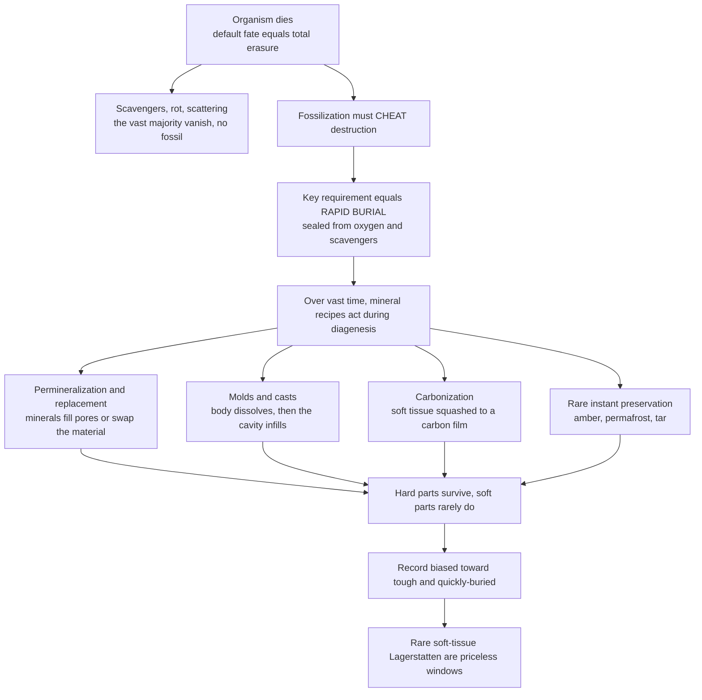

# 🪨 Fossils and the Fossilization Process

> [!abstract] TL;DR
> A **fossil** is any preserved remains, impression, or trace of a once-living organism from the geological past (conventionally older than the Holocene, ~10,000 years). Becoming one is among nature's rarest fates: the *default* outcome of death is **total erasure** by scavengers, decay, and physical destruction. Fossilization has to **cheat** that destruction — above all through **rapid burial** that seals a body from oxygen and scavengers before it vanishes — after which slow chemistry over deep time can turn remains to stone via **permineralization**, **replacement**, **mold-and-cast**, or **carbonization**, plus rare "instant" modes (**amber**, permafrost, tar). Because the filter favours **hard parts** that are **quickly buried** in **aquatic** settings, the record is a heavily biased sample. **Taphonomy** — everything between death and discovery — is therefore the foundational discipline of paleontology, and the rare soft-tissue **Lagerstätten** (Burgess Shale, Solnhofen, Messel) are priceless because they briefly defeat the filter.

## Intuition

**Analogy first.** Imagine being told you will win a lottery you never bought a ticket for. That is roughly the odds of any given animal becoming a fossil. When something dies, the world is efficiently set up to make it disappear: within hours scavengers arrive, within days bacteria liquefy the soft tissue, and within weeks currents, trampling, and weathering scatter and grind whatever is left to unrecognizable fragments. Erasure is not the exception — it is the rule, running automatically and almost always to completion.

For a fossil to exist, that normal machinery of destruction has to be *interrupted and cheated*. The single most powerful interruption is **rapid burial**: a mudslide, a sandbar, a fall of volcanic ash, a pool of tar, a sheet of ice — anything that quickly seals the body away from oxygen and scavengers. Only after the body is protected can the slow part begin: over thousands to millions of years, groundwater and minerals seep in and, following one of a few "recipes," convert perishable remains into durable rock. Because tough parts (bones, shells, teeth, wood) survive this gauntlet far more easily than fragile ones (skin, muscle, organs), the fossil record is not a fair census of past life — it is a heavily filtered highlight reel of the tough and the quickly-buried. Reading it honestly requires first understanding how brutally it was filtered.

---

## How It Works

**Fossilization is a survival filter with many gates.** An organism must pass *every* gate — escape scavenging, get rapidly buried, resist decay, survive the chemical changes of burial (diagenesis), avoid destruction by later erosion or metamorphism, then be re-exposed at the surface *and* found by someone — to end up in a museum drawer. Each gate rejects the overwhelming majority. The study of this whole journey from death to discovery is **taphonomy**, and it splits into two phases: **biostratinomy** (everything before final burial — death, decay, scavenging, disarticulation, transport) and **diagenesis** (the physical and chemical changes after burial that turn sediment-plus-remains into rock).

1. **Death.** The default trajectory is complete recycling by the biosphere.
2. **Cheat destruction via rapid burial.** Isolation from oxygen and scavengers is the decisive event; low-oxygen (anoxic) pore water further starves the microbes of decay. Aquatic and sedimentary settings — deltas, lake bottoms, seafloor, floodplains — bury constantly and so dominate the record.
3. **Mineralization over deep time.** Groundwater chemistry then acts through a small set of preservation modes:
   - **Permineralization** — dissolved minerals precipitate into the empty pore spaces of bone or wood, petrifying it (petrified wood, dinosaur bone).
   - **Replacement / recrystallization** — the original material is dissolved and swapped mineral-for-mineral (aragonite shell to calcite; wood or shell to **pyrite** or **silica**).
   - **Mold and cast** — the body dissolves entirely, leaving a cavity (mold) that later infills to make a cast.
   - **Compression / carbonization** — soft tissue is squashed and driven off as volatiles, leaving a thin **carbon film** (leaves, fish, graptolites).
   - **Unaltered / exceptional** — the original substance survives essentially intact: insects in **amber**, mammoths in **permafrost**, bones in **tar**.
4. **Survive the road to discovery.** Even a made fossil can be destroyed by erosion or metamorphism, or never re-exposed. What survives all of this is a biased sample skewed toward hard parts, quickly-buried, aquatic, abundant, and large organisms — which is exactly why soft-tissue **Lagerstätten** are treasured.



---

## Key Concepts

### Secondary Level

**What a fossil is.** Any evidence of past life preserved in the rock record and older than the Holocene (roughly >10,000 years). Two great families:

- **Body fossils** — the organism itself or a mineral copy of its parts: shells, bones, teeth, leaves, wood.
- **Trace fossils** (*ichnofossils*) — evidence of *activity* rather than the body: footprints and trackways, burrows, borings, and **coprolites** (fossil dung). A trace records what an animal *did*, not what it looked like. (Explored in the sibling note *Trace_Fossils_and_Ancient_Behavior*.)

**The two big requirements.** Fossilization is likely only when an organism has **durable hard parts** (bone, shell, teeth, wood, chitin) *and* is **rapidly buried** in the right setting — normally an aquatic or sediment-accumulating environment where burial outpaces decay.

**Basic modes of preservation:**

| Mode | What happens | Everyday example |
|------|--------------|------------------|
| **Unaltered remains** | original material sealed from decay | insect in **amber**, mammoth in **permafrost**, bones in **tar** |
| **Permineralization** | minerals fill the pore spaces | **petrified wood**, dinosaur bone |
| **Replacement** | original swapped mineral-for-mineral | shell to **pyrite** or silica |
| **Mold and cast** | body dissolves, cavity later infills | ammonite molds in limestone |
| **Carbonization** | tissue reduced to a thin carbon film | leaves, fish, graptolites |

### Undergraduate Level

**Taphonomy (Efremov, 1940).** The study of everything that happens to an organism *between death and discovery*. Its power is conceptual: the record is not a lament for what is missing but a **loss process to be modelled**. Each step subtracts information, and knowing the subtraction lets you reconstruct what was there.

- **Biostratinomy** — the pre-burial phase: death, microbial decay, scavenging and predation, **disarticulation** (joints falling apart), fragmentation, dissolution, and **transport** (which sorts and abrades remains, mixing a **death assemblage** that may be far from where the animals lived).
- **Diagenesis** — the post-burial phase: compaction, cementation, permineralization, replacement, dissolution, and recrystallization that lithify sediment and alter the remains within it.

**Modes of preservation, in detail.**
- **Permineralization** — the commonest mode for porous hard parts; groundwater precipitates silica, calcite, or apatite into voids, so the internal microstructure of bone or wood can survive in extraordinary detail.
- **Replacement / recrystallization** — original mineralogy is dissolved and reprecipitated. **Silicification** yields glassy, acid-etchable fossils; **pyritization** (iron sulfide, "fool's gold") occurs in anoxic, sulfate-rich, iron-bearing muds and can preserve fine detail.
- **Molds and casts** — an **external mold** records the outer surface, an **internal mold** (steinkern) the inner cavity; infilling either produces a **cast**.
- **Compression and carbonization** — burial pressure flattens tissue and drives off water and volatiles, concentrating carbon into a two-dimensional film; superb for plants, fish, and thin-cuticle animals.
- **Unaltered preservation** — original shell, unaltered bone, or organic material trapped in amber, tar, ice, or extreme desiccation.

**Environments and chemistry that help.** Preservation is favoured by **rapid sedimentation**, **low-energy** water (so remains are not smashed), and especially **anoxia** — oxygen-poor bottom waters and pore fluids suppress the aerobic microbes and burrowing scavengers (bioturbators) that otherwise destroy everything. This is why fine-grained, organic-rich muds (black shales) are disproportionately fossiliferous.

**Fossil assemblages and their bias.** An **autochthonous** assemblage is preserved essentially in place (a burrowed community, a coral reef); an **allochthonous** one has been transported and concentrated elsewhere. Paleontologists distinguish the **life assemblage** (the original living community), the **death assemblage** (the accumulated dead, already skewed toward the durable), and the **fossil assemblage** (what finally survives diagenesis and collection). **Time-averaging** compounds this: a single fossil bed can blend decades to millennia of dead organisms into one layer, so it is a smeared average, not a snapshot census. (The systematic biases this imposes on diversity counts are the subject of the sibling note *The_Fossil_Record_and_Its_Biases*.)

### Graduate Level

**Experimental and actualistic taphonomy.** Decay is now studied experimentally by rotting modern animals under controlled conditions (Briggs, Sansom, and others). A key finding is **stemward slippage**: as a carcass decays, the most diagnostic (often evolutionarily derived) characters are lost first, so a partially decayed fossil can be mistakenly reconstructed as a more primitive, stem-ward organism. Decay therefore does not merely remove data — it can systematically *bias phylogenetic placement*.

**Authigenic mineralization windows.** Exceptional soft-tissue preservation depends on a race between decay and mineral precipitation seeded by the decay itself. Microbial activity around a carcass locally changes pore-water chemistry (pH, redox, ion concentration), opening short-lived "taphonomic windows" for different minerals:
- **Phosphatization** (calcium phosphate / apatite) — preserves muscle and other soft tissue at cellular or sub-cellular scale (e.g. Cambrian "Orsten" microfossils); requires rapid onset within days.
- **Pyritization** — anoxic, low-organic, iron-rich, sulfate-bearing settings; preserves labile tissues as framboidal iron sulfide (Hunsrück Slate).
- **Kerogenization / carbonaceous compression** — recalcitrant biopolymers survive as carbon films (Burgess Shale).
- **Carbonate concretions** — early cementation can entomb a carcass in a nodule before it collapses, preserving three-dimensional shape.

**Lagerstätten — the exceptions that prove the filter.**
| Type | Meaning | Classic sites |
|------|---------|---------------|
| **Konservat-Lagerstätte** | exceptional *quality* — soft tissue preserved | Burgess Shale, Chengjiang, Solnhofen, Messel, Hunsrück |
| **Konzentrat-Lagerstätte** | exceptional *quantity* — remains concentrated | bone beds, shell coquinas |

These deposits briefly suspend the ordinary bias toward hard parts and are the empirical basis for much of what we know about soft-bodied clades and events such as the Cambrian explosion. (Molecular- and cellular-scale exceptional preservation is developed further in the sibling note *Molecular_Paleontology_and_Exceptional_Preservation*.)

**Quantifying the long shot.** Preservation potential can be modelled as a product of per-stage survival probabilities (see the Python demo). Because the terms multiply, hard/soft differences at each gate compound into orders-of-magnitude gaps in final fossilization probability — the mathematical root of the record's bias, and a reminder that *absence of evidence is rarely evidence of absence*. The broader consequences for reading diversity curves and extinction timing are taken up across *Paleontology_and_Deep_Time_Overview*, *The_Fossil_Record_and_Its_Biases*, and *Reading_Fossils_Morphology_and_Reconstruction*.

---

## Python Demo

```python
# Fossilization as a probability cascade (survival filter) + preservation bias.
# (a) An organism must survive EVERY taphonomic gate to become a found fossil;
#     probabilities multiply, so hard vs soft parts diverge by orders of magnitude.
# (b) Soft tissue decays fast, hard parts endure -> the record's built-in bias.
import numpy as np
import matplotlib.pyplot as plt

# -----------------------------------------------------------
# (a) THE SURVIVAL FILTER: cumulative probability through each gate
# -----------------------------------------------------------
stages = ["Died", "Escaped\nscavenging", "Rapid\nburial", "Survived\ndecay",
          "Survived\ndiagenesis", "Escaped\nerosion", "Re-exposed", "Found"]

# Per-stage survival probability: durable HARD parts vs fragile SOFT tissue.
p_hard = np.array([1.00, 0.30, 0.20, 0.60, 0.50, 0.40, 0.10, 0.05])
p_soft = np.array([1.00, 0.05, 0.10, 0.02, 0.30, 0.40, 0.10, 0.05])

cum_hard = np.cumprod(p_hard)   # probability of reaching each successive gate
cum_soft = np.cumprod(p_soft)

# -----------------------------------------------------------
# (b) PRESERVATION BIAS: surviving material fraction vs time since death
# -----------------------------------------------------------
t = np.linspace(0, 1.0e6, 500)          # years since death
tau_soft, tau_hard = 5.0e3, 5.0e5       # decay lifetimes: soft rots, bone endures
surv_soft = np.exp(-t / tau_soft) * 100.0
surv_hard = np.exp(-t / tau_hard) * 100.0

# -----------------------------------------------------------
# Plot
# -----------------------------------------------------------
fig, (ax1, ax2) = plt.subplots(1, 2, figsize=(13, 5))

x = np.arange(len(stages))
ax1.semilogy(x, cum_hard, "o-", color="#2563eb",
             label="Hard parts: bone, shell, wood")
ax1.semilogy(x, cum_soft, "s--", color="#dc2626",
             label="Soft tissue: skin, muscle")
ax1.set_xticks(x)
ax1.set_xticklabels(stages, fontsize=8)
ax1.set_ylabel("Cumulative survival probability, log scale")
ax1.set_title("Fossilization survival filter\nevery gate multiplies the long shot")
ax1.legend()
ax1.grid(True, which="both", alpha=0.3)

ax2.plot(t / 1e3, surv_soft, color="#dc2626", label="Soft tissue, tau = 5 kyr")
ax2.plot(t / 1e3, surv_hard, color="#2563eb", label="Hard parts, tau = 500 kyr")
ax2.set_xlabel("Time since death, thousand years")
ax2.set_ylabel("Surviving material, percent")
ax2.set_title("Preservation bias\nsoft tissue vanishes, hard parts persist")
ax2.legend()
ax2.grid(True, alpha=0.3)

plt.tight_layout()
plt.savefig("fossilization_probability.png", dpi=120)
plt.show()

# The punchline: the record over-represents the tough and quickly-buried.
print(f"P(hard part becomes a found fossil) = {cum_hard[-1]:.2e}")
print(f"P(soft tissue becomes a found fossil) = {cum_soft[-1]:.2e}")
print(f"Hard-part preservation advantage = {cum_hard[-1] / cum_soft[-1]:.0f}x")
# Expected: hard parts survive the cascade ~600x more often, and after 100 kyr
# almost no soft tissue remains while most hard-part mass still persists.
```

---

## Real-World Applications

- **Petrified Forest (Arizona) and fossil wood** — textbook **permineralization**: silica-rich groundwater from volcanic ash filled the cell lumens of buried logs, casting the wood in quartz while preserving growth rings and cell walls.
- **La Brea Tar Pits (Los Angeles)** — asphalt seeps trapped and impregnated bones of Ice Age mammals (dire wolves, sabre-tooths, mammoths), a **Konzentrat-Lagerstätte** giving a dense census of Pleistocene megafauna.
- **Siberian and Alaskan permafrost mammoths** — freezing halts decay so completely that skin, hair, stomach contents, and even blood-like fluid survive tens of thousands of years, enabling ancient-DNA and diet studies.
- **Baltic and Dominican amber** — tree resin entombs insects, spiders, and even feathers in three dimensions, preserving external anatomy that sediment never could (though DNA does not survive on those timescales).
- **Burgess Shale (British Columbia) and Chengjiang (China)** — carbonaceous compression of soft-bodied Cambrian animals; the primary empirical window on early animal body plans.
- **Petroleum micropaleontology** — foraminifera and pollen preserved by rapid marine/deltaic burial are used to date and correlate well cores, directly guiding drilling.

---

## Common Pitfalls

- **Assuming the fossil is the original organism.** Most body fossils are **replaced or permineralized** — "petrified wood" is quartz, not wood; a pyritized ammonite is fool's gold shaped like a shell. The *form* survives; the *substance* usually does not.
- **Treating the record as a fair census.** Because preservation probabilities multiply across gates and favour hard parts, the record systematically over-represents durable, marine, abundant, large taxa. Never read raw abundance as true past abundance.
- **Confusing the death assemblage with the life community.** Transport and time-averaging mix and sort remains; the fossils in one bed may never have lived together, or even nearby.
- **Reading a single bed as a snapshot.** Time-averaging can blend millennia into one layer; a "community" on a bedding plane is often a temporal composite.
- **Absence of evidence as evidence of absence.** A gap in a lineage is usually a *preservation* failure, not a true extinction or absence — hence ghost lineages inferred from phylogeny.
- **Ignoring decay bias in reconstruction.** Stemward slippage means partially decayed soft-bodied fossils can be mis-scored as more primitive than they were; decay removes derived characters first.
- **Confusing a trace with its maker.** One animal makes many ichnotaxa (a trackway, a resting mark, a burrow); similar traces can be made by unrelated animals, so a trace fossil names a behaviour, not a species.

---

## Related Concepts

- [[Fossils_and_the_Fossil_Record]] — Earth-Science companion: once a fossil forms, how it is *used* as an index fossil, environmental proxy, and record of evolution
- [[Sedimentary_Rocks_and_Environments]] — nearly all fossils are preserved in sediment; rapid burial and depositional setting control what is recorded
- [[What_Is_a_Mineral]] — permineralization and replacement are mineral-precipitation processes; the minerals (silica, calcite, apatite, pyrite) that build fossils
- [[Biogeochemical_Cycles]] — decomposition and nutrient recycling are the *default* fate that fossilization must interrupt
- [[Ecosystems_and_Energy_Flow]] — decomposers process the dead; fossilization is a rare escape from that recycling loop
- [[Relative_Dating_and_Stratigraphy]] — fossils read in their burial (stratigraphic) context order and correlate strata
- [[Mass_Extinctions_and_Paleoclimate]] — reading extinctions honestly requires correcting for the taphonomic filter described here
- [[Weathering_and_Soils]] — erosion and surface exposure form the final taphonomic gate between a buried fossil and its discovery

---

## Review Questions

1. **Secondary:** A jellyfish and a clam die together in the same lagoon. Which is far more likely to become a fossil, and why? Name the two conditions that most favour preservation.
2. **Undergraduate:** Distinguish biostratinomy from diagenesis, and explain how anoxia and rapid sedimentation each improve preservation potential. Why is a "death assemblage" a biased sample of the original living community?
3. **Graduate:** Explain why preservation probability is best modelled as a *product* of per-stage survival terms, and what that multiplicative structure implies for hard-part versus soft-part representation. Then describe how experimental taphonomy's "stemward slippage" could bias the phylogenetic placement of a soft-bodied Lagerstätte fossil.

---

## Sources

- Prothero, D. — *Bringing Fossils to Life: An Introduction to Paleobiology*, 3rd ed. (McGraw-Hill)
- Behrensmeyer, A.K., Kidwell, S.M., & Gastaldo, R.A. (2000) — "Taphonomy and paleobiology," *Paleobiology* 26 (S4), 103–147
- Efremov, I.A. (1940) — "Taphonomy: a new branch of paleontology," *Pan-American Geologist* 74, 81–93
- Allison, P.A. & Bottjer, D.J. (eds.) (2011) — *Taphonomy: Process and Bias Through Time*, 2nd ed. (Springer, Topics in Geobiology 32)
- Briggs, D.E.G. (2003) — "The role of decay and mineralization in the preservation of soft-bodied fossils," *Annual Review of Earth and Planetary Sciences* 31, 275–301

#paleontology #fossilization #taphonomy #preservation #lagerstatten
