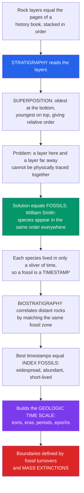

# 🪨 Geologic Time and Stratigraphy

> [!abstract] TL;DR
> **Stratigraphy** is the science of reading rock **strata** (layers) like the ordered pages of a colossal history book. Its founding principle is **superposition** — in an undisturbed stack, the oldest layer is at the bottom and the youngest on top — which orders events in *relative* time even without any dates. The paleontology contribution is **biostratigraphy**: because life is always evolving, each species occupies only a narrow sliver of time and appears in the **same order worldwide** (William Smith's *faunal succession*), so a **fossil is a timestamp**. The best timestamps — widespread, abundant, fast-evolving, short-lived taxa — are **index fossils**, and matching them lets us **correlate** far-flung rocks and build the **geologic time scale** whose very boundaries are drawn at the great faunal turnovers and **mass extinctions**. This note is the paleontology/biostratigraphy companion to Earth Science's [[Geologic_Time_Scale]].

---

## Intuition

**Analogy first.** Imagine the layers of rock beneath your feet as the pages of an enormous history book, stacked in the order they were written. Every page (layer) was laid down on top of the ones before it, exactly like a stack of newspapers on a doorstep — *yesterday's* paper is buried under *today's*. Stratigraphy is simply the skill of reading that stack in order.

That gives you the first great insight, **superposition**: bottom = oldest, top = youngest. You can now say *this happened before that* — **relative** order — without knowing a single date. But a nasty problem appears the moment you look up: a rock layer in the Grand Canyon and a layer in England cannot be physically traced to one another across an ocean, so how could you ever know they are the *same age*? The genius fix is **fossils**. William Smith noticed that each layer carries a characteristic set of fossils and that fossil species appear in the **same order everywhere on Earth**. Because life never stops evolving, a given species existed only during one thin sliver of time — so finding the same distinctive fossil in two far-apart rocks means they are the **same age**. Fossils tell time; time frames the fossils; the two are inseparable, and that is why deep time is written in bone as much as in stone.

---

## How It Works

### Core mechanics

1. **Order the layers (relative dating).** Sedimentary strata obey a small set of common-sense principles — **superposition** (younger on top), **original horizontality** (layers deposit flat), **lateral continuity** (a layer extends until it thins or hits a barrier), and **cross-cutting relationships** (a fault or intrusion is younger than what it cuts). Together they let you sequence events in one outcrop.
2. **Turn fossils into timestamps.** By the **principle of faunal succession**, fossil assemblages follow a fixed, worldwide order. Each taxon has a **first-appearance datum (FAD)** and a **last-appearance datum (LAD)** — the moments it evolved and went extinct — bracketing its **stratigraphic range**.
3. **Correlate distant rocks (biostratigraphy).** Match the same fossil (ideally an **index fossil**) between sections at different locations; matching layers are the same age. Overlapping ranges of several taxa subdivide time into **biozones**, giving resolution far finer than any single fossil.
4. **Assemble the calendar.** Stitching correlated sections worldwide produces a composite column, and that column *is* the **geologic time scale** — eons → eras → periods → epochs → ages. Its major boundaries are drawn where the fossils change abruptly, above all at **mass extinctions**.
5. **Calibrate with numbers.** The sequence was built *relatively* first; only later did [[Radiometric_Dating|radiometric dating]] hang **absolute ages** (in millions of years, Ma) on the boundaries, and **magnetostratigraphy** and **astrochronology** sharpen them further.

### Flow / architecture



---

## Key Concepts

### Secondary Level — the logic of ordering

- **Strata and superposition.** Rock layers stack oldest-at-bottom, youngest-on-top. This alone lets you build a *relative* history of events.
- **Faunal succession.** Fossils follow a predictable, worldwide order because life evolves. A trilobite-bearing layer is always older than a dinosaur-bearing one, on every continent.
- **Index fossils.** The ideal time markers are **geographically widespread, abundant, easily identified, short-ranged (fast-evolving), and environment-independent** — classics include **ammonites, trilobites, graptolites, conodonts, and foraminifera**. A single unusual shell can pin a rock's age.
- **The big picture.** Ordering the layers plus timing them with fossils yields Earth's master calendar, the **geologic time scale**, split into **eons, eras, periods, and epochs**. The three familiar eras are **Paleozoic** ("old life"), **Mesozoic** ("middle life", the dinosaurs), and **Cenozoic** ("recent life", the mammals).

### Undergraduate Level — biostratigraphy and the time scale

- **The full relative-dating toolkit.** Beyond superposition: **original horizontality**, **lateral continuity**, **cross-cutting relationships**, and **inclusions** (a fragment is older than the rock enclosing it).
- **Unconformities — gaps in the book.** A missing interval of time shows up as an **unconformity**: a **disconformity** (parallel layers, hidden gap), an **angular unconformity** (tilted then re-buried layers), or a **nonconformity** (sediment over eroded igneous/metamorphic basement). Reading the record means accounting for the missing pages, not just the present ones.
- **Biozones and datums.** A **range zone** is the interval a single taxon spans; a **concurrent-range zone** is defined by the *overlap* of two taxa; **assemblage zones** use a whole fauna; **acme zones** use a peak in abundance. **FAD/LAD** boundaries let biostratigraphers correlate to sub-stage resolution.
- **The three core stratigraphies.** **Lithostratigraphy** groups rock by physical character (the mappable **formation**); **biostratigraphy** groups by fossil content (**zones**); **chronostratigraphy** groups by time (time-rock units). These often *cross-cut* each other — a single formation can span several biozones.
- **How the scale was built.** The 19th-century pioneers (Smith, Sedgwick, Murchison, Lyell) fixed the *sequence* of periods from strata and fossils with **no clocks**, then radiometric dating supplied numbers after 1905. The scale is therefore a **relative framework calibrated by absolute ages** — see [[Geologic_Time_Scale]].
- **Boundaries are biological.** The Paleozoic–Mesozoic line is the **end-Permian ("Great Dying")** extinction; the Mesozoic–Cenozoic line is the **K–Pg** asteroid extinction. The chart's biggest divisions coincide with the events in [[Mass_Extinctions_and_Paleoclimate]].

### Graduate Level — integration and formal definition

- **Time-rock vs time units.** Chronostratigraphy names bodies of **rock** (**Eonothem, Erathem, System, Series, Stage**); geochronology names the corresponding intervals of **time** (**Eon, Era, Period, Epoch, Age**). You collect fossils from the *Jurassic **System*** but say a dinosaur lived in the *Jurassic **Period***. Conflating them is the classic exam trap.
- **GSSPs — the golden spikes.** Since the 1970s the **International Commission on Stratigraphy** defines the base of each **stage** with a **Global Boundary Stratotype Section and Point** — a literal golden spike in one agreed outcrop (e.g., the Permian–Triassic base at **Meishan, China**). Where no correlatable strata exist (deep Precambrian), boundaries are instead **GSSAs**, fixed at a chosen round number of years.
- **Beyond fossils.** **Magnetostratigraphy** correlates by the pattern of geomagnetic reversals; **chemostratigraphy** uses isotope excursions (e.g., δ¹³C, ⁸⁷Sr/⁸⁶Sr); **sequence stratigraphy** correlates by sea-level-driven depositional packages; **astrochronology** counts Milankovitch cycles in the sediment for sub-precession resolution.
- **The integrated time scale.** Modern practice fuses **biostratigraphy + radiometric ages + magnetostratigraphy + astrochronology** into one calibrated, global scale. This deep-time framework underlies every claim about *when* a lineage arose, *how fast* it changed, or *how abruptly* an extinction struck — it is the backbone of the whole history-of-life narrative.

---

## Python Demo

```python
# Biostratigraphy demo (numpy + matplotlib):
#   (a) correlate three stratigraphic sections using shared index fossils
#       -> "same fossil = same age", even though rock thickness is NOT time
#   (b) a fossil range chart whose overlapping ranges define biozones
# Convention: age in Ma; OLDER at the bottom, YOUNGER at the top.
import numpy as np
import matplotlib.pyplot as plt

# Six index taxa: name, first-appearance datum (FAD, older),
# last-appearance datum (LAD, younger), colour.
# Short, overlapping ranges are what make good time markers.
taxa = [
    ("P", 200, 182, "#7c3aed"),
    ("Q", 190, 170, "#2563eb"),
    ("R", 178, 160, "#059669"),
    ("S", 168, 150, "#d97706"),
    ("T", 158, 144, "#dc2626"),
    ("U", 150, 140, "#0891b2"),
]

# Datum ages used as correlation tie-points (FADs plus a final LAD).
datums = [200, 190, 178, 168, 158, 150, 140]

# Each section: name, x-centre, base age (bottom), top age,
# stratigraphic thickness (arbitrary units), optional unconformity gap.
sections = [
    ("Section 1\n(complete)",              0.0, 200, 150, 4.0, None),
    ("Section 2\n(thick basin)",           4.0, 200, 140, 6.0, None),
    ("Section 3\n(condensed +\nunconformity)", 8.0, 200, 140, 3.2, (178, 158)),
]

def age_to_y(age, base, top, thick):
    # older (base) -> y = 0 ; younger (top) -> y = thickness
    return thick * (base - age) / (base - top)

fig, (axL, axR) = plt.subplots(1, 2, figsize=(13, 7))

# ---- Panel A: correlation by index fossils ----
colW = 1.1
ypos = {}  # (section index, datum age) -> y
for si, (name, xc, base, top, thick, gap) in enumerate(sections):
    axL.add_patch(plt.Rectangle((xc - colW/2, 0), colW, thick,
                                facecolor="#f5f5f4", edgecolor="black", zorder=1))
    axL.text(xc, thick + 0.25, name, ha="center", va="bottom", fontsize=9)
    for age in datums:
        if age > base or age < top:
            continue                       # outside this section's recorded range
        if gap and gap[1] < age < gap[0]:
            continue                       # inside the unconformity -> not recorded
        y = age_to_y(age, base, top, thick)
        ypos[(si, age)] = y
        col = next((c for (n, f, l, c) in taxa if f == age), "black")
        axL.plot(xc, y, "o", color=col, ms=9, zorder=3)
        axL.text(xc + colW/2 + 0.08, y, f"{age} Ma", va="center", fontsize=7)
    if gap:                                # draw the wavy unconformity surface
        yg = age_to_y(gap[0], base, top, thick)
        xs = np.linspace(xc - colW/2, xc + colW/2, 40)
        axL.plot(xs, yg + 0.06*np.sin(xs*20), color="#b91c1c", lw=2, zorder=4)

# Tie-lines: connect equal-age datums between sections (the time lines that
# shared index fossils reveal). They are NOT flat -> thickness is not time.
for age in datums:
    pts = [(sections[si][1], ypos[(si, age)]) for si in range(len(sections))
           if (si, age) in ypos]
    if len(pts) >= 2:
        axL.plot([p[0] for p in pts], [p[1] for p in pts],
                 "--", color="gray", lw=1, zorder=2)

axL.set_xlim(-1.3, 9.7)
axL.set_ylim(0, 7)
axL.set_title("(a) Correlation by index fossils\n"
              "same fossil = same age; tie-lines are NOT flat\n"
              "(rock thickness is not time; note the missing zone)")
axL.set_ylabel("stratigraphic height  (up = younger)")
axL.set_xticks([])

# ---- Panel B: fossil range chart / biozones ----
for i, (n, fad, lad, col) in enumerate(taxa):
    axR.plot([i, i], [fad, lad], color=col, lw=8, solid_capstyle="butt")
    axR.text(i, fad + 2, n, ha="center", va="bottom", fontsize=9, color=col)

# One concurrent-range zone: the overlap of taxa R and S (168-160 Ma).
axR.axhspan(160, 168, color="gray", alpha=0.20)
axR.text(5.2, 164, "concurrent-range\nzone: R + S", fontsize=8, va="center")

axR.set_ylim(205, 138)                     # inverted: older at the bottom
axR.set_xlim(-0.7, 6.6)
axR.set_xticks(range(len(taxa)))
axR.set_xticklabels([t[0] for t in taxa])
axR.set_ylabel("age (Ma)  --  older at bottom")
axR.set_xlabel("index taxon")
axR.set_title("(b) Fossil range chart\noverlapping ranges subdivide time into biozones")
axR.grid(axis="y", ls=":", alpha=0.5)

plt.tight_layout()
plt.savefig("biostratigraphy_correlation.png", dpi=130)
plt.show()

# Takeaways:
#  - The dashed tie-lines slope because equal AGES sit at different HEIGHTS
#    in each section (different sedimentation rates) -> thickness != time.
#  - Section 3 is missing the 168 Ma zone across an unconformity: a gap in
#    the record you would misread if you ignored the absent fossils.
#  - Overlapping ranges (panel b) define biozones far finer than any one taxon.
```

---

## Real-World Applications

> **Example:** **Petroleum and coal exploration runs on biostratigraphy.** As a well is drilled, cuttings are washed for microfossils — **foraminifera, nannofossils, palynomorphs, conodonts** — and their FAD/LAD zones are tied to the geologic time scale. Because these index taxa are the same age worldwide, a biostratigrapher can tell an operator *which* stratigraphic layer the bit is in kilometres underground, correlate the source rock, reservoir, and seal between wells, and predict what lies ahead — a multi-billion-dollar payoff for reading fossils as timestamps.

- **The K–Pg boundary worldwide.** The same iridium anomaly, shocked quartz, and the abrupt disappearance of ammonites and non-avian dinosaurs define the Cretaceous–Paleogene boundary on every continent — a global time line fixed by a faunal turnover, formalized by a GSSP at El Kef, Tunisia.
- **The Meishan golden spike.** A single bed in China's Meishan section physically defines the Permian–Triassic base and the largest extinction in the fossil record — a boundary you can put your finger on.
- **Ocean-drilling calibration.** Deep-sea cores integrate biostratigraphy with **magnetostratigraphy** and **astrochronology** to date the Cenozoic to within a few thousand years, including events like the Paleocene–Eocene Thermal Maximum.
- **Forensic and archaeological correlation.** Pollen and diatom assemblages (a biostratigraphic logic at fine scale) tie sediment samples to specific times and places.

---

## Common Pitfalls

- **Confusing thickness with time.** A thick sandstone can represent less time than a thin shale; sedimentation rates vary wildly and unconformities remove time entirely. The Python demo's sloping tie-lines make this concrete — equal ages sit at unequal heights.
- **Ignoring the gaps.** Unconformities mean the rock record is *incomplete*; a "sudden" first appearance may just be the top of a hidden gap. Reading only the present pages, not the missing ones, produces false abruptness.
- **Confusing "Period" with "System."** *Period/Epoch/Age* are intervals of **time** (geochronology); *System/Series/Stage* are the bodies of **rock** (chronostratigraphy). Use the right word for the right object.
- **Choosing a bad index fossil.** A long-ranging, facies-controlled, or geographically restricted taxon gives coarse or misleading correlations. Good index fossils are widespread, abundant, short-lived, and environment-independent.
- **Reworking and contamination.** Fossils eroded from older rock and redeposited in younger layers ("reworked" specimens) can make a bed look older than it is; caving of drill cuttings does the reverse. Always cross-check with multiple taxa.
- **Treating boundary ages as fixed.** The base of the Cambrian, once quoted as 542 Ma, is now 538.8 Ma; ICS ages are revised as dating improves. Cite the chart version.
- **Assuming the scale is purely radiometric.** The *sequence* of periods was fixed by superposition and fossils long before any absolute number existed; radiometry *calibrated* an existing relative framework.

---

## Related Concepts

- [[Geologic_Time_Scale]] — the Earth Science companion to this note; the same master calendar viewed from the geochronology/GSSP side (this note supplies the paleontology/biostratigraphy emphasis)
- [[Relative_Dating_and_Stratigraphy]] — superposition, original horizontality, cross-cutting, and faunal succession: the ordering logic beneath biostratigraphy
- [[Fossils_and_the_Fossil_Record]] — what fossils are and how index fossils correlate strata worldwide
- [[Radiometric_Dating]] — the isotopic clocks that hang absolute ages (Ma) on the relatively-ordered framework
- [[Mass_Extinctions_and_Paleoclimate]] — the great faunal turnovers that define the era and period boundaries
- [[Sedimentary_Rocks_and_Environments]] — how the layers themselves form, and the depositional settings that biostratigraphy correlates
- [[Earths_History_Hadean_to_Phanerozoic]] — the narrative of Earth history that this time framework organizes
- [[The_Rock_Cycle]] — Hutton's endless recycling, where the very idea of *deep time* was born

*Sibling notes planned for this vault (prose references, not yet created): a Paleontology and Deep Time overview; Dating the Past — Radiometric and Relative; The Fossil Record and Its Biases; Mass Extinctions and the Big Five; and Paleozoic Life and the Colonization of Land.*

---

## Review Questions

1. **Secondary:** State the principle of superposition and the principle of faunal succession. What five qualities make a fossil a good *index fossil*, and why does each one matter?
2. **Undergraduate:** Two rock sections on different continents cannot be traced to each other. Explain step by step how biostratigraphy establishes that a given layer in each is the *same age*, and how overlapping FAD/LAD ranges build a biozone finer than any single fossil. What does an unconformity do to this reasoning?
3. **Graduate:** Distinguish chronostratigraphy from geochronology using the Jurassic as an example, and contrast a **GSSP** with a **GSSA**. How do magnetostratigraphy and astrochronology combine with biostratigraphy and radiometric dating to produce a single calibrated global time scale, and why are the biggest boundaries drawn at mass extinctions rather than at round-number ages?

---

## Sources

- Prothero, D. R. — *Bringing Fossils to Life: An Introduction to Paleobiology* (McGraw-Hill)
- Stanley, S. M. & Luczaj, J. A. — *Earth System History* (W. H. Freeman)
- Gradstein, F. M., Ogg, J. G., Schmitz, M. D. & Ogg, G. M. (eds.) — *A Geologic Time Scale (GTS2020)* (Elsevier)
- Winchester, S. — *The Map That Changed the World: William Smith and the Birth of Modern Geology* (HarperCollins)
- Cohen, K. M. et al. — *The ICS International Chronostratigraphic Chart* (stratigraphy.org, updated periodically)

---

#paleontology #stratigraphy #biostratigraphy #geologic-time #index-fossils
