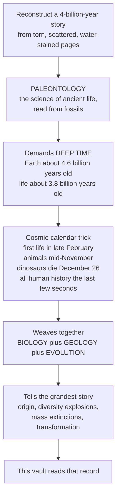

# 🦕 Paleontology and Deep Time

> [!abstract] TL;DR
> **Paleontology** is the science of ancient life — the detective work of reconstructing whole organisms and vanished ecosystems from **fossils**, the fragmentary scraps that survived across an almost unimaginable span of time. Its foundational idea is **deep time**: Earth is roughly **4.6 billion years** old and life roughly **3.5–3.8 billion**, spans so vast the human mind cannot natively grasp them. Compress all of Earth's history into one calendar year and complex animals appear only in mid-**November**, the dinosaurs die on **December 26**, and *all of recorded human history is the last few seconds before midnight on December 31*. By weaving together **biology** (the organisms), **geology** (the rocks and the clock), and **evolution** (the connecting thread of descent), paleontology tells the grandest story there is — life's origin, its explosive diversifications, its catastrophic **mass extinctions**, and its ceaseless transformation. This note is the hub that frames the whole vault.

---

## Intuition

**Analogy — the detective and the torn book.** Imagine trying to reconstruct the entire four-billion-year history of a story from a handful of torn, scattered, water-stained pages. Most of the book has rotted away; the few surviving fragments are out of order, faded, and hard to read. That is paleontology: the science that reconstructs ancient organisms and whole vanished ecosystems from the scraps they left behind. You never get the full text — you get pottery-shard fragments and must infer the rest.

The single most mind-bending thing this detective work demands is **deep time**. Earth is about 4.6 billion years old; life about 3.8 billion. Those numbers are literally beyond intuition, so paleontologists use a trick — **the cosmic calendar**. Squeeze all of Earth's history into one ordinary year. Earth forms at midnight on **January 1**. The first microbial life flickers into being in **late February**. For nine long months nothing but microbes. Complex animals do not appear until the **Cambrian explosion** in **mid-November**. Dinosaurs rule mid-to-late December and are wiped out on **December 26**. And *everything* humans have ever written down — every pyramid, empire, equation, and tweet — is squeezed into the final **few seconds** before midnight on December 31. We are a cosmic afterthought, a very recent chapter in an ancient and ongoing story. Paleontology is the science that reads that story.

---

## How It Works

### Core Mechanics

1. **Fossils are the primary data.** A fossil is any preserved trace of past life — a bone, a shell, a leaf film, a footprint, a burrow, even a biomolecule. The processes that turn a dead organism into a fossil (**taphonomy**) are rare and selective, so the record is a *biased, incomplete sample* rather than a fair census.
2. **Rocks supply the clock.** Layered (**stratigraphic**) rock records superposition — deeper is older — while **radiometric dating** of mineral crystals pins absolute ages in millions of years. Together they build the **geologic time scale**.
3. **Biology supplies the interpretation.** Comparative anatomy, functional morphology, and living analogues let us reconstruct how extinct organisms looked, moved, and lived.
4. **Evolution is the connecting thread.** The fossil record is the *only* direct archive of life's change through time — transitional forms, radiations, and extinctions read in temporal order.
5. **The three sciences fuse.** Paleontology sits at the intersection of biology, geology, and evolutionary theory (with chemistry and physics supplying the dating and biomarker tools). No single discipline can read the record alone.

### Flow / Architecture



---

## Key Concepts

### 🟢 Secondary

- **What a fossil is.** Any evidence of ancient life preserved in rock — body fossils (bones, shells) and trace fossils (tracks, burrows). Most organisms leave *nothing*; fossilization is the exception, not the rule.
- **Deep time.** Earth is about 4.6 billion years old; life about 3.5–3.8 billion. The cosmic-calendar analogy shows humans occupy only the final seconds.
- **The three big questions paleontology answers.** *What* lived in the past, *when* it lived, and *how* it changed — the origin, diversity, and extinction of life.
- **The geologic time scale (orientation).** Time is divided into **eons** (Hadean, Archean, Proterozoic, Phanerozoic), then **eras** (Paleozoic "old life," Mesozoic "middle life / age of dinosaurs," Cenozoic "recent life / age of mammals"). Names come from the rock strata and the fossils in them.

### 🟡 Undergraduate

- **Uniformitarianism.** James Hutton saw "no vestige of a beginning, no prospect of an end" in the rock record; Charles Lyell popularized the principle "**the present is the key to the past**" — the same slow processes (erosion, sedimentation, decay) operating today operated for eons. This **deep-time revolution** is what made **evolution** conceivable: natural selection needs vast time to work.
- **Interdisciplinary structure.** Paleontology braids biology, geology, evolutionary theory, chemistry, and physics. Its subfields include **paleobiology** (evolution and ecology of ancient life), **taphonomy** (death, burial, preservation), **biostratigraphy** (dating rocks by their fossils), **paleoecology** (ancient communities and environments), **paleoclimatology** (past climates), and **paleoanthropology** (human origins).
- **The fossil record as evidence for evolution.** Fossils show the *temporal order* of life's change: transitional forms (e.g. *Tiktaalik*, *Archaeopteryx*), the appearance and disappearance of whole groups, and nested patterns of shared traits that match the branching **tree of life**.
- **The Big Five mass extinctions.** Five catastrophic drops in diversity — end-Ordovician, Late Devonian, end-Permian (the "Great Dying," about 90 percent of marine species lost), end-Triassic, and end-Cretaceous (**K-Pg**, which ended the non-avian dinosaurs). Each was followed by recovery and radiation of survivors.

### 🔴 Graduate

- **Why deep time is cognitively hard — and foundational.** Human intuition is tuned to lifespans and generations, not to 10^9-year scales. The perceived incompleteness of the record (the **Signor–Lipps effect**, which smears sharp extinctions into gradual-looking declines) and sampling bias must be corrected with quantitative methods before any pattern is trusted.
- **Life and Earth co-evolve.** The biosphere is not a passenger. The **Great Oxidation Event** (about 2.4 Ga), driven by cyanobacterial photosynthesis, remade the atmosphere; carbonate and silicate weathering couple life to the long-term carbon cycle; extinctions reorganize entire ecosystems. Paleontology reads a *coupled Earth–life system*, not organisms against a static backdrop.
- **Reconstructing biodiversity through time.** Diversity curves (families or genera per stage, e.g. Sepkoski's compendia) require **rarefaction** and **sampling standardization** (subsampling) to separate genuine signal from the "pull of the recent" and rock-availability bias. Macroevolutionary rates (origination and extinction) are estimated from these standardized series.
- **Conservation paleobiology and astrobiology.** The deep-time record supplies baselines for the current biodiversity crisis (extinction rates, ecosystem resilience, recovery timescales) and calibrates the search for life beyond Earth — the earliest terrestrial biosignatures (stromatolites, isotopic carbon fractionation) are the templates for what we hunt for on Mars.

---

## Python Demo

```python
# Deep time made visible:
#   (A) The Cosmic Calendar -- 4.6 billion years compressed into one year
#   (B) Marine biodiversity through the Phanerozoic, punctuated by the Big Five
# Pure numpy + matplotlib, fully runnable.

import numpy as np
import matplotlib.pyplot as plt

# ----------------------------------------------------------------------
# (A) THE COSMIC CALENDAR
# ----------------------------------------------------------------------
AGE_EARTH = 4600.0  # million years ago that Earth formed (4.6 Ga)

# (label, age in millions of years before present)
events = [
    ("Earth forms",          4600.0),
    ("First life (cells)",   3800.0),
    ("Great Oxidation",      2400.0),
    ("Cambrian explosion",    541.0),
    ("Land plants",           470.0),
    ("First dinosaurs",       230.0),
    ("K-Pg extinction",        66.0),
    ("First Homo",              2.5),
    ("Recorded history",       0.005),
]

# Map an age onto a day-of-year: age 4600 -> day 0 (Jan 1), age 0 -> day 365 (midnight).
def age_to_day(age):
    return (AGE_EARTH - age) / AGE_EARTH * 365.0

days = np.array([age_to_day(age) for _, age in events])

# Month boundaries (cumulative days at the start of each month, non-leap year).
month_len = np.array([31,28,31,30,31,30,31,31,30,31,30,31])
month_start = np.concatenate([[0], np.cumsum(month_len)])
month_names = ["Jan","Feb","Mar","Apr","May","Jun",
               "Jul","Aug","Sep","Oct","Nov","Dec"]

fig, (axA, axB) = plt.subplots(2, 1, figsize=(12, 9))

# Draw the "year" as a horizontal bar.
axA.hlines(0, 0, 365, color="#334155", lw=6, zorder=1)
for m0, name in zip(month_start[:-1], month_names):
    axA.axvline(m0, color="#cbd5e1", lw=0.8, zorder=0)
    axA.text(m0 + 15, -0.55, name, ha="center", va="top", fontsize=8, color="#64748b")

# Alternate label heights so text does not overlap near year's end.
for i, ((label, age), d) in enumerate(zip(events, days)):
    up = (i % 2 == 0)
    y = 0.35 if up else -0.35
    axA.plot(d, 0, "o", ms=9, color="#dc2626", zorder=3)
    axA.annotate(f"{label}\n({age:g} Ma)",
                 xy=(d, 0), xytext=(d, y),
                 ha="center", va="bottom" if up else "top",
                 fontsize=8,
                 arrowprops=dict(arrowstyle="-", color="#94a3b8", lw=0.8))

axA.set_xlim(-5, 372)
axA.set_ylim(-1.1, 1.1)
axA.set_yticks([])
axA.set_title("The Cosmic Calendar: 4.6 billion years compressed into one year\n"
              "(all of human history is the last ~30 seconds of Dec 31)",
              fontsize=11, weight="bold")
axA.set_xlabel("Day of the compressed year")

# ----------------------------------------------------------------------
# (B) PHANEROZOIC MARINE BIODIVERSITY + THE BIG FIVE
# ----------------------------------------------------------------------
# Synthetic but plausible: logistic rise in number of marine families,
# punctuated by 5 mass-extinction crashes, each followed by recovery.
N = 2000
t = np.linspace(541.0, 0.0, N)          # Ma before present, past -> present
div = np.zeros(N)

d = 250.0                                # starting family count
carrying = 1300.0                        # long-term ceiling
growth = 0.006                           # per-step relative growth

# Big Five: {boundary age in Ma : fractional diversity LOST}
big_five = {444: 0.42, 372: 0.35, 252: 0.80, 201: 0.45, 66: 0.42}
names5   = {444: "End-Ordovician", 372: "Late Devonian",
            252: "End-Permian", 201: "End-Triassic", 66: "K-Pg"}
applied = set()

for i in range(N):
    d += growth * d * (1.0 - d / carrying)          # logistic recovery/growth
    for b in sorted(big_five, reverse=True):
        if b not in applied and t[i] <= b:
            d *= (1.0 - big_five[b])                 # sudden crash
            applied.add(b)
    div[i] = d

axB.plot(t, div, color="#0f766e", lw=2)
axB.fill_between(t, 0, div, color="#5eead4", alpha=0.35)

for b, loss in big_five.items():
    axB.axvline(b, color="#dc2626", ls="--", lw=1)
    axB.text(b, div.max()*1.02, f"{names5[b]}\n-{int(loss*100)}%",
             ha="center", va="bottom", fontsize=7.5, color="#b91c1c")

axB.invert_xaxis()                                   # time runs left(old) -> right(now)
axB.set_xlim(541, 0)
axB.set_ylim(0, div.max()*1.15)
axB.set_xlabel("Millions of years before present (Phanerozoic)")
axB.set_ylabel("Marine families (schematic)")
axB.set_title("Biodiversity through the Phanerozoic: overall rise punctuated by the Big Five",
              fontsize=11, weight="bold")

plt.tight_layout()
plt.savefig("deep_time_overview.png", dpi=120)
print("First life appears on cosmic-calendar day:",
      round(age_to_day(3800), 1), "(late February)")
print("Dinosaurs die on cosmic-calendar day:",
      round(age_to_day(66), 1), "(December 26)")
print("Recorded history occupies the final",
      round((365 - age_to_day(0.005)) * 24 * 3600, 1), "seconds")
```

Panel A drives home the scale — first life lands in late February and every written record is the final blink of December 31. Panel B shows the deep pattern paleontology exists to explain: diversity rises over half a billion years but is repeatedly slashed by the Big Five, the largest being the end-Permian "Great Dying."

---

## Real-World Applications

- **Understanding evolution and biodiversity's origin.** The fossil record is the primary historical evidence for descent with modification — the only place we watch life *actually change* over millions of years, from transitional forms to whole radiations.
- **Conservation paleobiology.** Deep-time extinction and recovery rates give the *baseline* against which today's biodiversity crisis (often called the "sixth extinction") is measured — how fast ecosystems collapse, and how slowly, over millions of years, they rebuild.
- **Paleoclimate reconstruction.** Fossils, isotopes, and sediments record past greenhouse worlds, icehouse worlds, and abrupt warmings (e.g. the PETM). These deep-time climate experiments inform projections of our own future.
- **Astrobiology.** The earliest Earth biosignatures — stromatolites, microfossils, carbon-isotope fractionation — are the search templates for detecting past life on Mars and beyond.
- **Resources and industry.** **Biostratigraphy** (correlating rock layers by their index fossils, especially microfossils) remains a workhorse for locating oil, gas, and coal — economically, paleontology's oldest paycheck.
- **Humanity's place in the cosmos.** More than any other science, paleontology delivers the deep-time perspective: we are a very recent, very small chapter in a four-billion-year epic that continues without us.

---

## Common Pitfalls

- **Reading the record as a fair census.** The fossil record is a *biased, incomplete sample*: it over-represents hard-shelled, abundant, marine, rapidly-buried organisms and nearly erases soft-bodied and rare life. Raw fossil counts must be corrected before trusting any diversity or extinction pattern.
- **Failing to grasp deep time.** Compressing "millions" and "billions" into one fuzzy category ("a really long time ago") destroys the science. A billion years is not "a lot more" than a million — it is a *thousand times* more. The cosmic calendar exists precisely to fight this collapse.
- **Confusing relative with absolute age.** Stratigraphy tells you *order* (this layer is older than that one); only radiometric dating gives *numbers* in years. Mixing them up produces nonsense timelines.
- **Treating extinctions as instantaneous cliffs.** Poor sampling smears sharp events into gradual-looking declines (the **Signor–Lipps effect**). A "gradual" extinction in the raw data can be an abrupt one hidden by gaps.
- **Reconstructing behavior as certainty.** Coloration, gait, physiology, and behavior are *inferred* from bones and analogues, not observed. Confident museum restorations are hypotheses, and they change as evidence improves.
- **Progress-ladder thinking.** Evolution is a branching bush, not a march toward humans. Reading the record as an inevitable climb to *us* is the single most persistent conceptual error.

---

## Related Concepts

This overview is the hub of the **Paleontology and Deep Time** vault, organized in six sections: **(1) Foundations of Paleontology** (this note, plus *Fossils and the Fossilization Process*, *The Fossil Record and Its Biases*, *Geologic Time and Stratigraphy*, *Dating the Past: Radiometric and Relative*, and *Reading Fossils: Morphology and Reconstruction*); **(2) History of Life** (from the origin of life through the *Cambrian Explosion*, the colonization of land, and the ages of dinosaurs and mammals); **(3) Macroevolution and Patterns**; **(4) Mass Extinctions and Recovery** (*Mass Extinctions and the Big Five*); **(5) Paleobiology** (reconstructing how ancient life actually lived); and **(6) Human Evolution and Modern Paleontology** (*Paleoanthropology and Human Origins*, and *The Reach and Future of Paleontology*). Those siblings live inside this vault and are referenced here in prose so they can be wired once written.

Verified cross-vault links to existing notes:

- [[Geologic_Time_Scale]] — the formal division of deep time into eons, eras, periods, and stages; the calendar paleontology reads events against.
- [[Fossils_and_the_Fossil_Record]] — the Earth-science companion on taphonomy and preservation; the primary data source this vault interprets.
- [[Relative_Dating_and_Stratigraphy]] — superposition and layer correlation that supply the *order* of the record.
- [[Radiometric_Dating]] — the isotopic clocks that pin *absolute* ages in millions of years.
- [[Earths_History_Hadean_to_Phanerozoic]] — the deep-time narrative of the planet itself, on which the history of life plays out.
- [[Mass_Extinctions_and_Paleoclimate]] — the Big Five crashes and the climate upheavals that drove them.
- [[The_History_of_Life_on_Earth]] — the biology-vault synthesis of life's grand sequence, complementary to this vault's arc.
- [[Evidence_for_Evolution]] — how fossils, alongside anatomy and molecules, document descent with modification.
- [[Natural_Selection_and_Adaptation]] — the mechanism that deep time makes powerful enough to build biodiversity.
- [[Speciation_and_Macroevolution]] — how the branching and large-scale patterns in the fossil record arise.
- [[Phylogenetics_and_the_Tree_of_Life]] — the branching framework fossils are placed into, uniting extinct and living life.
- [[The_Darwinian_Revolution]] — how the discovery of deep time and the fossil record made evolutionary theory conceivable.

---

## Review Questions

1. **(Secondary)** Explain the cosmic-calendar analogy. If Earth forms on January 1 and "now" is midnight December 31, roughly when do the first microbes, the first animals, and all of recorded human history each appear — and what does that tell you about humanity's place in Earth's history?
2. **(Undergraduate)** Why did the discovery of *deep time* (Hutton and Lyell's uniformitarianism) have to come *before* Darwin's theory of evolution could be widely accepted? Connect "the present is the key to the past" to the requirements of natural selection.
3. **(Graduate)** A raw plot of fossil family counts shows marine diversity rising smoothly toward the present, with the end-Permian extinction looking gradual. Name at least two biases that could manufacture *each* of those two features, and describe the quantitative corrections a paleobiologist would apply before claiming either pattern is real.

---

## Sources

- Prothero, D. R. *Bringing Fossils to Life: An Introduction to Paleobiology*, 3rd ed. Columbia University Press, 2013.
- Benton, M. J. *The History of Life: A Very Short Introduction*. Oxford University Press, 2008.
- Gould, S. J. *Time's Arrow, Time's Cycle: Myth and Metaphor in the Discovery of Geological Time*. Harvard University Press, 1987.
- Rudwick, M. J. S. *Earth's Deep History: How It Was Discovered and Why It Matters*. University of Chicago Press, 2014.
- Sepkoski, J. J. *A Compendium of Fossil Marine Animal Genera*. Bulletins of American Paleontology, 2002 (diversity-through-time data).

---

#paleontology #deep-time #fossil-record #history-of-life #geology
