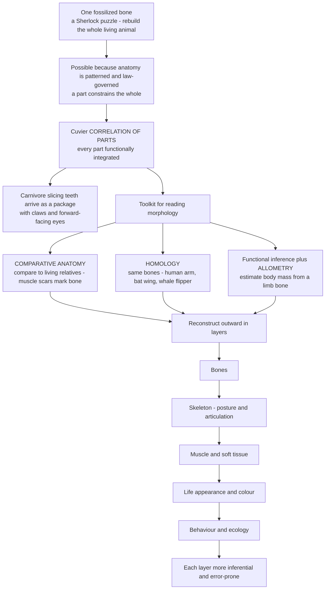

# 🦴 Reading Fossils: Morphology and Reconstruction

> [!abstract] TL;DR
> Reconstruction is the craft at the heart of paleontology: rebuilding an entire vanished organism — its shape, size, movement, diet, kinship, and behaviour — from incomplete, distorted, often **single-element** fossils. The seemingly impossible works because **anatomy is not random but law-governed and integrated**. Georges **Cuvier's correlation of parts** means every structure is functionally tied to every other, so a carnivore's slicing teeth arrive as a package with claws and forward-facing eyes, and a single bone constrains the whole. **Comparative anatomy** (bracketing the fossil with living relatives), **homology** (recognising the same bones across species — your arm, a bat's wing, a whale's flipper), **functional inference** (a bone's shape records the forces it bore), and quantitative tools — **allometric scaling** (body mass from a limb bone) and **geometric morphometrics** (turning shape into a **morphospace**) — convert stone into rigorous inference. Reconstruction proceeds outward in **layers of increasing uncertainty**: bones → skeleton → muscle → soft tissue → behaviour. The deeper the layer, the more inferential — which is why dinosaur restorations are perpetually revised.

## Intuition

**Analogy first.** A paleontologist handed a single fossilized bone faces a puzzle worthy of Sherlock Holmes. Holmes glances at a stranger's calloused hand, sunburnt skin, and worn boot and announces the man's trade, travels, and habits — not by magic, but because the world is **correlated**: a life of a certain kind leaves a consistent, readable set of marks. From one fragment, the detective reconstructs the whole story. The paleontologist does exactly this with a bone: from one element, rebuild the entire living animal.

How is that even possible? Because **anatomy is deeply patterned**. An animal is not a random bag of parts; it is a functionally integrated whole where the pieces must work together to survive. This is the master principle of the great anatomist **Georges Cuvier — the correlation of parts**: a predator that catches and dismembers live prey needs slicing teeth *and* claws *and* forward-facing eyes for depth perception *and* limbs built for pursuit *and* a short simple gut for meat — the whole package coheres. A grazer needs grinding teeth *and* a huge fermenting gut *and* eyes on the sides of the head to watch for predators. Form follows function, and function constrains form, so **a part reveals the whole**. Cuvier boasted he could reconstruct an animal from a single bone — and he was largely right. The rest of the craft is just making that inference precise: comparing the fossil to living relatives (comparative anatomy), recognising the "same" structure across species (homology), reading the forces a bone bore (functional inference), and scaling shape into numbers (allometry, morphometrics) — while never forgetting that each step outward, from bone toward behaviour, is a longer inferential leap and more likely to be wrong.

---

## How It Works

**Reconstruction is layered inference of increasing uncertainty.** You never observe the living animal; you observe a hard, often single, distorted fossil and infer the rest through a chain of arguments, each resting on how tightly anatomy constrains itself.

1. **Correlation of parts (Cuvier).** Because organisms are functionally integrated, structures co-vary in predictable packages. A tooth built for shearing implies a jaw joint, jaw muscles, a skull, and a lifestyle to match. This is what lets a fragment constrain the whole — and it is also the engine behind reconstructing a *missing* element from the ones you have.
2. **Comparative anatomy and the living analogue.** Compare the fossil to living relatives whose anatomy and behaviour you can observe directly. The rigorous version is the **Extant Phylogenetic Bracket**: an unpreservable feature (a muscle, an air sac, a behaviour) is confidently inferred in a fossil when the two nearest living relatives that "bracket" it both possess it. Bone itself is a rich witness — **muscle scars, attachment rugosities, foramina** (nerve and vessel holes), tooth microwear, and growth lines record soft tissue and physiology that rotted away.
3. **Homology.** Recognise the *same* structure inherited from a common ancestor — the one-bone/two-bone/many-bones plan of the **tetrapod limb** repeated in an arm, a bat wing, a whale flipper, a bird wing. Homology tells you which bones you are looking at even when they are radically reshaped, and it is distinct from **analogy / homoplasy** (superficial similarity from convergence, which can mislead).
4. **Functional inference.** A bone's geometry records the loads it carried: cross-sectional shape resists bending in the direction of habitual stress, joint surfaces record ranges of motion, lever arms record force-versus-speed trade-offs. Shape is a frozen free-body diagram.
5. **Quantitative morphology.** **Allometry / scaling** turns a skeletal dimension into body mass (femoral circumference predicts mass across tetrapods) and warns that proportions must change with size. **Morphometrics** — traditional measurements and modern **geometric morphometrics** (landmarks, Procrustes superimposition, a shape **morphospace** explored with PCA) — makes "shape" a measurable, comparable quantity.
6. **The workflow, outward in layers.** Isolated elements → an articulated **skeleton** (posture, joint articulation) → **musculature and soft tissue** (myology, integument) → **life restoration** (appearance, colour) → **behaviour and ecology** (the most speculative). Each layer adds inference and subtracts certainty.



---

## Key Concepts

### Secondary Level

**The challenge.** You almost never find a whole, undamaged animal. You find a bone, a tooth, a shell — usually broken, often crushed flat, frequently just one piece. Reconstruction is the disciplined guessing that turns that fragment back into a living creature.

**Correlation of parts.** Cuvier's big idea: the parts of an animal fit together like the parts of a machine. Grinding teeth go with a plant-eater's big gut and side-facing eyes; stabbing teeth go with a hunter's claws and forward eyes. So one part tells you about many others.

**Homology — the same bones, rearranged.** A human arm, a bat's wing, a whale's flipper, and a horse's leg all contain the *same* set of bones (one upper bone, two forearm bones, wrist bones, fingers), just stretched, shrunk, or fused. Because they are inherited from a shared ancestor, homology lets you name the bones of a strange fossil by matching them to a familiar skeleton.

**Reading a bone for soft parts.** Muscles leave **scars** and rough patches where they attached; nerves and blood vessels leave **holes**; teeth carry **wear** from the food they chewed. So a bare bone quietly records the muscles, senses, and diet that decayed away long ago.

**Reconstructions get revised.** Early restorations of *Iguanodon* put its spiky thumb bone on its nose like a horn; *Elasmosaurus* was first assembled with its head on the end of its tail. New fossils and better methods constantly overturn old pictures — a healthy sign that reconstruction is evidence-driven, not fixed.

### Undergraduate Level

**Comparative anatomy and the Extant Phylogenetic Bracket (EPB).** The most defensible soft-tissue and behaviour inferences come from **bracketing** the fossil between its nearest living relatives. For dinosaurs, that bracket is **crocodiles and birds** (their closest living kin). If a feature is present in both, and its bony signature appears in the fossil, the inference is strong (a *Level I* inference); if only one living relative has it, the inference is weaker (*Level II*); if neither does, it is speculative. This turns "what did living relatives look like" into a formal, testable argument.

**Homology vs analogy (homoplasy).** *Homology* is similarity by common descent (the tetrapod limb). *Analogy / homoplasy* is similarity by **convergence** — independent evolution of a like solution (the streamlined body plan of sharks, ichthyosaurs, and dolphins; wings in birds, bats, and pterosaurs). Confusing the two wrecks both reconstruction and family trees, which is why distinguishing them is a core skill (developed further in the sibling note *Phylogenetics_and_the_Tree_of_Life*). Convergence is also a *gift*: it lets you infer function, because a shape that evolves repeatedly for the same job in living animals signals the same job in a fossil.

**Functional morphology.** Form-function analysis reads lifestyle from shape: cursorial (running) limbs are long and gracile with restricted joints; fossorial (digging) limbs are short and robust with big muscle lever arms; slicing carnassial teeth versus flat grinding molars read diet directly. (This gets a dedicated treatment in the sibling note *Functional_Morphology_and_Biomechanics_of_Fossils*.)

**Allometry and scaling.** Proportions must change with size. **Isometry** keeps shape constant; **allometry** is the rule, because area scales as length² and volume/mass as length³ — the **square-cube law**. A bone's strength depends on its cross-sectional area, but the load it bears depends on body volume, so a giant cannot be a photo-enlarged small animal; its limb bones must become disproportionately thick. This same relationship, run in reverse, lets you **estimate body mass** from a limb-bone dimension such as **femoral circumference** — a workhorse of dinosaur mass estimation.

**Morphometrics.** *Traditional* morphometrics uses distances, ratios, and angles. *Geometric* morphometrics captures shape more completely with **landmarks** (biologically homologous points), removes position, rotation, and size by **Procrustes superimposition**, and analyses the residual **shape space** — a **morphospace** — usually with PCA. This quantifies form so specimens can be compared, diet or function inferred, and evolutionary **disparity** (the spread of forms) measured (see the Python demo).

**The reconstruction workflow.** Preparation and (increasingly) **CT scanning** reveal internal structure and let elements be digitally re-articulated; posture is set by joint fit and range of motion; **myology** rebuilds muscles onto their scars; **integument** — scales, feathers, skin — is added from direct impressions or the EPB; behaviour and ecology come last and least certainly. (Digital and imaging methods are the subject of the sibling note *Modern_Paleontological_Methods_and_Technology*.)

### Graduate Level

**Formalising soft-tissue inference.** Witmer's EPB makes reconstruction of unpreservable features an explicit, phylogenetically-ranked argument rather than free-hand analogy. Level I/II/III inferences carry different confidence, and "decisive negative" cases (absent in the whole bracket) demand exceptional evidence. This framework is why, e.g., dinosaur air-sac systems and certain jaw muscles are reconstructed with confidence while lips, cheeks, and vocal soft tissue remain contested.

**Geometric morphometrics, precisely.** Landmark configurations live on **Kendall's shape space**; **Generalized Procrustes Analysis** translates, scales to unit **centroid size**, and rotates each configuration to minimise summed squared landmark distances, leaving Procrustes shape coordinates. Because these sit in a high-dimensional non-Euclidean space, analyses work in the tangent space via PCA (**relative warps**), often with the **thin-plate spline** decomposing shape change into affine plus localised (partial-warp) components. **Allometry** is then tested by regressing shape on centroid size, and **disparity** quantified as variance in morphospace — distinguishing it sharply from taxonomic **diversity**.

**Mass estimation, rigorously.** Two families of method: **volumetric** (reconstruct a 3-D body model, estimate volume × density) and **extant-scaling** regressions. Campione and Evans (2012) showed that the summed **minimum shaft circumference** of the stylopodial bones (femur, and humerus in quadrupeds) predicts body mass across living tetrapods with a tight bivariate relationship, applied to dinosaurs. All such regressions demand **phylogenetic correction** (PGLS) — species are not independent data points — and honest **prediction intervals**, since extrapolating a living-animal law to a multi-tonne dinosaur beyond the training range inflates uncertainty.

**Biomechanics and simulation.** Beyond scaling, **beam theory**, **finite-element analysis** of skulls and limbs, multibody dynamics of gait, and estimated muscle moment arms convert morphology into quantitative performance (bite force, running speed, feeding stress). These test whether a reconstructed posture or behaviour is mechanically possible (structural limits tie directly to load-bearing statics — see *[[Statics_and_Equilibrium]]*).

**Colour and the frontier of soft-tissue reconstruction.** Fossil **melanosomes** — micron-scale pigment organelles whose shape correlates with colour in living animals (eumelanin sausages = black/grey, phaeomelanin spheres = reddish) — now permit statistically-supported **colour reconstruction** of feathered dinosaurs and early birds (*Anchiornis*, *Sinosauropteryx*), pushing life restoration from art toward data.

**Taphonomic distortion and the speculation gradient.** Real fossils are crushed, sheared, and incomplete; **retrodeformation** must undo compaction before shape is analysed, or morphometrics measures the burial, not the biology (crushing and incompleteness are taphonomic effects treated in the sibling note *Fossils_and_the_Fossilization_Process*). Above all, the honest reconstructor tracks the **speculation gradient**: bone geometry is near-certain, articulated posture well-constrained, musculature reasonably inferred, integument sometimes evidenced, colour occasionally, and detailed behaviour largely narrative. The modern critique of **"shrink-wrapping"** — plastering skin straight onto bone and skull, ignoring the fat, muscle, and soft tissue that make living animals look nothing like their skeletons — is a direct warning about mistaking the deepest, most speculative layers for fact.

---

## Python Demo

```python
# Reading morphology two ways:
# (a) ALLOMETRIC RECONSTRUCTION - estimate a whole (body mass) from a part (femur).
#     Fit a log-log power law on living reference animals, then PREDICT a dinosaur's
#     mass from its femoral circumference, WITH an uncertainty band.
# (b) MORPHOMETRIC CLASSIFICATION - represent jaws by shape ratios, build a
#     morphospace with a hand-rolled PCA (covariance eigen-decomposition),
#     and infer a mystery fossil's DIET from where it lands.
import numpy as np
import matplotlib.pyplot as plt

rng = np.random.default_rng(7)

# ======================================================================
# (a) ALLOMETRY: body mass from femoral circumference (power law M ~ C^b)
# ======================================================================
# Living reference tetrapods: femoral shaft circumference (mm) and body mass (kg).
animals = ["mouse", "rat", "rabbit", "fox", "dog", "human",
           "wolf", "deer", "horse", "rhino", "elephant"]
C = np.array([  2.5,   6.0,  14.0,  22.0,  34.0,  88.0,
               46.0,  70.0, 145.0, 250.0, 380.0])          # femur circumference, mm
M = np.array([ 0.02,  0.35,   2.0,   5.5,  22.0,  70.0,
               45.0,  90.0, 500.0,1600.0,4200.0])          # body mass, kg

# Power laws are straight lines in log-log space:  log10 M = b*log10 C + a
x, y = np.log10(C), np.log10(M)
b, a = np.polyfit(x, y, 1)                 # slope b, intercept a (least squares)
yhat = b * x + a
resid = y - yhat
s = resid.std(ddof=2)                      # residual scatter (log10 units)
r2 = 1.0 - np.sum(resid**2) / np.sum((y - y.mean())**2)

# Predict the mass of a fossil dinosaur from its femur (e.g. a large theropod).
C_fossil = 480.0                           # measured femoral circumference, mm
logM_pred = b * np.log10(C_fossil) + a
M_pred = 10**logM_pred
M_lo, M_hi = 10**(logM_pred - 1.96*s), 10**(logM_pred + 1.96*s)  # ~95% band

print("ALLOMETRY / MASS ESTIMATION")
print(f"  fitted law:  M = {10**a:.3g} * C^{b:.2f}   (R^2 = {r2:.3f})")
print(f"  slope b = {b:.2f}  (isometry for mass-vs-length would be 3.0)")
print(f"  fossil femur C = {C_fossil:.0f} mm  ->  mass ~ {M_pred:,.0f} kg")
print(f"  95% range: {M_lo:,.0f} - {M_hi:,.0f} kg\n")

# ======================================================================
# (b) MORPHOMETRICS: carnivore vs herbivore jaws in a PCA morphospace
# ======================================================================
# Each jaw is 4 shape ratios (dimensionless, so size is already removed):
#   f0 tooth aspect  (height/width): tall slicing teeth -> carnivore HIGH
#   f1 jaw mech. adv.(in-lever/out-lever): crushing/grinding -> herbivore HIGH
#   f2 gape ratio    (jaw length/depth): long snapping jaw -> carnivore HIGH
#   f3 grind area    (occlusal flat area proxy): grinding battery -> herbivore HIGH
n = 60
carn = np.column_stack([rng.normal(2.4, 0.30, n),   # tall teeth
                        rng.normal(0.22, 0.04, n),  # low mechanical advantage
                        rng.normal(3.2, 0.35, n),   # long jaw
                        rng.normal(0.15, 0.05, n)]) # little grinding area
herb = np.column_stack([rng.normal(1.1, 0.20, n),   # low, blunt teeth
                        rng.normal(0.55, 0.05, n),  # high mechanical advantage
                        rng.normal(1.8, 0.30, n),   # short deep jaw
                        rng.normal(0.70, 0.08, n)]) # large grinding surface
X = np.vstack([carn, herb])
labels = np.array([0]*n + [1]*n)                    # 0 = carnivore, 1 = herbivore

# --- PCA by hand: center, covariance, eigen-decomposition ---
Xc = X - X.mean(axis=0)
Xs = Xc / X.std(axis=0)                              # standardize (mixed ratios)
cov = np.cov(Xs, rowvar=False)
evals, evecs = np.linalg.eigh(cov)                   # ascending eigenvalues
order = np.argsort(evals)[::-1]                      # descending -> PC1 first
evecs = evecs[:, order]
scores = Xs @ evecs[:, :2]                           # project onto PC1, PC2
var_expl = evals[order][:2] / evals.sum() * 100.0

# --- classify a mystery fossil jaw by nearest group centroid in morphospace ---
fossil_raw = np.array([1.9, 0.30, 2.7, 0.28])        # a somewhat carnivore-leaning jaw
fossil_s = (fossil_raw - X.mean(axis=0)) / X.std(axis=0)
fossil_pc = fossil_s @ evecs[:, :2]
cen_c = scores[labels == 0].mean(axis=0)
cen_h = scores[labels == 1].mean(axis=0)
d_c = np.linalg.norm(fossil_pc - cen_c)
d_h = np.linalg.norm(fossil_pc - cen_h)
verdict = "CARNIVORE" if d_c < d_h else "HERBIVORE"
print("MORPHOMETRICS / DIET INFERENCE")
print(f"  PC1, PC2 explain {var_expl[0]:.0f}% + {var_expl[1]:.0f}% of shape variance")
print(f"  fossil distance to carnivore centroid = {d_c:.2f}, herbivore = {d_h:.2f}")
print(f"  => inferred diet: {verdict}")

# ======================================================================
# Plot
# ======================================================================
fig, (ax1, ax2) = plt.subplots(1, 2, figsize=(13, 5.2))

# (a) allometry log-log regression + prediction band + fossil
xx = np.linspace(x.min(), np.log10(C_fossil) + 0.05, 200)
yy = b * xx + a
ax1.fill_between(10**xx, 10**(yy - 1.96*s), 10**(yy + 1.96*s),
                 color="#93c5fd", alpha=0.35, label="95% prediction band")
ax1.plot(10**xx, 10**yy, "-", color="#2563eb", label="fitted power law")
ax1.plot(C, M, "o", color="#1e3a8a", label="living reference animals")
ax1.plot(C_fossil, M_pred, "*", color="#dc2626", markersize=20,
         label=f"fossil femur -> {M_pred:,.0f} kg")
ax1.set_xscale("log"); ax1.set_yscale("log")
ax1.set_xlabel("Femoral circumference, mm (log)")
ax1.set_ylabel("Body mass, kg (log)")
ax1.set_title("Allometric reconstruction\nestimate the whole animal's mass from one bone")
ax1.legend(fontsize=8); ax1.grid(True, which="both", alpha=0.3)

# (b) morphospace scatter with fossil placed
ax2.scatter(scores[labels == 0, 0], scores[labels == 0, 1],
            c="#dc2626", label="carnivore jaws", alpha=0.7, edgecolor="k", linewidth=0.3)
ax2.scatter(scores[labels == 1, 0], scores[labels == 1, 1],
            c="#16a34a", label="herbivore jaws", alpha=0.7, edgecolor="k", linewidth=0.3)
ax2.scatter(*fossil_pc, marker="*", s=380, c="gold", edgecolor="k",
            linewidth=0.8, label=f"mystery fossil -> {verdict.title()}", zorder=5)
ax2.set_xlabel(f"PC1  ({var_expl[0]:.0f}% of shape variance)")
ax2.set_ylabel(f"PC2  ({var_expl[1]:.0f}% of shape variance)")
ax2.set_title("Morphospace of jaw shape\ndiet inferred from where a fossil lands")
ax2.legend(fontsize=8); ax2.grid(True, alpha=0.3)

plt.tight_layout()
plt.savefig("reading_fossils_reconstruction.png", dpi=120)
plt.show()

# Takeaways:
# (a) Because anatomy is law-governed, one measured bone + a scaling law recovers
#     body mass - with an honest uncertainty band that widens on extrapolation.
# (b) Shape, made quantitative, forms a morphospace where function clusters, so a
#     fragmentary fossil's diet is read from its neighbourhood - Cuvier, quantified.
```

---

## Real-World Applications

- **Estimating dinosaur body mass** — femoral (and, for quadrupeds, humeral) shaft circumference regressed across living tetrapods yields defensible masses for animals no scale ever weighed; volumetric 3-D models cross-check the scaling estimates, and the two together bracket, e.g., *Tyrannosaurus* at roughly 6–9 tonnes.
- **Inferring diet from jaws and teeth** — carnassial shear versus grinding molars, jaw mechanical advantage, and tooth microwear place fossil mammals and dinosaurs into dietary categories; geometric morphometrics of jaw shape separates hypercarnivores from herbivores in a quantified morphospace.
- **The great posture revisions** — *Iguanodon*'s thumb-spike migrated from its nose to its hand; *Elasmosaurus*'s skull moved from tail to neck; sprawling, tail-dragging dinosaurs were re-erected into active, horizontal-backed animals — each correction driven by better articulation and biomechanics.
- **Recovering colour from melanosomes** — pigment-organelle shape in exceptionally preserved feathers reconstructed the plumage of *Anchiornis* (black-and-white with a rufous crest) and the banded, countershaded tail of *Sinosauropteryx* — reconstruction crossing from art into measurement.
- **CT-scanned endocasts and inner ears** — digitally extracting brain-cavity and semicircular-canal shape reconstructs sensory ability, habitual head posture, and agility without ever cutting the fossil (developed in the sibling note *Modern_Paleontological_Methods_and_Technology*).
- **Reconstructing whale origins** — homology of limb bones in *Pakicetus*, *Ambulocetus*, and *Rodhocetus* traces the land-to-sea transition, with the hindlimb progressively reduced to the vestige buried in a modern whale's body.

---

## Common Pitfalls

- **Shrink-wrapping.** Draping skin directly over the skeleton, skipping the fat, muscle, cartilage, and soft tissue that make living animals look unlike their bones — the classic over-reading of the deepest reconstruction layer.
- **Over-reading a single element.** Cuvier's correlation is powerful but not infallible; an isolated tooth or vertebra constrains, it does not dictate, and lone elements have founded many "taxa" later shown to be parts of already-named animals.
- **Ignoring taphonomic distortion.** Crushed, sheared, and incomplete fossils must be **retrodeformed** before their shape is analysed, or morphometrics measures the burial rather than the biology.
- **Confusing analogy with homology.** Convergent look-alikes (ichthyosaur vs dolphin) can suggest false kinship or be mis-scored as the "same" structure; always separate similarity-by-descent from similarity-by-function.
- **Extrapolating allometry past the data.** A scaling law fitted on cat-to-elephant-sized animals grows wildly uncertain when pushed to a multi-tonne dinosaur; report prediction intervals and beware the square-cube law biting on both ends.
- **Naive isometric scaling.** "Just scale up a lizard" ignores that strength scales with area and load with volume; giants demand disproportionately robust bones, so a photo-enlarged small animal would collapse.
- **Over-confident behaviour claims.** Pack-hunting, parental care, vocalisation, and colour signalling sit at the speculative end of the gradient; state them as hypotheses, and rank soft-tissue inferences with the Extant Phylogenetic Bracket.
- **Landmark non-homology.** Geometric morphometrics is only as valid as its landmarks; points that are not truly homologous across specimens quietly corrupt the entire morphospace.

---

## Related Concepts

- [[Evidence_for_Evolution]] — the biology of **homology vs analogy/homoplasy** and comparative anatomy that reconstruction runs on; the tetrapod-limb argument in full
- [[Natural_Selection_and_Adaptation]] — *why* form follows function: selection shapes anatomy to task, which is exactly what makes function readable from a bone
- [[The_Musculoskeletal_System]] — the living bone-muscle-tendon system whose scars, attachment sites, and lever arms a fossil preserves and a reconstructor decodes
- [[PCA]] — the eigen-decomposition of a covariance matrix that turns landmark/ratio data into the **morphospace** used in geometric morphometrics
- [[Statics_and_Equilibrium]] — free-body/load analysis behind functional inference and scaling: why bone cross-section tracks stress and why giants cannot be scaled-up dwarfs

*Within this vault, this note is the interpretive foundation beneath the siblings **Paleontology_and_Deep_Time_Overview**, **Fossils_and_the_Fossilization_Process** (the taphonomic distortion you must correct for), **Functional_Morphology_and_Biomechanics_of_Fossils** (the deep dive on form-function), **Phylogenetics_and_the_Tree_of_Life** (homology as evidence of kinship), and **Modern_Paleontological_Methods_and_Technology** (CT and digital reconstruction).*

---

## Review Questions

1. **Secondary:** A single fossil tooth is tall, blade-like, and edged with fine serrations. Using Cuvier's correlation of parts, name three other features of the living animal you would predict, and say whether it ate meat or plants.
2. **Undergraduate:** Distinguish **homology** from **analogy**, giving one example of each, and explain why confusing them would corrupt both a reconstruction and a family tree. Then explain how the **Extant Phylogenetic Bracket** turns "compare it to living relatives" into a ranked, testable inference.
3. **Undergraduate:** Why must proportions change with body size (the square-cube law), and how does that same relationship let you estimate a dinosaur's mass from its femoral circumference? What does the slope of a log-log mass-vs-circumference fit tell you?
4. **Graduate:** You have a set of crushed, incomplete fossil skulls. Outline how you would (a) prepare the shape data for geometric morphometrics (retrodeformation, landmarking, Procrustes superimposition), (b) build and interpret a morphospace, and (c) test for allometry — and identify the two assumptions most likely to invalidate your conclusions.
5. **Graduate:** Place the following inferences on the "speculation gradient" from near-certain to largely narrative, and justify the ranking: femur length, running gait, jaw-muscle reconstruction, skin colour, pack-hunting behaviour.

---

## Sources

- Rudwick, M.J.S. (1997) — *Georges Cuvier, Fossil Bones, and Geological Catastrophes* (University of Chicago Press) — Cuvier and the correlation of parts in his own words
- Prothero, D. (2013) — *Bringing Fossils to Life: An Introduction to Paleobiology*, 3rd ed. (McGraw-Hill / Columbia University Press) — functional and comparative morphology, reconstruction
- Zelditch, M.L., Swiderski, D.L., & Sheets, H.D. (2012) — *Geometric Morphometrics for Biologists: A Primer*, 2nd ed. (Academic Press) — landmarks, Procrustes, morphospace, PCA of shape
- Campione, N.E. & Evans, D.C. (2012) — "A universal scaling relationship between body mass and proximal limb bone dimensions in quadrupedal terrestrial tetrapods," *BMC Biology* 10:60 — femoral/humeral circumference mass estimation
- Witmer, L.M. (1995) — "The Extant Phylogenetic Bracket and the importance of reconstructing soft tissues in fossils," in *Functional Morphology in Vertebrate Paleontology* (Cambridge University Press), 19–33

#paleontology #functional-morphology #reconstruction #allometry #morphometrics
