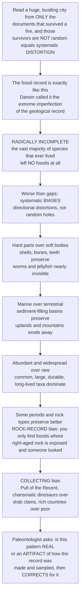

# 🦴 The Fossil Record and Its Biases

> [!abstract] TL;DR
> The **fossil record** — the total accumulated body of fossils and fossil-bearing strata — is humanity's only direct archive of the history of life, reaching back billions of years. But it is a *terrible* archive in two distinct ways. First, it is **radically incomplete**: the vast majority of species that ever lived left **no fossils at all**, and most that did remain buried, eroded, or undiscovered — what Darwin called the "extreme imperfection of the geological record." Second, and far more insidious, its gaps are **not random**: the record is **systematically biased**, favoring organisms with hard parts over soft-bodied ones, marine over terrestrial life, abundant and large and widespread taxa over rare ones, well-preserved and well-studied rocks over the rest, and younger strata over older (the **Pull of the Recent**). Read at face value, these biases manufacture **false patterns** — apparent diversity that merely tracks how much rock survives, or an abrupt mass extinction smeared into a fake gradual decline by the **Signor–Lipps effect**. The central skill of rigorous paleontology is therefore to think like a **forensic statistician**: to ask of every pattern, *is this real biological signal, or an artifact of how the record was made and sampled?* — and to deploy **sampling-standardization** methods to correct for it. Understanding the biases is not pessimism; it is what makes it possible to extract reliable history from a distorted archive.

---

## Intuition

**Analogy:** Imagine trying to understand a huge, bustling city by reading only the tiny fraction of its documents that happened to survive a great fire — and, crucially, those survivors are **not a random sample**. Stone monuments and engraved plaques lasted; paper memos and diaries burned. The downtown was later excavated; the suburbs were paved over unexamined. Famous people got statues and inscriptions; ordinary people left no trace at all. Any history you write from those charred scraps will be not merely **incomplete** but **systematically distorted** — it will overweight the monumental, the central, and the celebrated, and it will be silent on everyone else. Worse, if you forget the fire and read the survivors at face value, you will "discover" patterns that are really just the shape of what burned versus what endured.

The fossil record is exactly this fire-survivor archive for the whole history of life. Darwin himself fretted about its "extreme imperfection" — and he was right. Organisms with **hard parts** (shells, bones, teeth) fossilize far more readily than **soft-bodied** ones (worms, jellyfish), so the record over-represents the sturdy. Life in **sediment-accumulating marine basins** preserves far better than **terrestrial or upland** life, which erodes away. **Abundant, widespread, long-lived** species show up more often than rare ones. Some time periods and rock types are simply **better preserved and more accessible** — you only find fossils where the right-aged rock happens to be exposed and where someone actually looked. Even collecting effort is skewed (the **Pull of the Recent**, charismatic dinosaurs over drab clams, rich countries over poor). So the paleontologist must think like a forensic statistician, constantly asking: *is this pattern REAL, or an artifact of how the record was made and sampled?* — and use clever methods to correct for it. Understanding the biases is the key to reading true signal out of a distorted archive.

---

## How It Works

### Core Mechanics

The journey from a living organism to a data point in a diversity curve passes through **three destructive filters**, each of which removes information non-randomly:

1. **The taphonomic filter (will it become a fossil?).** Death, decay, scavenging, and chemistry destroy almost every organism before burial. Only a favored minority — hard-bodied, buried quickly, in the right sediment and chemistry — enters the rock. This filter is *directional*: it preferentially keeps **biomineralized** taxa and preferentially erases **soft-bodied** ones, so whole clades can be nearly invisible.

2. **The geological filter (will the rock survive?).** Once formed, fossil-bearing strata can be destroyed by **erosion**, cooked by **metamorphism**, or recycled by **subduction** — or simply never uplifted and exposed. The amount of preserved sedimentary rock varies enormously by age, so some intervals of deep time have a rich rock record and others almost none.

3. **The discovery filter (will anyone find it?).** A fossil only enters science where the right-aged rock **outcrops at the surface** *and* a paleontologist actually searches there. This injects **human sampling bias**: uneven collecting effort, a taste for charismatic taxa, and a heavy skew toward the rocks of wealthy, accessible regions.

On top of these filters sit the **systematic biases** — directional distortions, not random gaps:

- **Anatomical / preservational bias** — hard parts ≫ soft parts; biomineralized taxa are over-represented, entire soft-bodied groups almost absent.
- **Environmental / habitat bias** — marine and aquatic depositional settings ≫ terrestrial; lowland ≫ upland; anoxic basins ≫ oxygenated shelves.
- **Abundance, body-size, and geographic-range bias** — common, large, durable, widespread taxa are far more likely to be sampled than rare, small, localized ones.
- **Rock-record / sampling bias** — observed diversity often **correlates with the amount and accessibility of sedimentary rock** of each age, fueling the "common-cause versus rock-as-driver" debate (does sea level drive both rock *and* diversity, or does rock area merely *control what we see*?).
- **Temporal bias — the Pull of the Recent** — younger rocks are better preserved and better sampled, so taxon ranges get "pulled" toward the present and recent diversity looks inflated. **Time-averaging** further blurs fine temporal resolution.
- **Human / collecting bias** — collecting effort, taxonomic fashion, **monographic effects** (a single dedicated expert can inflate a group's apparent richness), and geographic/economic skew in where paleontologists work.

The dangerous payoff is **artifacts that mimic biology**: the **Signor–Lipps effect** (incomplete sampling records a taxon's *last appearance* below its *true* extinction, smearing an abrupt mass extinction into an apparent gradual decline), **Lazarus taxa** (species that "vanish" then reappear because the intervening record failed), **pseudo-extinction**, and diversity curves that track outcrop area rather than real diversity. The modern response is **statistical paleobiology**: **sampling standardization** (rarefaction, subsampling, shareholder quorum subsampling à la Alroy and the Paleobiology Database), residual-diversity modeling, **ghost-lineage** and phylogenetic completeness metrics, occupancy modeling, and **confidence intervals on stratigraphic ranges**. The discipline has shifted from reading the record at "face value" to treating it as a **biased sample requiring inference**.

### Flow / Architecture



---

## Key Concepts

### Secondary (the big idea)
- **The fossil record is incomplete AND unfair.** Not every creature becomes a fossil, and the ones that do are a *biased* sample — mostly hard-shelled, ocean-dwelling, common animals in the right kind of rock.
- **Fossilization is rare.** A dead organism usually rots, is eaten, or is destroyed. Becoming a fossil needs luck: quick burial, hard parts, and the right chemistry.
- **Gaps are not random.** Because soft-bodied and land animals are systematically missing, the record *tilts* our picture of ancient life rather than just leaving neat holes.
- **Face value can lie.** A pattern in the fossils might reflect real biology — or just where rocks happened to survive and where scientists happened to dig.

### Undergraduate (the mechanisms)
- **Three filters:** taphonomic (becoming a fossil) → geological (rock surviving erosion, metamorphism, subduction) → discovery (right-aged rock exposed *and* searched).
- **Named biases:** preservational (hard ≫ soft), environmental (marine ≫ terrestrial), abundance/size/range, **rock-record** (diversity tracks preserved rock area), temporal (**Pull of the Recent**, time-averaging), and human collecting bias (effort, charisma, geography, monographic effects).
- **The Signor–Lipps effect:** incomplete sampling records each taxon's *last-appearance datum* (LAD) *before* its true extinction, so a **simultaneous** mass extinction appears as a **gradual** decline — a make-or-break artifact when diagnosing extinction dynamics.
- **Lazarus and Elvis taxa:** groups that disappear from the record and reappear (Lazarus) or are misidentified look-alikes filling the gap (Elvis) — signatures of preservation failure, not biology.
- **Absence of evidence ≠ evidence of absence.** A taxon's non-appearance in an interval may mean extinction *or* merely non-preservation/non-sampling.

### Graduate (the correction toolkit and open debates)
- **Sampling standardization:** classical **rarefaction** (Raup 1975) rarefies each interval to a common sample size; **subsampling** and **shareholder quorum subsampling (SQS)** (Alroy) standardize to a common *coverage* rather than a fixed count, better handling uneven abundance distributions. These underpin the Paleobiology Database revision of Phanerozoic marine diversity (Alroy et al. 2008), which flattened the raw "hockey-stick" diversity rise.
- **Common-cause vs redundancy:** does sea-level/sequence stratigraphy drive *both* sedimentary rock volume *and* genuine diversity (common cause), or does rock area merely *control sampling* of a decoupled true diversity? Benton et al. (2000) quantified rock-record quality through time to attack this.
- **Phylogenetic completeness metrics:** **ghost lineages** (implied but unsampled lineage duration from a phylogeny), the **Gap Excess Ratio (GER)**, **SCI**, and **MSM** quantify congruence between cladistic and stratigraphic order to score record quality.
- **Range-end confidence intervals:** Strauss & Sadler / Marshall methods place **statistical confidence intervals on stratigraphic ranges**, formalizing how far a true origination/extinction may lie beyond the observed first/last appearance.
- **Modeling approaches:** residual-diversity modeling, capture–mark–recapture and **occupancy models** borrowed from ecology, and Bayesian **fossilized birth–death** models jointly estimate diversification *and* preservation rates, turning bias into an explicitly modeled parameter rather than a nuisance.

---

## Python Demo

```python
# Two classic fossil-record biases, simulated with numpy + matplotlib:
#   (A) SAMPLING BIAS  -- "observed diversity" can track how much ROCK we
#       sample, not real diversity; rarefaction recovers the true signal.
#   (B) SIGNOR-LIPPS   -- incomplete sampling smears an ABRUPT extinction
#       into an apparent GRADUAL decline.
import numpy as np
import matplotlib.pyplot as plt

rng = np.random.default_rng(42)

# ============================================================
# PART A: does observed diversity reflect biology or just rock?
# ============================================================
n_bins = 20
time = np.arange(n_bins)                      # 20 time intervals, old -> young

true_div = np.full(n_bins, 120)               # TRUE diversity is FLAT: no trend

# Rock availability / collecting effort varies wildly through time
# (outcrop area, sea level, effort) -> a spurious bump near the young end
rock = 0.15 + 0.85 * np.exp(-0.5 * ((time - 14) / 3.0) ** 2)

def sample_richness(n_genera, n_occurrences):
    """Collect n_occurrences fossils from n_genera equally-common taxa;
    return the number of DISTINCT genera seen (observed richness)."""
    if n_occurrences <= 0:
        return 0
    draws = rng.integers(0, n_genera, size=n_occurrences)
    return np.unique(draws).size

base_effort = 1500
effort = (base_effort * rock).astype(int)     # occurrences collected per bin

# FACE-VALUE observed diversity: richness rises where more rock is sampled
observed = np.array([sample_richness(true_div[i], effort[i]) for i in range(n_bins)])

# CORRECTION: rarefy EVERY bin down to the weakest bin's effort (a fixed quota)
quota = effort.min()
rarefied = np.array([sample_richness(true_div[i], quota) for i in range(n_bins)])

# ============================================================
# PART B: Signor-Lipps -- an abrupt extinction looks gradual
# ============================================================
n_taxa = 80
depth = np.linspace(0, 10, 240)               # stratigraphic height (old->young)
boundary = 8.0                                # ALL taxa really die here, at once
origins = rng.uniform(0, boundary, n_taxa)    # each taxon originates earlier
p_find = 0.025                                 # per-horizon detection probability

true_lad = np.full(n_taxa, boundary)          # TRUE last appearance = the boundary
obs_lad = np.empty(n_taxa)
for i in range(n_taxa):
    horizons = depth[(depth >= origins[i]) & (depth <= boundary)]
    hits = horizons[rng.random(horizons.size) < p_find]
    # observed last appearance = highest horizon actually sampled (or origin)
    obs_lad[i] = hits.max() if hits.size else origins[i]

def richness_curve(lads):
    """How many taxa are still 'present' (not past their LAD) at each level."""
    return np.array([(lads >= z).sum() for z in depth])

true_curve = richness_curve(true_lad)         # a vertical CLIFF at the boundary
obs_curve = richness_curve(obs_lad)           # a GRADUAL ramp down before it

# ------------------------------------------------------------
# Plots
# ------------------------------------------------------------
fig, ax = plt.subplots(2, 2, figsize=(12, 9))

# A1: true vs observed vs rarefied diversity, with rock overlaid
ax[0, 0].plot(time, true_div, 'k--', lw=2, label='TRUE diversity (flat)')
ax[0, 0].plot(time, observed, 'o-', color='crimson', label='Observed (face value)')
ax[0, 0].plot(time, rarefied, 's-', color='seagreen', label='Rarefied (corrected)')
axb = ax[0, 0].twinx()
axb.fill_between(time, 0, rock, color='sandybrown', alpha=0.30)
axb.set_ylabel('rock availability / effort', color='sandybrown')
ax[0, 0].set_title('A. Observed diversity chases ROCK, not biology')
ax[0, 0].set_xlabel('time bin (old -> young)'); ax[0, 0].set_ylabel('genera')
ax[0, 0].legend(loc='upper left', fontsize=8)

# A2: the spurious correlation between rock and face-value diversity
ax[0, 1].scatter(rock, observed, color='crimson', label='face value')
ax[0, 1].scatter(rock, rarefied, color='seagreen', label='rarefied')
r_obs = np.corrcoef(rock, observed)[0, 1]
r_rar = np.corrcoef(rock, rarefied)[0, 1]
ax[0, 1].set_title(f'A. Face value tracks rock (r={r_obs:.2f}); '
                   f'rarefied does not (r={r_rar:.2f})')
ax[0, 1].set_xlabel('rock availability'); ax[0, 1].set_ylabel('observed genera')
ax[0, 1].legend(fontsize=8)

# B1: true (cliff) vs observed (gradual) diversity curve
ax[1, 0].plot(true_curve, depth, 'k-', lw=2, label='TRUE (abrupt kill)')
ax[1, 0].plot(obs_curve, depth, color='crimson', lw=2, label='Observed (smeared)')
ax[1, 0].axhline(boundary, color='gray', ls=':', label='extinction boundary')
ax[1, 0].set_title('B. Signor-Lipps: abrupt extinction looks gradual')
ax[1, 0].set_xlabel('standing richness'); ax[1, 0].set_ylabel('stratigraphic height')
ax[1, 0].legend(fontsize=8)

# B2: where last-appearances actually land -- smeared BELOW the true boundary
ax[1, 1].hist(obs_lad, bins=20, color='crimson', alpha=0.7,
              orientation='horizontal', label='observed LADs')
ax[1, 1].axhline(boundary, color='gray', ls=':', lw=2, label='true extinction')
ax[1, 1].set_title('B. Observed last appearances fall BELOW the true boundary')
ax[1, 1].set_xlabel('taxa'); ax[1, 1].set_ylabel('stratigraphic height')
ax[1, 1].legend(fontsize=8)

plt.tight_layout()
plt.savefig('fossil_record_biases.png', dpi=120)
print(f"Face-value vs rock correlation : r = {r_obs:.2f}  (spurious!)")
print(f"Rarefied  vs rock correlation : r = {r_rar:.2f}  (signal recovered)")
print(f"Mean observed LAD = {obs_lad.mean():.2f} vs true extinction at {boundary}"
      f"  -> smeared down by {boundary - obs_lad.mean():.2f} units")
```

Running it shows the two artifacts quantitatively: the **face-value** diversity curve correlates strongly with **rock availability** (a spurious pattern) while the **rarefied** curve stays flat and *decouples* from rock (the true signal recovered); and the mean **observed last-appearance** falls well *below* the true extinction boundary, so a single instantaneous kill masquerades as a gradual decline — the **Signor–Lipps effect** in miniature.

---

## Real-World Applications

- **The end-Permian and end-Cretaceous extinctions.** Whether the "Big Five" mass extinctions were geologically **abrupt** (favoring impact/volcanism catastrophes) or **gradual** (favoring long environmental decline) hinges on correcting the Signor–Lipps effect; range-end confidence intervals showed that apparently gradual dinosaur and ammonite declines are consistent with a sudden K–Pg catastrophe.
- **The Phanerozoic diversity curve.** The raw Sepkoski curve implied an explosive rise in marine diversity toward the present. Sampling-standardized reanalysis by **Alroy et al. (2008)** using the Paleobiology Database dramatically **flattened** that rise, showing much of the "increase" was the **Pull of the Recent** plus better sampling of younger rocks.
- **Cambrian explosion interpretation.** Exceptional soft-bodied **Lagerstätten** (Burgess Shale, Chengjiang) exist precisely *because* normal preservation bias erases soft bodies — reminding us how much of early animal life the ordinary record silently omits.
- **Conservation paleobiology.** Death assemblages and sub-fossil records are used to establish pre-human baselines for ecosystems, but must be corrected for the same preservation and time-averaging biases before informing modern **biodiversity** targets.
- **Every quantitative macroevolution study.** Origination/extinction rate estimation, diversification models, and body-size trends all now build **preservation rate** into the model (e.g., fossilized birth–death) rather than reading raw counts.

---

## Common Pitfalls

- **Reading the record at face value.** Treating raw fossil counts as true diversity confuses *sampling intensity* with *biology* — the single most common error, and the reason diversity curves must be sampling-standardized before interpretation.
- **Mistaking absence of evidence for evidence of absence.** A taxon missing from an interval may be extinct *or* merely unpreserved/unsampled (a **Lazarus** gap). Declaring extinction from a last appearance ignores the Signor–Lipps smear.
- **Ignoring the Pull of the Recent.** Younger, better-preserved rocks inflate recent diversity and stretch taxon ranges toward the present; failing to correct makes the modern biota look artificially exceptional.
- **Comparing groups with different preservation potential.** Contrasting the "diversity" of clams (heavily biomineralized) with that of worms or insects without accounting for vastly different fossilization rates yields nonsense comparisons.
- **Assuming gaps are random.** Random incompleteness would only blur patterns; **systematic** bias *creates* patterns (marine over land, hard over soft). Confusing the two — much like confusing random error with systematic bias in study design — leads to confidently wrong conclusions.
- **Over-trusting a single monographer or region.** A burst of "diversity" can be a **monographic effect** or a well-collected outcrop, not a real radiation.

---

## Related Concepts

- [[Biodiversity_and_Conservation]] — the fossil record supplies deep-time baselines and background extinction rates for measuring today's biodiversity crisis, but must first be corrected for preservation and sampling bias.
- [[Statistical_Inference]] — sampling standardization, rarefaction, and confidence intervals on stratigraphic ranges are direct applications of statistical inference to a biased sample.
- [[Bias_Selection_and_Information]] — the epidemiological distinction between *systematic bias* (a persistent lean uncorrectable by more data) and *random error* is the exact conceptual analog to preservation/sampling bias in the fossil record.

Within this vault (siblings): this note underpins **Paleontology_and_Deep_Time_Overview** as a foundational caveat; it depends on the mechanics detailed in **Fossils_and_the_Fossilization_Process** (the taphonomic filter) and **Geologic_Time_and_Stratigraphy** (the geological and rock-record filter); and it is the essential methodological prerequisite for reading **Mass_Extinctions_and_the_Big_Five** (where the Signor–Lipps effect is decisive) and **Macroevolution_and_Deep_Time_Patterns** (where every diversity curve must be sampling-standardized).

---

## Review Questions

1. **(Secondary)** Explain in your own words why a soft-bodied jellyfish and a hard-shelled clam that lived in equal numbers would be enormously unequal in the fossil record. What does this tell you about reading ancient "diversity" straight from fossil counts?
2. **(Undergraduate)** A student plots observed marine genus diversity through time and finds it rises sharply toward the present, closely mirroring the area of preserved sedimentary rock of each age. Describe two competing explanations (real biological increase vs sampling artifact) and one method that could help distinguish them.
3. **(Undergraduate/Graduate)** The Signor–Lipps effect makes a sudden mass extinction look gradual. Explain the mechanism in terms of last-appearance datums, and describe how confidence intervals on stratigraphic ranges could test whether an *apparently* gradual decline is statistically consistent with an *instantaneous* extinction.
4. **(Graduate)** Contrast the "common-cause" hypothesis with the "rock-as-driver" (redundancy) hypothesis for the correlation between sedimentary rock volume and observed diversity. What kind of evidence would favor one over the other, and why does the distinction matter for macroevolutionary inference?
5. **(Graduate)** Compare classical rarefaction with shareholder quorum subsampling (SQS). Why can rarefying to a fixed *number of occurrences* still mislead when abundance distributions differ between intervals, and how does standardizing to a fixed *coverage* address this?

---

## Sources

- Darwin, C. (1859). *On the Origin of Species*, Chapters 9–10 ("On the Imperfection of the Geological Record"). [Full text](https://www.gutenberg.org/ebooks/1228)
- Raup, D. M. (1975). "Taxonomic diversity estimation using rarefaction." *Paleobiology*, 1(4), 333–342. [DOI](https://doi.org/10.1017/S0094837300002633)
- Alroy, J. et al. (2008). "Phanerozoic Trends in the Global Diversity of Marine Invertebrates." *Science*, 321(5885), 97–100. [DOI](https://doi.org/10.1126/science.1156963)
- Benton, M. J. et al. (2000). "Quality of the fossil record through time." *Nature*, 403, 534–537. [DOI](https://doi.org/10.1038/35000558)
- Signor, P. W. & Lipps, J. H. (1982). "Sampling bias, gradual extinction patterns, and catastrophes in the fossil record." *GSA Special Paper 190*, 291–296. [DOI](https://doi.org/10.1130/SPE190-p291)

---

#paleontology #fossil-record #preservation-bias #sampling-bias #signor-lipps
