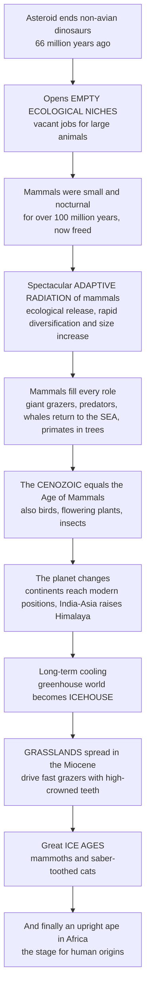

# 🦣 Cenozoic Life and the Age of Mammals

> [!abstract] TL;DR
> The **Cenozoic Era** (66 million years ago to today) is the chapter of Earth's history in which the **modern world** — its familiar animals, its continents, its climate, and ultimately *ourselves* — took shape from the wreckage of the dinosaurs. When the **end-Cretaceous asteroid** wiped out the non-avian dinosaurs, it emptied the planet of large-bodied "jobs" and unleashed the greatest **adaptive radiation** in mammalian history: the small, nocturnal survivors of the Age of Dinosaurs exploded in **diversity and body size**, filling every vacated niche — giant grazers, fearsome predators, tree-dwelling primates, and whales that returned to the **sea**. Meanwhile the planet itself transformed: continents drifted to their **modern positions** (India crashing into Asia to raise the Himalaya, the Isthmus of Panama joining the Americas), and the climate slid from an early-Cenozoic **greenhouse** into an **icehouse**, spreading **grasslands** that drove the evolution of fast-running, high-toothed grazers and, finally, plunging the world into the **Pleistocene Ice Ages** of mammoths, saber-toothed cats, and an upright ape in Africa. The Cenozoic teaches one of the deepest truths in the history of life: **catastrophe for one group is opportunity for another**.

## Intuition

**Analogy first.** Imagine a bustling office tower where, for a hundred million years, every senior role — CEO, floor manager, head of every department — has been locked up by one dominant family that refuses to retire. Everyone else is stuck as a junior night-shift clerk, small and overlooked, scurrying around only after the bosses go home. Then one day a catastrophe removes the entire ruling family in a single stroke. Suddenly **every corner office is empty at once**. The former night-clerks — nimble, adaptable, already in the building — scramble upward, and within a few "quarters" the whole org chart is refilled: some become the new executives, some the new specialists, some invent roles nobody held before. The building looks completely different, and it is the *survivors of the old order*, not newcomers, who now run everything.

That office is the planet, the ruling family is the **non-avian dinosaurs**, the catastrophe is the **asteroid** of 66 million years ago, and the night-clerks are the **mammals** — for over 100 million years kept small, mostly nocturnal, and marginal by the dominant dinosaurs. The "empty corner offices" are **ecological niches**: the vacant ways of making a living — being a giant grazer, an apex predator, an ocean giant, a fruit-eater in the canopy. With the dinosaurs gone, mammals radiated explosively to fill every one of them, growing from rat-sized survivors into elephants, whales, and eventually primates. This burst of diversification into freshly-opened opportunity is called **adaptive radiation** driven by **ecological release**, and the whole 66-million-year era that follows is the **Cenozoic** — the **Age of Mammals** (and, quietly, of birds, flowering plants, and insects too). Understanding it is understanding how the living world we actually inhabit — and the evolutionary stage onto which humanity finally walked — came to be.

---

## How It Works

### Core mechanics

1. **The empty world (66 Ma).** The [end-Cretaceous mass extinction] removed the non-avian dinosaurs, large marine reptiles, ammonites, and much else — roughly three-quarters of species. The **Cenozoic opens on a depleted planet** in which almost every large-bodied ecological role sits vacant. The surviving mammals are small (mostly under a few kilograms), insectivorous or omnivorous, and — freed from dinosaur predation and competition — poised.
2. **Ecological release and the mammal radiation.** With competitors and predators gone, the survivors experience **ecological release**: selection no longer penalizes being large and active by day. Over the **Paleocene and Eocene** (the first ~20 million years), mammalian lineages diversify explosively in an **adaptive radiation** — rapid branching into many forms, accompanied by a dramatic climb in **maximum body size** (from ~10 kg survivors to multi-tonne giants). The major modern **placental orders** appear in a geological blink: ungulates (hoofed herbivores), carnivorans, rodents, bats, and **primates**.
3. **Filling every niche.** Mammals reoccupy the full range of "jobs." Large herbivores arise as **proboscideans** (elephant relatives), **perissodactyls** (horses, rhinos — including the ~15-tonne hornless rhino *Paraceratherium*, the largest land mammal ever) and **artiodactyls** (deer, cattle, pigs). Large predators arise first as archaic **creodonts**, then as true **carnivorans** and repeated **saber-toothed** forms. On isolated continents, **marsupials** run the same experiment in parallel (Australia, South America). And in one of the most spectacular transitions, a lineage of hoofed mammals **returns to the sea** to become the **whales**.
4. **The whale transition (a textbook fossil series).** The land-to-sea passage is documented step by step: **Pakicetus** (a wolf-sized land mammal near water) → **Ambulocetus** (an amphibious "walking whale") → **Basilosaurus** (a fully aquatic, serpent-like whale with vestigial hind limbs). It is one of paleontology's clearest **transitional sequences**.
5. **The planet re-arranges (Cenozoic Earth).** **Plate tectonics** carries the continents to their modern positions: **India collides with Asia** to raise the **Himalaya and Tibetan Plateau**; the **Isthmus of Panama** closes (~3 Ma), joining the Americas and triggering the **Great American Biotic Interchange** of migrating faunas; **Antarctica** drifts over the South Pole and is thermally isolated by circumpolar ocean currents.
6. **Greenhouse to icehouse.** The early Cenozoic is a **hothouse** — the **Paleocene–Eocene Thermal Maximum (PETM, ~56 Ma)** is a sharp carbon-driven **hyperthermal**, and the **Early Eocene Climatic Optimum** has crocodiles near the poles. From there, a long-term **cooling** trend sets in: **Antarctic ice sheets** form near the **Eocene–Oligocene boundary (~34 Ma)**, **Northern Hemisphere ice sheets** follow (~3 Ma), and the **Pleistocene** breaks into rhythmic **glacial–interglacial cycles** paced by orbital (Milankovitch) forcing.
7. **Grasslands and the grazing revolution.** As the world cools and dries in the **Miocene**, **grasslands** (and, later, drought-tolerant **C4 grasses**) spread across continental interiors. Grass is abrasive (silica phytoliths) and grows in open country, driving a coevolutionary makeover of herbivores: **hypsodont** (high-crowned) teeth that resist wear, **cursorial** (running) limbs for open-ground escape, and **herding** behavior. The modern horse lineage is the classic case.
8. **The Ice Ages and megafauna.** The **Pleistocene** (2.6 Ma–11.7 ka) is the era of the great ice sheets and charismatic **megafauna**: woolly **mammoths** and **mastodons**, woolly **rhinos**, **saber-toothed cats**, **giant ground sloths**, and **cave bears**. At the end of the last glacial, a wave of **late-Quaternary megafaunal extinctions** removes most of these giants — a still-debated mix of **climate change** and **human hunting**.
9. **The human stage.** Amid all this, **primates** radiate; in **Africa**, apes give rise to the **hominins**, and by the late Cenozoic an upright, large-brained, tool-making lineage — *Homo* — walks onto the scene. The Cenozoic is, quite literally, the era that produced us.

### Flow: from the asteroid to an upright ape



---

## Key Concepts

### Secondary Level

**The Cenozoic is the "Age of Mammals."** After the dinosaurs died out 66 million years ago, mammals — until then small and mostly nocturnal — took over the world. This most recent era of Earth history runs right up to the present day and includes the rise of elephants, whales, horses, primates, and humans.

**Empty niches, then an explosion.** A **niche** is an animal's "job" in nature — what it eats, where it lives, how it makes a living. The asteroid emptied out all the big jobs the dinosaurs had held. Mammals rapidly evolved to fill them, a burst of new species and body plans called an **adaptive radiation**. Some got huge, some became fast runners, some became fierce hunters, and one group even went back to living in the ocean as **whales**.

**The three periods of the Cenozoic** (oldest to youngest):
- **Paleogene** — Paleocene, Eocene, Oligocene epochs; the first great mammal radiation.
- **Neogene** — Miocene, Pliocene epochs; grasslands spread and modern animals appear.
- **Quaternary** — Pleistocene ("Ice Ages") and Holocene (today); mammoths, then humans.

**The world got colder.** The early Cenozoic was warm and tropical, even near the poles. Over tens of millions of years it slowly cooled until ice sheets formed — first on **Antarctica**, then across the **Northern Hemisphere** — ending in the great **Ice Ages** of woolly mammoths and saber-toothed cats.

**The big idea.** *Catastrophe for one group is opportunity for another.* The disaster that ended the dinosaurs is exactly what gave mammals — and eventually us — our chance.

### Undergraduate Level

**Adaptive radiation via ecological release.** The post-K-Pg mammal boom is the archetypal **adaptive radiation**: a single surviving stock diversifies rapidly into many ecological forms when opportunity (vacant niches, low competition) opens up. Two signatures are visible in the fossil record — a rapid rise in **taxonomic diversity** (number of genera/families) and a rapid rise in **maximum body size**, from the sub-10-kg Paleocene survivors to the multi-tonne giants of the Eocene–Oligocene. Body-size increase itself follows a broadly convergent pattern across continents, constrained by land area and temperature.

**The modern orders appear fast.** Molecular clocks and fossils together show the major placental orders — **Perissodactyla, Artiodactyla (incl. Cetacea), Carnivora, Rodentia, Chiroptera, Primates** — diversifying in the **Paleocene–Eocene**. Isolated landmasses ran independent radiations: **marsupials** dominated **Australia** and were major players in **South America**, producing striking **convergences** (e.g., the marsupial "saber-tooth" *Thylacosmilus* paralleling placental *Smilodon*).

**The whale sequence.** *Pakicetus → Ambulocetus → Rodhocetus → Basilosaurus* traces artiodactyl land mammals becoming obligate marine cetaceans over ~10 million years, with intermediate **ankle bones (astragalus)** confirming the artiodactyl link and a shift from limb-driven to tail-driven swimming. It is a canonical case of a **major transition** documented by transitional fossils.

**Geography drives biology.** Cenozoic tectonics reshaped faunas: the **India–Asia collision** built the Himalaya and altered monsoon climate; the **closing of Panama (~3 Ma)** produced the **Great American Biotic Interchange** (North and South American mammals mixing, with net northern dominance); and the **thermal isolation of Antarctica** by the opening of Southern Ocean gateways enabled the **Antarctic Circumpolar Current** and permanent ice.

**Grassland–grazer coevolution.** The **Miocene** expansion of grasslands (and the later rise of **C4** photosynthesis) reshaped herbivore evolution. Selection favored **hypsodonty** (high-crowned teeth resisting silica-rich, gritty grass), **cursorial** limbs (elongated, single-toed feet in horses for open-country running), and **social herding**. Horses (*Hyracotherium* → *Equus*) are the textbook lineage: browsers with low-crowned teeth and multiple toes give way to hypsodont, single-toed grazers.

**The Ice Ages and their megafauna.** The **Quaternary** glacial–interglacial cycles, paced by **Milankovitch** orbital forcing, produced cold-adapted **megafauna** — mammoths, woolly rhinos, *Smilodon*, giant ground sloths, *Megaloceros*. The **late-Quaternary extinctions** removed most large-bodied genera on most continents, with timing that correlates variously with rapid warming *and* with the arrival of *Homo sapiens* — the still-open "**climate vs. overkill**" debate.

### Graduate Level

**Reading the cooling curve: the δ¹⁸O benthic record.** The canonical Cenozoic climate archive is the **deep-sea benthic foraminiferal oxygen-isotope (δ¹⁸O) stack** (Zachos et al., 2001). Because benthic δ¹⁸O integrates both **deep-water temperature** and **global ice volume**, its long rise through the Cenozoic records the greenhouse-to-icehouse transition. Key features: the **PETM (~56 Ma)** negative excursion (a ~5°C hyperthermal driven by massive carbon release, a deep-time analog for carbon-cycle perturbation); the **Early Eocene Climatic Optimum**; the sharp **Oi-1 glaciation (~34 Ma)** marking the onset of continental Antarctic ice at the Eocene–Oligocene boundary; **Northern Hemisphere glaciation intensifying (~2.7 Ma)**; and the **Mid-Pleistocene Transition** shift from ~41-kyr (obliquity-paced) to ~100-kyr (eccentricity-paced) glacial cycles.

**Tectonic and biogeochemical drivers of cooling.** Long-term Cenozoic cooling is attributed to a combination of declining **atmospheric CO₂** and tectonic reorganization: the **uplift-weathering hypothesis** (Himalayan/Tibetan uplift enhancing silicate weathering and CO₂ drawdown), the **opening of Southern Ocean gateways** (Tasmanian and Drake Passage) enabling the Antarctic Circumpolar Current and thermal isolation of Antarctica, and changing ocean heat transport. These couple **solid-Earth** processes to climate over tens of millions of years.

**Radiation dynamics and diversity dependence.** The mammal radiation is a natural laboratory for macroevolutionary theory: was diversification **unbounded** or **diversity-dependent** (slowing as niches fill, an "adaptive-zone" saturation)? Fossil and phylogenetic analyses show early-burst body-size and lineage diversification consistent with **ecological opportunity**, followed by damping — though debate continues over whether the placental **crown-group** radiation preceded or was triggered by the K-Pg boundary (the "**explosive**" vs. "**long-fuse**" vs. "**short-fuse**" models reconciling molecular clocks with a fossil record that shows few crown placentals before 66 Ma).

**Convergence and constraint.** Repeated independent evolution of **saber teeth** (nimravids, machairodont felids, the marsupial *Thylacosmilus*, and even the non-mammalian gorgonopsians earlier in the Permian), of **cursoriality**, and of **aquatic body plans** demonstrates that **empty niches channel evolution toward convergent solutions** — a central theme linking the Cenozoic to broader macroevolutionary theory (see *Speciation and Macroevolution*).

**The late-Quaternary extinction as a natural experiment.** The megafaunal collapse is analyzed with **survival analysis** across continents and body-size classes: extinction is strongly **size-biased** (large animals hit hardest, unlike background extinction), spatially **staggered** in a pattern tracking human arrival (Australia ~45 ka, Americas ~13 ka, late in Africa where megafauna coevolved with hominins), yet also coincident with abrupt deglacial climate swings. Disentangling forcing is the paradigm case connecting the deep-time record to the modern **anthropogenic biodiversity crisis** and the "**sixth mass extinction**" framing.

---

## Python Demo

```python
# Cenozoic Life and the Age of Mammals
# (a) ADAPTIVE RADIATION AFTER THE K-Pg: after the asteroid empties the world's
#     large-bodied niches, surviving mammals radiate explosively -- rising in both
#     DIVERSITY and MAXIMUM BODY SIZE (the "empty niche" fill / ecological release).
# (b) CENOZOIC COOLING: the deep-sea benthic oxygen-isotope (delta-18-O) curve,
#     which rises as the world cools from an early-Cenozoic GREENHOUSE (with the
#     PETM hyperthermal) into an ICEHOUSE (Antarctic ice ~34 Ma, then Northern
#     Hemisphere ice, then Pleistocene glacial cycles).
import numpy as np
import matplotlib.pyplot as plt

fig, (ax1, ax2) = plt.subplots(1, 2, figsize=(14, 5.5))

# ---------------------------------------------------------------
# (a) MAMMAL RADIATION: diversity + maximum body size after the K-Pg
# ---------------------------------------------------------------
# time axis: millions of years AGO, from the K-Pg boundary (66) to present (0)
age = np.linspace(66, 0, 400)          # Ma ago
t_since = 66 - age                     # Myr elapsed since the extinction

# DIVERSITY: near-zero large-mammal diversity at 66 Ma, then a logistic surge as
# vacated niches fill (diversity-dependent saturation), with modest late wiggles.
K_div = 100.0                          # relative "carrying capacity" of niche space
r_div = 0.18                           # radiation rate
diversity = K_div / (1.0 + 40.0 * np.exp(-r_div * t_since))
diversity *= 1.0 + 0.04 * np.sin(t_since / 6.0)   # minor fluctuation

# MAXIMUM BODY SIZE: survivors ~10 kg at 66 Ma climb toward multi-tonne giants
# (e.g. Paraceratherium ~15,000 kg by the Eocene-Oligocene), then plateau.
size_max = 10.0 + (16000.0 - 10.0) / (1.0 + 25.0 * np.exp(-0.28 * t_since))

ax1.plot(age, diversity, color="#b45309", lw=2.8, label="Mammal diversity (relative)")
ax1.set_xlim(66, 0)                    # older on LEFT, present on RIGHT
ax1.set_xlabel("Millions of years ago (Ma)")
ax1.set_ylabel("Mammal diversity (relative)", color="#b45309")
ax1.tick_params(axis="y", labelcolor="#b45309")
ax1.set_title("Adaptive radiation after the K-Pg\ndiversity and body size explode into empty niches")

# body size on a second (log) axis
ax1b = ax1.twinx()
ax1b.plot(age, size_max, color="#2563eb", lw=2.8, ls="--",
          label="Max body size (kg)")
ax1b.set_yscale("log")
ax1b.set_ylabel("Maximum body size (kg, log scale)", color="#2563eb")
ax1b.tick_params(axis="y", labelcolor="#2563eb")

# mark the K-Pg boundary (the trigger)
ax1.axvline(66, color="gray", ls=":", alpha=0.7)
ax1.annotate("K-Pg asteroid\n(dinosaurs gone)", xy=(66, 55),
             xytext=(55, 30), fontsize=8, color="gray",
             arrowprops=dict(arrowstyle="->", color="gray"))

# combined legend
lines1, labels1 = ax1.get_legend_handles_labels()
lines2, labels2 = ax1b.get_legend_handles_labels()
ax1.legend(lines1 + lines2, labels1 + labels2, loc="center right", fontsize=8)
ax1.grid(True, alpha=0.3)

# ---------------------------------------------------------------
# (b) CENOZOIC COOLING: the benthic delta-18-O curve (greenhouse -> icehouse)
# ---------------------------------------------------------------
age2 = np.linspace(66, 0, 1500)        # Ma ago

# baseline long-term rise in delta-18-O (higher = colder / more ice)
# schematic reconstruction of the Zachos-style trend
base = 0.6 + 0.055 * (66 - age2)                 # gentle secular cooling
# Antarctic glaciation step near the Eocene-Oligocene boundary (~34 Ma, Oi-1)
base += 1.2 / (1.0 + np.exp((age2 - 34.0) / 1.5))
# Northern Hemisphere ice intensifies from ~3 Ma onward
base += 0.9 / (1.0 + np.exp((age2 - 3.0) / 0.8))

d18O = base.copy()

# PETM hyperthermal spike: a sharp WARMING (negative delta-18-O) at ~56 Ma
d18O -= 0.9 * np.exp(-((age2 - 56.0) ** 2) / (2 * 0.6 ** 2))
# Early Eocene Climatic Optimum: broad warm interval ~52-50 Ma
d18O -= 0.35 * np.exp(-((age2 - 51.0) ** 2) / (2 * 2.0 ** 2))
# Pleistocene glacial-interglacial oscillations (last ~2.6 Ma)
glacial = 0.5 * np.sin(age2 * 6.0) * (age2 < 2.6)
d18O += glacial

ax2.plot(age2, d18O, color="#0f766e", lw=1.8)
ax2.invert_yaxis()                     # colder (higher d18O) plotted DOWNWARD
ax2.set_xlim(66, 0)
ax2.set_xlabel("Millions of years ago (Ma)")
ax2.set_ylabel("Benthic delta-18-O  (per mil)\n<- warmer     colder ->")
ax2.set_title("Cenozoic cooling: greenhouse to icehouse\ndeep-sea oxygen-isotope curve")

# annotate the key climate events
ax2.annotate("PETM\nhyperthermal", xy=(56, d18O[np.argmin(np.abs(age2 - 56))]),
             xytext=(60, 0.2), fontsize=8, color="#b91c1c",
             arrowprops=dict(arrowstyle="->", color="#b91c1c"))
ax2.annotate("Antarctic ice\n~34 Ma (Oi-1)", xy=(34, d18O[np.argmin(np.abs(age2 - 34))]),
             xytext=(40, 3.4), fontsize=8, color="#1d4ed8",
             arrowprops=dict(arrowstyle="->", color="#1d4ed8"))
ax2.annotate("N. Hemisphere ice\n+ Pleistocene cycles", xy=(2.6, d18O[np.argmin(np.abs(age2 - 2.6))]),
             xytext=(18, 4.6), fontsize=8, color="#4338ca",
             arrowprops=dict(arrowstyle="->", color="#4338ca"))
ax2.grid(True, alpha=0.3)

plt.tight_layout()
plt.savefig("cenozoic_age_of_mammals.png", dpi=120)
plt.show()

# Quantify the radiation and the cooling.
print(f"Mammal diversity at 66 Ma (relative): {diversity[0]:.1f}")
print(f"Mammal diversity today (relative):     {diversity[-1]:.1f}")
print(f"Max body size at 66 Ma: {size_max[0]:.0f} kg  ->  peak: {size_max.max():,.0f} kg")
print(f"Benthic d18O change (warm early Cenozoic -> today): "
      f"{d18O[np.argmin(np.abs(age2-50))]:.2f} -> {d18O[-1]:.2f} per mil (colder)")
print("Punchline: an emptied world let mammals radiate in size and number,")
print("while the planet slid from greenhouse to icehouse.")
```

---

## Real-World Applications

- **Reconstructing past climate to constrain the future.** The Cenozoic **δ¹⁸O cooling curve** and especially the **PETM** hyperthermal are the deep-time laboratory for how the Earth system responds to rapid carbon injection — directly informing climate sensitivity estimates and the study of *Anthropogenic Climate Change*.
- **Conservation baselines and "rewilding."** Knowing which **megafauna** were present before the late-Quaternary extinctions (and why they vanished) shapes debates over rewilding, trophic cascades, and what a "natural" ecosystem is — the deep-time backdrop to modern conservation biology.
- **Biostratigraphy and resource geology.** Cenozoic mammal faunas (**Land Mammal Ages**) and marine microfossils are used to **date and correlate** rock units, underpinning petroleum, coal, and groundwater exploration in Cenozoic basins.
- **Human evolution and biomedicine.** The Cenozoic **primate radiation** and the African origin of **hominins** frame paleoanthropology; comparative Cenozoic mammal genomics illuminates our own physiology and disease.
- **Testing macroevolutionary theory.** The post-K-Pg mammal radiation is a canonical dataset for models of **diversity-dependent diversification**, **body-size evolution (Cope's rule)**, and **convergence**, validating methods later applied across the tree of life.
- **Invasion and interchange analogs.** The **Great American Biotic Interchange** is a natural experiment in what happens when long-isolated biotas mix — a deep-time parallel for modern **biological invasions**.

---

## Common Pitfalls

- **Thinking mammals "beat" the dinosaurs.** Mammals did not out-compete the dinosaurs; they inherited an empty world. For over 100 million years mammals *coexisted* with dinosaurs while staying small — it took a **mass extinction** removing the incumbents, not gradual competitive victory, to release them.
- **Assuming the radiation was instantaneous.** "Geological blink" still means **millions of years**. The diversity and body-size climb unfolds across the whole Paleocene–Eocene (~10–20 Myr), and the molecular-clock debate ("explosive vs. long-fuse") is precisely about *how* clustered on the boundary it really was.
- **Calling the Cenozoic only the Age of Mammals.** Birds (including giant **terror birds**), teleost fish, flowering plants, and insects also radiated spectacularly. Mammals are the headline, not the whole story.
- **Confusing "warm early Cenozoic" with a steady warm era.** The Cenozoic climate is a **trend, not a state**: a hot early phase (with the PETM spike) gives way to tens of millions of years of **cooling**. Do not picture the whole era as tropical *or* as icy — it slides from one to the other.
- **Over-reading δ¹⁸O as pure temperature.** Benthic **δ¹⁸O reflects both deep-ocean temperature *and* global ice volume**; once ice sheets exist, changes in the curve partly track ice, not just temperature. Interpreting the signal requires separating these.
- **Treating the megafaunal extinction as settled.** The **"climate vs. overkill"** question is genuinely unresolved and *continent-dependent* — Australia points more to humans, some Eurasian losses more to climate, and the truth is likely a **synergy**. Avoid picking one cause dogmatically.
- **Assuming grasses caused hypsodont teeth by simple abrasion alone.** Recent work implicates **grit and dust** (windblown silica in open, dusty environments), not just phytoliths, as a major selective pressure — hypsodonty is about the whole open-habitat diet, not grass alone.

---

## Related Concepts

Within the Paleontology and Deep Time vault this note is part of the grand narrative of the history of life: it is set up by the sibling overview *Paleontology_and_Deep_Time_Overview* and follows directly from *Mesozoic_Life_the_Age_of_Dinosaurs* and its abrupt close in *The_End_Cretaceous_Extinction_and_the_Asteroid* — the very catastrophe that opens the Cenozoic. The evolutionary mechanism at its heart is developed in *Adaptive_Radiations_and_Diversification*, and the era's ultimate outcome — the emergence of our own lineage — is the subject of *Paleoanthropology_and_Human_Origins*.

- [[The_History_of_Life_on_Earth]] — Biology companion placing the Cenozoic mammal radiation within the full 4-billion-year arc of life
- [[Speciation_and_Macroevolution]] — the macroevolutionary theory (adaptive radiation, convergence, diversity dependence) that the mammal explosion exemplifies
- [[Natural_Selection_and_Adaptation]] — the selective mechanism behind grassland-grazer coevolution (hypsodonty, cursorial limbs) and body-size change
- [[Evidence_for_Evolution]] — transitional-fossil evidence such as the *Pakicetus → Basilosaurus* whale series and the horse lineage
- [[Mass_Extinctions_and_Paleoclimate]] — Earth Science treatment of the K-Pg extinction and Cenozoic climate that frame this era's beginning and cooling
- [[Continental_Drift_and_the_Plate_Tectonics_Revolution]] — the tectonics that drove continents to modern positions (India-Asia, Panama, Antarctic isolation)
- [[Geologic_Time_Scale]] — the formal periods and epochs (Paleogene, Neogene, Quaternary) used to subdivide the Cenozoic
- [[Paleoclimatology_and_Ice_Cores]] — Milankovitch orbital forcing and the glacial-interglacial cycles of the Pleistocene Ice Ages
- [[Glaciers_and_Glacial_Landscapes]] — the ice sheets whose advances and retreats sculpted the late-Cenozoic world of the megafauna
- [[Biomes_and_Global_Ecology]] — how the Cenozoic spread of grasslands created the modern biome pattern
- [[Extinction_and_the_Sixth_Mass_Extinction]] — the late-Quaternary megafaunal extinction as the deep-time prelude to today's biodiversity crisis

---

## Review Questions

1. **Secondary:** Why is the Cenozoic called the "Age of Mammals," and what event at its start gave mammals their opportunity? Explain in your own words what an "empty ecological niche" is and give one example of a niche that mammals filled.
2. **Undergraduate:** Describe the *Pakicetus → Ambulocetus → Basilosaurus* sequence and explain why it is considered strong evidence for evolution. Separately, explain how the Miocene spread of grasslands drove the evolution of **hypsodont teeth** and **cursorial limbs** in grazing mammals.
3. **Graduate:** The benthic **δ¹⁸O** record shows the Cenozoic sliding from greenhouse to icehouse. (a) Identify the PETM, the ~34 Ma Antarctic glaciation, and the intensification of Northern Hemisphere ice, and name a tectonic driver of long-term cooling. (b) Why is δ¹⁸O ambiguous between temperature and ice volume, and how does that ambiguity change its interpretation before versus after ~34 Ma? (c) Summarize the "climate vs. overkill" debate for the late-Quaternary megafaunal extinctions and why the evidence is continent-dependent.

---

## Sources

- Prothero, D.R. (2016). *The Princeton Field Guide to Prehistoric Mammals.* Princeton University Press.
- Prothero, D.R. (2006). *After the Dinosaurs: The Age of Mammals.* Indiana University Press.
- Benton, M.J. (2015). *Vertebrate Palaeontology* (4th ed.). Wiley-Blackwell.
- Zachos, J., Pagani, M., Sloan, L., Thomas, E. & Billups, K. (2001). "Trends, rhythms, and aberrations in global climate 65 Ma to present." *Science*, 292(5517), 686–693.
- Thewissen, J.G.M. (2014). *The Walking Whales: From Land to Water in Eight Million Years.* University of California Press.

#paleontology #cenozoic #age-of-mammals #adaptive-radiation #ice-age
