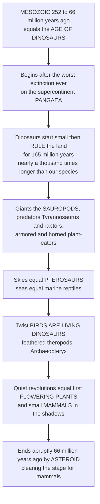

# 🦕 Mesozoic Life: the Age of Dinosaurs

> [!abstract] TL;DR
> The **Mesozoic Era** (~252–66 million years ago) is the most famous chapter in the history of life — the **Age of Dinosaurs** — but its real story is richer than the movies. It opened in the devastated aftermath of the **end-Permian extinction** (the worst mass extinction ever) on a recovering world dominated by the single supercontinent **Pangaea**. From the survivors, a new cast rose: the **dinosaurs**, which started small and modest yet seized the land and ruled it for an astonishing **~165 million years** — nearly a *thousand* times longer than our own species has existed. They became the largest land animals that ever lived (the long-necked **sauropods**), fearsome predators (*Tyrannosaurus*, the raptors), and armored and horned giants; meanwhile **pterosaurs** conquered the skies and giant marine reptiles ruled the seas. Paleontology's great twist: **birds *are* living dinosaurs** — feathered theropods that took to the air (*Archaeopteryx* is the famous link), so the dynasty never fully ended; it is at your bird feeder. Beneath the giants, two quiet revolutions assembled the modern world — the first **flowering plants** and the small, nocturnal **mammals** that were our own ancestors. An **asteroid** ended it all 66 million years ago, clearing the stage for mammals.

---

## Intuition

**Analogy — the 165-million-year dynasty everyone half-remembers.** Everyone knows the headline: *dinosaurs were huge and then a rock killed them.* But imagine a royal dynasty so long-lived that if you compressed all of *human* existence (roughly 300,000 years) into a single day, the dinosaurs' reign would run for nearly a *year*. That is the scale we are dealing with. The dinosaurs did not appear fully grown and gigantic; they started as modest, dog-sized creatures scurrying among bigger reptiles, then — after a lucky break (a mass extinction cleared their rivals) — they radiated into the most spectacular land animals in Earth's history and held the throne for 165 million years.

Now the twist that turns the familiar story strange. The dynasty is *still ruling*. Paleontology's greatest detective triumph of the last century was proving that **birds are dinosaurs** — not descendants *of* dinosaurs the way we descend from apes, but literal, feathered, flying dinosaurs, one surviving branch of the meat-eating theropods that included *Tyrannosaurus*. The pigeon on the windowsill is a Mesozoic survivor. And while the giants stomped overhead, two revolutions were quietly assembling the world we live in: the first **flowers** were co-evolving with insects, and small, warm, furry **mammals** — our ancestors — were waiting in the shadows for their turn. Understand the Mesozoic and you understand both the grandeur of deep-time dynasties *and* the origins of the birds, flowers, and mammals that define life today.

---

## How It Works

### Core Mechanics

1. **A recovering world (Triassic, ~252–201 Ma).** The Mesozoic opened in the wreckage of the **end-Permian "Great Dying,"** which erased ~90 percent of marine species. Recovery was slow. On a single supercontinent, **Pangaea**, the survivors — including the **archosaurs** — diversified. Dinosaurs *originated* here (~230 Ma) but stayed modest, sharing the stage with big crocodile-relatives and mammal ancestors.
2. **A second lucky break (end-Triassic extinction, ~201 Ma).** Another extinction pulse removed many of the dinosaurs' rivals. The survivors radiated explosively into the empty ecological space — the dinosaurs' *rise to dominance* really begins in the Jurassic.
3. **The reign (Jurassic + Cretaceous, ~201–66 Ma).** Two great lineages — **saurischians** ("lizard-hipped": sauropods and theropods) and **ornithischians** ("bird-hipped": the horned, armored, and duck-billed plant-eaters) — filled every large-bodied land niche. Giants, predators, herds, and armored tanks dominated terrestrial ecosystems for over 130 million years.
4. **Air and sea.** Land was only part of it. **Pterosaurs** — the first flying vertebrates — owned the skies, while ichthyosaurs, plesiosaurs, and later **mosasaurs** ruled the seas. The Mesozoic was truly the **Age of Reptiles**.
5. **The supercontinent breaks up.** Through the era, **Pangaea rifted apart** — the Atlantic opened, Gondwana fragmented — physically separating faunas and driving **biogeographic divergence** (rising endemism on isolating landmasses).
6. **Quiet revolutions.** The first **flowering plants (angiosperms)** appeared and radiated explosively in the Cretaceous, co-evolving with pollinating insects and remaking terrestrial ecosystems. Meanwhile **mammals** — descended from Triassic synapsids — stayed small and nocturnal, diversifying in the shadows.
7. **Abrupt end (K-Pg, 66 Ma).** An **asteroid impact** ended the non-avian dinosaurs, pterosaurs, and marine reptiles — but *one* dinosaur branch survived: **birds**. The extinction cleared the stage for mammals.

### Flow / Architecture



---

## Key Concepts

### 🟢 Secondary

- **The three periods.** The Mesozoic ("middle life") divides into the **Triassic** (252–201 Ma), **Jurassic** (201–145 Ma), and **Cretaceous** (145–66 Ma). Dinosaurs *appear* in the Triassic, *dominate* through the Jurassic and Cretaceous, and (except birds) *die out* at the end.
- **Dinosaurs started small.** They did not begin as giants. Early dinosaurs were modest, agile creatures; they grew into the largest land animals ever only after they came to dominate.
- **The biggest land animals ever.** The long-necked **sauropods** (e.g. *Brachiosaurus*, *Argentinosaurus*) reached tens of tonnes — some as heavy as a dozen elephants. No land animal before or since has matched them.
- **Reptiles ruled land, sea, and sky.** Dinosaurs on land, **pterosaurs** in the air, and marine reptiles (ichthyosaurs, plesiosaurs, mosasaurs) in the oceans.
- **Birds are living dinosaurs.** The most surprising fact in paleontology: birds are one surviving lineage of feathered dinosaurs. The dinosaurs never fully went extinct.
- **The world was different.** One giant continent (**Pangaea**), a warm ice-free "greenhouse" climate, and — for most of the era — no flowers and no grasses.

### 🟡 Undergraduate

- **Pangaea and its breakup.** The Mesozoic began with all continents fused into **Pangaea**. Rifting through the Triassic–Jurassic opened the **Atlantic** and fragmented **Gondwana**, progressively isolating faunas and increasing **provinciality** (regional endemism) — a natural experiment in **biogeography** and **allopatric divergence**.
- **The two dinosaur lineages.** **Saurischia** (theropod predators + sauropod giants) and **Ornithischia** (ceratopsians, stegosaurs, ankylosaurs, ornithopods). *Note the irony:* "bird-hipped" ornithischians did **not** give rise to birds — birds arose from within the "lizard-hipped" theropods.
- **Dinosaur biology was advanced.** Erect, pillar-like limb posture (legs *under* the body, not sprawling); rapid growth; likely elevated metabolism trending toward **endothermy**; nesting and **parental care**; and — in many theropods — **feathers**. These are not sluggish swamp-dwellers.
- **The origin of birds.** *Archaeopteryx* (Late Jurassic, ~150 Ma) and the extraordinary feathered-dinosaur fossils from China's **Liaoning** deposits show the transition step by step: feathers evolved **first** for insulation and display, and only **later** were co-opted for flight. Birds are surviving **avian theropods**.
- **The rise of flowers.** **Angiosperms** appeared in the Early Cretaceous and radiated explosively, co-evolving with pollinating **insects** — a mutualism that reshaped terrestrial ecosystems and set up the flowering-plant-dominated world we live in.
- **Mammals in the shadows.** Descended from Triassic **synapsids/therapsids**, Mesozoic mammals stayed small and mostly nocturnal for ~150 million years — a long apprenticeship, not a failure. They diversified quietly beneath the dinosaurs, waiting for the stage to clear.

### 🔴 Graduate

- **Two extinctions bookend the dinosaurs' rise.** The dinosaurs' path to dominance was gated by *contingency*: the end-Permian cleared the Permian megafauna and let archosaurs radiate, and the **end-Triassic extinction** removed the crurotarsan (croc-line) competitors that had rivaled early dinosaurs. Dinosaur dominance was as much *ecological opportunity* as competitive superiority — a caution against adaptationist "just-so" narratives.
- **Biomechanics of gigantism.** Sauropod giantism required a suite of enabling traits: **avian-style air-sac lungs** (efficient respiration and skeletal pneumaticity lightening the giant frame), long necks harvesting vegetation over huge areas with minimal locomotion, small heads with no chewing (bulk fermentation in a barrel gut), and rapid growth. Scaling of bone strength and the **square-cube law** set the mechanical ceilings — see functional-morphology treatments of limb-bone allometry.
- **The endothermy debate.** Whether dinosaurs were ectotherms, endotherms, or intermediate "mesotherms" is inferred from bone histology (growth-line spacing), isotopic body-temperature proxies, predator-prey ratios, and phylogenetic bracketing with living archosaurs. The modern consensus favors elevated, growth-fueling metabolic rates in many lineages, with birds inheriting full endothermy.
- **Character acquisition in the dinosaur-to-bird transition.** Bird features did **not** appear all at once. Bipedality and hollow bones, then a **furcula** (wishbone), then filamentous protofeathers, then **pennaceous (vaned) feathers**, then asymmetric flight feathers and elongated forelimbs, then powered flight — each stage is documented in non-avian theropods *before* true birds. This is a textbook case of **exaptation** (features evolving for one function, insulation/display, then co-opted for another, flight) and of **mosaic evolution**.
- **Paleobiogeography and vicariance.** Pangaea's stepwise fragmentation makes the Mesozoic a laboratory for **vicariance biogeography**: shared basal faunas become increasingly endemic as ocean barriers form, testing dispersalist vs vicariance models against the calibrated plate-tectonic reconstruction — see plate-tectonic and supercontinent-cycle treatments.
- **Ecosystem restructuring by angiosperms.** The Cretaceous rise of flowering plants ("Cretaceous Terrestrial Revolution") restructured food webs, accelerated insect diversification (pollinators, herbivores), and altered fire regimes, weathering, and nutrient cycling — a case where a botanical innovation reorganizes an entire biosphere.

---

## Python Demo

```python
# Mesozoic life, four views:
#   (A) Timeline of the three periods with key events
#   (B) Dinosaur body-size range on a log scale (they were the largest land animals ever)
#   (C) Pangaea breakup driving rising faunal provinciality (endemism)
#   (D) Dinosaur-to-bird character acquisition (features appear before true birds)
# Pure numpy + matplotlib, fully runnable.

import numpy as np
import matplotlib.pyplot as plt

fig, axes = plt.subplots(2, 2, figsize=(15, 10))
axA, axB, axC, axD = axes.ravel()

# ----------------------------------------------------------------------
# (A) MESOZOIC TIMELINE  (252 -> 66 Ma)
# ----------------------------------------------------------------------
periods = [("Triassic", 252, 201, "#f4a261"),
           ("Jurassic", 201, 145, "#2a9d8f"),
           ("Cretaceous", 145, 66, "#e76f51")]
for name, start, end, c in periods:
    axA.barh(0, start - end, left=end, height=0.5, color=c, edgecolor="white")
    axA.text((start + end) / 2, 0, name, ha="center", va="center",
             fontsize=10, weight="bold", color="white")

# (label, age Ma, vertical offset for staggering)
events = [
    ("End-Permian recovery", 252,  0.9),
    ("First dinosaurs",      230,  0.55),
    ("End-Triassic extinction", 201, 0.9),
    ("Pangaea breakup / Atlantic opens", 180, 0.55),
    ("First birds (Archaeopteryx)", 150, 0.9),
    ("Flowering plants radiate", 110, 0.55),
    ("K-Pg asteroid impact",  66,  0.9),
]
for label, age, y in events:
    axA.plot([age, age], [0.25, y - 0.05], color="#555", lw=0.8)
    axA.plot(age, 0.25, "o", color="#111", ms=5)
    axA.text(age, y, label, ha="center", va="bottom", fontsize=8, color="#111")

axA.set_xlim(260, 55)          # older on the left
axA.set_ylim(-0.5, 1.3)
axA.set_yticks([])
axA.set_xlabel("Millions of years ago (Ma)")
axA.set_title("(A) The Mesozoic Era: three periods, ~165 Myr of dinosaur reign",
              fontsize=11, weight="bold")

# ----------------------------------------------------------------------
# (B) DINOSAUR BODY-SIZE RANGE  (log scale, kg)
# ----------------------------------------------------------------------
animals = [
    ("Microraptor\n(feathered)", 1.0,     "#8ecae6"),
    ("Velociraptor\n(raptor)",   15.0,    "#8ecae6"),
    ("Human\n(for scale)",       70.0,    "#adb5bd"),
    ("Stegosaurus\n(plated)",    3500.0,  "#95d5b2"),
    ("African elephant\n(for scale)", 6000.0, "#adb5bd"),
    ("Tyrannosaurus\n(predator)", 8000.0, "#e07a5f"),
    ("Triceratops\n(horned)",    9000.0,  "#95d5b2"),
    ("Brachiosaurus\n(sauropod)", 35000.0, "#f4a261"),
    ("Argentinosaurus\n(sauropod)", 70000.0, "#f4a261"),
]
labels = [a[0] for a in animals]
masses = np.array([a[1] for a in animals])
colors = [a[2] for a in animals]

y = np.arange(len(animals))
axB.barh(y, masses, color=colors, edgecolor="#333", log=True)
axB.set_yticks(y)
axB.set_yticklabels(labels, fontsize=8)
axB.invert_yaxis()
axB.set_xlabel("Body mass (kg, log scale)")
axB.set_title("(B) Dinosaur size range: the largest land animals ever\n"
              "(a big sauropod outweighed ~12 elephants)",
              fontsize=11, weight="bold")
for yi, m in zip(y, masses):
    axB.text(m * 1.15, yi, f"{m:,.0f} kg", va="center", fontsize=7.5)

# ----------------------------------------------------------------------
# (C) PANGAEA BREAKUP -> RISING FAUNAL PROVINCIALITY
# ----------------------------------------------------------------------
t = np.linspace(252, 66, 400)                 # Ma, old -> young
# Number of isolated faunal "provinces" grows in steps as Pangaea fragments.
provinces = np.ones_like(t)
provinces += 1.0 / (1 + np.exp((t - 175) / 8))   # Pangaea -> Laurasia + Gondwana
provinces += 1.5 / (1 + np.exp((t - 130) / 8))   # Gondwana fragments
provinces += 1.5 / (1 + np.exp((t - 100) / 8))   # S. Atlantic widens, continents isolate

axC.plot(t, provinces, color="#264653", lw=2.5)
axC.fill_between(t, 1, provinces, color="#2a9d8f", alpha=0.25)
for age, txt in [(175, "Pangaea splits\n(Laurasia / Gondwana)"),
                 (130, "Gondwana\nfragments"),
                 (100, "Atlantic widens\ncontinents isolate")]:
    axC.axvline(age, color="#e76f51", ls="--", lw=1)
    axC.text(age, 1.05, txt, ha="center", va="bottom", fontsize=7.5, color="#b5471f")

axC.set_xlim(252, 66)
axC.invert_xaxis()
axC.set_xlabel("Millions of years ago (Ma)")
axC.set_ylabel("Faunal provinciality (endemism index)")
axC.set_title("(C) Pangaea breakup drives biogeographic divergence",
              fontsize=11, weight="bold")

# ----------------------------------------------------------------------
# (D) DINOSAUR-TO-BIRD CHARACTER ACQUISITION
# ----------------------------------------------------------------------
# Features appear stepwise in theropods BEFORE true powered-flying birds.
steps = [
    ("Bipedal, hollow bones", 230),
    ("Furcula (wishbone)",    200),
    ("Filamentous protofeathers", 175),
    ("Pennaceous (vaned) feathers", 165),
    ("Winged forelimbs",      155),
    ("Powered flight (birds)", 150),
]
ages = np.array([s[1] for s in steps])
cum = np.arange(1, len(steps) + 1)             # cumulative bird-like traits

# Build a step plot from oldest to youngest.
axD.step(np.append(ages, 66), np.append(cum, cum[-1]),
         where="post", color="#5a189a", lw=2.5)
axD.plot(ages, cum, "o", color="#9d4edd", ms=8, zorder=3)
for (label, age), c in zip(steps, cum):
    axD.annotate(label, xy=(age, c), xytext=(age - 3, c + 0.15),
                 ha="right", va="bottom", fontsize=8)

axD.axvline(150, color="#e76f51", ls="--", lw=1)
axD.text(150, 0.3, "true birds", color="#b5471f", fontsize=8, ha="right")
axD.set_xlim(240, 66)
axD.invert_xaxis()
axD.set_ylim(0, len(steps) + 1)
axD.set_xlabel("Millions of years ago (Ma)")
axD.set_ylabel("Cumulative bird-like traits")
axD.set_title("(D) Birds are dinosaurs: features acquired step by step",
              fontsize=11, weight="bold")

plt.tight_layout()
plt.savefig("mesozoic_life.png", dpi=120)

# A quick perspective print-out:
dino_reign = 165e6          # years dinosaurs dominated
human_span = 300e3          # years Homo sapiens has existed
print(f"Dinosaur reign: {dino_reign/1e6:.0f} million years")
print(f"Homo sapiens so far: {human_span/1e3:.0f} thousand years")
print(f"Dinosaurs reigned about {dino_reign/human_span:,.0f}x longer than we have existed")
```

Panel A lays out the three periods and the events that matter: dinosaurs *originate* modestly in the Triassic, *rise* after the end-Triassic extinction, birds and flowers appear mid-era, and an asteroid ends it at 66 Ma. Panel B drives home the size story on a log scale — a big sauropod outweighed roughly a dozen elephants, making dinosaurs the largest land animals that ever lived. Panel C models how Pangaea's breakup progressively isolated faunas, raising endemism. Panel D shows the paleontological punchline: bird features accumulated *step by step* in theropods long before powered flight, which is why birds *are* dinosaurs. The print-out puts the reign in human perspective — dinosaurs ruled roughly 550 times longer than *Homo sapiens* has so far existed.

---

## Real-World Applications

- **Understanding evolution's grand patterns.** The Mesozoic is the textbook case of **adaptive radiation** after mass extinction, of **exaptation** (feathers → flight), and of **contingency** (dinosaurs rose because extinctions cleared their rivals). It is where macroevolutionary theory meets its richest data.
- **The bird-dinosaur link as a public science triumph.** The discovery that **birds are living dinosaurs** — confirmed by *Archaeopteryx* and the feathered fossils of Liaoning — is one of the best-supported and most rhetorically powerful demonstrations of evolutionary continuity, widely used in education and museum outreach.
- **Deep-time climate and biosphere lessons.** The Mesozoic "greenhouse" world (warm, ice-free, high CO2) is a natural experiment in how ecosystems, sea levels, and ocean chemistry behave under sustained warmth — data that informs projections of anthropogenic warming.
- **Biogeography and conservation baselines.** Pangaea's breakup is the reference case for how continental fragmentation generates and partitions biodiversity, underpinning how biogeographers reason about endemism, dispersal, and the vulnerability of isolated island-like faunas today.
- **Biomechanics and bio-inspired engineering.** Sauropod gigantism (air-sac lungs, lightweight pneumatic bones) and theropod/bird flight inform functional-morphology methods and the study of how the physics of lift, bone strength, and metabolism scale with body size.
- **Cultural and economic reach.** Dinosaurs are the gateway drug to science for millions of children; Mesozoic marine and terrestrial strata are also major sources of oil, gas, and chalk, tying the era to the energy economy.

---

## Common Pitfalls

- **"Dinosaurs were always giant."** They started small and modest in the Triassic and became giants only after rising to dominance. The Age of Dinosaurs is a 165-million-year *story*, not a static tableau of giants.
- **"The dinosaurs all died out."** Non-avian dinosaurs did — but **birds are dinosaurs**, so the lineage survives and thrives (~10,000 living species). Saying dinosaurs are extinct is like saying mammals are extinct because mammoths are.
- **Confusing the two hip lineages.** The "bird-hipped" **ornithischians** did **not** give rise to birds. Birds arose from within the "lizard-hipped" theropod **saurischians**. The naming is a historical trap.
- **Treating pterosaurs and marine reptiles as "dinosaurs."** Pterosaurs, ichthyosaurs, plesiosaurs, and mosasaurs were Mesozoic reptiles but were **not** dinosaurs. Dinosaurs are a specific land-vertebrate clade.
- **Assuming feathers evolved for flight.** Feathers appear first as **insulation and display** structures in non-flying theropods; flight was a later co-option (**exaptation**). Reversing the order misreads the whole transition.
- **Overlooking the quiet revolutions.** Fixating on the giants misses the era's deepest legacy: the origin of **flowering plants** and the long "shadow phase" of **mammals** that produced the modern terrestrial world.
- **Reading dinosaur dominance as inevitable superiority.** Their rise depended on **contingency** — mass extinctions clearing competitors — not on some intrinsic destiny to dominate.

---

## Related Concepts

This note lives in the vault's **History of Life** section and continues the narrative arc set up by the *Paleontology and Deep Time Overview*, following *Paleozoic Life and the Colonization of Land* and preceding *Cenozoic Life and the Age of Mammals*. The era's abrupt close is treated in depth in the companion sibling *The End-Cretaceous Extinction and the Asteroid*, and the biomechanics of sauropod gigantism and theropod flight are explored in *Functional Morphology and Biomechanics of Fossils*. Those siblings are named here in prose so they can be wired once written.

Glob-verified cross-vault links to existing notes:

- [[The_History_of_Life_on_Earth]] — the biology-vault synthesis of life's whole sequence; this note zooms into its Mesozoic chapter.
- [[Continental_Drift_and_the_Plate_Tectonics_Revolution]] — the mechanism behind Pangaea's assembly and breakup that partitioned Mesozoic faunas.
- [[Wilson_Cycle_and_Supercontinents]] — the supercontinent cycle that made and unmade Pangaea, framing Mesozoic paleogeography.
- [[Earths_History_Hadean_to_Phanerozoic]] — the deep-time planetary narrative on which the Mesozoic sits between the Paleozoic and Cenozoic.
- [[Speciation_and_Macroevolution]] — the branching, radiation, and large-scale patterns that produced the dinosaur, bird, angiosperm, and mammal radiations.
- [[Natural_Selection_and_Adaptation]] — the mechanism refining flight, gigantism, and armor over the era's vast timescales.
- [[Phylogenetics_and_the_Tree_of_Life]] — the cladistic framework that placed birds firmly inside the theropod dinosaurs.
- [[Evidence_for_Evolution]] — transitional fossils like *Archaeopteryx* as textbook evidence for descent with modification.
- [[Extinction_and_the_Sixth_Mass_Extinction]] — the ecology-vault companion on extinction dynamics; the K-Pg event is the archetype for today's biodiversity crisis.
- [[Mutualism_Commensalism_and_Symbiosis]] — the angiosperm-pollinator coevolution that reshaped Cretaceous terrestrial ecosystems.
- [[Predator_Prey_and_Population_Interactions]] — the ecological dynamics underlying Mesozoic food webs of theropod predators and herbivorous giants.
- [[Airfoils_and_Wing_Theory]] — the aerodynamics of lift that pterosaur and bird wings independently exploited to conquer the air.

---

## Review Questions

1. **(Secondary)** In what sense are birds "living dinosaurs," and why is it inaccurate to say that dinosaurs went completely extinct? Name the famous fossil that links dinosaurs to birds.
2. **(Undergraduate)** The dinosaurs *originated* in the Triassic but only *dominated* from the Jurassic onward. Explain the role the end-Triassic extinction played, and why this makes dinosaur dominance an example of contingency rather than inevitable competitive superiority.
3. **(Graduate)** Feathers are found on many non-flying theropods. Explain how this evidence supports the hypothesis that feathers evolved first for insulation or display and were later co-opted for flight (exaptation), and describe how the *sequence* of character acquisition (protofeathers → vaned feathers → wings → powered flight) is reconstructed from the fossil record.

---

## Sources

- Brusatte, S. *The Rise and Fall of the Dinosaurs: A New History of a Lost World*. William Morrow, 2018.
- Benton, M. J. *Vertebrate Palaeontology*, 4th ed. Wiley-Blackwell, 2015.
- Xu, X., Zhou, Z., Dudley, R., et al. "An integrative approach to understanding bird origins." *Science* 346, 1253293 (2014); and Norell, M. A. & Xu, X. "Feathered Dinosaurs." *Annual Review of Earth and Planetary Sciences* 33 (2005).
- Sereno, P. C. "The Evolution of Dinosaurs." *Science* 284, 2137–2147 (1999).
- Sander, P. M., et al. "Biology of the sauropod dinosaurs: the evolution of gigantism." *Biological Reviews* 86 (2011).

---

#paleontology #mesozoic #dinosaurs #birds-are-dinosaurs #pangaea
