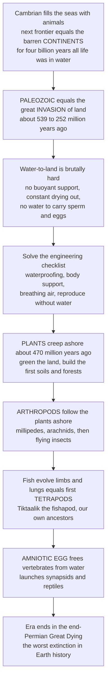

# 🐟 Paleozoic Life and the Colonization of Land

> [!abstract] TL;DR
> The **Paleozoic Era** (about **539 to 252 million years ago**) is the epic of life's greatest expansion — its **invasion of the land**. After the **Cambrian explosion** filled the seas with animals, life faced its next frontier: the barren, lifeless **continents**, where for roughly four billion years there had been nothing but bare rock. Moving from water to air is brutally hard, because water supports your weight, keeps you moist, carries your gametes, and buffers temperature — land offers none of that. Over the Paleozoic, life solved this engineering checklist in stages: **plants** crept ashore around **470 Ma** and greened the continents, building the first soils and forests; **arthropods** followed the plants; then **fish evolved sturdy limbs and lungs** and hauled themselves out as the first **tetrapods** (four-legged vertebrates — our own ancestors, via "fishapod" transitional fossils like *Tiktaalik*); and finally the **amniotic egg** freed vertebrates from returning to water to breed, launching the reptiles. The era ended in the worst catastrophe in Earth's history — the **end-Permian "Great Dying."** To understand the Paleozoic is to understand how the entire land-based world we live in came to be.

---

## Intuition

**Analogy — the amphibious assault on an empty planet.** Picture Earth as a world where every living thing is trapped in the ocean, and the vast continents stretch out as an utterly empty, hostile shore — no plants, no animals, no soil, just bare rock baking under an unfiltered sun. Now imagine trying to launch an invasion of that shore. You cannot just walk out. The moment you leave the water you begin to dry out like a beached fish, gravity crushes a body that was built to float, your gills gasp uselessly in thin air, and your eggs — which have always drifted in water — shrivel and die. Colonizing land is like sending troops into an environment with no air, no food, and no shelter: you have to invent the space suit, the life support, and the supply chain *before* you can hold the beachhead.

That is exactly the problem life faced in the Paleozoic, and it solved the whole checklist in stages over roughly 300 million years. First came the "terraformers" — microbes and then **plants** — which greened the rock, built the first soils, and released the oxygen and food that made the land habitable. Then the "infantry" — **arthropods** — followed the plants ashore. And finally, in the most dramatic chapter, **fish grew legs**: lobe-finned fish evolved sturdy limbs, wrists, necks, and lungs, and crawled out as the first four-legged **tetrapods** — the direct ancestors of every amphibian, reptile, bird, and mammal, including you. The last barrier, reproduction, fell when the **amniotic egg** — a private pond in a shell — let vertebrates breed on dry land at last. The land you walk on, the forests, the soil, the insects, and your own four-limbed body plan are all trophies of this ancient invasion.

---

## How It Works

### Core Mechanics

1. **The starting point: a marine-only world.** After the Cambrian explosion (about 539 Ma) and the **Great Ordovician Biodiversification Event**, the seas teemed with trilobites, brachiopods, corals, cephalopods, and the first fish — but the continents were sterile rock. The Paleozoic's six periods (**Cambrian, Ordovician, Silurian, Devonian, Carboniferous, Permian**) chart the arc from that empty-land world to richly vegetated, animal-filled continents.
2. **The engineering checklist of land.** Leaving water forces an organism to solve several lethal problems *simultaneously*: **desiccation** (needs waterproofing — waxy cuticle, skin), **gravity and support** (no buoyancy — needs stems, lignin, skeletons, limbs), **gas exchange in air** (needs stomata, lungs, or tracheae), **reproduction away from water** (spores, then **seeds** and the **amniotic egg**), plus **UV exposure** (survivable only once the oxygen-built **ozone shield** existed) and wider **temperature swings**.
3. **Plants go first and terraform the land.** From about **470 Ma**, the sequence ran moss-grade plants → early **vascular plants** (*Cooksonia*) → **lignin, roots, and leaves** → the first **trees and forests** (*Archaeopteris*, Devonian) → the **seed**. Plants built soils, accelerated weathering, drew down atmospheric CO2, and pumped up oxygen.
4. **Animals follow the plants.** **Arthropods** (early millipedes and arachnids, then insects with flight) colonized the new green world first. Then **lobe-finned fish** evolved toward land: *Tiktaalik* and other "fishapods" show the fin-to-limb transition, followed by early tetrapods (*Acanthostega*, *Ichthyostega*).
5. **The amniotes break the last tether.** The **amniotic egg** — a self-contained shelled pond — let vertebrates reproduce entirely on land, launching the amniotes, which split into **synapsids** (our mammal line) and **sauropsids** (the reptile line) as **Pangaea** assembled. The era then closed with the catastrophic **end-Permian mass extinction**.

### Flow / Architecture



---

## Key Concepts

### 🟢 Secondary

- **The Paleozoic in one line.** The "old life" era (about 539 to 252 Ma) when life spread from the oceans onto the land and built the terrestrial world — divided into six periods: **Cambrian, Ordovician, Silurian, Devonian, Carboniferous, Permian**.
- **Why land was empty.** For roughly four billion years the continents were bare rock. Land has no water to hold you up, keep you moist, or carry your eggs — so living there meant inventing entirely new equipment.
- **Plants greened the world first.** Small moss-like plants, then the first vascular plants and trees, spread over the land from about 470 Ma, creating the first **forests** and **soils** and pumping oxygen into the air.
- **Fish grew legs.** In the Devonian "**Age of Fishes**," some fish evolved lungs and limbs and became the first four-legged land animals (**tetrapods**) — the ancestors of amphibians, reptiles, birds, and mammals. *Tiktaalik* is the famous half-fish, half-tetrapod fossil.
- **The great coal forests.** The **Carboniferous** was blanketed in swampy forests so vast that their buried remains became today's **coal** — and so much oxygen built up that **insects grew giant**.

### 🟡 Undergraduate

- **The Great Ordovician Biodiversification Event (GOBE).** After the Cambrian set up the animal body plans, marine diversity *soared* in the Ordovician — reefs, filter-feeders, and complex food webs expanded dramatically before the first end-Ordovician mass extinction.
- **The plant colonization sequence.** **Bryophyte-grade** plants (mosses, liverworts, no true vascular tissue) → early **vascular plants** (*Cooksonia*, preserved beautifully in the **Rhynie Chert** Lagerstätte) → the evolution of **lignin, roots, and megaphyll leaves** → the first trees (*Archaeopteris*) and Devonian forests → the **seed**, which packages the embryo with food and a coat and finally frees plants from needing surface water to reproduce.
- **The fish-to-tetrapod transition.** Within the **sarcopterygian** (lobe-finned) fish, a lineage evolved toward land: *Eusthenopteron* → **elpistostegalians** like *Tiktaalik* (a flat-headed "fishapod" with a neck, wrist bones, and lungs) → early tetrapods **Acanthostega** and **Ichthyostega**, which retained **polydactyly** (six to eight digits) and were still largely aquatic. Limbs likely evolved *before* full terrestriality — for maneuvering in weedy shallows.
- **Carboniferous oxygen and gigantism.** Vast coal-swamp forests buried organic carbon faster than it decayed, pushing atmospheric **oxygen to about 35 percent** (versus 21 percent today). Because insects breathe by passive diffusion through **tracheae**, higher oxygen relaxed the size limit — producing the meter-wingspan dragonfly *Meganeura* and the two-meter millipede-relative *Arthropleura*.
- **The amniotic egg.** A shelled or membraned egg with internal fluid-filled sacs (**amnion, chorion, allantois**) that carries its own water and gas exchange — the innovation that let **amniotes** reproduce fully on land, dividing into the **synapsid** (mammal) and **sauropsid** (reptile/bird) lineages.

### 🔴 Graduate

- **Terrestrialization as a coupled Earth-life event.** Land plants did not just colonize a passive stage — they *rebuilt the planet*. Root-driven silicate weathering and organic-carbon burial drove a long-term **CO2 drawdown** that helped trigger the **late Paleozoic ice age**, while oxygen rose sharply; models such as GEOCARBSULF track these feedbacks. The greening of the continents is arguably the largest biologically driven perturbation of the atmosphere since the Great Oxidation.
- **Homology and the deep genetic toolkit.** The tetrapod limb is a modification of the sarcopterygian fin skeleton (humerus-radius-ulna homologues appear in *Tiktaalik*), and the same **Hox** patterning genes shape fish fins and tetrapod digits — a striking case of **deep homology** and evidence that the raw genetic machinery for limbs predated their use on land.
- **The physiology of the barrier.** Each transition is a physical-constraint story: the **stomatal / cuticle trade-off** (water loss versus CO2 uptake), the **Fick-diffusion limit** on tracheal insects (why atmospheric O2 caps insect body size), and the **surface-area-to-volume** demands of air-breathing that favored lungs and, later, the amniote's water-conserving egg and skin.
- **Reading the record's biases.** Terrestrial fossilization is even rarer than marine, so the timing of "firsts" is skewed by preservation windows (Lagerstätten like the Rhynie Chert dominate our view of early land plants), by the **Signor-Lipps effect** smearing origination and extinction, and by molecular-clock versus body-fossil disagreements about how early land plants and arthropods truly appeared.
- **The Permian synapsid world and its erasure.** The Permian land was dominated by **synapsids** (mammal-line "pelycosaurs" then therapsids), not reptiles — a fact often forgotten because the **end-Permian extinction**, the worst in Earth history, annihilated that world and reset terrestrial ecosystems, clearing the stage for the archosaurs and eventually the dinosaurs of the Mesozoic.

---

## Python Demo

```python
# Paleozoic terrestrialization, made visible with numpy + matplotlib:
#   (A) TERRESTRIALIZATION TIMELINE -- the staged first-appearances of major
#       land-colonization milestones across the six Paleozoic periods.
#   (B) CARBONIFEROUS OXYGEN PEAK & INSECT GIGANTISM -- atmospheric O2 through
#       the Paleozoic and the giant-insect size it enabled (tracheal limit).
# Fully runnable, no external data.

import numpy as np
import matplotlib.pyplot as plt

# ----------------------------------------------------------------------
# (A) TERRESTRIALIZATION TIMELINE
# ----------------------------------------------------------------------
# Paleozoic periods: (name, start Ma, end Ma, colour)
periods = [
    ("Cambrian",      539, 485, "#7dd3fc"),
    ("Ordovician",    485, 444, "#67e8f9"),
    ("Silurian",      444, 419, "#6ee7b7"),
    ("Devonian",      419, 359, "#a3e635"),
    ("Carboniferous", 359, 299, "#4d7c0f"),
    ("Permian",       299, 252, "#fbbf24"),
]

# Major colonization milestones: (label, first-appearance Ma, y-slot)
milestones = [
    ("Marine world only\n(all life in the sea)", 520, 1),
    ("First land plants\n(moss-grade spores)",    470, 2),
    ("Vascular plants (Cooksonia)\n+ arthropods ashore", 430, 3),
    ("First forests (Archaeopteris)\n'Age of Fishes'", 385, 4),
    ("Tiktaalik 'fishapod'\n+ first tetrapods",   375, 2),
    ("Seed plants",                                360, 5),
    ("Coal forests + O2 peak\ngiant insects",      310, 3),
    ("Amniotic egg\nfirst reptiles",               315, 1),
    ("Permian synapsid world\nthen the Great Dying", 260, 4),
]

fig, (axA, axB) = plt.subplots(2, 1, figsize=(13, 10))

# Period bands (time runs old -> young left to right)
for name, t0, t1, col in periods:
    axA.axvspan(t0, t1, color=col, alpha=0.35)
    axA.text((t0 + t1) / 2, 5.7, name, ha="center", va="center",
             fontsize=8, weight="bold", color="#334155")

for label, t, slot in milestones:
    axA.plot(t, slot, "o", ms=11, color="#b91c1c", zorder=3)
    axA.annotate(label, xy=(t, slot), xytext=(t, slot + 0.42),
                 ha="center", va="bottom", fontsize=7.5,
                 arrowprops=dict(arrowstyle="-", color="#64748b", lw=0.8))

axA.set_xlim(545, 250)          # inverted: past on the left, present on the right
axA.set_ylim(0.3, 6.2)
axA.set_yticks([])
axA.set_xlabel("Millions of years before present")
axA.set_title("Colonization of the land: the staged terrestrialization of the Paleozoic\n"
              "plants first, then arthropods, then the fish-to-tetrapod transition",
              fontsize=11, weight="bold")

# ----------------------------------------------------------------------
# (B) OXYGEN PEAK & INSECT GIGANTISM
# ----------------------------------------------------------------------
# Approximate atmospheric O2 (%) through the Paleozoic (GEOCARBSULF-style anchors)
anchor_t  = np.array([540, 500, 460, 430, 400, 370, 340, 310, 300, 280, 260, 252])
anchor_o2 = np.array([ 16,  14,  14,  16,  18,  22,  28,  33,  35,  30,  24,  22])

t = np.linspace(540, 252, 400)
o2 = np.interp(t, anchor_t[::-1], anchor_o2[::-1])  # ascending x for interp

# Max insect wingspan is diffusion-limited: it tracks O2 above a baseline.
# Model: wingspan grows with O2 surplus once terrestrial insects exist (~410 Ma).
baseline_o2 = 15.0
insects_present = t <= 410
o2_surplus = np.clip(o2 - baseline_o2, 0, None)
max_wing = np.where(insects_present, 3.5 * o2_surplus, np.nan)  # cm, schematic

ax1 = axB
ax1.plot(t, o2, color="#0369a1", lw=2.5, label="Atmospheric O2 (%)")
ax1.axhline(21, color="#0369a1", ls=":", lw=1)
ax1.text(255, 21.6, "modern 21%", color="#0369a1", fontsize=7.5, va="bottom")
ax1.fill_between(t, baseline_o2, o2, where=o2 > baseline_o2,
                 color="#bae6fd", alpha=0.4)
ax1.set_xlim(540, 252)
ax1.set_ylim(10, 40)
ax1.set_xlabel("Millions of years before present")
ax1.set_ylabel("Atmospheric O2 (%)", color="#0369a1")
ax1.tick_params(axis="y", labelcolor="#0369a1")

ax2 = ax1.twinx()
ax2.plot(t, max_wing, color="#b91c1c", lw=2.5,
         label="Max insect wingspan (cm)")
ax2.set_ylabel("Max insect wingspan (cm)", color="#b91c1c")
ax2.tick_params(axis="y", labelcolor="#b91c1c")
ax2.set_ylim(0, 80)
ax2.annotate("Meganeura ~70 cm\nCarboniferous",
             xy=(300, 3.5 * (35 - baseline_o2)), xytext=(360, 68),
             fontsize=8, color="#b91c1c",
             arrowprops=dict(arrowstyle="->", color="#b91c1c", lw=1))

axB.set_title("Carboniferous oxygen peak (~35%) and insect gigantism\n"
              "high O2 relaxed the tracheal diffusion limit on insect body size",
              fontsize=11, weight="bold")

plt.tight_layout()
plt.savefig("paleozoic_colonization_of_land.png", dpi=120)

# Quantify the O2-size link over the interval when insects existed
mask = insects_present & ~np.isnan(max_wing)
r = np.corrcoef(o2[mask], max_wing[mask])[0, 1]
print("Peak atmospheric O2:", round(o2.max(), 1), "% near",
      int(t[np.argmax(o2)]), "Ma (Carboniferous)")
print("O2-vs-max-insect-size correlation over the Paleozoic:", round(r, 3))
```

Panel A lays out the *sequence* of the invasion: the land stays empty through the Cambrian, plants green it from about 470 Ma, arthropods follow, and the fish-to-tetrapod transition (*Tiktaalik*, then the first four-legged vertebrates) unfolds in the Devonian before the coal forests and the amniotic egg complete the conquest. Panel B shows *why the Carboniferous grew giants*: as the coal forests buried carbon, atmospheric oxygen climbed toward 35 percent, and because insects breathe by passive diffusion, that oxygen surplus lifted the ceiling on insect body size — the correlation the code prints makes the link explicit.

---

## Real-World Applications

- **Understanding our own body plan.** Every amphibian, reptile, bird, and mammal — including humans — is a modified tetrapod. Limbs, wrists, necks, lungs, and the five-digit hand are Paleozoic inventions; comparative anatomy and *Tiktaalik*-grade fossils explain *why* our skeleton is built the way it is.
- **Coal, oil, and the carbon we burn.** The Carboniferous coal beds that power much of industrial history are the buried remains of the first great forests. The very name "Carboniferous" means coal-bearing, and the era's carbon burial is why fossil fuels exist.
- **Reconstructing deep-time climate.** The plant-driven CO2 drawdown and oxygen spike of the late Paleozoic are natural experiments in how the biosphere controls climate — including the late Paleozoic ice age — and inform models of the carbon cycle used for the present.
- **Astrobiology and the habitability of land.** Terrestrialization is a template for how a barren, irradiated planetary surface can be made habitable — relevant to assessing whether other worlds could ever host complex land life.
- **Conservation and ecosystem assembly.** The Paleozoic record shows how terrestrial food webs, soils, and forests were *built* from scratch, giving a baseline for how long ecosystems take to assemble and recover after collapse.

---

## Common Pitfalls

- **Thinking fish "decided" to walk onto land.** Limbs, lungs, and necks evolved in fish living in shallow, weedy, oxygen-poor waters — for maneuvering and gulping air *in* the water — and were only later co-opted for terrestrial life. Land-walking was a by-product, not a goal.
- **Assuming plants and animals colonized together.** Plants (and microbial/fungal crusts) went first by tens of millions of years, building the soils, oxygen, and food that made animal life on land possible. The greening had to precede the grazing.
- **Treating *Tiktaalik* as "the" missing link.** It is one superb transitional form among many (*Panderichthys*, *Acanthostega*, *Ichthyostega*); the fin-to-limb transition is a *series*, not a single leap, and early tetrapods had six to eight digits, not five.
- **Confusing the Paleozoic land with a reptile world.** The Permian was dominated by **synapsids** — the mammal lineage — not reptiles or dinosaurs (which are Mesozoic). The dinosaurs appear only *after* the end-Permian extinction wiped the Paleozoic world away.
- **Ignoring the amniotic egg's importance.** Amphibians still had to return to water to breed; the shelled amniotic egg was the innovation that finally freed vertebrates from the water entirely. Skipping it misses why reptiles could colonize dry interiors.
- **Reading "invasion of land" as instantaneous.** Terrestrialization took roughly 200 million years and solved a whole checklist of problems in stages — desiccation, support, gas exchange, and reproduction — not in one dramatic crawl-out.

---

## Related Concepts

This note sits in the **History of Life** section of the *Paleontology and Deep Time* vault. Its sibling notes are referenced here in prose so they can be wired once written: the vault hub *Paleontology and Deep Time Overview*; *The Cambrian Explosion* (which filled the seas and set up the animal body plans this note carries onto land); *Mesozoic Life: the Age of Dinosaurs* (the world that rose from the Paleozoic's ashes); *The End-Permian Extinction: the Great Dying* (the catastrophe that closes this era); and *Paleoclimatology and Deep-Time Climate* (the CO2 drawdown and late Paleozoic ice age driven by the greening).

Verified cross-vault links to existing notes:

- [[The_History_of_Life_on_Earth]] — the biology-vault synthesis of life's grand sequence, of which this era is the terrestrial turning point.
- [[Evidence_for_Evolution]] — transitional fossils like *Tiktaalik* are among the strongest documented evidence for descent with modification.
- [[Speciation_and_Macroevolution]] — the large-scale radiations (plants, arthropods, tetrapods) that terrestrialization unleashed.
- [[Natural_Selection_and_Adaptation]] — the mechanism that shaped fins into limbs and cuticles against desiccation.
- [[Plant_Structure_and_Tissues]] — the vascular tissue, lignin, roots, and cuticle that let plants stand up and hold water on land.
- [[Transport_in_Plants]] — the xylem/phloem plumbing that made tall land plants and the first forests possible.
- [[Plant_Reproduction]] — spores to seeds, the reproductive innovation that freed plants from surface water.
- [[Photosynthesis]] — the process whose runaway on land drove the Carboniferous oxygen peak and CO2 drawdown.
- [[Wilson_Cycle_and_Supercontinents]] — the assembly of **Pangaea** that framed Permian terrestrial ecosystems.
- [[Continental_Drift_and_the_Plate_Tectonics_Revolution]] — the paleogeography on which land life spread and Pangaea came together.
- [[Earths_History_Hadean_to_Phanerozoic]] — the planetary timeline this biological invasion plays out upon.
- [[Geologic_Time_Scale]] — the formal periods (Cambrian to Permian) used to order the colonization sequence.
- [[Mass_Extinctions_and_Paleoclimate]] — the end-Permian "Great Dying" that terminates the Paleozoic.
- [[Weathering_and_Soils]] — root-driven weathering and the first soils, both built by the greening of the continents.
- [[Ecosystem_Ecology_and_Energy_Flow]] — the terrestrial food webs and energy flow first assembled during this era.

---

## Review Questions

1. **(Secondary)** Name three specific problems an animal or plant must solve to live on land instead of in water, and give one biological "invention" that solves each. Why did plants have to colonize the land before large animals could?
2. **(Undergraduate)** *Tiktaalik* is often called a "fishapod." List the anatomical features that make it transitional between fish and tetrapods, and explain why biologists think limbs first evolved for use *in* shallow water rather than for walking on land.
3. **(Graduate)** Explain the causal chain linking the Carboniferous coal forests to (a) the atmospheric oxygen peak of about 35 percent, (b) insect gigantism, and (c) the late Paleozoic ice age. Which physiological constraint caps insect body size, and why does higher oxygen relax it?

---

## Sources

- Shubin, N. *Your Inner Fish: A Journey into the 3.5-Billion-Year History of the Human Body*. Pantheon, 2008. (Discovery of *Tiktaalik* and the fish-to-tetrapod transition.)
- Clack, J. A. *Gaining Ground: The Origin and Evolution of Tetrapods*, 2nd ed. Indiana University Press, 2012.
- Benton, M. J. *Vertebrate Palaeontology*, 4th ed. Wiley-Blackwell, 2015.
- Kenrick, P. and Crane, P. R. "The origin and early evolution of plants on land." *Nature* 389, 33–39 (1997).
- Berner, R. A. *The Phanerozoic Carbon Cycle: CO2 and O2*. Oxford University Press, 2004. (GEOCARBSULF oxygen and carbon-cycle modeling.)

---

#paleontology #paleozoic #colonization-of-land #tetrapods #tiktaalik
