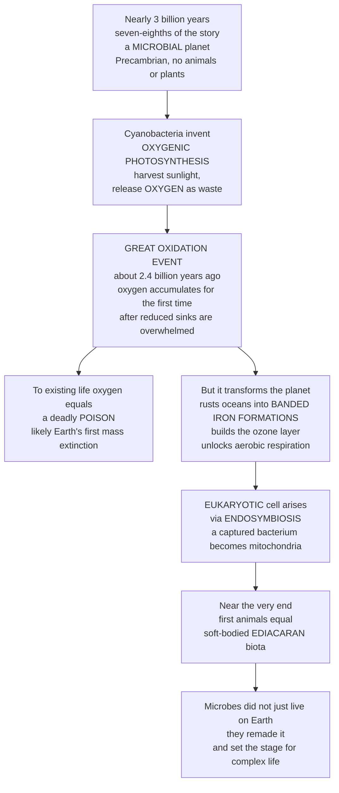

# 🦠 Precambrian Life and the Great Oxidation

> [!abstract] TL;DR
> For nearly **3 billion years** — roughly **seven-eighths** of life's entire history — Earth was a **microbial planet**: no animals, no plants, nothing visible, just oceans of single-celled microbes. This immense, easily-overlooked era (the **Precambrian**: Hadean + Archean + Proterozoic, about 4.6 Ga to 541 Ma, some **88 percent** of Earth history) hosted two of the most world-changing events ever. First, **cyanobacteria** invented **oxygenic photosynthesis**, harvesting sunlight and dumping **oxygen** as waste. That eventually triggered the **Great Oxidation Event** (**GOE**, about **2.4 Ga**) — free O₂ accumulating in the air for the first time. To the existing anaerobic world oxygen was a deadly **poison** (likely Earth's **first mass extinction**), yet it also remade the planet: it rusted the oceans into the striped **banded iron formations** we now mine, built the **ozone layer**, and unlocked the far more powerful **aerobic respiration** that complex life needs. Add the **endosymbiotic** origin of the **eukaryotic** cell and, at the very end, the first large animals (the enigmatic **Ediacaran biota**), and the lesson is clear: microbes did not merely live on Earth — over billions of patient years they *remade* it, setting every precondition for the complex life to come.

---

## Intuition

**Analogy — the invisible empire that terraformed a world.** Imagine a planet where, for age after age after age, absolutely *nothing* is visible to the naked eye. No trees, no worms, no fish, no reefs — just endless oceans that look empty but are, in fact, teeming with trillions of invisible single-celled microbes. That was Earth for nearly three billion years. If you compressed all of life's history into a single day, complex animals would not show up until roughly the last three hours; everything before that — most of the day — is the microbial empire. It is the easiest era to ignore precisely because there is nothing dramatic to look at.

And yet this invisible empire quietly pulled off the single greatest engineering feat in the planet's history. One group of microbes, the **cyanobacteria**, figured out how to eat sunlight — **photosynthesis** — and their waste product was **oxygen**, a gas that had been almost absent from the air. At first it barely registered: the oxygen was mopped up by dissolved iron and other chemicals as fast as it was made, like a trickle of ink vanishing into a giant sponge. But microbes are patient, and they had a billion years. Eventually the sponge filled up, and oxygen began to *accumulate* — the **Great Oxidation Event**. To almost everything then alive, this new oxygen was a corrosive **poison**, so it probably caused the first great die-off in history. But that same "pollution catastrophe" was also the greatest revolution: it rusted the seas into banded rock, it wove an **ozone** shield in the sky, and it opened the door to a vastly more powerful way of burning food — **aerobic respiration** — which is exactly the power supply every animal and plant would later run on. The Precambrian is the story of how life didn't just inhabit a planet; it *rebuilt* one.

---

## How It Works

### Core Mechanics

1. **The Precambrian is the "age of microbes."** It spans the **Hadean** (planet-forming chaos), **Archean** (first life, anoxic world), and **Proterozoic** (the slow oxygenation and the first eukaryotes and animals) — from Earth's origin at ~4.6 Ga to the base of the Cambrian at 541 Ma. Its fossils are cryptic: microscopic **microfossils**, layered microbial mounds called **stromatolites**, and molecular **biomarkers** in ancient rock. Few, hard-to-read fossils are why the era is under-appreciated, but it is the foundation everything else rests on.
2. **Microbial metabolism diversified first.** Long before oxygen, prokaryotes (**Bacteria** and **Archaea**) ran the biosphere on **chemosynthesis** (energy from chemicals like hydrogen and sulfide) and **anoxygenic photosynthesis** (using light but *not* splitting water). The pivotal invention was **oxygenic photosynthesis** by cyanobacteria — splitting H₂O to grab electrons and releasing O₂ as waste. This one metabolic trick would reshape the atmosphere.
3. **Oxygen stayed near zero at first — because of sinks.** Cyanobacterial O₂ did not immediately build up. It was consumed by huge reservoirs of **reduced material**: dissolved ferrous iron (Fe²⁺) in the oceans, volcanic gases, and sulfur. Only when these sinks were overwhelmed could free O₂ "overflow" into the atmosphere. This is why the record shows a long lag, then a relatively abrupt step.
4. **The Great Oxidation Event (~2.4 Ga).** Free O₂ crossed a threshold and began accumulating. The fingerprints: **banded iron formations** (BIFs) recording iron rusting out of the oceans; **red beds** (oxidized continental sediments); and the *disappearance* of **mass-independent sulfur isotope fractionation** (a signal that only forms under an oxygen-free, UV-transparent sky). The consequences: an **oxygen catastrophe** for anaerobes (probable first mass extinction), the birth of the **ozone layer**, likely **Snowball Earth** glaciations (as O₂ destroyed the methane greenhouse), and the unlocking of high-yield **aerobic respiration**.
5. **Eukaryotes arise by endosymbiosis.** The complex cell — with a **nucleus**, endomembranes, and cytoskeleton — emerged around 1.8–2.1 Ga. Its power plants, the **mitochondria**, are descended from an engulfed **alpha-proteobacterium** (and, in algae and plants, **chloroplasts** from an engulfed cyanobacterium) — Lynn Margulis's theory of **endosymbiosis**. Mitochondria supplied the energy budget that large genomes and complex cells require.
6. **The road to animals.** After a long, stable **"boring billion,"** the **Neoproterozoic** brought upheaval — Snowball Earths, a second pulse of oxygenation, early multicellular algae, and finally the **Ediacaran biota** (~575–541 Ma): the first large, soft-bodied multicellular organisms, a peaceful "Garden of Ediacara" that set the stage for the Cambrian explosion.

### Flow / Architecture



---

## Key Concepts

### 🟢 Secondary

- **The Precambrian is most of the story.** From Earth's birth (~4.6 Ga) to the first abundant animals (541 Ma) is about 88 percent of Earth history — and for nearly all of it, life was **microbial** and invisible.
- **Cyanobacteria and photosynthesis.** Cyanobacteria were the first organisms to make food from sunlight *and* release oxygen. They built **stromatolites** — layered mats of microbes that trapped sediment, some of the oldest fossils on Earth.
- **The Great Oxidation Event.** Around **2.4 billion years ago**, oxygen from cyanobacteria finally started building up in the air. This is the moment Earth's atmosphere changed from oxygen-poor to oxygen-bearing.
- **Oxygen was first a poison, then a gift.** To the microbes already living without it, oxygen was toxic — it likely killed off much of the old anaerobic world. But it also created the **ozone layer** and made possible the energy-rich breathing (**aerobic respiration**) that animals use today.
- **Banded iron formations.** As oxygen met iron dissolved in the seas, it rusted out and settled in striped red-and-grey layers. These **BIFs** are both a record of the event and the world's main source of **iron ore**.

### 🟡 Undergraduate

- **Reading a rock record with almost no bodies.** Precambrian paleobiology relies on **microfossils**, **stromatolites**, biomarker molecules, and *geochemical proxies* rather than skeletons. The evidence for the GOE is largely **chemical**: the switch-off of mass-independent sulfur isotope fractionation (the "sulfur MIF" signal), the appearance of oxidized **red beds**, and the deposition history of **BIFs**.
- **Why the lag, then the jump.** O₂ production began well before 2.4 Ga (there are "whiffs" of oxygen earlier), but atmospheric O₂ stayed near zero because **reduced sinks** — ferrous iron, volcanic H₂/H₂S, sulfide — consumed it. The GOE is best modeled as a **source–sink threshold**: only once photosynthetic supply outpaced the sinks did O₂ "overflow" and accumulate.
- **Cascading consequences.** The GOE plausibly triggered the **Huronian glaciations** (Snowball Earth) by oxidizing atmospheric **methane**, a strong greenhouse gas; formed **stratospheric ozone**, enabling later colonization of land; and enabled **aerobic respiration**, which yields roughly an order of magnitude more ATP per glucose than fermentation — the energy premium complex life would exploit.
- **Endosymbiosis and the eukaryotic cell.** Lynn Margulis's **endosymbiotic theory**: **mitochondria** derive from a free-living **alpha-proteobacterium** engulfed by a host cell; **chloroplasts** from an engulfed **cyanobacterium**. Evidence includes their own circular DNA, double membranes, bacterial-type ribosomes, and binary-fission-like division. The earliest widely-accepted eukaryotic body fossils (e.g. the coiled *Grypania*) appear ~1.8–2.1 Ga.
- **The Ediacaran biota.** From ~575–541 Ma, the first large multicellular organisms appear — **Charnia** (frond-like), **Dickinsonia** (quilted ovals), and others. Their biological affinities are famously debated (animals? early metazoan stem groups? something else?), and this soft-bodied, apparently predator-free "Garden of Ediacara" immediately precedes the Cambrian.

### 🔴 Graduate

- **The "energetics of complexity."** Nick Lane and William Martin argue that internalizing power generation via **mitochondria** removed a fundamental **bioenergetic constraint**: a prokaryote pays energy costs across its single surface membrane, but a eukaryote parallelizes ATP synthesis across many endosymbiont-derived membranes, raising energy-per-gene by orders of magnitude. This may explain why complex, large-genome life evolved *once* and only after endosymbiosis — a threshold, not a gradient.
- **Life and Earth co-evolve — the biosphere as a geological force.** The GOE is the archetypal case of biology reshaping the **atmosphere, ocean chemistry, and climate**. Oxygenation restructured the **biogeochemical cycles** of carbon, sulfur, nitrogen, and iron; oxidative weathering altered continental chemistry; and the coupled system oscillated (the GOE overshoot, the **Lomagundi** carbon-isotope excursion, then a long Proterozoic low-oxygen state). The record is a *coupled Earth–life system*, not organisms on a passive stage.
- **The "boring billion" and the mid-Proterozoic ocean.** From ~1.8–0.8 Ga, environments and possibly evolution show striking **stasis**. The **Canfield ocean** hypothesis proposes mid-depth waters were **euxinic** (anoxic and sulfidic), limiting bioavailable trace metals (especially for nitrogen fixation) and plausibly throttling eukaryotic diversification — a chemical brake on complexity that only released in the Neoproterozoic.
- **The Neoproterozoic Oxygenation Event (NOE) and Snowball Earth.** A second major rise in O₂ (~0.8–0.54 Ga) coincides with the **Cryogenian** Snowball glaciations (Sturtian, Marinoan) and the rise of animals. Causation is contested — did oxygenation permit large motile animals, or did biological innovation (e.g. filter-feeding, faecal-pellet ballasting of organic carbon) *drive* oxygenation? The feedbacks run both ways.
- **Quantifying deep-time oxygen.** Reconstructing the O₂ curve fuses multiple **redox proxies** — sulfur MIF, iron speciation, redox-sensitive trace metals (Mo, Cr, U), and the BIF record — each with its own thresholds and caveats. The classic "step-plateau-step" curve (near-zero Archean → GOE step → Proterozoic plateau → NOE rise to modern) is a *synthesis* of noisy, sometimes conflicting proxies, and the absolute Proterozoic level remains uncertain by orders of magnitude.

---

## Python Demo

```python
# Precambrian & the Great Oxidation, made visible:
#   (A) The classic atmospheric-oxygen history curve through deep time
#       (near-zero Archean -> GOE step ~2.4 Ga -> Proterozoic "boring billion"
#        plateau -> Neoproterozoic Oxygenation Event rise toward modern),
#       annotated with banded-iron-formation deposition and biological milestones.
#   (B) A simple SOURCE-SINK box model showing WHY oxygen stayed near zero for
#       ~2 billion years, then jumped: photosynthetic O2 is mopped up by a finite
#       reduced-iron/sulfur reservoir, and only "overflows" once the sinks saturate.
# Pure numpy + matplotlib, fully runnable.

import numpy as np
import matplotlib.pyplot as plt

# ----------------------------------------------------------------------
# (A) ATMOSPHERIC OXYGEN HISTORY  (log10 of pO2 relative to present level, PAL)
# ----------------------------------------------------------------------
N = 4000
t = np.linspace(4000.0, 0.0, N)          # Ma before present, old -> young

# Two smooth "steps": the GOE (~2400 Ma) and the NOE (~600 Ma).
# A logistic that switches from 0 (old) to 1 (young) as age drops below its centre.
def step_down_in_age(age, centre, width):
    return 1.0 / (1.0 + np.exp((age - centre) / width))

goe = step_down_in_age(t, centre=2400.0, width=70.0)   # Great Oxidation Event
noe = step_down_in_age(t, centre=600.0,  width=110.0)  # Neoproterozoic Oxygenation Event

# Archean baseline ~1e-5 PAL; GOE lifts to a Proterozoic plateau ~1e-2 PAL;
# NOE lifts to ~1 PAL (modern). Values are schematic but proxy-plausible.
log_o2 = -5.0 + 3.0 * goe + 2.0 * noe

# Biological + geological milestones (label, age in Ma)
milestones = [
    ("First life",            3800.0, -5.0),
    ("Oxygenic photosynthesis\n(cyanobacteria)", 2900.0, -5.0),
    ("GREAT OXIDATION EVENT",  2400.0, -3.4),
    ("Eukaryotes",             1900.0, -2.0),
    ('"Boring billion"',       1300.0, -2.0),
    ("Ediacaran animals",       575.0, -1.0),
]

fig, (axA, axB) = plt.subplots(2, 1, figsize=(12, 9))

axA.plot(t, log_o2, color="#b91c1c", lw=2.5, zorder=3)
axA.fill_between(t, -6, log_o2, color="#fca5a5", alpha=0.30, zorder=1)

# Shade the main banded-iron-formation deposition window (~3.0-1.8 Ga).
axA.axvspan(3000, 1800, color="#64748b", alpha=0.18, zorder=0)
axA.text(2400, 0.6, "Banded iron formations\ndeposited (ocean rusting)",
         ha="center", va="center", fontsize=8, color="#334155")

for label, age, y in milestones:
    axA.axvline(age, color="#94a3b8", ls=":", lw=1, zorder=2)
    axA.annotate(label, xy=(age, y), xytext=(age, y + 0.9),
                 ha="center", va="bottom", fontsize=8, color="#0f172a",
                 arrowprops=dict(arrowstyle="-", color="#94a3b8", lw=0.8))

axA.axhline(0.0, color="#0f766e", ls="--", lw=1)
axA.text(50, 0.15, "modern level (1 PAL)", ha="right", fontsize=8, color="#0f766e")

axA.invert_xaxis()                        # time runs left(old) -> right(now)
axA.set_xlim(4000, 0)
axA.set_ylim(-6, 1.5)
axA.set_xlabel("Millions of years before present")
axA.set_ylabel("log10  atmospheric O2  (PAL)")
axA.set_title("The rise of atmospheric oxygen through Earth history\n"
              "near-zero Archean -> GOE step (~2.4 Ga) -> Proterozoic plateau -> "
              "Neoproterozoic rise to modern",
              fontsize=11, weight="bold")

# ----------------------------------------------------------------------
# (B) SOURCE-SINK BOX MODEL: why O2 stayed near zero, then overflowed
# ----------------------------------------------------------------------
steps = 4000
P = 1.0            # O2 produced per step by photosynthesis (constant source)
k = 0.05           # rate at which reduced sinks consume O2
R = 3000.0         # initial reduced reservoir (dissolved iron + sulfur)
O2 = 0.0

o2_hist = np.zeros(steps)
R_hist  = np.zeros(steps)
for i in range(steps):
    O2 += P                       # photosynthesis adds oxygen
    react = min(O2, k * R)        # oxygen consumed oxidizing the reduced sink
    O2 -= react
    R  = max(R - react, 0.0)      # sink is drawn down and cannot regenerate
    o2_hist[i] = O2
    R_hist[i]  = R

# Time axis in arbitrary "model time" (0 -> 1 of the Precambrian).
tau = np.linspace(0.0, 1.0, steps)
overflow = np.argmax(o2_hist > 0.5 * P)   # step where O2 starts accumulating

axB.plot(tau, R_hist / R_hist.max(), color="#334155", lw=2,
         label="reduced sink (iron + sulfur), normalized")
axB.plot(tau, o2_hist / o2_hist.max(), color="#b91c1c", lw=2.5,
         label="free O2 (accumulating), normalized")
axB.fill_between(tau, 0, o2_hist / o2_hist.max(), color="#fca5a5", alpha=0.30)

axB.axvline(tau[overflow], color="#0f766e", ls="--", lw=1.2)
axB.text(tau[overflow] + 0.01, 0.55,
         "sinks saturated ->\noxygen OVERFLOWS\n(Great Oxidation Event)",
         fontsize=8.5, color="#0f766e", va="center")

axB.set_xlim(0, 1)
axB.set_ylim(0, 1.05)
axB.set_xlabel("Model time through the Precambrian (arbitrary units)")
axB.set_ylabel("Normalized amount")
axB.set_title("Source-sink model: constant O2 production, but O2 stays ~zero until "
              "the reduced sink is exhausted, then jumps",
              fontsize=11, weight="bold")
axB.legend(loc="center right", fontsize=8)

plt.tight_layout()
plt.savefig("precambrian_oxygen.png", dpi=120)

print("O2 begins accumulating at model-time fraction:",
      round(tau[overflow], 3), "of the Precambrian")
print("Reduced sink remaining at overflow:",
      round(R_hist[overflow] / R_hist.max() * 100, 1), "percent")
print("This 'lag then jump' is why the GOE looks abrupt in the rock record.")
```

Panel A reproduces the textbook oxygen curve — an almost oxygen-free Archean, the step at the **Great Oxidation Event**, a long low **Proterozoic plateau** (the "boring billion"), and the final **Neoproterozoic** climb toward modern levels — with the banded-iron-formation window and biological firsts marked. Panel B explains the *shape* of that curve: even with steady oxygen production, a finite reservoir of reduced iron and sulfur pins atmospheric O₂ near zero for most of the Precambrian, and only when that sink saturates does oxygen "overflow" into the air — the abrupt-looking GOE.

---

## Real-World Applications

- **Iron ore and the global economy.** **Banded iron formations** are the world's dominant source of iron ore — the Hamersley Basin (Australia), the Lake Superior region, and the Transvaal (South Africa) are all Precambrian BIFs. The steel in modern civilization is, quite literally, the fossilized residue of the Great Oxidation Event.
- **Reconstructing atmospheric evolution.** The GOE is the anchor point for models of how Earth's air became breathable. Understanding the source–sink threshold behavior informs how we interpret oxygen and biosignature signals on any planet.
- **Astrobiology and biosignatures.** Free O₂ (and its photochemical product ozone) is a leading remote **biosignature** in the search for life on exoplanets — but the Precambrian teaches caution: for two billion years a fully inhabited Earth showed *almost no* atmospheric oxygen. Absence of O₂ does not mean absence of life, and detectable oxygen may lag the origin of life by eons.
- **The template for mass extinction and Earth-system tipping points.** The oxygen catastrophe is the first known example of a **biologically driven global catastrophe** — a cautionary deep-time analogue for how a metabolic innovation (or, today, a species) can reorganize the whole planet's chemistry and climate.
- **Foundations of cell biology.** The **endosymbiotic** origin of mitochondria and chloroplasts, first confirmed in this deep-time context, underpins modern understanding of eukaryotic cells, organelle genetics, and why our own energy metabolism is bacterial in origin.

---

## Common Pitfalls

- **Thinking "nothing happened" in the Precambrian.** Because there are no dinosaurs or dramatic body fossils, the era is dismissed as a boring prelude. In fact the two most transformative events in life's history — the oxygenation of the planet and the origin of the complex cell — both happened here. It is the *foundation*, not the prologue.
- **Assuming oxygen accumulated as soon as photosynthesis appeared.** Oxygenic photosynthesis predates the GOE by hundreds of millions of years. The lag is the whole point: **reduced sinks** (iron, sulfur, volcanic gases) consumed O₂ until they were overwhelmed. Ignore the sinks and the timing makes no sense.
- **Treating oxygen as unambiguously "good."** For the anaerobic biosphere, O₂ was a corrosive **toxin** that likely caused the first mass extinction. Aerobic life is a later adaptation *to* a poison, not evidence that oxygen was welcomed.
- **Confusing the GOE with reaching modern oxygen levels.** The GOE lifted O₂ from near-zero to a low Proterozoic plateau — perhaps a percent or so of today's level — where it lingered for a *billion* years. Modern-like O₂ only arrived with the later **Neoproterozoic Oxygenation Event**, just before animals.
- **Reading Ediacaran fossils as obvious animals.** The affinities of *Dickinsonia*, *Charnia*, and kin are genuinely uncertain and hotly debated. Do not assume they are ancestors of Cambrian groups; many may represent extinct experiments in multicellularity.
- **Picturing endosymbiosis as a smooth "upgrade."** The engulfment of the mitochondrial ancestor was a singular, contingent event — complex life apparently evolved only *once*. Treating eukaryotes as an inevitable next rung on a ladder misreads a rare, threshold-crossing accident.

---

## Related Concepts

This note sits in the **History of Life** section of the **Paleontology and Deep Time** vault. Its siblings are referenced here in prose so they can be wired once written: it follows the vault's hub note *Paleontology and Deep Time Overview* and the deep-time origin story in *The Origin of Life and Earliest Fossils*, and it sets up the events that come next — *The Cambrian Explosion* (the burst of animal diversity the Precambrian made possible), *Paleoclimatology and Deep Time Climate* (the Snowball Earth glaciations and methane-greenhouse collapse tied to oxygenation), and *Mass Extinctions and the Big Five* (for which the oxygen catastrophe is the deep-time prototype).

Verified cross-vault links to existing notes:

- [[The_History_of_Life_on_Earth]] — the biology-vault synthesis of life's grand sequence; this note is the deep-dive on its microbial first act.
- [[Photosynthesis]] — the metabolic machinery whose oxygenic form (in cyanobacteria) is the pivotal invention behind the entire Great Oxidation Event.
- [[Oxidative_Phosphorylation]] — **aerobic respiration**, the high-yield energy pathway that free oxygen unlocked and that complex life would come to depend on.
- [[Bacteria_and_Archaea]] — the prokaryotic lineages that ran the biosphere for billions of years and invented every major metabolism, including oxygenic photosynthesis.
- [[Mitochondria_and_Chloroplasts]] — the endosymbiotic organelles at the heart of the eukaryotic cell; direct evidence for Margulis's theory discussed here.
- [[The_Cell_Theory_and_Cell_Types]] — the prokaryote-versus-eukaryote distinction whose *origin* the Precambrian records.
- [[Earths_History_Hadean_to_Phanerozoic]] — the planet-scale deep-time narrative on which this microbial revolution unfolds.
- [[Earth_Formation_and_Differentiation]] — the Hadean origin of the planet that opens the Precambrian.
- [[Geologic_Time_Scale]] — the formal eon-and-era framework (Hadean, Archean, Proterozoic) used to place these events.
- [[Global_Biogeochemical_Cycles]] — the coupled carbon, sulfur, nitrogen, and oxygen cycles that oxygenation permanently reorganized.
- [[Evidence_for_Evolution]] — how microfossils, stromatolites, and biomarkers extend the evolutionary record deep into the Precambrian.
- [[Mass_Extinctions_and_Paleoclimate]] — the later mass-extinction record for which the anaerobic "oxygen catastrophe" is the earliest analogue.

---

## Review Questions

1. **(Secondary)** For roughly what fraction of Earth's history was life purely microbial, and what single microbial invention eventually changed the whole atmosphere? Explain in one or two sentences why oxygen was at first harmful to most life yet ultimately essential for animals.
2. **(Undergraduate)** Oxygenic photosynthesis appeared well before oxygen accumulated in the air. Using the idea of **reduced sinks**, explain why atmospheric O₂ stayed near zero for hundreds of millions of years and then rose relatively abruptly at the Great Oxidation Event. Name two independent lines of geological or geochemical evidence for the GOE.
3. **(Graduate)** Complex, large-genome eukaryotic life apparently evolved only once, after the endosymbiotic acquisition of mitochondria, and long after the GOE. Drawing on the "energetics of complexity" argument and the mid-Proterozoic ocean-chemistry hypotheses (e.g. the euxinic "Canfield ocean" and the "boring billion"), construct an argument for why the origin of complex life was gated by *both* bioenergetic and environmental thresholds rather than being an inevitable outcome of oxygenation.

---

## Sources

- Knoll, A. H. *Life on a Young Planet: The First Three Billion Years of Evolution on Earth*. Princeton University Press, 2003 (updated ed. 2015).
- Lyons, T. W., Reinhard, C. T., & Planavsky, N. J. "The rise of oxygen in Earth's early ocean and atmosphere." *Nature* 506, 307–315 (2014).
- Margulis, L. (Sagan, L.). "On the origin of mitosing cells." *Journal of Theoretical Biology* 14(3), 225–274 (1967); and *Origin of Eukaryotic Cells*, Yale University Press, 1970.
- Canfield, D. E. *Oxygen: A Four Billion Year History*. Princeton University Press, 2014.
- Lane, N. & Martin, W. "The energetics of genome complexity." *Nature* 467, 929–934 (2010).

---

#paleontology #precambrian #great-oxidation-event #banded-iron #endosymbiosis
