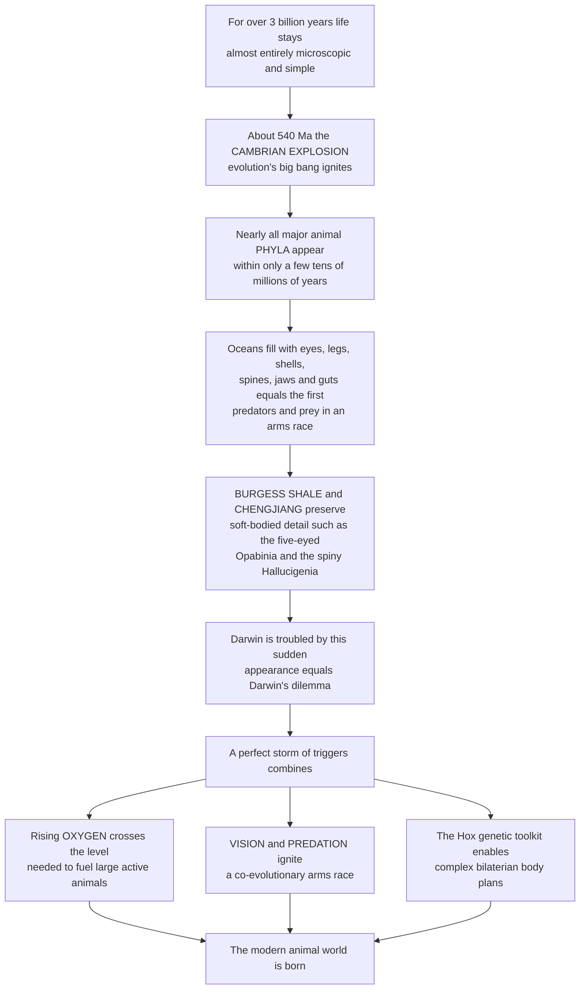

# 🦑 The Cambrian Explosion

> [!abstract] TL;DR
> For more than **three billion years**, life on Earth was almost entirely **microscopic and simple** — bacteria, archaea, and eventually single-celled eukaryotes and soft microbial mats. Then, beginning roughly **538 million years ago** and playing out over "only" a few tens of millions of years, something extraordinary happened: **nearly every major animal body plan we know today burst into the fossil record**, seemingly at once. This is the **Cambrian explosion** — evolution's "big bang." The oceans filled with the first animals bearing **eyes, legs, shells, spines, jaws, and guts** — the first **predators** and their **prey**, locked in an evolutionary **arms race**. Almost all the great animal **phyla** (the fundamental blueprints — arthropods, mollusks, echinoderms, chordates including our own lineage) appear in this narrow window. Extraordinary **Lagerstätten** — the **Burgess Shale** in Canada and **Chengjiang** in China — preserve the event in soft-bodied detail, revealing bizarre experimental creatures like the five-eyed **Opabinia** and the spiny **Hallucigenia**. The key conceptual lesson is the distinction between **disparity** (the *range* of body plans) — which appeared **early and high** — and **diversity** (species *counts*), which built up more gradually. The likely trigger was a **perfect storm**: rising **oxygen** finally reaching animal-fueling levels, the invention of **vision** and **predation** igniting an arms race, and the genetic **Hox toolkit** for building complex bodies. The Cambrian explosion is the moment the **modern animal world was born**.

---

## Intuition

**Analogy:** Imagine an architecture firm that, for eons, has only ever built simple single-room mud huts — endless variations on one dull theme. Then, in a single astonishing decade, its architects suddenly invent the arch, the column, the vault, the dome, the flying buttress, the skyscraper frame, and the suspension bridge — *the entire structural vocabulary of building* — all at once. Every building erected in the millennia that follow is a variation on blueprints laid down in that one creative burst. Nothing fundamentally new in *kind* is ever invented again; the firm only refines and recombines what it discovered in that decade.

That is the Cambrian explosion. After more than three billion years of building only **simple structures**, life abruptly discovered the whole architectural vocabulary of **animal design** — segmented limbs, hinged shells, muscular guts, image-forming eyes, internal skeletons, backbones. Nearly all the fundamental **body plans** (phyla) that animals still use today were established in this brief window, and almost none has been added since. The oceans went from a quiet microbial world to a bustling ecosystem of hunters and hunted in a geological eye-blink — and **every animal you have ever seen** traces its basic blueprint back to it.

---

## How It Works

### Core Mechanics

The Cambrian explosion (~538.8 to ~515 Ma) was not literally instantaneous, but it was **geologically rapid** — most of the action compressed into perhaps 20–25 million years, a sliver of Earth's 4.6-billion-year history. Its mechanics unfold as a chain of environmental, ecological, and genetic events:

1. **The long Precambrian prelude.** For over 3 billion years, life was overwhelmingly **microbial**. The late **Ediacaran** (~575–539 Ma) hosted the first large multicellular organisms — the enigmatic, mostly soft, mostly immobile **Ediacaran biota** — but these left few clear descendants and lacked skeletons, guts, or eyes.

2. **The threshold is crossed.** At the Ediacaran–Cambrian boundary, three enablers converge: atmospheric and oceanic **oxygen** rise past the level needed to power large, active, predatory metabolisms; ocean chemistry supplies the **calcium and carbonate** for skeletons; and the **developmental genetic toolkit** (especially **Hox genes** and gene regulatory networks) becomes able to specify complex, differentiated, bilaterally symmetric bodies.

3. **Skeletons and the "substrate revolution."** The **small shelly fauna** — a profusion of tiny biomineralized tubes, spines, and plates — marks the sudden global appearance of **hard parts**. Skeletons enable armor, larger size, and new feeding modes.

4. **The predation arms race.** With **eyes** (image-forming vision) and mobile **predators** such as the meter-scale apex predator **Anomalocaris**, a co-evolutionary **escalation** ignites: predators evolve better attack (grasping appendages, jaws, acute vision) and prey evolve better defense (shells, spines, burrowing, speed). This runaway feedback drives rapid morphological innovation.

5. **The agronomic revolution.** **Trace fossils** record exploding **behavioral complexity** — animals begin to burrow vertically and churn the seafloor (**bioturbation**), transforming previously firm microbial-mat substrates into oxygenated, mixed sediment and opening entirely new **ecological niches** (infaunal life).

6. **Body plans lock in.** Within this window, nearly all bilaterian **phyla** — arthropods, mollusks, brachiopods, echinoderms, annelids, and chordates (our own lineage, e.g. **Pikaia**, **Myllokunmingia**) — first appear. **Disparity** (the range of fundamentally distinct body plans) reaches high levels **early**; subsequent evolution largely elaborates *within* these established blueprints rather than inventing new ones.

7. **Darwin's dilemma and its resolution.** Darwin was troubled by the *apparently sudden* appearance of complex animals, which seemed to contradict gradualism. The modern resolution: a **longer fuse** than the fossils alone suggest — **molecular clocks** and rare Ediacaran fossils push the *genetic* origin of the phyla back before the Cambrian, so the explosion records the rapid *ecological and skeletal* filling-out of lineages whose roots run deeper.

### Flow / Architecture



---

## Key Concepts

### Secondary (the big idea)
- **Life was simple for a very long time.** For more than 3 billion years, almost all life was microscopic. Complex animals are a *recent* and *sudden* chapter.
- **The animal "big bang."** Around 540 million years ago, nearly every major *type* of animal — things with eyes, legs, shells, and backbones — appeared in the fossil record in a short span of geological time.
- **First predators and prey.** The Cambrian saw the first real hunters and the first armored defenders, kicking off an evolutionary "arms race."
- **Weird wonders in famous rocks.** Special fossil sites like the **Burgess Shale** and **Chengjiang** preserve soft bodies, showing strange creatures like **Opabinia** (five eyes) and **Hallucigenia** (spines and legs).

### Undergraduate (the mechanisms)
- **Phylum and body plan.** A **phylum** is a fundamental architectural blueprint (e.g. Arthropoda, Mollusca, Chordata). The explosion established most animal phyla in a narrow window; few have arisen since.
- **Disparity vs diversity.** **Disparity** = the *morphological range* of body plans; **diversity** = the *number* of species/genera. In the Cambrian, disparity rose **early and high** while diversity accumulated more gradually — a hallmark of the event.
- **The evidence, three ways.** (1) The **small shelly fauna** and sudden **biomineralization**; (2) **trace fossils** recording rising behavioral complexity and **bioturbation** (the agronomic revolution); (3) soft-bodied **Lagerstätten** (Burgess Shale, Chengjiang, Sirius Passet) preserving the full fauna, including **stem-group** oddities.
- **Key players.** **Anomalocaris** (apex predator), **Opabinia**, **Hallucigenia**, **Wiwaxia**, **Marrella**, and the earliest chordates **Pikaia** and **Myllokunmingia** — our own deep lineage.
- **Multi-factor triggers.** Environmental (**oxygen** rise, end of Snowball Earth, skeleton chemistry), ecological (**predation**, **vision**, ecosystem engineering, empty niches), and genetic (the **Hox / gene-regulatory-network** toolkit).

### Graduate (the debates and subtleties)
- **Gould's contingency argument.** In *Wonderful Life*, Gould read the Burgess "weird wonders" as evidence that disparity was **maximal early** and that survivors were partly a matter of **contingency** ("replay the tape and the outcome differs"). Later work (Conway Morris and others) reinterpreted many "weird wonders" as **stem-group** members of living phyla, and questioned whether early disparity truly *maxed out* — a live quantitative debate over morphospace occupation.
- **Explosion or artifact?** How much of the "suddenness" is **real biology** versus a **preservation/skeletonization signal**? The onset of biomineralization made animals *visible* to the fossil record; **Signor–Lipps**-style appearance biases and uneven Lagerstätten sampling shape the apparent pattern (see *The Fossil Record and Its Biases*).
- **Darwin's dilemma and the "long fuse."** Reconciling an abrupt fossil appearance with gradual evolution: **molecular-clock** estimates and Ediacaran trace/body fossils place the *divergence* of major clades well before their Cambrian *skeletal* debut — the explosion is the rapid **phenotypic and ecological** expression of older cryptic lineages.
- **Oxygen as permissive vs causal.** Rising **O₂** (linked to Neoproterozoic oxygenation) is likely a **permissive** threshold for large active metabolisms rather than a sole cause; ecological feedbacks (predation, tiering, bioturbation further oxygenating sediments) are self-reinforcing.
- **Constructional constraint.** Why do *no* new phyla appear afterward? Hypotheses invoke **developmental canalization** (gene regulatory networks become entrenched and hard to re-wire) and **ecological saturation** (body-plan morphospace filled), so later evolution elaborates *within* established bauplans.

---

## Python Demo

```python
# The Cambrian explosion, illustrated with numpy + matplotlib:
#   (A) DIVERSITY vs DISPARITY -- disparity (range of body plans) rises
#       EARLY and HIGH, while diversity (species counts) builds gradually.
#   (B) MORPHOSPACE FILLING -- body-plan space is occupied rapidly and
#       widely during the Cambrian window (high early disparity).
#   (C) PREDATOR-PREY ARMS RACE -- once vision & predation switch on, a
#       coupled escalation of attack vs defense runs away to saturation.
#   (D) OXYGEN THRESHOLD -- atmospheric O2 crosses an animal-enabling
#       level right at the Cambrian, a permissive trigger.
import numpy as np
import matplotlib.pyplot as plt

rng = np.random.default_rng(7)

# Shared time axis in millions of years ago (Ma), old -> young
age = np.linspace(600, 480, 400)          # Ediacaran (600) to mid-Cambrian (480)
boundary = 538.8                          # Ediacaran-Cambrian boundary

def logistic(a, midpoint, steepness, ceiling):
    """Rises as age DECREASES (time moves forward toward the present)."""
    return ceiling / (1.0 + np.exp((a - midpoint) / steepness))

# --- (A) diversity vs disparity through time -------------------------------
# DISPARITY: rises fast, early (just after the boundary) and plateaus.
disparity = logistic(age, midpoint=534, steepness=2.5, ceiling=35)
disparity += rng.normal(0, 0.4, age.size)
# DIVERSITY: rises later and keeps climbing (gentler, higher ceiling).
diversity = logistic(age, midpoint=515, steepness=8.0, ceiling=600)
diversity += rng.normal(0, 6, age.size)

# --- (B) morphospace occupation --------------------------------------------
# Precambrian taxa: few, clustered near the origin (low disparity).
pre = rng.normal(0, 0.35, size=(25, 2)); pre_age = rng.uniform(560, boundary, 25)
# Cambrian taxa: spread WIDELY across morphospace (disparity explodes).
cam = rng.normal(0, 1.9, size=(120, 2)); cam_age = rng.uniform(515, boundary, 120)
# Post-Cambrian taxa: many, but INFILLING near existing clusters (diversity).
seeds = cam[rng.integers(0, cam.shape[0], 200)]
post = seeds + rng.normal(0, 0.3, size=(200, 2)); post_age = rng.uniform(480, 515, 200)
mx = np.vstack([pre, cam, post]); mage = np.concatenate([pre_age, cam_age, post_age])

# --- (C) predator-prey arms race (coupled escalation) ----------------------
steps = 120
A = np.zeros(steps); D = np.zeros(steps)   # predator Attack, prey Defense
A[0], D[0] = 0.05, 0.05
rA, rD, Amax, Dmax = 0.18, 0.16, 1.0, 1.0
for t in range(steps - 1):
    A[t+1] = A[t] + rA * D[t] * (1 - A[t] / Amax)   # attack chases defense
    D[t+1] = D[t] + rD * A[t] * (1 - D[t] / Dmax)   # defense chases attack

# --- (D) oxygen crossing an animal-enabling threshold ----------------------
o2 = 1.0 + logistic(age, midpoint=545, steepness=9.0, ceiling=20.0)  # % PAL-ish
threshold = 10.0   # schematic level needed to fuel large active animals

# ---------------------------------------------------------------------------
fig, ax = plt.subplots(2, 2, figsize=(13, 9))

# A: diversity vs disparity (twin axes)
axA = ax[0, 0]; axA2 = axA.twinx()
lD = axA.plot(age, disparity, color='crimson', lw=2.2, label='Disparity (body plans)')
lV = axA2.plot(age, diversity, color='steelblue', lw=2.2, label='Diversity (species)')
axA.axvline(boundary, color='gray', ls=':', lw=1.5)
axA.invert_xaxis()                          # older on the left
axA.set_title('A. Disparity rises EARLY & HIGH; diversity builds gradually')
axA.set_xlabel('Age (Ma)'); axA.set_ylabel('disparity (# body plans)', color='crimson')
axA2.set_ylabel('diversity (# species)', color='steelblue')
axA.legend(lD + lV, [l.get_label() for l in lD + lV], loc='upper left', fontsize=8)
axA.annotate('Cambrian\nboundary', xy=(boundary, 30), xytext=(565, 25),
             fontsize=8, arrowprops=dict(arrowstyle='->', color='gray'))

# B: morphospace filling
axB = ax[0, 1]
sc = axB.scatter(mx[:, 0], mx[:, 1], c=mage, cmap='viridis_r', s=22,
                 edgecolor='k', linewidth=0.2)
axB.set_title('B. Morphospace fills widely & fast in the Cambrian')
axB.set_xlabel('body-plan axis 1'); axB.set_ylabel('body-plan axis 2')
cb = fig.colorbar(sc, ax=axB); cb.set_label('Age (Ma)')

# C: predator-prey arms race
axC = ax[1, 0]
axC.plot(A, color='darkred', lw=2.2, label='Predator attack')
axC.plot(D, color='darkgreen', lw=2.2, label='Prey defense / armor')
axC.set_title('C. Vision + predation -> runaway co-evolutionary arms race')
axC.set_xlabel('generations after predation appears'); axC.set_ylabel('trait level')
axC.legend(fontsize=8)

# D: oxygen threshold
axD = ax[1, 1]
axD.plot(age, o2, color='purple', lw=2.2, label='Atmospheric/ocean O2')
axD.axhline(threshold, color='orange', ls='--', lw=1.8, label='animal-enabling level')
axD.axvline(boundary, color='gray', ls=':', lw=1.5)
axD.fill_between(age, threshold, o2, where=(o2 > threshold),
                 color='gold', alpha=0.30)
axD.invert_xaxis()
axD.set_title('D. O2 crosses the animal-enabling threshold at the Cambrian')
axD.set_xlabel('Age (Ma)'); axD.set_ylabel('O2 (% present level, schematic)')
axD.legend(fontsize=8)

plt.tight_layout()
plt.savefig('cambrian_explosion.png', dpi=120)

# Quantitative takeaways
half_disp = age[np.argmin(np.abs(disparity - disparity.max() / 2))]
half_div = age[np.argmin(np.abs(diversity - diversity.max() / 2))]
print(f"Disparity reaches half-max at ~{half_disp:.0f} Ma")
print(f"Diversity reaches half-max at ~{half_div:.0f} Ma  (later -> gradual buildup)")
print(f"Disparity leads diversity by ~{half_disp - half_div:.0f} Myr")
```

Running it makes the core lesson quantitative: **disparity** reaches its half-maximum *tens of millions of years earlier* than **diversity** — body plans are established fast and early, while species counts climb more slowly (Panel A). The morphospace is occupied **widely and rapidly** during the Cambrian window rather than filling in gradually from a center (Panel B). Once vision and predation switch on, attack and defense traits **escalate together in a runaway feedback** (Panel C). And oxygen crosses an **animal-enabling threshold** right at the boundary, permitting the large active metabolisms the whole event depends on (Panel D).

---

## Real-World Applications

- **Calibrating the tree of life.** The Cambrian's first skeletal appearances of arthropods, mollusks, echinoderms, and chordates are prime **fossil calibration points** for **molecular clocks**, anchoring divergence-time estimates across the entire animal phylogeny.
- **Exceptional-preservation science (Lagerstätten).** The **Burgess Shale** (Walcott, British Columbia), **Chengjiang / Maotianshan Shales** (Yunnan, China), and **Sirius Passet** (Greenland) are the gold-standard windows into soft-bodied early animals and drive taphonomy research on *how* soft tissues fossilize.
- **Astrobiology and the search for complex life.** The Cambrian shows that the jump from microbes to complex animals may hinge on **oxygen thresholds** and specific genetic innovations — a framework for assessing whether exoplanet biospheres could host complex life.
- **Evo-devo and synthetic morphology.** Understanding how the **Hox / gene-regulatory-network toolkit** built disparate body plans informs modern **evolutionary developmental biology** and efforts to model or engineer morphogenesis.
- **Testing macroevolutionary theory.** The **disparity-first, diversity-later** pattern is a canonical test case for models of **adaptive radiation**, morphospace occupation, and whether innovation is front-loaded early in a clade's history.

---

## Common Pitfalls

- **Thinking it was instantaneous.** "Explosion" is relative to deep time — the main radiation spans ~20–25 million years, not a single event. Calling it literally sudden misrepresents both the tempo and the Ediacaran/molecular-clock roots.
- **Conflating disparity with diversity.** The signature of the Cambrian is high *disparity* (many body plans) early, **not** peak *diversity* (species numbers). Treating "explosion" as merely a spike in species count misses the whole point.
- **Reading "sudden appearance" as literal creation from nothing.** Darwin's dilemma is resolved by a **long fuse**: lineages diverged earlier but became fossil-visible only when they evolved **skeletons**. Absence of earlier fossils is partly a preservation artifact.
- **Assuming Gould's "maximal early disparity" is settled.** Whether disparity truly *peaked* in the Cambrian is contested; some "weird wonders" are now placed as **stem groups** of living phyla, and quantitative morphospace results are debated.
- **Naming a single cause.** No one factor (oxygen *or* predation *or* Hox genes) suffices. It was a **multi-factor, feedback-driven perfect storm**; single-trigger stories are seductive but incomplete.
- **Ignoring the record's biases.** The apparent pattern is filtered through **biomineralization** onset and uneven Lagerstätten sampling — interpret it alongside *The Fossil Record and Its Biases*.

---

## Related Concepts

- [[The_History_of_Life_on_Earth]] — the Cambrian explosion is the pivotal early-Phanerozoic chapter in the broad sweep from origin-of-life through microbial eons to complex animals.
- [[Speciation_and_Macroevolution]] — the explosion is the canonical macroevolutionary event: a rapid radiation establishing higher taxa (phyla) and body-plan disparity, not just species-level splitting.
- [[Phylogenetics_and_the_Tree_of_Life]] — molecular clocks and cladistics reconcile Darwin's "sudden appearance" with a deeper, pre-Cambrian ("long fuse") divergence of animal lineages.
- [[Morphogenesis_and_Pattern_Formation]] — the **Hox genes** and gene regulatory networks that assign body-axis identity are the developmental toolkit that made complex, disparate body plans possible.
- [[Predator_Prey_and_Population_Interactions]] — the predation "arms race" (escalation of attack vs defense) is a core proposed ecological trigger and matches the co-evolutionary dynamics formalized in population ecology.
- [[Biodiversity_and_Species_Richness]] — the diversity-vs-disparity distinction central to the Cambrian sharpens what "biodiversity" actually measures (counts vs morphological range).
- [[Earths_History_Hadean_to_Phanerozoic]] — the environmental stage-setting: Neoproterozoic oxygenation, the end of Snowball Earth glaciations, and ocean chemistry enabling skeletons.

Within this vault (siblings): this note builds directly on **Precambrian_Life_and_the_Great_Oxidation** (the oxygen and Ediacaran prelude) and opens the story continued in **Paleozoic_Life_and_the_Colonization_of_Land**; it exemplifies **Adaptive_Radiations_and_Diversification** (disparity-first radiation); it must be read alongside **The_Fossil_Record_and_Its_Biases** (skeletonization and Lagerstätten sampling shape the apparent "explosion"); and it is framed by the vault entry **Paleontology_and_Deep_Time_Overview**.

---

## Review Questions

1. **(Secondary)** In one or two sentences, explain what the "Cambrian explosion" was and why it is called evolution's "big bang." What kinds of animal features first appeared then?
2. **(Secondary/Undergraduate)** Why are the **Burgess Shale** and **Chengjiang** so scientifically important compared with ordinary fossil sites? What do they preserve that normal rocks usually do not?
3. **(Undergraduate)** Distinguish **disparity** from **diversity**. In the Cambrian, which rose early and which built up gradually, and why does this distinction matter for understanding the event?
4. **(Undergraduate/Graduate)** Describe three proposed **triggers** of the explosion (one environmental, one ecological, one genetic) and explain how they could reinforce one another as a feedback system rather than acting alone.
5. **(Graduate)** What was **Darwin's dilemma**, and how do **molecular clocks**, Ediacaran fossils, and the onset of **biomineralization** together resolve the apparent contradiction between a sudden fossil appearance and gradual evolution?
6. **(Graduate)** Gould argued that morphological **disparity was maximal early** in the Cambrian. State his contingency argument, then give one line of evidence or reinterpretation (e.g. stem-group placement of "weird wonders") that has been used to challenge it.

---

## Sources

- Gould, S. J. (1989). *Wonderful Life: The Burgess Shale and the Nature of History*. W. W. Norton. [Publisher](https://wwnorton.com/books/9780393307009)
- Erwin, D. H. & Valentine, J. W. (2013). *The Cambrian Explosion: The Construction of Animal Biodiversity*. Roberts & Company. [Publisher](https://www.macmillanlearning.com/college/us/product/The-Cambrian-Explosion/p/0981519423)
- Marshall, C. R. (2006). "Explaining the Cambrian 'Explosion' of Animals." *Annual Review of Earth and Planetary Sciences*, 34, 355–384. [DOI](https://doi.org/10.1146/annurev.earth.33.031504.103001)
- Conway Morris, S. (1998). *The Crucible of Creation: The Burgess Shale and the Rise of Animals*. Oxford University Press. [Publisher](https://global.oup.com/academic/product/the-crucible-of-creation-9780192862020)
- Erwin, D. H. et al. (2011). "The Cambrian Conundrum: Early Divergence and Later Ecological Success in the Early History of Animals." *Science*, 334(6059), 1091–1097. [DOI](https://doi.org/10.1126/science.1206375)

---

#paleontology #cambrian-explosion #burgess-shale #body-plans #disparity
