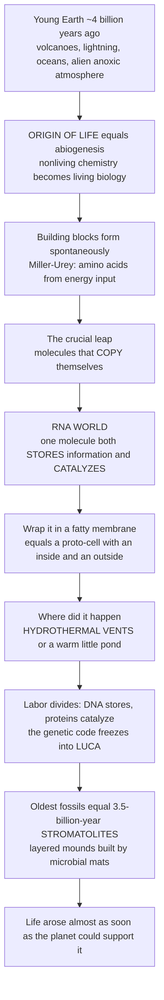

# 🦠 The Origin of Life and Earliest Fossils

> [!abstract] TL;DR
> The deepest question in biology is how **non-living chemistry became living biology** — the **origin of life**, or **abiogenesis**. On the young Earth ~4 billion years ago (volcanoes, lightning, oceans, an alien oxygen-free atmosphere), simple energy sources readily forge life's **building blocks** — amino acids, sugars, and nucleobases — as the **Miller–Urey** experiment famously showed. But building blocks are not life. The decisive threshold is a molecule that can **copy itself**, and the leading idea is the **RNA world**: RNA can both *store information* like DNA and *catalyze reactions* like a protein, so a self-copying RNA could start Darwinian evolution before DNA or proteins existed. Wrap that replicator in a **fatty membrane** and you have a **protocell**, perhaps born at an alkaline **hydrothermal vent** or in a warm little pond. Paleontology supplies the physical evidence: the oldest fossils — **3.5-billion-year-old stromatolites** (layered mounds built by microbial mats) plus even older carbon-isotope biosignatures — show life was already thriving *astonishingly early*, almost as soon as Earth could support it. That single fact reshapes how probable we think life may be elsewhere in the universe.

## Intuition

**Analogy first.** Imagine a kitchen with all the ingredients for a cake — flour, sugar, eggs, heat — scattered on the counter. Given energy, some of those ingredients will even combine on their own into batter-like clumps. But a pile of batter is not a *bakery*. The magic step is not making the ingredients; it is inventing a **recipe that copies itself** — a note that, once read, produces two more copies of the same note, each of which does it again. The instant that happens, the counter is no longer just chemistry: it is a lineage that can vary, compete, and improve. Life's origin is exactly this jump — from a soup of lifeless molecules that merely *react* to a molecule that **reproduces**, mutates, and is therefore subject to natural selection.

Now zoom in on the real "counter": the **young Earth**, roughly 4 billion years ago. It is a hellish, unfamiliar world — a hotter sun, oceans under an atmosphere of volcanic gases with essentially no free oxygen, lit by lightning and pelted by meteorites. Run energy through those gases and you get **amino acids** for free (this is what Miller and Urey demonstrated in a flask in 1953). The hard, still-unsolved part is the next step: getting molecules that **copy themselves**. The best candidate is **RNA**, a single molecule that can act as *both* the recipe (information, like DNA) *and* the cook (a catalyst, like a protein) — the **RNA world**. Enclose a self-copying RNA in a soap-bubble-like **lipid membrane** and you have a **protocell**, the ancestor of every cell alive today. The likeliest kitchens were **deep-sea hydrothermal vents** (mineral surfaces, natural chemical gradients, abundant energy) or Darwin's "warm little pond." And here is paleontology's stunning contribution: the oldest fossils we can find — **stromatolites** ~3.5 billion years old, and chemical fingerprints of life perhaps ~3.8 billion years old — tell us this whole leap had *already happened* within a few hundred million years of the planet cooling enough to host liquid water. Life, it seems, arose about **as soon as it possibly could** — a clue that biology may not be a cosmic fluke.

---

## How It Works

### Core mechanics

1. **The setting — the early Earth (Hadean → early Archean, ~4.4–3.8 Ga).** A younger, fainter Sun; oceans condensing onto a cooling crust; an **anoxic**, reducing-to-neutral atmosphere of volcanic outgassing (CO₂, N₂, H₂O, H₂, plus some CH₄/NH₃); frequent meteorite impacts. No ozone layer means intense UV. This is the chemical reactor in which life had to assemble.
2. **Prebiotic chemistry — the building blocks form spontaneously.** Given an energy source (lightning, UV, geothermal heat, impact shocks), simple gases and minerals yield **amino acids, nucleobases, sugars, and lipids**. The **Miller–Urey** spark-discharge experiment produced amino acids in days; more are delivered ready-made from space in carbon-rich **meteorites** (e.g. Murchison contains dozens of amino acids and even nucleobases).
3. **The crucial leap — self-replication.** Building blocks are necessary but not sufficient. Life proper begins with a molecule that **templates copies of itself with occasional error**, because copying-with-variation-and-selection *is* Darwinian evolution at the molecular scale. Self-replication is the true threshold between chemistry and biology.
4. **The RNA world.** DNA stores information but cannot copy itself unaided; proteins catalyze but cannot store heritable information — a chicken-and-egg trap. **RNA escapes it** by doing both: it carries a sequence (genotype) *and* can fold into a catalyst (a **ribozyme**). The discovery that RNA can catalyze reactions (Cech and Altman) and the fact that the **ribosome's catalytic core is itself RNA** are living relics of an RNA-first stage.
5. **Compartmentalization — the protocell.** Fatty acids and lipids **self-assemble** into hollow vesicles in water. Wrapping replicators inside a membrane concentrates them, keeps a "cell's" useful molecules together, and lets different bubbles **compete** — the birth of individuality and metabolism.
6. **The modern system and LUCA.** Over time, labor divided: **DNA** took over stable information storage, **proteins** took over most catalysis, and the **genetic code / translation** froze into place. All of this had crystallized by the time of **LUCA**, the **Last Universal Common Ancestor** — already a sophisticated cell with DNA, ribosomes, and ATP metabolism — inferred by tracing all living genes back to their common root.
7. **The earliest fossils — paleontology's evidence.** **Stromatolites** (laminated mounds trapped and bound by microbial mats) appear by ~3.5 Ga (Pilbara/Warrawoona, Australia); living examples still grow at Shark Bay. Contested **microfossils** and, crucially, **carbon-isotope biosignatures** (life prefers light ¹²C) push possible traces back to the ~3.7–3.8 Ga rocks of Isua, Greenland. Proving any of these are truly **biogenic** (not abiotic mimics or contamination) is one of paleontology's hardest arts.

### Flow: from lifeless chemistry to the oldest fossils



---

## Key Concepts

### Secondary Level

**Abiogenesis vs evolution.** *Abiogenesis* is the one-time emergence of life from non-life. *Evolution* is the ongoing change of populations that are *already* alive. Uncertainty about life's first spark does **not** weaken the mountain of evidence for evolution — they are different questions.

**The four requirements of "being alive"** that the origin of life had to bootstrap:
- **Metabolism** — capturing energy and matter from the environment.
- **Compartmentalization** — a membrane separating "self" from "surroundings."
- **Replication** — making copies.
- **Heredity with variation** — copies that can differ, so **natural selection** can act.

**The Miller–Urey experiment (1953).** Stanley Miller sparked electricity (mock lightning) through a flask of methane, ammonia, hydrogen, and water vapor (a guess at the early atmosphere). Within days the flask brimmed with **amino acids** — proof that life's building blocks form easily from simple chemicals plus energy.

**Stromatolites — the oldest fossils.** Layered, rock-like mounds built up, millimeter by millimeter, by mats of microbes (often **cyanobacteria**) that trap sediment and grow toward light. Fossil stromatolites date to ~3.5 billion years; you can still watch them form today at **Shark Bay, Australia**. They are our best hard evidence for how early life was established.

**The headline fact.** Life appears in the record *very* soon after Earth became habitable — a hint that going from chemistry to biology may not require a miracle, just the right ingredients and time.

### Undergraduate Level

**Prebiotic sources of organics.** Three, not mutually exclusive:
- **Endogenous synthesis** — Miller–Urey-type atmospheric chemistry; sugars from the **formose reaction**; nucleobases (e.g. adenine) from concentrated **HCN**.
- **Hydrothermal synthesis** — mineral-catalyzed reactions at vents (e.g. iron-sulfur chemistry).
- **Extraterrestrial delivery** — carbonaceous chondrite meteorites (**Murchison**) and comets carry amino acids, nucleobases, and complex organics, seeding the young ocean.

**The RNA world in detail.** RNA is a plausible *first* biopolymer because it unifies genotype and phenotype:
- As a **template**, a strand of RNA can direct the assembly of its complement, enabling copying.
- As a **ribozyme**, folded RNA catalyzes reactions — including, in the lab, limited **RNA-templated RNA polymerization**.
- **Molecular fossils** support it: the **ribosome** is a ribozyme; many essential cofactors (ATP, NAD⁺, coenzyme A) are RNA-based nucleotides; the genetic machinery is soaked in RNA.

**Competing "first" hypotheses.** The field debates the *order* of the four requirements:
- **Replicator-first** (genetics-first) — the RNA world; information came first.
- **Metabolism-first** — self-sustaining chemical cycles (e.g. on mineral surfaces at alkaline vents) came first, and heredity was added later.
- **Lipid-world / compartments-first** — self-replicating vesicles came first, providing selectable "individuals" before precise heredity.
Most modern scenarios blend these: metabolism, membranes, and replicators likely co-evolved.

**Protocells.** Fatty acids spontaneously form **vesicles** that can grow, divide under simple physical forces, and admit nutrients through their leaky membranes — a laboratory-demonstrated pathway (Szostak and others) toward the first cell.

**LUCA and the tree's root.** By reconstructing which genes are universal, biologists infer that **LUCA** already had DNA, a translation system, and chemiosmotic ATP synthesis, and probably lived in a hot, anaerobic, hydrogen-rich setting. From LUCA the tree splits into the great domains **Bacteria** and **Archaea** (with **Eukarya** arising later via endosymbiosis).

**Reading the earliest fossils.** Three lines of evidence, in ascending difficulty of interpretation:
- **Stromatolites** — morphology plus internal lamination; robust by ~3.5 Ga, but *some* layered structures can form abiotically, so biogenicity must be argued from micro-texture and geochemistry.
- **Microfossils** — putative preserved cells (e.g. the famously disputed ~3.46 Ga **Apex chert** filaments) demand caution: mineral artifacts can mimic cells.
- **Chemical / isotopic biosignatures** — life fractionates carbon toward light **¹²C**; graphite in ~3.7–3.8 Ga Isua rocks shows biological-looking δ¹³C, though abiotic explanations are debated.

### Graduate Level

**Where life began — the energy and concentration problems.** Any origin scenario must solve *thermodynamics* (a continuous free-energy source to drive polymerization against decay) and *concentration* (dilute ocean chemistry cannot easily build polymers).
- **Alkaline hydrothermal vents (Lane & Martin).** Porous mineral chimneys at off-ridge vents (like Lost City) host natural **proton gradients** across thin inorganic walls between alkaline vent fluid and acidic ocean — a ready-made **chemiosmotic** battery that mirrors how all cells make ATP today. Micropores also concentrate organics and template compartments. This links the origin of life directly to the origin of **metabolism**.
- **Warm little ponds / hydrothermal fields (Darwin; Deamer).** Surface pools undergoing **wet–dry cycling** concentrate reactants and drive condensation polymerization (lipids and nucleotides link up as water evaporates), and are exposed to the UV and delivery of meteoritic organics.
Each site has strengths; the debate is unresolved and partly a debate about *replicator-first vs metabolism-first*.

**The transition to coded protein synthesis.** The emergence of the **genetic code** and the ribosome is arguably the pivotal event — the moment heritable information began specifying catalysts. The near-universality and non-random, error-minimizing structure of the code suggest a frozen accident refined by early selection; the RNA-world ribosome bridges the pre-coded and coded worlds.

**Establishing biogenicity — the crux of Precambrian paleontology.** Because abiotic processes can mimic biological forms and isotopic signals, claims of the oldest life demand converging criteria:
- **Geological context** — plausibly habitable, syngenetic (not later contamination), unmetamorphosed enough to preserve signal.
- **Morphology + population statistics** — size distributions and branching consistent with cells, not mineral dendrites.
- **Geochemistry** — carbon-isotope fractionation, biomarker molecules, and correlated micro-textures.
Controversies — the **Apex chert** microfossils, the **3.7 Ga Isua** stromatolite claim (Nutman et al. 2016), and putative biomarkers repeatedly reinterpreted as contamination — illustrate how hard it is to prove life at the edge of the record.

**Implications for astrobiology.** If life arose on Earth within a few hundred million years of habitability, either (a) abiogenesis is relatively **easy** given the right conditions, boosting the odds of life elsewhere, or (b) we are a lucky sample subject to **observation-selection bias** (only planets where life arose early have observers to notice). Distinguishing these requires an **independent second origin** — which is why Mars, Europa, and Enceladus (subsurface oceans with possible hydrothermal vents) are prime targets. This is the bridge from paleontology to the search for life beyond Earth.

**The long "age of microbes" that followed.** For roughly the next two billion years the biosphere was purely microbial — **microbial mats** and stromatolites dominated, and it was cyanobacterial photosynthesis that eventually triggered the atmospheric oxygenation explored in the sibling note *Precambrian_Life_and_the_Great_Oxidation*. Complex life is a late, thin veneer on this deep microbial foundation.

---

## Python Demo

```python
# The Origin of Life and Earliest Fossils
# (a) AUTOCATALYSIS: why SELF-REPLICATION is the threshold between chemistry
#     and biology. A self-copying (autocatalytic) molecule grows in proportion
#     to how much of itself already exists -> a characteristic SIGMOIDAL takeoff
#     that outpaces a passively-accumulating, non-replicating molecule.
# (b) EARLY-EARTH TIMELINE: life appears astonishingly soon after the planet
#     becomes habitable -- the gap between "Earth cool enough" and "oldest
#     fossils" is short in deep time.
import numpy as np
import matplotlib.pyplot as plt

fig, (ax1, ax2) = plt.subplots(1, 2, figsize=(14, 5.5))

# ---------------------------------------------------------------
# (a) AUTOCATALYTIC REPLICATOR vs PASSIVE ACCUMULATION
# ---------------------------------------------------------------
t = np.linspace(0, 60, 2000)
dt = t[1] - t[0]

K = 1.0          # finite substrate / carrying capacity (shared resource)
k_auto = 0.45    # autocatalytic rate constant (copying depends on copies present)
k_lin = 0.035    # passive formation rate (no self-amplification)

R = np.zeros_like(t); R[0] = 1e-3   # tiny seed of a SELF-COPIER
N = np.zeros_like(t); N[0] = 1e-3   # same seed, but it does NOT self-copy

for i in range(1, len(t)):
    # autocatalytic: dR/dt = k_auto * R * (1 - R/K)  -> logistic sigmoid
    R[i] = R[i-1] + dt * k_auto * R[i-1] * (1.0 - R[i-1] / K)
    # passive: dN/dt = k_lin * (1 - N/K)  -> slow saturating approach, no takeoff
    N[i] = N[i-1] + dt * k_lin * (1.0 - N[i-1] / K)

ax1.plot(t, R, color="#2563eb", lw=2.6,
         label="Autocatalytic replicator (self-copying)")
ax1.plot(t, N, color="#dc2626", lw=2.6, ls="--",
         label="Passive molecule (no self-copying)")

# mark the sigmoidal takeoff (steepest growth of the replicator)
i_takeoff = int(np.argmax(np.gradient(R, dt)))
ax1.axvline(t[i_takeoff], color="#2563eb", ls=":", alpha=0.6)
ax1.annotate("sigmoidal\ntakeoff", xy=(t[i_takeoff], 0.5),
             xytext=(t[i_takeoff] + 6, 0.35), color="#2563eb",
             arrowprops=dict(arrowstyle="->", color="#2563eb"))

ax1.set_xlabel("Time (arbitrary units)")
ax1.set_ylabel("Molecular abundance (fraction of substrate)")
ax1.set_title("Self-replication is the threshold\nautocatalysis outcompetes passive chemistry")
ax1.legend(loc="center right", fontsize=9)
ax1.grid(True, alpha=0.3)

# ---------------------------------------------------------------
# (b) THE HADEAN / ARCHEAN TIMELINE OF EARLY LIFE
# ---------------------------------------------------------------
# (age in billions of years ago, label)
events = [
    (4.54, "Earth forms"),
    (4.40, "Oldest zircons:\nliquid water present"),
    (4.03, "Oldest surviving rocks\n(Acasta gneiss)"),
    (3.90, "Late heavy bombardment\nwanes"),
    (3.80, "First chemical traces of life\n(Isua C-isotopes)"),
    (3.48, "Oldest robust stromatolite\nfossils (Pilbara)"),
]
ages = np.array([e[0] for e in events])

# habitable window: once stable oceans/crust exist (~4.0 Ga) life could persist
ax2.axvspan(4.0, 3.0, color="#bbf7d0", alpha=0.5, label="plausibly habitable")

ax2.hlines(0, 4.7, 3.0, color="black", lw=1.5, zorder=1)
for k, (age, label) in enumerate(events):
    up = (k % 2 == 0)
    y = 0.55 if up else -0.55
    color = "#166534" if age <= 3.8 else "#7c3aed"
    ax2.plot(age, 0, "o", ms=9, color=color, zorder=3)
    ax2.annotate(label, xy=(age, 0), xytext=(age, y),
                 ha="center", va="bottom" if up else "top", fontsize=8,
                 arrowprops=dict(arrowstyle="-", color="gray", lw=0.8))

# highlight how SHORT the gap is from habitability to first fossils
ax2.annotate("", xy=(3.48, -0.95), xytext=(3.80, -0.95),
             arrowprops=dict(arrowstyle="<->", color="#166534", lw=2))
ax2.text(3.64, -1.12, "life established\nwithin this short window",
         ha="center", va="top", fontsize=8, color="#166534")

ax2.set_xlim(4.7, 3.0)          # older on the LEFT, time flows right
ax2.set_ylim(-1.4, 1.2)
ax2.set_xlabel("Billions of years ago (Ga)")
ax2.set_yticks([])
ax2.set_title("Life appears soon after Earth becomes habitable\nHadean and early Archean")
ax2.legend(loc="upper right", fontsize=9)

plt.tight_layout()
plt.savefig("origin_of_life_and_earliest_fossils.png", dpi=120)
plt.show()

# Quantify the takeoff advantage of a self-copier.
half_R = t[np.argmax(R >= 0.5 * K)]
half_N = t[np.argmax(N >= 0.5 * K)] if np.any(N >= 0.5 * K) else np.inf
print(f"Autocatalytic replicator reaches half-capacity at t = {half_R:.1f}")
print(f"Passive molecule reaches half-capacity at t = {half_N:.1f}")
print("Punchline: self-replication, not the raw building blocks, is the leap to life.")
```

---

## Real-World Applications

- **The search for life beyond Earth (astrobiology).** Because life arose so quickly on Earth, mission design targets **subsurface oceans with hydrothermal vents** — Europa (*Europa Clipper*) and Enceladus (whose plumes already show organics and hydrogen). Detecting a **second, independent origin** would transform our estimate of how common life is.
- **Mars sample return.** Rovers (*Perseverance*) hunt for ancient **stromatolite-like textures** and **carbon-isotope biosignatures** in former lakebeds — and the field's hard-won criteria for proving Earthly biogenicity are exactly the tools needed to avoid false positives from Mars.
- **Synthetic biology and the origin of the cell.** Lab work building **self-replicating RNA**, protocell vesicles, and minimal genomes (e.g. JCVI-syn3.0) is guided by, and tests, origin-of-life hypotheses.
- **Reading Earth's oldest rocks for resources and climate history.** Banded iron formations and organic-rich Archean sediments — laid down in the microbial world that followed life's origin — are both major **iron ore** and archives of early atmospheric chemistry.
- **Biotechnology from the deepest branches.** Heat-stable enzymes from **archaea and bacteria** near LUCA (e.g. *Taq* polymerase) power PCR; ancient metabolic pathways inspire industrial catalysis.

---

## Common Pitfalls

- **Confusing abiogenesis with evolution.** The origin of the first replicator is a *chemistry* problem; evolution explains change *after* life exists. Doubts about the former do not touch the overwhelming evidence for the latter.
- **Thinking building blocks equal life.** Miller–Urey makes amino acids trivially, and meteorites deliver them — but a bucket of amino acids is not alive. The unsolved, decisive step is **self-replication**, not raw ingredients.
- **Treating the RNA world as proven fact.** It is the leading *hypothesis*, strongly supported (ribozymes, the ribosome, RNA cofactors), but the full path from prebiotic chemistry to a self-copying RNA has not been demonstrated end-to-end. Present it as a well-motivated frontier, not a settled story.
- **Assuming every ancient layered rock is a fossil.** Some **stromatolite-like** structures and cell-like microstructures form **abiotically**. Establishing **biogenicity** requires converging morphological, contextual, and geochemical evidence — the Apex chert and Isua debates show how easy it is to be fooled.
- **Reading "life arose early" as "life is guaranteed elsewhere."** A single early origin may reflect **observation-selection bias**: we could only ever find ourselves on a planet where life happened to start early. One data point is not a probability.
- **Picturing the early atmosphere as strongly reducing like Miller's flask.** Modern models favor a more **neutral** (CO₂/N₂) atmosphere, which yields organics less efficiently — part of why hydrothermal and extraterrestrial sources gained importance.
- **Imagining LUCA as "the first cell."** LUCA is the **last common ancestor of surviving life** — already complex, with DNA and ribosomes. Much origin-of-life history lies *below* LUCA and left no surviving lineage.

---

## Related Concepts

This note opens the vault's grand narrative of the history of life; it is introduced by the sibling overview *Paleontology_and_Deep_Time_Overview* and continues into *Precambrian_Life_and_the_Great_Oxidation* (the long microbial world and the oxygenation of the air that followed). The chemistry of reading these faint traces builds on *Fossils_and_the_Fossilization_Process*, the phylogenetic rooting of the tree at LUCA connects to *Cladistics_and_Fossil_Phylogeny*, and the astrobiological stakes are developed in *Conservation_Paleobiology_and_Astrobiology*.

- [[The_History_of_Life_on_Earth]] — Biology companion giving the full 4-billion-year arc that this note's origin event begins
- [[Phylogenetics_and_the_Tree_of_Life]] — how molecular phylogeny infers **LUCA** and roots the three domains
- [[Bacteria_and_Archaea]] — the two prokaryotic domains that descend directly from LUCA and dominated early Earth
- [[Nucleic_Acids]] — the structure and chemistry of RNA and DNA that underpin the **RNA world** hypothesis
- [[Proteins_and_Amino_Acids]] — the amino acids that Miller–Urey produced, and the catalysts that proteins later took over from ribozymes
- [[Translation_and_the_Genetic_Code]] — the coded protein-synthesis system whose emergence was the pivotal origin-of-life transition
- [[The_Cell_Membrane_and_Transport]] — lipid bilayers and self-assembling vesicles, the basis of **protocells**
- [[Enzymes_and_Catalysis]] — catalysis and active sites; ribozymes show RNA can do this job
- [[Nucleic_Acids_and_the_Central_Dogma]] — Chemistry-vault treatment of the DNA→RNA→protein flow that RNA-world thinking reorders
- [[Astrobiology_and_Habitability]] — what an early, rapid origin implies for the odds and search for life elsewhere
- [[Formation_of_the_Solar_System]] — how the young Earth itself formed, setting the Hadean stage for life's origin

---

## Review Questions

1. **Secondary:** What did the **Miller–Urey experiment** demonstrate, and why is producing amino acids *not* the same as producing life? Name the one further step that marks the true boundary between chemistry and biology.
2. **Undergraduate:** Explain the **RNA world** hypothesis and give two independent pieces of evidence (e.g. ribozymes; the ribosome) that RNA preceded DNA and proteins. Why does RNA uniquely solve the "chicken-and-egg" problem of information versus catalysis?
3. **Graduate:** You find ~3.7-billion-year-old layered structures with light carbon-isotope values and cell-sized inclusions. Lay out the criteria you would use to argue for or against **biogenicity**, referencing why alkaline **hydrothermal vents** are attractive origin sites and how the **observation-selection bias** complicates inferring that "life arose early, therefore life is common."

---

## Sources

- Miller, S.L. (1953). "A production of amino acids under possible primitive Earth conditions." *Science*, 117(3046), 528–529.
- Lane, N. (2015). *The Vital Question: Energy, Evolution, and the Origins of Complex Life.* W.W. Norton. (alkaline hydrothermal vents and chemiosmosis)
- Schopf, J.W. (1999). *Cradle of Life: The Discovery of Earth's Earliest Fossils.* Princeton University Press.
- Nutman, A.P., Bennett, V.C., Friend, C.R.L., Van Kranendonk, M.J. & Chivas, A.R. (2016). "Rapid emergence of life shown by discovery of 3,700-million-year-old microbial structures." *Nature*, 537, 535–538.
- Joyce, G.F. & Szostak, J.W. (2018). "Protocells and RNA self-replication." *Cold Spring Harbor Perspectives in Biology*, 10(9), a034801.

#paleontology #origin-of-life #abiogenesis #stromatolites #rna-world
